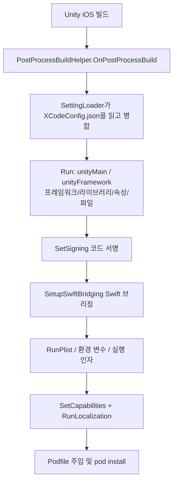

# Xcode 패키징 구성 패키지 개요

GameFrameX Xcode 구성 패키지(com.gameframex.unity.xcode)는 `XCodeConfig.json` 한 개만으로 iOS 패키징 후 Xcode 프로젝트 설정을 자동으로 완료할 수 있게 해줍니다: Info.plist, 시스템 프레임워크/라이브러리, Build Settings, Capabilities, 로컬라이제이션, CocoaPods, 코드 서명, Swift 브리징 등 모두 Xcode 프로젝트를 수동으로 수정할 필요가 없습니다. Unity에서 iOS 플랫폼 빌드 후 `PostProcessBuild` 콜백을 통해 자동으로 실행되며, 로컬 및 CI 자동화 빌드에 적합합니다.

## 빠른 시작

### 1. 패키지 설치

Unity 프로젝트의 `Packages/manifest.json`을 편집하여 scoped registry를 추가하고 의존성을 선언합니다(현재 버전 `1.11.1`):

```json
{
  "scopedRegistries": [
    {
      "name": "GameFrameX",
      "url": "https://gameframex.upm.alianblank.uk",
      "scopes": [
        "com.gameframex"
      ]
    }
  ],
  "dependencies": {
    "com.gameframex.unity.xcode": "1.11.1"
  }
}
```

Source: [README.zh-CN.md](https://github.com/GameFrameX/com.gameframex.unity.xcode/blob/main/README.zh-CN.md#L49-L63)

registry를 만들지 않고 `dependencies` 아래에 Git 주소 `https://github.com/gameframex/com.gameframex.unity.xcode.git`를 직접 작성하거나, Package Manager의 `Git URL` 방식으로 추가하거나, 저장소를 다운로드한 뒤 `Packages` 디렉터리에 넣어도 됩니다.

### 2. 구성 파일 생성

프로젝트에 `XCodeConfig.json`을 새로 생성합니다 — 파일 이름은 고정되어 있고 프로젝트 내 어느 곳에나 둘 수 있으며, 여러 파일의 공존을 지원합니다(자동 깊이 재귀 병합). 또한 `XCodeConfig.{渠道名}.json` 채널 전용 구성이 마지막에 덮어쓰기 병합되는 것도 지원합니다.

```json
{
  "swiftBridging": true,
  "signing": {},
  "plist": {},
  "environmentVariables": {},
  "launcherArgs": [],
  "podSource": [],
  "podfile": "",
  "podInstall": true,
  "localizations": [],
  "capabilities": {},
  "unityFramework": {},
  "unityMain": {}
}
```

Source: [README.zh-CN.md](https://github.com/GameFrameX/com.gameframex.unity.xcode/blob/main/README.zh-CN.md#L81-L96)

| 필드 | 타입 | 설명 |
| :--- | :--- | :--- |
| `swiftBridging` | bool | Swift 브리징 헤더 파일 자동 생성(기본값 `true`) |
| `signing` | object | 코드 서명: Team ID, Bundle ID, 서명 아이덴티티, 프로비저닝 프로파일 |
| `plist` | object | Info.plist 키-값 쌍, 값은 문자열/불리언/정수/배열/딕셔너리를 지원하며 재귀적으로 기록 |
| `environmentVariables` | object | XcScheme 환경 변수 |
| `launcherArgs` | string[] | XcScheme 실행 인자 |
| `podSource` | string[] | CocoaPods 소스 주소, Podfile 기본 소스를 대체 |
| `podfile` | string | 사용자 지정 Podfile 경로(`pods` 필드보다 우선순위가 높음) |
| `podInstall` | bool | Podfile 처리 완료 후 자동으로 `pod install` 실행(기본값 `true`) |
| `localizations` | array | `.lproj/InfoPlist.strings` 자동 생성 |
| `capabilities` | object | 인앱 결제, Game Center, 푸시, Sign In with Apple 등 13가지 기능 |
| `unityFramework` | object | UnityFramework target 구성 |
| `unityMain` | object | Unity-iPhone(메인) target 구성 |

### 3. 가장 자주 쓰는 구성 작성

`unityMain` / `unityFramework` 구조는 동일하며, `libs`는 `+`/`-`로 시스템 라이브러리를 추가/삭제하고, `frameworks`는 프레임워크를 추가/삭제하며, `properties`는 `=`/`+`/`-`로 Build Settings를 설정, 추가, 제거합니다:

```json
{
  "unityMain": {
    "libs": {
      "+": ["libz.tbd", "libicucore.tbd"],
      "-": ["libstdc++.tbd"]
    },
    "frameworks": {
      "+": ["WebKit.framework", "UserNotifications.framework"],
      "-": []
    },
    "properties": {
      "=": { "ENABLE_BITCODE": "NO" },
      "+": { "OTHER_CFLAGS": ["-flag1", "-flag2"] },
      "-": { "UNUSED_FLAG": [""] }
    }
  },
  "signing": {
    "teamId": "XXXXXXXXXX",
    "bundleId": "com.company.app",
    "codeSignIdentity": "Apple Development",
    "codeSignStyle": "Automatic",
    "provisioningProfileSpecifier": ""
  }
}
```

Sources: [README.zh-CN.md](https://github.com/GameFrameX/com.gameframex.unity.xcode/blob/main/README.zh-CN.md#L133-L140) · [README.zh-CN.md](https://github.com/GameFrameX/com.gameframex.unity.xcode/blob/main/README.zh-CN.md#L245-L255)

### 4. iOS 빌드 및 검증

Unity에서 iOS 플랫폼 빌드를 실행합니다. 빌드가 끝나면 패키지 내 `PostProcessBuildHelper.OnPostProcessBuild`(`[PostProcessBuild(888)]`)가 자동으로 실행됩니다: 구성 파일을 하나도 찾지 못하면 `未找到任何 XCodeConfig 相关配置文件, 跳过设置`를 출력하고, 정상적인 경우 파일별로 `[MergeConfig] 正在合并配置: {路径}`를 출력한 뒤 이어서 `[PBXProject] 正在应用最终合并配置...`, `[OtherSettings] 正在应用最终合并配置...`를 차례로 출력합니다. Console에서 이러한 로그가 보이면 구성이 Xcode 프로젝트에 기록되었음을 의미합니다:

```csharp
[PostProcessBuild(888)]
public static void OnPostProcessBuild(BuildTarget target, string path)
{
    if (target != BuildTarget.iOS)
    {
        return;
    }
    // 구성 파일 읽기
    var jsonPaths = SettingLoader.LoadSettingsData("XCodeConfig.json");
    // 일치하는 파일을 하나도 찾지 못하면 바로 반환
    if (jsonPaths.Count == 0)
    {
        LogHelper.Error("未找到任何 XCodeConfig 相关配置文件, 跳过设置");
        return;
    }
```

Source: [Editor/PostProcessBuildHelper.cs](https://github.com/GameFrameX/com.gameframex.unity.xcode/blob/main/Editor/PostProcessBuildHelper.cs#L14-L31)

## 작동 원리 요약

전체 흐름은 `OnPostProcessBuild`가 구동합니다: 구성 병합 → PBXProject 기록 → plist/scheme/capabilities/로컬라이제이션 기록 → Podfile 처리.



2단계 처리 설명: `unityMain`/`unityFramework`/`signing`/`swiftBridging`을 먼저 기록하고 `project.pbxproj`를 저장하며, 그다음 Plist, 환경 변수, 실행 인자, Capabilities, 로컬라이제이션, Podfile이 두 번째 단계에서 적용됩니다. Capabilities는 `ProjectCapabilityManager`가 별도로 디스크에 기록하기 때문에, 수정 사항이 덮어쓰이지 않도록 프로젝트 파일을 다시 읽은 후 계속 진행합니다:

```csharp
// PBXProject 저장
File.WriteAllText(projectPath, project.WriteToString());
// 두 번째 단계: 기타 구성 적용 (Plist, Env, Args, Pod, Capabilities)
LogHelper.Log("[OtherSettings] 正在应用最终合并配置...");
```

Source: [Editor/PostProcessBuildHelper.cs](https://github.com/GameFrameX/com.gameframex.unity.xcode/blob/main/Editor/PostProcessBuildHelper.cs#L103-L107)

구성 병합의 우선순위는 채널 구성(`XCodeConfig.{channel}.json`) > 일반 `XCodeConfig.json` > 없음이며, 일반 파일이 여러 개일 경우 스캔 순서대로 차례로 깊이 병합됩니다. 패키지 내 구현은 기능별로 여러 partial 파일로 분할되어 있어 필요에 따라 소스 코드를 읽기에 편리합니다.

## 일반적인 오류

| 현상 | 원인 | 해결 방법 |
|------|------|------|
| Console에 `未找到任何 XCodeConfig 相关配置文件, 跳过设置` 오류 출력 | 구성 파일이 `XCodeConfig.json`으로 명명되지 않았거나 프로젝트 내에 없음 | 파일 이름과 위치 확인; 채널 파일은 `XCodeConfig.{渠道名}.json`이어야 함 |
| 일부 구성 항목이 적용되지 않음 | `XCodeConfig.json`이 여러 개 존재하거나 채널 파일이 이를 덮어씀 | 나중에 병합된 것이 같은 키 값을 덮어씀; 병합 로그 `[MergeConfig]`에서 각 파일의 순서 확인 |
| `folders` 복사 오류 | 대상 폴더가 Xcode 프로젝트에 이미 존재함(`folders`는 덮어쓰지 않음) | `files` 단일 파일 복사로 전환하거나, 빌드 출력 디렉터리를 먼저 정리 |
| CI에서 Swift 혼합 컴파일 시 팝업 발생 | Swift 브리징 미활성화 | `swiftBridging: true`(기본값) 유지, 브리징 헤더 자동 생성 및 `SWIFT_VERSION`을 `5.0`으로 설정 |

## 다음 단계

- 구성 파일의 전체 필드와 각 하위 항목 작성 방법은 저장소 [README.zh-CN.md](https://github.com/GameFrameX/com.gameframex.unity.xcode/blob/main/README.zh-CN.md#L75-L484)의 "구성 파일 구조" 장을 참고하세요.
- 버전 이력은 [CHANGELOG.md](https://github.com/GameFrameX/com.gameframex.unity.xcode/blob/main/CHANGELOG.md)를 참고하세요.
- 소스 코드 진입점: `Editor/PostProcessBuildHelper.cs`(메인 흐름), `Editor/PostProcessBuildHelper.BuildProperties.cs`(Build Settings), `Editor/PostProcessBuildHelper.Capabilities.cs`(Capabilities), `Editor/PostProcessBuildHelper.File.cs`(파일 복사).
- 공식 문서와 소통 그룹은 [README.zh-CN.md](https://github.com/GameFrameX/com.gameframex.unity.xcode/blob/main/README.zh-CN.md#L16)를 참고하세요.