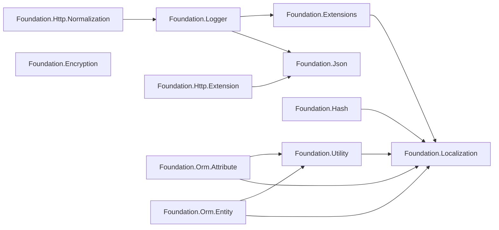

# 패키지 개요 및 의존 관계

GameFrameX.Foundation은 책임별로 분할된 .NET 클래스 라이브러리 컬렉션으로, 각 하위 디렉터리는 독립적인 NuGet 패키지이며 패키지 간에는 `ProjectReference`로 연결됩니다. 이 페이지에서는 모든 패키지 목록, 의존 방향 및 어떤 패키지부터 통합을 시작할지에 대한 기준을 제공합니다.

## 패키지 목록

저장소 루트 디렉터리의 각 1단계 폴더는 하나의 NuGet 패키지에 해당하며, 모든 패키지는 `../Version.props`의 버전 번호를 통합 사용하고 `../gameframex.key.snk`로 강한 이름 서명됩니다.

| 패키지명 | 주요 책임 | 주요 타사 의존성 |
|------|----------|----------------|
| GameFrameX.Foundation.Encryption | 암호화/복호화(AES, RSA 등) | — |
| GameFrameX.Foundation.Extensions | 일반적인 확장 메서드 모음 | Localization |
| GameFrameX.Foundation.Hash | 해시 알고리즘(xxHash, BCrypt, BouncyCastle) | Standart.Hash.xxHash 4.0.5, BouncyCastle.Cryptography 2.7.0, BCrypt.Net-Next.StrongName 4.2.1 |
| GameFrameX.Foundation.Http.Extension | HTTP 클라이언트 통합 인터페이스(GET/POST) | Json |
| GameFrameX.Foundation.Http.Normalization | HTTP 요청/응답 정규화 | Logger |
| GameFrameX.Foundation.Json | JSON 직렬화/역직렬화 통합 인터페이스 | — |
| GameFrameX.Foundation.Localization | 다국어 지역화 추상화 | Microsoft.Extensions.Localization.Abstractions 10.0.11 |
| GameFrameX.Foundation.Logger | Serilog 구조화 로그, Loki, MongoDB 지원 | MongoDB.Driver 3.11.0, Serilog.AspNetCore 10.0.0, Serilog.Sinks.Grafana.Loki 9.0.2, Serilog.Sinks.MongoDB 7.2.0 |
| GameFrameX.Foundation.Options | 구성 옵션 확장 | — |
| GameFrameX.Foundation.Orm.Attribute | ORM 엔티티 특성(Attribute) | Utility, Localization |
| GameFrameX.Foundation.Orm.Entity | ORM 엔티티 기본 클래스 | Utility, Localization |
| GameFrameX.Foundation.Utility | 일반 유틸리티 클래스 | Localization |

Source: [GameFrameX.Foundation.Http.Extension.csproj](https://github.com/GameFrameX/GameFrameX.Foundation/blob/main/GameFrameX.Foundation.Http.Extension/GameFrameX.Foundation.Http.Extension.csproj#L24-L26),[GameFrameX.Foundation.Json.csproj](https://github.com/GameFrameX/GameFrameX.Foundation/blob/main/GameFrameX.Foundation.Json/GameFrameX.Foundation.Json.csproj#L1-L26),[GameFrameX.Foundation.Hash.csproj](https://github.com/GameFrameX/GameFrameX.Foundation/blob/main/GameFrameX.Foundation.Hash/GameFrameX.Foundation.Hash.csproj#L14-L33),[GameFrameX.Foundation.Localization.csproj](https://github.com/GameFrameX/GameFrameX.Foundation/blob/main/GameFrameX.Foundation.Localization/GameFrameX.Foundation.Localization.csproj#L29-L32),[GameFrameX.Foundation.Logger.csproj](https://github.com/GameFrameX/GameFrameX.Foundation/blob/main/GameFrameX.Foundation.Logger/GameFrameX.Foundation.Logger.csproj#L26-L36)

## 의존 관계 다이어그램



Source: [GameFrameX.Foundation.Extensions.csproj](https://github.com/GameFrameX/GameFrameX.Foundation/blob/main/GameFrameX.Foundation.Extensions/GameFrameX.Foundation.Extensions.csproj#L15-L17),[GameFrameX.Foundation.Hash.csproj](https://github.com/GameFrameX/GameFrameX.Foundation/blob/main/GameFrameX.Foundation.Hash/GameFrameX.Foundation.Hash.csproj#L14-L16),[GameFrameX.Foundation.Utility.csproj](https://github.com/GameFrameX/GameFrameX.Foundation/blob/main/GameFrameX.Foundation.Utility/GameFrameX.Foundation.Utility.csproj#L15-L17),[GameFrameX.Foundation.Orm.Entity.csproj](https://github.com/GameFrameX/GameFrameX.Foundation/blob/main/GameFrameX.Foundation.Orm.Entity/GameFrameX.Foundation.Orm.Entity.csproj#L23-L32),[GameFrameX.Foundation.Logger.csproj](https://github.com/GameFrameX/GameFrameX.Foundation/blob/main/GameFrameX.Foundation.Logger/GameFrameX.Foundation.Logger.csproj#L34-L36),[GameFrameX.Foundation.Http.Extension.csproj](https://github.com/GameFrameX/GameFrameX.Foundation/blob/main/GameFrameX.Foundation.Http.Extension/GameFrameX.Foundation.Http.Extension.csproj#L24-L26),[GameFrameX.Foundation.Http.Normalization.csproj](https://github.com/GameFrameX/GameFrameX.Foundation/blob/main/GameFrameX.Foundation.Http.Normalization/GameFrameX.Foundation.Http.Normalization.csproj#L23-L25)

## 빠른 시작

1. **사용할 기능을 확정하고 해당 패키지만 도입하세요** — 모든 Foundation 패키지를 끌어들이는 것을 피하세요. 예를 들어 JSON 직렬화만 필요하다면 `GameFrameX.Foundation.Json`만 참조하세요.
2. **확장 메서드, 유틸리티 클래스, ORM 등을 사용하는 경우 Localization으로 전이 의존됩니다** — `Microsoft.Extensions.Localization.Abstractions 10.0.11`이 함께 도입되므로 DI에서 지역화 서비스를 등록해야 합니다.
3. **로그 패키지를 사용하는 경우** — Serilog 메인 패키지 외에도 MongoDB.Driver 3.11.0이 도입되므로 MongoDB 드라이버 버전이 비즈니스 측과 충돌하지 않는지 확인하세요.
4. **Hash 패키지를 사용하는 경우** — xxHash, BouncyCastle, BCrypt 세 개의 타사 라이브러리가 한 번에 도입되며, 필요에 따라 참조되지 않은 `using`을 정리할 수 있습니다.
5. **강한 이름 어셈블리 사용** — 모든 패키지는 `gameframex.key.snk`로 서명되므로, 소비자 프로젝트에서 강한 이름 사용을 허용하거나 프로젝트 자체 서명과 일치해야 합니다.

## 진입 패키지 선택 방법

| 시나리오 | 권장 패키지 |
|------|--------|
| JSON 읽기/쓰기만 | GameFrameX.Foundation.Json |
| HTTP 호출만 | GameFrameX.Foundation.Http.Extension |
| 구조화 로그 + 원격 집계 | GameFrameX.Foundation.Logger |
| 비밀번호/데이터 해시 | GameFrameX.Foundation.Hash |
| 암호화/복호화 | GameFrameX.Foundation.Encryption |
| ORM 엔티티 및 특성 | GameFrameX.Foundation.Orm.Entity + GameFrameX.Foundation.Orm.Attribute |
| 구성 옵션 확장 | GameFrameX.Foundation.Options |

## 버전 및 서명

모든 패키지는 하나의 버전 정의 파일을 공유합니다:

```xml
<Import Project="../Version.props" Label="버전 번호 정의"/>
<AssemblyOriginatorKeyFile>../gameframex.key.snk</AssemblyOriginatorKeyFile>
```

Source: [GameFrameX.Foundation.Http.Extension.csproj](https://github.com/GameFrameX/GameFrameX.Foundation/blob/main/GameFrameX.Foundation.Http.Extension/GameFrameX.Foundation.Http.Extension.csproj#L1-L7)

버전 업그레이드 시 `Version.props`를 한 번만 수정하면 되며, 각 패키지 빌드 시 자동으로 최신 버전 번호가 적용됩니다.

## 관련 링크

- 지역화에 대해서는 《Localization》 참조
- 로그에 대해서는 《Logger》 참조
- JSON 및 HTTP에 대해서는 《Http.Extension》 참조