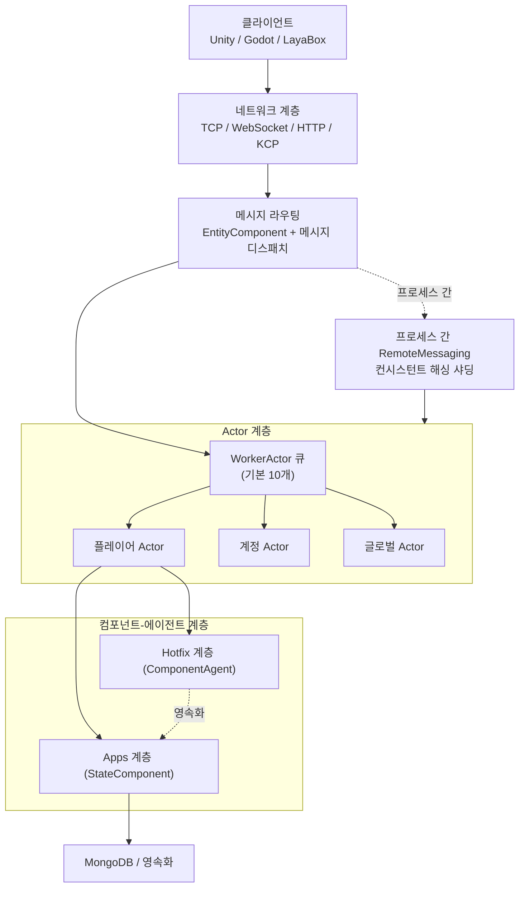

# 아키텍처 개요: Actor 모델과 멀티 프로세스 토폴로지

GameFrameX는 Actor 모델을 핵심으로 게임 서버의 런타임 단위를 구성하며, Actor 간에는 공유 상태가 아닌 메시지 전달을 통해 협력합니다. 여러 게임 프로세스는 일관된 ActorId 인코딩과 ActorType 세그먼트를 기반으로 메시지를 라우팅하여, 수평 확장 가능한 멀티 프로세스 토폴로지를 형성합니다.

## 빠른 시작

1. `GameFrameX.Server.Start` 메인 프로세스를 시작하면, `GameFrameX.Apps`(영속화 상태 계층)와 `GameFrameX.Hotfix`(핫업데이트 가능한 비즈니스 계층) 두 어셈블리를 로드합니다.
2. 클라이언트는 TCP/WebSocket/HTTP/KCP 중 하나로 네트워크 계층에 접속하며, 메시지는 해당하는 Actor 프로세서로 라우팅됩니다.
3. 서버는 ActorId를 기반으로 위치한 프로세스를 계산하며, 프로세스를 넘나들 때는 `RemoteMessaging`으로 전달하고, 프로세스 내부에서는 `WorkerActor` 큐로 전달합니다.

```csharp
// ActorId를 통해 플레이어 컴포넌트 에이전트 획득 (프로세스 내 일반적인 사용법)
var agent = await ActorManager.GetComponentAgent<PlayerComponentAgent>(actorId);

[Actor.cs#L38-L100](https://github.com/GameFrameX/GameFrameX.Server.Source/blob/main/GameFrameX.Core/Actors/Actor.cs#L38-L100)
```

## 작동 원리 개요

GameFrameX는 "게임 엔티티"를 `IActor`로, "실행 대기 메시지"를 `IWorkerActor`로 캡슐화하고, TPL DataFlow를 사용하여 락 없는 직렬화를 구현합니다. 프로세스 간에는 `ActorId`의 상위 비트 세그먼트(`ActorType` + 프로세스/데이터센터 식별자)로 컨시스턴트 해싱 샤딩을 수행합니다.



- **Actor = 상태 컨테이너**: `IActor`는 `Id`, `Type`, `ScheduleIdSet` 및 `WorkerActor`를 가지며, 각 Actor 내부의 메시지는 자신이 독점하는 `WorkerActor`에 의해 직렬로 처리되어 락이 필요 없습니다. 자세한 내용은 [IActor.cs](https://github.com/GameFrameX/GameFrameX.Server.Source/blob/main/GameFrameX.Core/Abstractions/IActor.cs#L38-L100)를 참조하세요.
- **WorkerActor = 메시지 펌프**: TPL DataFlow를 기반으로 인바운드 메시지를 직렬화 가능한 작업 항목으로 변환하여 순차적으로 실행하며, 기본적으로 `ActorManager`는 10개의 `WorkerActor`를 샤드로 시작합니다. 자세한 내용은 [ActorManager.cs](https://github.com/GameFrameX/GameFrameX.Server.Source/blob/main/GameFrameX.Core/Actors/ActorManager.cs#L53-L100)를 참조하세요.
- **프로세스 내 vs 프로세스 간**: `ActorManager`는 `ConcurrentDictionary<long, Actor>`로 해당 프로세스의 Actor 테이블을 유지 관리합니다. 프로세스를 넘나들 때는 `RemoteMessaging` + 컨시스턴트 해싱으로 대상 프로세스를 찾습니다.
- **타입 세그먼트**: `ActorType`는 `ushort`로 인코딩되며, `Separator`보다 작은 값은 "단일 인스턴스 글로벌형"을, `Separator`보다 큰 값은 "다중 인스턴스형"(예: 플레이어, 길드)을 나타냅니다. 스노우플레이크 ID와 ActorType을 조합하여 고유한 ActorId를 생성합니다. 자세한 내용은 [ActorType.cs](https://github.com/GameFrameX/GameFrameX.Server.Source/blob/main/GameFrameX.Apps/ActorType.cs#L38-L60)를 참조하세요.

## 다음 단계

- 특정 Actor의 내부 세부 사항은 `GameFrameX.Core/Actors/Actor.cs`를 참조하세요.
- 프로세스 간 메시지 송수신에 대해서는 `GameFrameX.NetWork.Abstractions`와 `NetWorkSenderFactory`를 참조하세요.
- ActorId 인코딩과 스노우플레이크 알고리즘에 대해서는 `GameFrameX.Utility/ActorIdGenerator.cs`를 참조하세요.
- 컴포넌트 에이전트와 핫업데이트 경계에 대해서는 《컴포넌트-에이전트 계층과 핫업데이트》 페이지를 참조하세요.

## 관련 링크

- [IActor.cs](https://github.com/GameFrameX/GameFrameX.Server.Source/blob/main/GameFrameX.Core/Abstractions/IActor.cs#L38-L100)
- [IWorkerActor.cs](https://github.com/GameFrameX/GameFrameX.Server.Source/blob/main/GameFrameX.Core/Abstractions/IWorkerActor.cs)
- [ActorManager.cs](https://github.com/GameFrameX/GameFrameX.Server.Source/blob/main/GameFrameX.Core/Actors/ActorManager.cs#L53-L100)
- [Actor.cs](https://github.com/GameFrameX/GameFrameX.Server.Source/blob/main/GameFrameX.Core/Actors/Actor.cs)
- [WorkActor.cs](https://github.com/GameFrameX/GameFrameX.Server.Source/blob/main/GameFrameX.Core/Actors/Impl/WorkActor.cs)
- [ActorType.cs](https://github.com/GameFrameX/GameFrameX.Server.Source/blob/main/GameFrameX.Apps/ActorType.cs#L38-L60)
- [ActorIdGenerator.cs](https://github.com/GameFrameX/GameFrameX.Server.Source/blob/main/GameFrameX.Utility/ActorIdGenerator.cs)
- [NetWorkSenderFactory.cs](https://github.com/GameFrameX/GameFrameX.Server.Source/blob/main/GameFrameX.NetWork/NetWorkSenderFactory.cs)