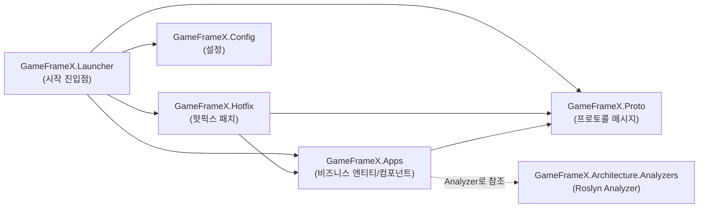

# 프로젝트 구조 및 레이어(Apps / Hotfix / Proto / Config) 한눈에 보기

GameFrameX.Server 솔루션은 서버 프로젝트를 네 개의 단일 책임 C# 클래스 라이브러리(및 Launcher, Analyzers, Hotfix.Tests)로 분리하여, "프로토콜 → 비즈니스 로직 → 핫픽스 패치 → 설정 로드 → 시작 진입점"이 각각 독립적으로 유지보수되도록 합니다. 아래 화면에서 각 프로젝트에 무엇이 담겨 있는지, 누가 누구를 참조하는지 확인할 수 있습니다.

## 빠른 시작

`Server.sln`을 열면 다음 프로젝트들을 볼 수 있습니다(모두 저장소 루트 디렉터리에 위치):

| 프로젝트 | csproj 경로 | 대상 프레임워크 | 주요 역할 |
|------|-------------|----------|----------|
| `GameFrameX.Launcher` | [GameFrameX.Launcher/GameFrameX.Launcher.csproj](https://github.com/GameFrameX/GameFrameX.Server/blob/main/GameFrameX.Launcher/GameFrameX.Launcher.csproj) | — (추가 예정) | 프로그램 시작 진입점 |
| `GameFrameX.Hotfix` | [GameFrameX.Hotfix/GameFrameX.Hotfix.csproj](https://github.com/GameFrameX/GameFrameX.Server/blob/main/GameFrameX.Hotfix/GameFrameX.Hotfix.csproj) | — (추가 예정) | 핫픽스 비즈니스 로직 패치 |
| `GameFrameX.Config` | [GameFrameX.Config/GameFrameX.Config.csproj](https://github.com/GameFrameX/GameFrameX.Server/blob/main/GameFrameX.Config/GameFrameX.Config.csproj) | — (추가 예정) | 런타임 설정 항목 |
| `GameFrameX.Proto` | [GameFrameX.Proto/GameFrameX.Proto.csproj](https://github.com/GameFrameX/GameFrameX.Server/blob/main/GameFrameX.Proto/GameFrameX.Proto.csproj) | — (추가 예정) | 네트워크 프로토콜 / 메시지 정의 |
| `GameFrameX.Apps` | [GameFrameX.Apps/GameFrameX.Apps.csproj](https://github.com/GameFrameX/GameFrameX.Server/blob/main/GameFrameX.Apps/GameFrameX.Apps.csproj) | `net10.0` | 비즈니스 엔티티, 컴포넌트, 상태(아래에 참조 관계 예시 있음) |
| `GameFrameX.Architecture.Analyzers` | [GameFrameX.Architecture.Analyzers/GameFrameX.Architecture.Analyzers.csproj](https://github.com/GameFrameX/GameFrameX.Server/blob/main/GameFrameX.Architecture.Analyzers/GameFrameX.Architecture.Analyzers.csproj) | — (추가 예정) | 컴파일 시점 아키텍처 제약 분석기(Roslyn Analyzer 형식으로 다른 프로젝트에서 참조됨) |
| `GameFrameX.Hotfix.Tests` | [GameFrameX.Hotfix.Tests/GameFrameX.Hotfix.Tests.csproj](https://github.com/GameFrameX/GameFrameX.Server/blob/main/GameFrameX.Hotfix.Tests/GameFrameX.Hotfix.Tests.csproj) | — (추가 예정) | Hotfix 레이어의 단위 테스트 |

> 표의 "추가 예정" 항목은 해당 csproj의 구체적인 내용을 이번에 직접 확인하지 않았음을 의미합니다. 구체적인 정보는 각 csproj 실제 파일을 기준으로 합니다.

전체 프로젝트를 "구동"하려면 저장소 루트 디렉터리에서 다음을 실행하세요:

```bash
# 전체 솔루션 복원 및 빌드
dotnet restore Server.sln
dotnet build  Server.sln -c Debug
```

## 작동 원리 한눈에 보기

네 개의 핵심 프로젝트는 컴파일 시점에 `ProjectReference`를 통해 단방향 의존성 체인을 형성하여 순환 참조를 방지합니다:



의존 방향은 단일 메인 라인(Launcher → Hotfix/Apps → Proto)뿐이며, Config는 Launcher 쪽에 단독으로 연결되고, Analyzer는 컴파일 시점 제약 조건으로 Apps에 연결되어 런타임 호출 체인에는 참여하지 않습니다.

### 각 레이어별 역할

- **Proto(프로토콜 레이어)**: `GameFrameX.Proto` 프로젝트는 클라이언트-서버, 서버-서버 간의 메시지 구조 정의를 한곳에 모아 두며, Apps, Hotfix, Launcher에서 공동으로 참조되어 전체 프로젝트가 동일한 프로토콜 계약을 사용하도록 보장합니다.
- **Apps(비즈니스 구현 레이어)**: `GameFrameX.Apps` 프로젝트는 계정, 플레이어, 게임 룸 등의 비즈니스 엔티티(Entity), 컴포넌트(Component), 상태(State) 및 도메인 이벤트(EventArgs)를 담당합니다. 이 csproj는 Proto를 직접 참조합니다:

  ```xml
  <ProjectReference Include="..\GameFrameX.Proto\GameFrameX.Proto.csproj" />
  <ProjectReference Include="..\GameFrameX.Architecture.Analyzers\GameFrameX.Architecture.Analyzers.csproj"
                    OutputItemType="Analyzer" ReferenceOutputAssembly="false" />
  ```

  `OutputItemType="Analyzer"`는 해당 참조가 **컴파일 시점 Roslyn 분석기**임을 나타내며, 런타임 의존성에는 참여하지 않고 `dotnet build` 시에만 Apps 아래의 코드에 대해 아키텍처 규칙 검사를 수행합니다.

  Source: [GameFrameX.Apps/GameFrameX.Apps.csproj#L10-L11](https://github.com/GameFrameX/GameFrameX.Server/blob/main/GameFrameX.Apps/GameFrameX.Apps.csproj#L10-L11)

- **Hotfix(핫픽스 레이어)**: `GameFrameX.Hotfix`는 Apps와 Proto에 의존하며, 런타임에 교체 가능한 비즈니스 패치를 담당합니다. `GameFrameX.Hotfix.Tests`가 이에 대한 단위 테스트를 수행합니다.
- **Config(설정 레이어)**: `GameFrameX.Config`는 서버 시작, 연결, 데이터베이스 등 설정 항목의 읽기와 검증을 중앙에서 관리합니다.
- **Launcher(시작 진입점)**: `GameFrameX.Launcher`는 솔루션의 실행 가능한 진입점입니다(`.sln`에서 `Project("{9A19103F-16F7-4668-BE54-9A1E7A4F7556}")`로 나열되어 있으며, 즉 SDK 스타일의 실행 가능한 프로젝트입니다). 시작 시 Config를 초기화하고, Proto를 로드하며, Hotfix에 패치를 등록합니다.
- **Architecture.Analyzers(아키텍처 제약)**: `GameFrameX.Architecture.Analyzers`는 Roslyn Analyzer 형식으로 Apps에서 참조되며, 컴파일 시점에 코드가 정해진 레이어 구조에 따라 구성되도록 강제하여 비즈니스 로직이 잘못된 레이어에 작성되는 것을 방지합니다.

### 솔루션 구성(`Server.sln`에서 항목별로 확인)

아래 7개의 `Project(...)` 행은 `Server.sln`에서 직접 가져온 것으로, 프로젝트 레이어 구성의 "권위 있는 목록"입니다:

| 프로젝트 GUID | 프로젝트 이름 |
|-----------|--------|
| `{835335CB-D99B-4CB9-99D3-A7883306E723}` | GameFrameX.Launcher |
| `{E47F7B43-E435-4B9E-AD10-1FE0D19F45CF}` | GameFrameX.Hotfix |
| `{08B73D90-AB00-4B9D-AE3C-AB19E6D594F9}` | GameFrameX.Config |
| `{12AA7D1B-E3EB-4DC4-BEAA-0C7BC5047B0C}` | GameFrameX.Proto |
| `{EAA64025-FD7E-4E0F-92D1-AEBAC1A552BF}` | GameFrameX.Apps |
| `{B973B133-20C6-4E43-AE76-99D845F93E6E}` | GameFrameX.Architecture.Analyzers |
| `{B216586B-DCF1-4492-90E3-34F0BE57BCD9}` | GameFrameX.Hotfix.Tests |

Source: [Server.sln#L6-L26](https://github.com/GameFrameX/GameFrameX.Server/blob/main/Server.sln#L6-L26)

## Apps 프로젝트 디렉터리 규칙

`GameFrameX.Apps/GameFrameX.Apps.csproj`에는 세 개의 최상위 비즈니스 디렉터리(`Account\`, `Player\`, `Server\`)가 명시적으로 선언되어 있으며, 비즈니스 코드는 반드시 이 디렉터리 아래에 위치해야 합니다:

```xml
<Folder Include="Account\" />
<Folder Include="Player\" />
<Folder Include="Server\" />
```

Source: [GameFrameX.Apps/GameFrameX.Apps.csproj#L15-L17](https://github.com/GameFrameX/GameFrameX.Server/blob/main/GameFrameX.Apps/GameFrameX.Apps.csproj#L15-L17)

실제 디렉터리 예시(`GameFrameX.Apps/` 아래에 이미 존재하는 파일들, 이후 코딩 시 참고용):

| 최상위 디렉터리 | 예시 파일 |
|----------|----------|
| `Account/` | [Login/Component/LoginComponent.cs](https://github.com/GameFrameX/GameFrameX.Server/blob/main/GameFrameX.Apps/Account/Login/Component/LoginComponent.cs), [Login/Entity/LoginState.cs](https://github.com/GameFrameX/GameFrameX.Server/blob/main/GameFrameX.Apps/Account/Login/Entity/LoginState.cs) |
| `Game/` | [RockPaperScissors/Component/RockPaperScissorsGameComponent.cs](https://github.com/GameFrameX/GameFrameX.Server/blob/main/GameFrameX.Apps/Game/RockPaperScissors/Component/RockPaperScissorsGameComponent.cs), [Room/Component/RoomComponent.cs](https://github.com/GameFrameX/GameFrameX.Server/blob/main/GameFrameX.Apps/Game/Room/Component/RoomComponent.cs) |
| `Common/Event/` | [EventAttribute.cs](https://github.com/GameFrameX/GameFrameX.Server/blob/main/GameFrameX.Apps/Common/Event/EventAttribute.cs), [EventId.cs](https://github.com/GameFrameX/GameFrameX.Server/blob/main/GameFrameX.Apps/Common/Event/EventId.cs) |
| `Common/EventData/` | [AttributeChangedEventArgs.cs](https://github.com/GameFrameX/GameFrameX.Server/blob/main/GameFrameX.Apps/Common/EventData/AttributeChangedEventArgs.cs), [PlayerSendItemEventArgs.cs](https://github.com/GameFrameX/GameFrameX.Server/blob/main/GameFrameX.Apps/Common/EventData/PlayerSendItemEventArgs.cs) |
| `Common/Session/` | [Session.cs](https://github.com/GameFrameX/GameFrameX.Server/blob/main/GameFrameX.Apps/Common/Session/Session.cs), [SessionManager.cs](https://github.com/GameFrameX/GameFrameX.Server/blob/main/GameFrameX.Apps/Common/Session/SessionManager.cs) |
| 루트 디렉터리 | [AppsHandler.cs](https://github.com/GameFrameX/GameFrameX.Server/blob/main/GameFrameX.Apps/AppsHandler.cs), [ActorType.cs](https://github.com/GameFrameX/GameFrameX.Server/blob/main/GameFrameX.Apps/ActorType.cs), [BsonClassMapHelper.cs](https://github.com/GameFrameX/GameFrameX.Server/blob/main/GameFrameX.Apps/BsonClassMapHelper.cs), [CacheStateTypeManager.cs](https://github.com/GameFrameX/GameFrameX.Server/blob/main/GameFrameX.Apps/CacheStateTypeManager.cs) |

> 표의 파일들은 모두 `ListFiles`를 통해 `GameFrameX.Apps/**/*.cs`에서 스캔하여 얻은 것이며, `Player/`와 `Server/` 두 디렉터리는 csproj에 선언되어 있지만 이번에는 그 아래의 파일들을 직접 나열하지 않았습니다.

## 다음 단계

- `Account/`, `Player/`, `Server/` 아래에 비즈니스 로직을 추가하려면 《Apps 레이어에 비즈니스 모듈을 새로 추가하는 방법》을 참고하세요(추가 예정).
- 프로토콜 메시지를 새로 추가하려면 《Proto 프로토콜 메시지 정의 규칙》을 참고하세요(추가 예정).
- Hotfix에 핫픽스 가능한 패치를 추가하려면 《Hotfix 핫픽스 작성 가이드》를 참고하세요(추가 예정).
- 설정 항목을 추가하려면 《Config 설정 로드 및 검증》을 참고하세요(추가 예정).
- 전체 서버를 시작하려면 《Launcher 시작 흐름》을 참고하세요(추가 예정).