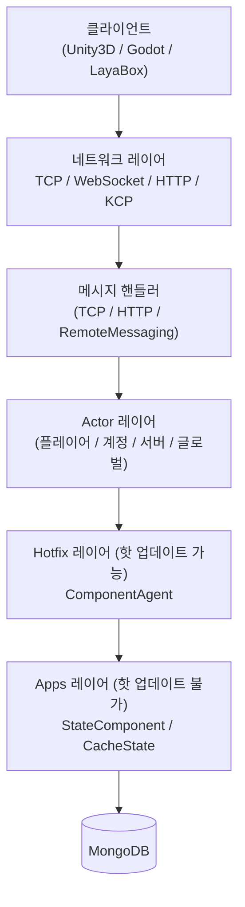

# 개요

GameFrameX Server는 C# .NET 10.0 기반으로 개발된 고성능 크로스 플랫폼 게임 서버 프레임워크입니다. Actor 모델과 락 프리(lock-free) 메시지 큐를 채택하고 있으며, 핫 업데이트 메커니즘을 지원합니다. 멀티플레이어 온라인 게임을 위해 설계되었으며, Unity3D, Godot, LayaBox 등 다양한 클라이언트와 연동할 수 있습니다.

## 빠른 시작

### 환경 요구 사항

- [.NET 10.0 SDK](https://dotnet.microsoft.com/download/dotnet/10.0)(.NET 8/9는 지원하지 않음)
- MongoDB 4.x+
- Visual Studio 2022 또는 JetBrains Rider

### 시작 절차

1. MongoDB 시작:

```bash
docker run -d -p 27017:27017 --name mongo mongo:8.2
```

Source: [README.zh-CN.md](https://github.com/GameFrameX/GameFrameX.Server.Source/blob/main/README.zh-CN.md#L192-L199)

2. 프로젝트 복원 및 빌드:

```bash
dotnet restore
dotnet build
```

Source: [README.zh-CN.md](https://github.com/GameFrameX/GameFrameX.Server.Source/blob/main/README.zh-CN.md#L182-L189)

3. 서버 시작(Game 타입 예시):

```bash
dotnet run --project GameFrameX.Launcher -- \
    --ServerType=Game \
    --ServerId=1000 \
    --OuterPort=29100 \
    --HttpPort=28080 \
    --DataBaseUrl=mongodb://127.0.0.1:27017 \
    --DataBaseName=gameframex
```

Source: [README.zh-CN.md](https://github.com/GameFrameX/GameFrameX.Server.Source/blob/main/README.zh-CN.md#L201-L210)

4. 시작 확인: `http://localhost:28080/game/api/health`에 접속하여 헬스 상태를 점검하고, 콘솔 로그를 통해 `Actor`와 리스닝 포트가 성공적으로 초기화되었는지 확인합니다.

Source: [README.zh-CN.md](https://github.com/GameFrameX/GameFrameX.Server.Source/blob/main/README.zh-CN.md#L212-L214)

## 작동 원리 요약

GameFrameX Server는 4개의 레이어로 구성됩니다: 네트워크 레이어는 클라이언트 메시지를 수신하고, Actor 레이어는 TPL DataFlow 기반의 락 프리 직렬 처리를 수행하며, 비즈니스 로직은 핫 업데이트 가능한 Hotfix 레이어에서 구현되고, 상태 데이터는 핫 업데이트가 불가능한 Apps 레이어에서 관리되어 배치 영속화를 통해 MongoDB에 기록됩니다.



Source: [README.zh-CN.md](https://github.com/GameFrameX/GameFrameX.Server.Source/blob/main/README.zh-CN.md#L92-L127)

### 핵심 기능

| 카테고리 | 기능 |
|------|------|
| 동시성 모델 | Actor 모델 + 완전 비동기 async/await, 락 프리 설계, 배치 영속화, 스노우플레이크 ID |
| 핫 업데이트 | 무중단 신규 어셈블리 로딩, 상태-로직 분리, 기존 어셈블리 10분 유예 기간 후 언로드, HTTP를 통한 버전 지정 지원 |
| 네트워크 프로토콜 | TCP(SuperSocket), WebSocket, HTTP/HTTPS(Kestrel + Swagger), KCP(실험적), 프로세스 간 RemoteMessaging |
| 데이터베이스 | MongoDB 메인 데이터베이스, 헬스 상태 머신, 연결 풀, OpenTelemetry 메트릭 포함 |
| 관측 가능성 | OpenTelemetry Metrics/Tracing/Logging, Prometheus 내보내기, Serilog 콘솔/파일/Loki 출력 |

Source: [README.zh-CN.md](https://github.com/GameFrameX/GameFrameX.Server.Source/blob/main/README.zh-CN.md#L50-L89)

### 프로젝트 구조

```
Server/
├── GameFrameX.Launcher/              # 애플리케이션 진입점
├── GameFrameX.StartUp/               # 시작 오케스트레이션 및 초기화
├── GameFrameX.Core/                  # 핵심 프레임워크(Actor, 컴포넌트, 이벤트, 핫 업데이트 관리)
├── GameFrameX.Apps/                  # 상태 데이터 레이어(핫 업데이트 불가)
├── GameFrameX.Hotfix/                # 비즈니스 로직 레이어(핫 업데이트 가능)
├── GameFrameX.Config/                # 게임 설정 테이블(LuBan 생성)
├── GameFrameX.NetWork/               # 네트워크 코어(메시지 객체, 센더, WebSocket)
├── GameFrameX.NetWork.HTTP/          # HTTP 서버(Swagger, Kestrel)
├── GameFrameX.NetWork.Kcp/           # KCP 프로토콜 지원
├── GameFrameX.NetWork.RemoteMessaging/ # 프로세스 간 원격 메시지(서킷 브레이커, 컨시스턴트 해싱)
├── GameFrameX.DataBase.Mongo/        # MongoDB 구현
├── GameFrameX.Monitor/               # OpenTelemetry + Prometheus 통합
├── GameFrameX.Utility/               # 유틸리티 모음(로그, 압축, 오브젝트 풀, Mapster)
├── GameFrameX.AppHost/               # .NET Aspire 앱 호스트
└── Tests/GameFrameX.Tests/           # xUnit 테스트 스위트
```

Source: [README.zh-CN.md](https://github.com/GameFrameX/GameFrameX.Server.Source/blob/main/README.zh-CN.md#L131-L162)

## 다음 단계

- 먼저 실행해 보고 싶다면: 위의 "빠른 시작"에 따라 클론 → 빌드 → 시작을 진행하세요.
- 각 설정 항목의 기본값을 알고 싶다면: 《설정 참조》를 참고하세요(`--ServerType` / `--OuterPort` / `--DataBaseUrl` 등 항목별로 정리되어 있음).
- 첫 번째 비즈니스 Handler를 작성하고 싶다면: 《비즈니스 Handler 구현 방법》을 참고하세요(`ComponentAgent` + `StateComponent` 기반 예제 포함).
- 시작 후 오류가 발생한다면: 《시작 실패 시 대처 방법》을 참고하세요(MongoDB 연결, 포트 점유, Actor 타임아웃 등 일반적인 증상 포함).
- Actor와 컴포넌트에 대해 알고 싶다면: 《핵심 개념: Actor / 컴포넌트 / 에이전트》를 참고하세요.