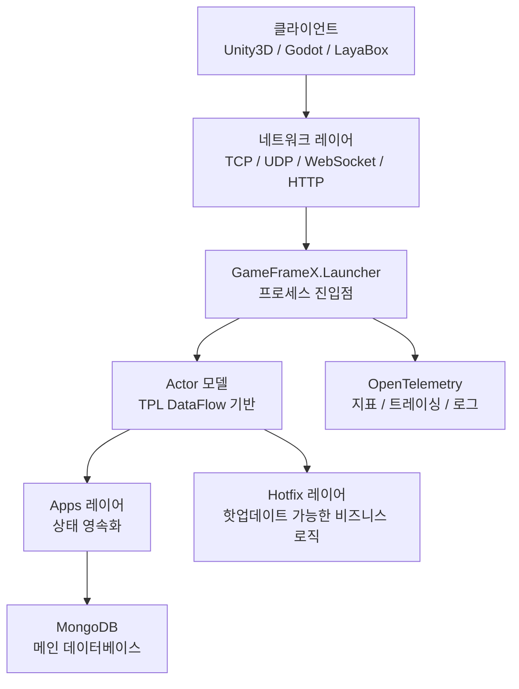

# 빠른 시작: 첫 번째 게임 서버 구축하기

이 페이지의 단계를 따라 하면 로컬에서 GameFrameX Server를 실행하여 TCP / HTTP / WebSocket을 수신하는 게임 서버 프로세스를 구동하고, 헬스 체크 인터페이스를 통해 시작 성공 여부를 확인할 수 있습니다. 프레임워크는 .NET 10.0을 기반으로 하며, Actor 모델을 사용하고, 기본적으로 MongoDB에 연결하여 상태를 영속화합니다.

## 사전 조건

| 의존성 | 버전 | 설명 |
|------|------|------|
| .NET SDK | 10.0 | 프레임워크는 .NET 10.0을 대상으로 합니다; [dotnet 공식 사이트](https://dotnet.microsoft.com/download/dotnet/10.0)에서 다운로드 |
| MongoDB | 4.x 이상 | 메인 데이터베이스로, 상태 영속화에 사용; 로컬 기본값 `mongodb://127.0.0.1:27017` |
| Docker(선택 사항) | 최신 버전 | MongoDB를 설치하고 싶지 않을 때 저장소 루트 디렉터리의 `docker-compose.yml`로 한 번에 실행 가능 |
| IDE | 무관 | Rider / VS 2022(17.10+)/ VS Code 모두 가능 |

## 빠른 시작

### 1. 소스 코드 가져오기

```bash
git clone https://github.com/GameFrameX/GameFrameX.Server.Source.git
cd GameFrameX.Server.Source
```

### 2. 데이터베이스 준비(둘 중 하나 선택)

**방식 A: 저장소에 포함된 Docker Compose 사용**

```bash
docker-compose up -d mongodb
```

**방식 B: MongoDB 직접 시작**, `127.0.0.1:27017`을 수신하는지 확인하세요.

### 3. 솔루션 빌드

```bash
dotnet build GameFrameX.Launcher -c Debug
```

### 4. 서버 시작

최소 시작 명령(`Launcher`는 프로세스 진입점입니다):

```bash
dotnet run --project GameFrameX.Launcher -- \
    --ServerType=Game \
    --ServerId=1000 \
    --OuterPort=29100 \
    --HttpPort=28080 \
    --DataBaseUrl=mongodb://127.0.0.1:27017 \
    --DataBaseName=gameframex
```

모든 설정 항목은 `--Key=Value` 명령줄 인수를 통해 전달되며, `StartupOptions`에 정의되어 있습니다. 자주 사용하는 항목은 아래 표를 참고하세요:

| 설정 항목 | 필수 여부 | 기본값 | 설명 |
|--------|----------|--------|------|
| `ServerType` | 예 | 없음 | 서버 유형, 예: `Game`, `Social` |
| `ServerId` | 예 | 없음 | 서버 고유 식별 ID |
| `DataBaseUrl` | 예 | 없음 | MongoDB 연결 문자열 |
| `DataBaseName` | 예 | 없음 | 데이터베이스 이름 |
| `OuterPort` | 아니요 | `29100` | 클라이언트용 TCP 포트 |
| `HttpPort` | 아니요 | `8080` | HTTP / 헬스 체크 포트 |
| `IsEnableHttp` | 아니요 | `true` | HTTP 서비스 활성화 여부 |
| `HttpIsDevelopment` | 아니요 | `false` | 개발 모드(Swagger 활성화) |
| `IsEnableWebSocket` | 아니요 | `false` | WebSocket 활성화 여부 |

### 5. 시작 확인

시작 후 다음 두 가지 작업으로 서비스가 정상인지 확인하세요:

1. **헬스 체크 인터페이스**(기본 API 루트 경로는 `/game/api/`입니다):
   ```bash
   curl http://localhost:28080/game/api/health
   ```
2. **콘솔 로그 확인**, `Server started, listening on 0.0.0.0:29100`와 유사한 내용이 출력되면 시작에 성공한 것입니다.

## 작동 원리 개요



- **Launcher**: 프로세스 진입점으로, 명령줄 인수를 받아 네트워크 레이어와 Actor 컨테이너를 시작합니다.
- **Apps 레이어**: `StateComponent`와 `BaseCacheState`를 정의하며, 상태 영속화를 담당하고 핫업데이트가 불가능합니다.
- **Hotfix 레이어**: `StateComponentAgent`를 구현하며, 비즈니스 로직을 포함하고 런타임 핫업데이트를 지원합니다.
- **Actor 모델**: 락 없는 고동시성, 내부 상태는 메시지 큐를 통해 직렬화하여 접근합니다.
- **네트워크 레이어**: TCP(SuperSocket 기반), WebSocket, HTTP/Kestrel 멀티 프로토콜 병렬 처리.

## 최소한의 로그인 컴포넌트 작성하기

프레임워크의 핵심 패턴은 **상태-로직 분리**입니다. 아래에서 로그인 예제로 전체 흐름을 살펴봅니다.

**1. 상태(Apps 레이어, 핫업데이트 불가)**

`GameFrameX.Apps/Account/Login/Entity/LoginState.cs`가 이미 존재하며, 필드에는 계정, Token, 로그인 시간 등이 포함됩니다.

**2. 컴포넌트(Apps 레이어, 핫업데이트 불가)**

```csharp
public class LoginComponent : StateComponent<LoginState>
{
    protected override async Task OnInit()
    {
        await base.OnInit();
        // 컴포넌트 상태 초기화
    }
}
```

**3. 비즈니스 로직(Hotfix 레이어, 핫업데이트 가능)**

`GameFrameX.Hotfix/Logic/Account/Login/ReqLoginHandler.cs`가 이미 존재하며, HTTP / 메시지 핸들러로서 `LoginComponent`를 호출하여 Token을 기록합니다.

**4. 레이어 간 호출**

```csharp
// ActorManager를 통해 컴포넌트 에이전트 가져오기
var loginAgent = await ActorManager.GetComponentAgent<LoginComponentAgent>(actorId);
var result = await loginAgent.Login(account, password);
```

전체 비즈니스 개발 프로세스와 컴포넌트 에이전트 패턴은 《비즈니스 로직 개발》 장을, Hotfix 어셈블리 교체 메커니즘은 《핫업데이트 메커니즘》 장을 참고하세요.

## 다음 단계

- **설정 항목 전체**: 《설정 참조》 참고——모든 `--Key=Value` 파라미터, 기본값과 예시.
- **비즈니스 개발**: 《Actor 컴포넌트 작성 방법》 참고——상태, 컴포넌트, 에이전트 3종 세트.
- **핫업데이트**: 《비즈니스 로직 핫업데이트 방법》 참고——Hotfix 어셈블리 무중단 교체.
- **Docker 배포**: 《Docker 배포》 참고——루트 디렉터리의 `docker-compose.yml` / `docker-compose.multi.yml`로 멀티 프로세스 통합 테스트.
- **모니터링**: 《모니터링과 관측 가능성》 참고——Prometheus, Grafana Loki, OpenTelemetry 연동.