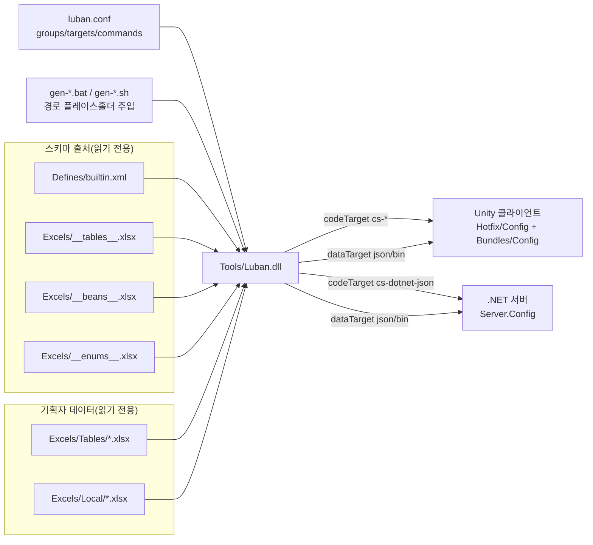

# Config 도구의 작동 원리

GameFrameX.Config는 [Luban](https://github.com/GameFrameX/luban) 기반의 설정 테이블 도구입니다: `Excels/` 아래의 Excel 워크북(데이터 테이블 + 로컬라이제이션 테이블 + 고급 정의 테이블)을 읽고, `Defines/builtin.xml`과 `luban.conf`의 설정을 결합하여, 클라이언트와 서버 양측 모두에서 바로 로드할 수 있는 C# 코드와 데이터 파일로 한 번에 생성합니다.

## 한 줄 워크플로우

`gen-*.bat` 또는 `gen-*.sh` 스크립트 실행 → 도구가 `luban.conf`를 읽음 → `targets` 목록의 명령에 따라 `Tools/Luban.dll`을 하나씩 호출 → Unity 프로젝트의 `Hotfix/Config/Generate/`(코드)와 `Bundles/Config/`(데이터) 아래에 파일을 산출하고, 동시에 `Server.Config/` 아래에 서버 버전을 산출합니다.

## 설정 주도: `luban.conf`가 무엇을 생성할지 결정

`luban.conf`는 도구의 "중앙 설정"이며, 모든 동작이 여기서 비롯됩니다. 출처:[luban.conf](https://github.com/GameFrameX/GameFrameX.Config/blob/main/luban.conf)

| 필드 | 의미 | 예시 |
|------|------|------|
| `groups` | 그룹 표시, `c` = 클라이언트, `s` = 서버 | `"names": ["c"]`, ``"names": ["s"]` |
| `schemaFiles` | 데이터 스키마 정의 출처(필드 타입, 열거형, bean, 테이블 골격 포함) | `Defines`, `Excels/__tables__.xlsx`, `Excels/__beans__.xlsx`, `Excels/__enums__.xlsx` |
| `dataDir` | 비즈니스 데이터가 위치한 디렉터리 | `Excels` |
| `targets` | 한 번의 생성으로 산출할 대상 집합(각 대상은 자체 네임스페이스, manager, groups를 가짐) | `server`, `client`, `all` |
| `commands` | 실제로 Luban에 전달되는 명령줄, 대상마다 여러 개가 대응됨(json / bin 등 다양한 형식) | `--target server --dataTarget json --codeTarget cs-dotnet-json …` |
| `toolPath` | Luban 도구 dll 경로 | `/../Config/Tools/Luban.dll` |
| `UNITY_ASSETS_PATH` / `SERVER_PATH` | 클라이언트와 서버 프로젝트 위치 플레이스홀더, 명령어에서 전개됨 | 실행 스크립트에 의해 주입됨 |

각 `commands`는 플레이스홀더 `%UNITY_ASSETS_PATH%`와 `%SERVER_PATH%`를 통해 코드와 데이터를 어느 프로젝트 디렉터리에 기록할지 결정합니다.

## 3계층 데이터: 동작 / 스키마 / 데이터

도구는 작업 내용을 세 계층의 출처로 나눕니다:

1. **동작 계층**(`luban.conf`): 생성 형식, 대상, 네임스페이스를 결정합니다.
2. **스키마 계층**(`Defines/builtin.xml` + `Excels/__*__.xlsx`): 필드 타입, 열거형, 구조체, 테이블 골격을 정의합니다.
3. **데이터 계층**(`Excels/Tables/*.xlsx`, `Excels/Local/*.xlsx`): 기획자가 실제로 입력한 데이터입니다.

출처 예시 — `Defines/builtin.xml`은 동일한 "좌표"를 클라이언트에서는 Unity 타입으로, 서버에서는 .NET 타입으로 매핑합니다:

```xml
<bean name="vec3" valueType="1" sep="," group="*">
    <var name="x" type="float"/>
    <var name="y" type="float"/>
    <var name="z" type="float"/>
    <mapper target="client" codeTarget="cs-bin,cs-simple-json">
        <option name="type" value="UnityEngine.Vector3"/>
        <option name="constructor" value="ExternalTypeUtil.NewVector3"/>
    </mapper>
    <mapper target="server" codeTarget="cs-bin,cs-dotnet-json">
        <option name="type" value="System.Numerics.Vector3"/>
        <option name="constructor" value="ExternalTypeUtil.NewVector3"/>
    </mapper>
</bean>
```

출처:[Defines/builtin.xml](https://github.com/GameFrameX/GameFrameX.Config/blob/main/Defines/builtin.xml#L14-L26)

즉, 기획자는 Excel 한 부만 작성하면 도구가 대상에 따라 해당 언어/엔진의 코드를 자동으로 출력하므로, 클라이언트와 서버를 위해 각각 작성할 필요가 없습니다.

## 3가지 생성 대상

출처:[luban.conf](https://github.com/GameFrameX/GameFrameX.Config/blob/main/luban.conf#L35-L60)

| 대상 이름 | `topModule`(네임스페이스) | `manager` | 활성화 시기 |
|--------|-----------------------|-----------|----------|
| `server` | `GameFrameX.Config` | `TablesComponent` | 서버 코드/데이터, groups = `s` |
| `client` | `Hotfix.Config` | `TablesComponent` | Unity 클라이언트 코드/데이터, groups = `c` |
| `all` | `cfg` | `Tables` | 범용 내보내기, groups = `c,s` |

`commands` 목록의 각 명령은 또한 `dataTarget`(`json` 또는 `bin`), `codeTarget`(`cs-dotnet-json` / `cs-simple-json` / `cs-bin`) 및 `validationFailAsError`를 독립적으로 전환할 수 있습니다.

## 한 번의 완전한 생성 단계

1. 기획자가 `Excels/Tables/*.xlsx`와 `Excels/Local/*.xlsx`를 작성합니다(명명은 `字母-英文名-中文名` 규칙을 따릅니다).
2. 저장소 루트 디렉터리에서 `gen-client-json.bat / .sh`(또는 `gen-server-bin.bat / .sh` 등)를 실행하면, 스크립트 내부에서 `UNITY_ASSETS_PATH`, `SERVER_PATH`를 플레이스홀더에 주입합니다.
3. 도구가 `luban.conf`를 읽고, `commands` 순서대로 `Tools/Luban.dll`을 실행하며, 각 target마다 하나의 명령이 대응됩니다.
4. Luban이 스키마 파일(`Defines/`, `__tables__.xlsx`, `__beans__.xlsx`, `__enums__.xlsx`)을 파싱하고, `Excels/` 데이터와 하나씩 검증합니다.
5. `codeTarget`에 따라 C# 소스 코드를 `%UNITY_ASSETS_PATH%/Hotfix/Config/Generate/` 또는 `%SERVER_PATH%/Server.Config/Config/`에 생성합니다.
6. `dataTarget`에 따라 데이터 파일을 `Bundles/Config/`(런타임 시 첫 패키지에 번들링됨) 또는 `Server.Config/Json/`(서버에서 읽음)에 생성합니다.
7. 터미널에 성공 출력이 표시되고 파일이 저장되면 프로젝트에서 바로 `tables.TbXxx.Get(id)`를 호출할 수 있습니다.

## 아키텍처 관계도



## 설계 의도(배경)

- **설정이 곧 중심**: `luban.conf`는 "누가 생성하고, 어디에 생성하며, 어떤 형식을 사용할지"를 모두 JSON으로 외부화합니다. 새 대상을 추가하거나 json/bin으로 전환할 때 도구 본체를 수정할 필요가 없습니다.
- **한 부의 데이터를 양측에서 사용**: `Defines/builtin.xml`에서 동일한 bean을 `<mapper target="client" ...>`와 `<mapper target="server" ...>`로 각각 Unity와 .NET 타입에 매핑하여, Unity와 서버가 동일한 비즈니스 테이블을 공유하도록 합니다.
- **그룹 분할 병합**: 동일한 영어 테이블 이름(예: `D-ItemConfig-道具表-1001.xlsx`와 `D-ItemConfig-道具表-2001.xlsx`)은 하나의 테이블로 병합되어, 필요에 따라 큰 테이블을 분할하기 편리합니다.

## 관련 링크

- [Defines/builtin.xml](https://github.com/GameFrameX/GameFrameX.Config/blob/main/Defines/builtin.xml)
- [luban.conf](https://github.com/GameFrameX/GameFrameX.Config/blob/main/luban.conf)
- [README.zh-CN.md](https://github.com/GameFrameX/GameFrameX.Config/blob/main/README.zh-CN.md)
- 업스트림 도구 [GameFrameX/luban](https://github.com/GameFrameX/luban)