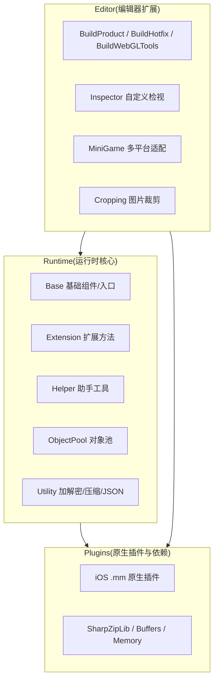

# 框架三层结构速览

GameFrameX 是一个面向独立游戏开发者的 Unity 框架,采用 **Runtime / Plugins / Editor** 三层模块化架构。三层之间职责清晰、相互协作:Runtime 提供运行时核心功能,Plugins 提供原生平台能力与第三方依赖,Editor 提供编辑器扩展与构建流水线。本页用一张图和一张表带你快速建立全局认知。

## 工作原理速览



## 三层职责速查

| 层 | 目录 | 关键文件 | 主要职责 |
|----|------|----------|----------|
| **Runtime** | `Runtime/` | [GameEntry.cs](/Runtime/Base/GameEntry.cs#L46-L60)、[GameFrameworkComponent.cs](/Runtime/Base/GameFrameworkComponent.cs#L43-L45) | 框架入口、组件管理、事件池、引用池、对象池、变量系统、加密压缩、JSON、扩展方法、助手工具 |
| **Plugins** | `Plugins/` | [GameFrameX.mm](/Plugins/iOS/GameFrameX/GameFrameX.mm)、`ICSharpCode.SharpZipLib.dll`、`System.Memory.dll` | iOS 原生能力、ZIP 压缩库、.NET 内存与运行时支持 |

## 接下来

- 想了解 Runtime 内部 Base / Extension / Helper / Utility 等子模块分工,见《Runtime 模块详解》。
- 想了解 Plugins 的 iOS 原生插件与 DLL 依赖清单,见《Plugins 模块详解》。
- 想了解 Editor 构建流水线、小游戏多平台适配与 Inspector 扩展,见《Editor 模块详解》。
- 想从零跑通一个最小工程,见《快速开始》。## Runtime 层(运行时核心)

Runtime 是框架的全部 C# 代码,目录按职责划分为 7 个子模块。

| 子模块 | 关键内容 | 说明 |
|--------|----------|------|
| **Base** | [GameEntry.cs](/Runtime/Base/GameEntry.cs#L46-L56)、[GameFrameworkComponent.cs](/Runtime/Base/GameFrameworkComponent.cs#L43-L45)、`EventPool/`、`ReferencePool/`、`TaskPool/`、`Variable/` | 框架入口与组件基类、事件池、引用池、任务池、可绑定变量、单例 |
| **Extension** | `BinaryExtension`、`StringExtensions`、`CollectionExtensions`、`UnityEngine.Transform` 扩展等 | 通用与 Unity 类型扩展方法 |
| **Helper** | `ApplicationHelper`、`FileHelper`、`PathHelper`、`MathHelper`、`TimerHelper`、`ZipHelper` 等 | 应用、文件、路径、数学、计时、压缩等运行时助手 |
| **ObjectPool** | [ObjectPoolComponent.cs](/Runtime/ObjectPool/ObjectPoolComponent.cs) | `GameFrameworkComponent` 子类,负责对象复用与内存优化 |
| **Property** | `BindableProperty` | MVVM 风格的可绑定属性 |
| **ReferencePool** | `ReferencePoolComponent` | 引用类型对象池,降低 GC 压力 |
| **Utility** | `Utility.Encryption`(AES/RSA/DSA)、`Utility.Compression`、`Utility.Json`、`Utility.Hash`(MD5/SHA1/HMAC)、`Utility.Verifier`(CRC32/CRC64) | 加密、压缩、JSON、哈希、校验等纯静态工具 |

入口类型示例:

```csharp
using GameFrameX.Runtime;

// 框架入口,提供游戏框架组件的统一访问点
public static class GameEntry { /* ... */ }

// 所有挂载到 GameEntry 的组件都继承自该基类
public abstract class GameFrameworkComponent : MonoBehaviour { /* ... */ }
```

Source: [GameEntry.cs](/Runtime/Base/GameEntry.cs#L46-L60), [GameFrameworkComponent.cs](/Runtime/Base/GameFrameworkComponent.cs#L43-L45)

## Plugins 层(原生插件与依赖)

Plugins 层只放不能在 Unity C# 层完成的事情:原生平台插件与第三方 .NET DLL。

| 子模块 | 文件 | 说明 |
|--------|------|------|
| **iOS 插件** | [GameFrameX.mm](/Plugins/iOS/GameFrameX/GameFrameX.mm)、`GameFrameXTrackingAuthorization.mm` | iOS 原生能力(如 ATT 追踪权限) |
| **压缩库** | `ICSharpCode.SharpZipLib.dll` | ZIP 压缩/解压,被 `Utility.Compression` 调用 |
| **内存与缓冲区** | `System.Buffers.dll`、`System.Memory.dll`、`System.IO.Pipelines.dll` | 高性能内存与 IO 管道 |
| **运行时支持** | `Microsoft.NET.StringTools.dll`、`System.Runtime.CompilerServices.Unsafe.dll` | 字符串优化与不安全代码支持 |

## Editor 层(编辑器扩展)

Editor 层仅在 Unity 编辑器内生效,提供构建流水线与开发辅助。

| 子模块 | 关键文件 | 说明 |
|--------|----------|------|
| **BuildProduct** | `BuildProductHelper`、`BuildPostProcessHelper`、`IBuilderPreHookHandler`、`IBuilderPostHookHandler` | 通用构建助手与构建前/后钩子 |
| **BuildHotfix** | `BuildHotfixHelper`、`HotFixAssemblyDefinitionHelper` | HybridCLR 热更新程序集构建 |
| **BuildWebGLTools** | `BuildWebGLToolsWithHybridCLR` | WebGL 平台 + HybridCLR 联合构建 |
| **MiniGame** | [MiniGameDefineSymbolHelper.WeChat.cs](/Editor/MiniGame/DomesticMiniGames/MiniGameDefineSymbolHelper.WeChat.cs) 等 21 个平台宏定义 | 微信、支付宝、抖音、快手、百度、京东、美团、淘宝等平台一键切换 |
| **Inspector** | `BaseComponentInspector`、`ObjectPoolComponentInspector`、`ReferencePoolComponentInspector` | 自定义检视面板,运行时观察池状态 |
| **Cropping** | `CroppingWindow` | 图片裁剪工具 |
| **InspectorLockShortcut** | `InspectorLockShortcut` | Inspector 锁定快捷键 |

构建钩子使用示例(伪代码,真实签名见源文件):

```csharp
using GameFrameX.Editor;

public sealed class MyPreBuildHook : IBuilderPreHookHandler
{
    public void OnBeforeBuild(BuildContext ctx) { /* ... */ }
}
```