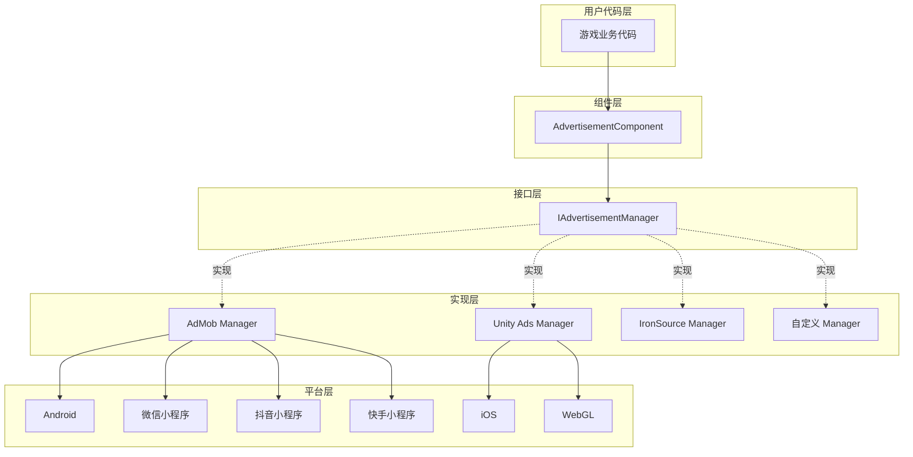
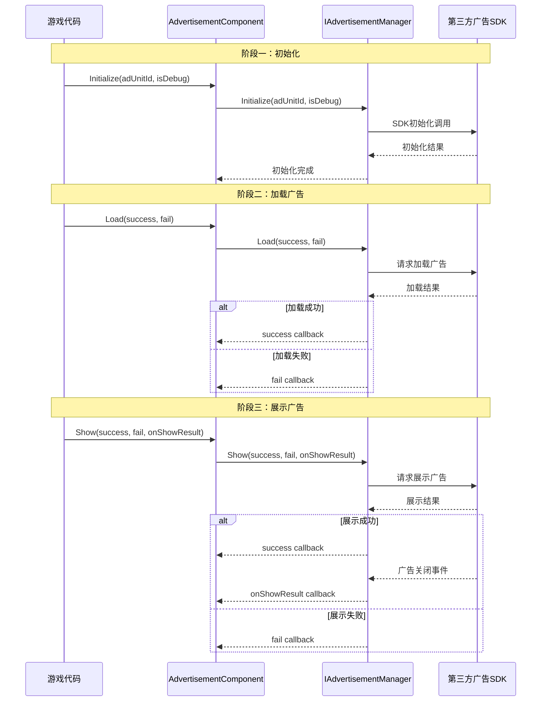

# 概述

Game Frame X Advertisement 是 Game Frame X 框架的广告组件，为 Unity 项目提供统一的广告功能抽象层。该组件采用策略模式设计，使开发者能够轻松集成各种广告 SDK（如 AdMob、Unity Ads、IronSource 等），而无需修改核心业务代码。

## 项目简介

`com.gameframex.unity.advertisement` 是 Game Frame X 框架的核心模块之一，专门用于解决 Unity 项目中广告集成的复杂性。该组件提供了一套标准化的广告操作接口，开发者只需编写一次广告调用代码，即可在不同的广告平台之间切换。

该组件支持 Unity 2017.1 及更高版本，当前最新版本为 1.4.0。采用 Apache License 2.0 开源许可证，允许在商业和非商业项目中免费使用。

## 架构设计

该组件采用分层架构设计，将广告业务逻辑与具体平台实现分离。这种设计遵循了依赖倒置原则，上层模块（AdvertisementComponent）依赖于抽象接口（IAdvertisementManager），而不关心具体实现细节。

## 核心组件

该组件包含四个核心类，它们各自承担不同的职责，协同完成广告功能的完整封装。

### AdvertisementComponent

 AdvertisementComponent 是用户直接交互的主要入口，它继承自 GameFrameworkComponent，是一个 Unity MonoBehaviour 组件。开发者需要将此组件添加到场景中的任意 GameObject 上，然后通过代码调用其方法来加载和展示广告。

> Source: [AdvertisementComponent.cs](https://cnb.cool/GameFrameX/com.gameframex.unity.advertisement/blob/main/Runtime/Advertisement/AdvertisementComponent.cs#L1-L169)

该组件的核心职责包括：根据当前运行平台自动选择对应的广告位 ID、在 Unity 生命周期中初始化广告管理器、以及提供 Load、Show、Play 三个主要方法供业务代码调用。

### IAdvertisementManager

 IAdvertisementManager 是广告管理器的核心接口，定义了所有广告操作的标准方法。任何具体的广告 SDK 实现都必须实现此接口，从而保证不同广告平台之间的行为一致性。

> Source: [IAdvertisementManager.cs](https://cnb.cool/GameFrameX/com.gameframex.unity.advertisement/blob/main/Runtime/Advertisement/IAdvertisementManager.cs#L1-L55)

该接口定义了四个核心方法：Initialize 用于初始化广告管理器，SetExtraData 用于设置额外参数，Load 用于预加载广告，Show 用于展示广告。接口设计采用了回调模式，通过 Action 委托处理异步操作的成功、失败和结果回调。

### BaseAdvertisementManager

 BaseAdvertisementManager 是一个抽象基类，继承自 GameFrameworkModule 并实现了 IAdvertisementManager 接口。它为开发者提供了一个创建自定义广告管理器的起点，封装了通用的回调处理逻辑。

> Source: [BaseAdvertisementManager.cs](https://cnb.cool/GameFrameX/com.gameframex.unity.advertisement/blob/main/Runtime/Advertisement/BaseAdvertisementManager.cs#L1-L109)

该基类定义了四个受保护的回调属性：OnShowResult、OnLoadSuccess、OnLoadFail，分别对应广告展示结果、广告加载成功和广告加载失败的情况。子类可以这些回调属性来触发相应的业务逻辑。

### AdvertisementComponentInspector

 AdvertisementComponentInspector 是 Unity 编辑器的自定义检视面板，继承自 ComponentTypeComponentInspector。它为 AdvertisementComponent 提供了友好的图形化配置界面，开发者可以在 Inspector 窗口中直接设置各平台的广告位 ID。

> Source: [AdvertisementComponentInspector.cs](https://cnb.cool/GameFrameX/com.gameframex.unity.advertisement/blob/main/Editor/Inspector/AdvertisementComponentInspector.cs#L1-L72)

这个编辑器集成大大简化了配置流程，开发者无需编写代码即可完成广告位 ID 的设置。

## 工作流程

广告的标准工作流程分为三个主要阶段：初始化、加载和展示。这个流程设计遵循了最佳实践，确保广告能够平稳加载并及时展示。

初始化阶段在 AdvertisementComponent 的 Start 方法中自动执行，使用 Inspector 中配置的广告位 ID。加载阶段是可选的，但建议在展示广告前预先调用 Load 方法，以减少用户等待时间。展示阶段通过 Show 方法触发，展示完成后会通过 onShowResult 回调通知开发者广告是否被完整观看，这对于激励视频广告尤为重要。

## 平台支持

该组件支持多种平台和发布目标，能够满足不同游戏项目的发布需求。

| 平台 | 配置字段 | 说明 |
|------|----------|------|
| Android | m_adUnitIdAndroid | Google Play 和其他 Android 应用商店 |
| iOS | m_adUnitIdiOS | Apple App Store |
| WebGL | m_adUnitIdWebGL | 标准 WebGL 发布 |
| 微信小程序 | m_adUnitIdWebGLWeChat | 微信小游戏平台 |
| 抖音小程序 | m_adUnitIdWebGLDouYin | 抖音小游戏平台 |
| 快手小程序 | m_adUnitIdWebGLKuaiShou | 快手小游戏平台 |

组件会根据编译时的平台宏自动选择对应的广告位 ID。开发者需要在对应平台的发布设置中配置正确的编译宏，例如 ENABLE_WECHAT_MINI_GAME、ENABLE_DOUYIN_MINI_GAME、ENABLE_KUAISHOU_MINI_GAME 等。

## 激励视频支持

该组件特别优化了激励视频广告的支持，这是移动游戏中最常见的变现方式之一。激励视频允许玩家主动选择观看广告以获取游戏内奖励，这种广告形式具有较高的用户接受度和转化率。

激励视频的核心流程是：玩家触发观看广告的动作 -> 广告展示 -> 玩家完整观看或中途关闭 -> 回调通知开发者是否应该发放奖励。onShowResult 回调的布尔值参数指示广告是否被完整观看：true 表示用户观看了完整的广告，应该发放奖励；false 表示用户跳过了广告或因其他原因未完整观看，不应该发放奖励。

这种设计确保了奖励发放的公平性，防止玩家通过关闭广告或使用其他方式跳过广告而获取不应得的奖励。

## 设计理念

该组件的设计遵循了几个核心原则，以确保其易用性、可扩展性和可靠性。

首先是开闭原则，系统对扩展开放、对修改关闭。当需要支持新的广告平台时，只需创建新的 IAdvertisementManager 实现类，无需修改现有代码。这种设计使得添加广告平台变得简单可控，不会影响现有功能的稳定性。

其次是依赖倒置原则，高层模块不应该依赖于低层模块，两者都应该依赖于抽象。AdvertisementComponent 依赖于 IAdvertisementManager 接口，而不关心具体是哪个广告平台的实现。这使得可以在不修改业务代码的情况下切换广告平台。

最后是单一职责原则，每个类都有明确的职责边界。AdvertisementComponent 负责与 Unity 生命周期集成和分发调用，IAdvertisementManager 定义接口契约，具体实现类负责与各自的 SDK 交互。这种分离使得代码更容易理解和维护。

## 应用场景

该组件适用于各种需要广告变现的 Unity 游戏项目，特别是那些需要发布到多个平台的项目。通过统一的接口抽象，开发者可以一次性编写广告逻辑代码，然后根据需要选择不同的广告平台实现。

对于需要在多个小程序平台发布的项目，该组件的跨平台广告位 ID 配置功能尤为重要。开发者可以分别为微信、抖音、快手等平台配置不同的广告位，无需修改代码即可实现多平台发布。

## 相关链接

- [安装指南](./2-installation) - 了解如何在项目中安装和配置组件
- [快速开始](./3-getting-started) - 快速上手使用广告功能
- [核心概念](./4-core-concepts) - 深入了解组件的设计原理
- [平台配置](./5-platforms) - 各平台的详细配置说明
- [API 参考](./6-api-reference) - 完整的接口文档
- [常见问题](./7-troubleshooting) - 常见问题解答

## 更新日志

当前版本为 1.4.0，该版本为快手小游戏平台添加了 WebGL 广告位 ID 支持。组件持续迭代更新，每次更新都会带来新的平台支持、功能增强和错误修复。

> Source: [CHANGELOG.md](https://cnb.cool/GameFrameX/com.gameframex.unity.advertisement/blob/main/CHANGELOG.md#L1-L70)
