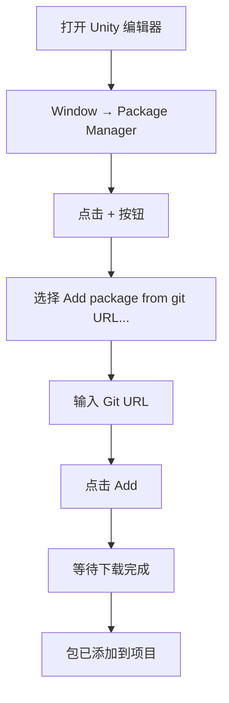
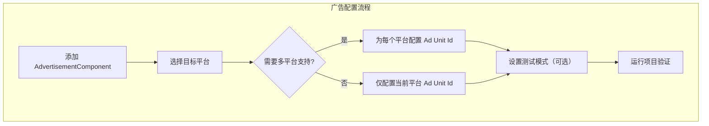

# 安装指南

本指南将帮助您将 Game Frame X Advertisement 组件安装到 Unity 项目中，并完成基本配置。

## 概述

Game Frame X Advertisement 是 Game Frame X 框架的广告组件，提供统一的广告功能抽象层。该组件支持多种广告平台，包括 AdMob、Unity Ads、IronSource 等，允许开发者在不修改核心代码的情况下切换不同的广告 SDK。

> **重要提示**：本组件 (`com.gameframex.unity.advertisement`) 提供广告显示的抽象层和核心逻辑。您需要项目中包含一个具体的 `IAdvertisementManager` 接口实现，该实现负责与特定的广告 SDK 进行交互。

## 前置要求

在安装本组件之前，请确保满足以下条件：

| 要求 | 说明 |
|------|------|
| Unity 版本 | 2017.1 或更高版本 |
| Game Frame X 核心 | 需要已安装 GameFrameX.Runtime 和 GameFrameX.Event.Runtime |
| 广告 SDK | 需要集成具体的广告平台 SDK（如 AdMob、Unity Ads 等） |

## 安装步骤

### 方式一：通过 Unity Package Manager 安装（推荐）

1. 打开 Unity 编辑器
2. 选择菜单 `Window` → `Package Manager`
3. 在 Package Manager 窗口中，点击左上角的 `+` 按钮
4. 选择 `Add package from git URL...`
5. 输入以下 Git URL：
   ```
   https://github.com/AlianBlank/com.gameframex.unity.advertisement.git
   ```
6. 点击 `Add` 按钮开始安装
7. 等待 Package Manager 下载并导入包



### 方式二：通过 npm/cnpm 安装

如果您的网络环境访问 GitHub 较慢，可以使用 CNPM 镜像：

1. 在 `Packages/manifest.json` 文件中添加依赖：
   ```json
   {
     "dependencies": {
       "com.gameframex.unity.advertisement": "https://npm.cnb.cool/GameFrameX/com.gameframex.unity.advertisement.git"
     }
   }
   ```
2. 保存文件后，Unity 会自动下载并导入包

### 方式三：手动安装

1. 从 GitHub 仓库克隆或下载源码：
   ```
   https://github.com/AlianBlank/com.gameframex.unity.advertisement.git
   ```
2. 将下载的文件夹复制到 Unity 项目的 `Packages` 目录下
3. 重命名文件夹为 `com.gameframex.unity.advertisement`
4. 重新打开 Unity 编辑器

## 依赖配置

本组件依赖以下 Game Frame X 模块，需要确保这些模块已正确安装：

```json
// GameFrameX.Advertisement.Runtime.asmdef
{
    "references": [
        "GameFrameX.Runtime",
        "GameFrameX.Event.Runtime"
    ]
}
```

### 安装 Game Frame X 核心模块

如果尚未安装 Game Frame X 核心模块，请按以下步骤安装：

1. 在 Package Manager 中添加 GameFrameX 核心包：
   ```
   https://github.com/AlianBlank/com.gameframex.unity.runtime.git
   ```

## 场景配置

### 添加 AdvertisementComponent

1. 在 Unity 编辑器中，打开需要集成广告的场景
2. 在 Hierarchy 面板中，右键点击并选择 `Create Empty` 创建一个空 GameObject
3. 选择该 GameObject，在 Inspector 面板中点击 `Add Component`
4. 搜索并添加 `Advertisement Component`（或 `GameFrameX/Advertisement`）
5. 组件已添加到场景中

```csharp
// 也可以通过代码方式添加组件
using GameFrameX.Advertisement.Runtime;
using UnityEngine;

public class AdSetup : MonoBehaviour
{
    void Start()
    {
        // 确保场景中有 AdvertisementComponent
        var adComponent = GetComponent<AdvertisementComponent>();
        if (adComponent == null)
        {
            adComponent = gameObject.AddComponent<AdvertisementComponent>();
        }
    }
}
```

### 配置广告位 ID

在 Inspector 面板中配置各平台的广告位 ID：

| 平台 | 字段名称 | 说明 |
|------|----------|------|
| Android | Ad Unit Id (Android) | Google Play 平台广告位 ID |
| iOS | Ad Unit Id (iOS) | Apple App Store 平台广告位 ID |
| WebGL | Ad Unit Id (WebGL) | 网页端广告位 ID |
| 微信小程序 | Ad Unit Id (WebGL WeChat) | 微信小程序广告位 ID |
| 抖音小程序 | Ad Unit Id (WebGL DouYin) | 抖音小程序广告位 ID |
| 快手小程序 | Ad Unit Id (WebGL KuaiShou) | 快手小程序广告位 ID |

> **注意**：组件会根据当前构建平台自动选择对应的广告位 ID。



### 测试模式配置

在 Inspector 面板中，勾选 `是否是测试模式` (Debug Mode) 选项可以启用测试广告，便于开发调试。

```csharp
// 也可以通过代码配置测试模式
public class AdSetup : MonoBehaviour
{
    void Start()
    {
        var adComponent = GetComponent<AdvertisementComponent>();
        // 手动初始化，第二个参数为是否启用调试模式
        adComponent.Initialize("your-ad-unit-id", true);
    }
}
```

## 广告管理器实现

### 实现 IAdvertisementManager 接口

本组件需要您提供具体的 `IAdvertisementManager` 接口实现。以下是实现步骤：

1. 创建一个新类，继承自 `BaseAdvertisementManager`
2. 实现所有抽象方法
3. 在游戏启动时注册您的实现

```csharp
using System;
using GameFrameX.Advertisement.Runtime;

public class MyAdManager : BaseAdvertisementManager
{
    public override void Initialize(string adUnitId, bool debug = false)
    {
        // 初始化广告 SDK
    }

    public override void Play(Action<bool> playResult, string customData = null)
    {
        // 播放激励视频广告
    }

    public override void Show(Action<string> success, Action<string> fail, Action<bool> onShowResult, string customData = null)
    {
        // 展示广告
    }

    public override void Load(Action<string> success, Action<string> fail, string customData = null)
    {
        // 加载广告
    }
}
```

> 详细实现说明请参阅 [核心概念](../4-core-concepts) 和 [快速开始](../3-getting-started) 文档。

## 验证安装

安装完成后，可以通过以下方式验证：

1. **检查包是否正确导入**：
   - 在 Unity 项目中查看 `Packages/com.gameframex.unity.advertisement` 目录
   - 确认 Runtime 和 Editor 文件夹存在

2. **检查编译是否成功**：
   - 在 Unity 中打开 `Window` → `Assembly Compiler`（如果安装了相关工具）
   - 或者尝试构建项目

3. **运行测试**：
   - 在场景中添加 AdvertisementComponent
   - 运行游戏，检查控制台是否有错误信息

## 常见问题

### Q: 安装后出现编译错误

**可能原因**：缺少依赖的 Game Frame X 核心模块。

**解决方案**：
1. 确认已安装 GameFrameX.Runtime
2. 确认已安装 GameFrameX.Event.Runtime
3. 重新导入广告组件包

### Q: 广告位 ID 没有自动匹配

**可能原因**：平台定义符号未正确设置。

**解决方案**：
- Android：确保在 Build Settings 中选择了 Android 平台
- iOS：确保在 Build Settings 中选择了 iOS 平台
- WebGL：确保在 Build Settings 中选择了 WebGL 平台

### Q: 无法在 Inspector 中看到配置选项

**可能原因**：Editor 脚本未正确编译。

**解决方案**：
1. 检查 Editor 文件夹是否存在
2. 重新打开 Unity 编辑器
3. 检查 `GameFrameX.Advertisement.Editor.asmdef` 是否存在

## 相关链接

- [概述](../1-overview) - 了解 Game Frame X Advertisement 整体架构
- [快速开始](../3-getting-started) - 快速上手使用广告功能
- [核心概念](../4-core-concepts) - 深入了解核心接口和实现
- [API 参考](../6-api-reference) - 完整的 API 文档
- [GitHub 仓库](https://github.com/AlianBlank/com.gameframex.unity.advertisement.git) - 官方源码仓库
