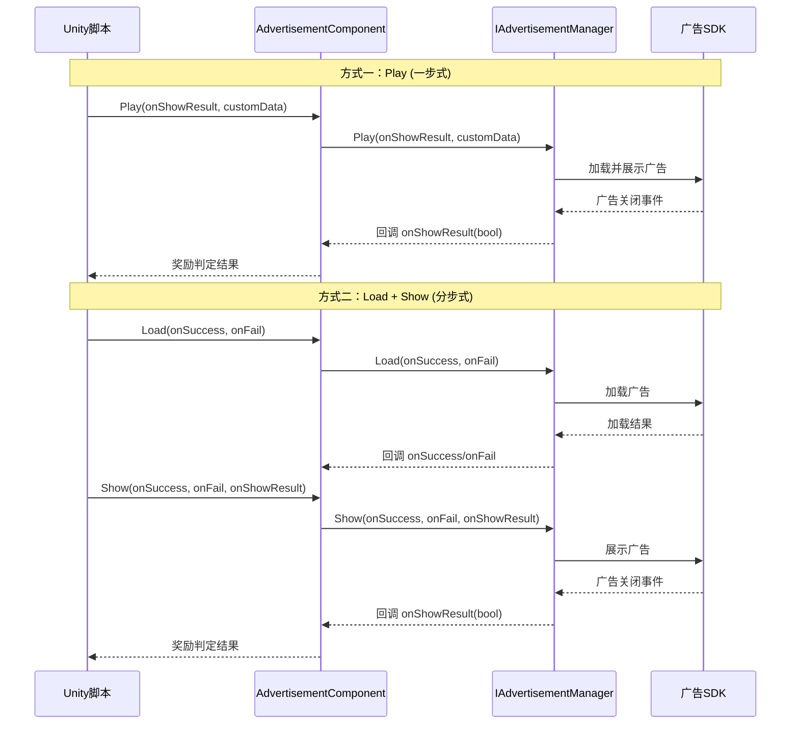

# 核心概念

本文档介绍 GameFrameX 广告模块的核心架构概念、设计模式和工作原理。理解这些概念有助于更好地使用和扩展广告功能。

## 概述

GameFrameX 广告模块是一个基于 Unity 的广告集成框架，采用模块化架构设计，提供了统一的广告接口抽象。该模块允许开发者以平台无关的方式实现广告功能，同时支持针对不同平台（Android、iOS、WebGL 以及各种小程序环境）的定制化实现。

核心设计理念是将广告业务逻辑与 Unity 组件生命周期解耦，通过接口抽象和模块化设计，使代码更加可测试、可维护和可扩展。

## 架构设计

```mermaid
graph TD
    subgraph Unity层["Unity 组件层"]
        AC[AdvertisementComponent<br/>广告组件]
    end

    subgraph 框架层["GameFrameX 框架层"]
        GFC[GameFrameworkComponent<br/>框架组件基类]
        GFE[GameFrameworkEntry<br/>框架入口]
        GFM[GameFrameworkModule<br/>框架模块基类]
    end

    subgraph 抽象层["抽象接口层"]
        IAM[IAdvertisementManager<br/>广告管理器接口]
        BAM[BaseAdvertisementManager<br/>广告管理器基类]
    end

    subgraph 实现层["平台实现层"]
        ADM[Platform Specific<br/>广告管理器实现]
    end

    AC -->|依赖| IAM
    AC -->|获取模块| GFE
    GFE -->|实例化| GFM
    IAM <|..| BAM
    BAM -->|继承| GFM
    BAM -->|依赖| ADM
    AC -->|引用| GFC
```

### 各层职责

**Unity 组件层**
- `AdvertisementComponent`：作为 Unity 游戏对象组件，封装了广告功能的对外接口
- 负责组件生命周期管理（Awake、Start）
- 处理平台特定的广告位 ID 选择

**框架层**
- `GameFrameworkComponent`：提供 Unity 组件的基础功能
- `GameFrameworkEntry`：提供模块注册和获取的入口点
- `GameFrameworkModule`：所有 GameFrameX 模块的基类

**抽象接口层**
- `IAdvertisementManager`：定义广告管理器的抽象接口，隔离业务逻辑与具体实现
- `BaseAdvertisementManager`：提供基础实现，定义回调字段和模板方法

**平台实现层**
- 由具体平台实现（如 Unity Ads、AdMob 等）继承 `BaseAdvertisementManager` 实现

## 核心组件详解

### IAdvertisementManager 接口

`IAdvertisementManager` 是广告模块的核心接口，定义了所有广告操作的标准契约：

```csharp
public interface IAdvertisementManager
{
    void Initialize(string adUnitId, bool isDebug = false);
    void SetExtraData(string key, string value);
    void Play(Action<bool> playResult, string customData = null);
    void Show(Action<string> success, Action<string> fail, Action<bool> onShowResult, string customData = null);
    void Load(Action<string> success, Action<string> fail, string customData = null);
}
```

> Source: [IAdvertisementManager.cs]({{file_base_url}}/Runtime/Advertisement/IAdvertisementManager.cs#L10-L54)

**接口设计意图：**
- **Initialize**：初始化广告管理器，设置广告位 ID 和调试模式
- **SetExtraData**：允许在展示广告前设置额外参数，供广告 SDK 使用
- **Play**：简化的一步式广告播放方法（加载+展示）
- **Show**：分步式广告展示，需要先调用 Load
- **Load**：预加载广告资源，提高展示成功率

### BaseAdvertisementManager 基类

`BaseAdvertisementManager` 是所有平台特定广告管理器的基类，继承自 `GameFrameworkModule`：

```csharp
public abstract class BaseAdvertisementManager : GameFrameworkModule, IAdvertisementManager
{
    protected Action<bool> OnShowResult;
    protected Action<string> OnLoadSuccess;
    protected Action<string> OnLoadFail;

    public abstract void Initialize(string adUnitId, bool debug = false);
    public abstract void Play(Action<bool> playResult, string customData = null);
    public abstract void Show(Action<string> success, Action<string> fail, Action<bool> onShowResult, string customData = null);
    public abstract void Load(Action<string> success, Action<string> fail, string customData = null);

    protected void LoadSuccess(string json);
    protected void LoadFail(string json);
}
```

> Source: [BaseAdvertisementManager.cs]({{file_base_url}}/Runtime/Advertisement/BaseAdvertisementManager.cs#L11-L108)

**基类设计意图：**
- 继承 `GameFrameworkModule` 使其成为框架的一部分，享受框架提供的生命周期管理
- 使用 `protected` 修饰符暴露回调字段，供子类在适当时机触发
- 抽象方法强制子类实现平台特定逻辑
- `LoadSuccess` 和 `LoadFail` 提供了加载结果的标准处理模板

### AdvertisementComponent 组件

`AdvertisementComponent` 是 Unity 层面的入口组件，继承自 `GameFrameworkComponent`：

```csharp
[DisallowMultipleComponent]
[AddComponentMenu("GameFrameX/Advertisement")]
public class AdvertisementComponent : GameFrameworkComponent
{
    [SerializeField] private string m_adUnitIdAndroid = string.Empty;
    [SerializeField] private string m_adUnitIdiOS = string.Empty;
    [SerializeField] private string m_adUnitIdWebGL = string.Empty;
    [SerializeField] private string m_adUnitIdWebGLWeChat = string.Empty;
    [SerializeField] private string m_adUnitIdWebGLDouYin = string.Empty;
    [SerializeField] private string m_adUnitIdWebGLKuaiShou = string.Empty;
    [SerializeField] private bool m_debug = false;

    public string AdUnitId { get; private set; }

    private IAdvertisementManager _advertisementManager;

    protected override void Awake() { /* ... */ }
    private void Start() { /* ... */ }
    public void Initialize(string adUnitId, bool isDebug = false) { /* ... */ }
    public void SetExtraData(string key, string value) { /* ... */ }
    public void Show(Action<string> success, Action<string> fail, Action<bool> onShowResult) { /* ... */ }
    public void Play(Action<bool> onShowResult, string customData = null) { /* ... */ }
    public void Load(Action<string> success, Action<string> fail) { /* ... */ }
}
```

> Source: [AdvertisementComponent.cs]({{file_base_url}}/Runtime/Advertisement/AdvertisementComponent.cs#L13-L168)

**组件设计意图：**
- 使用 `[DisallowMultipleComponent]` 确保场景中只有一个广告组件实例
- 使用 `[AddComponentMenu]` 方便在 Unity 编辑器中添加组件
- 序列化字段支持在编辑器中配置不同平台的海报位 ID
- `Awake` 中通过 `GameFrameworkEntry.GetModule<IAdvertisementManager>()` 获取模块实例
- `Start` 中自动初始化广告管理器
- 根据运行时平台和编译条件自动选择正确的广告位 ID

## 平台选择机制

广告组件根据运行时环境自动选择对应的广告位 ID，这个过程在 `Awake` 方法中完成：

```csharp
AdUnitId =
#if UNITY_WEBGL
#if ENABLE_WECHAT_MINI_GAME
    m_adUnitIdWebGLWeChat
#elif ENABLE_DOUYIN_MINI_GAME
    m_adUnitIdWebGLDouYin
#elif ENABLE_KUAISHOU_MINI_GAME
    m_adUnitIdWebGLKuaiShou
#else
    m_adUnitIdWebGL
#endif
#elif UNITY_ANDROID
    m_adUnitIdAndroid
#elif UNITY_IOS
    m_adUnitIdiOS
#else
    string.Empty
#endif
;
```

> Source: [AdvertisementComponent.cs]({{file_base_url}}/Runtime/Advertisement/AdvertisementComponent.cs#L69-L87)

这种设计支持以下平台：
| 平台 | 条件编译符号 | 配置字段 |
|------|-------------|---------|
| Android | `UNITY_ANDROID` | m_adUnitIdAndroid |
| iOS | `UNITY_IOS` | m_adUnitIdiOS |
| WebGL (通用) | `UNITY_WEBGL` | m_adUnitIdWebGL |
| 微信小程序 | `ENABLE_WECHAT_MINI_GAME` | m_adUnitIdWebGLWeChat |
| 抖音小程序 | `ENABLE_DOUYIN_MINI_GAME` | m_adUnitIdWebGLDouYin |
| 快手小程序 | `ENABLE_KUAISHOU_MINI_GAME` | m_adUnitIdWebGLKuaiShou |

## 广告播放流程



### Play 方法（推荐方式）

`Play` 方法是最简单的广告播放方式，封装了加载和展示的完整流程：

```csharp
public void Play(Action<bool> onShowResult, string customData = null)
{
    _advertisementManager.Play(onShowResult, customData);
}
```

> Source: [AdvertisementComponent.cs]({{file_base_url}}/Runtime/Advertisement/AdvertisementComponent.cs#L148-L151)

适用于简单场景，调用时自动处理广告加载。

### Load + Show 方法（精细控制）

对于需要精细控制的场景，可以使用分步方式：

```csharp
// 第一步：预加载广告
public void Load(Action<string> success, Action<string> fail)
{
    _advertisementManager.Load(success, fail);
}

// 第二步：展示广告
public void Show(Action<string> success, Action<string> fail, Action<bool> onShowResult)
{
    _advertisementManager.Show(success, fail, onShowResult);
}
```

> Source: [AdvertisementComponent.cs]({{file_base_url}}/Runtime/Advertisement/AdvertisementComponent.cs#L133-L167)

适用于：
- 需要在特定时机预加载广告
- 需要根据加载结果做不同处理
- 需要区分加载失败和展示失败

## 回调机制

广告模块使用 C# 的 `Action` 委托实现异步回调：

| 回调类型 | 参数 | 用途 |
|---------|------|------|
| `Action<string> success` | 成功信息 | 操作成功时调用 |
| `Action<string> fail` | 失败原因 | 操作失败时调用 |
| `Action<bool> onShowResult` | 是否完整观看 | 广告关闭时调用，true 表示应发放奖励 |

### onShowResult 回调说明

`onShowResult` 回调的布尔值含义：
- **true**：用户完整观看广告（通常需要发放奖励）
- **false**：用户跳过广告或广告播放异常（不发放奖励）

```csharp
// 使用示例
advertisementComponent.Play((shouldReward) =>
{
    if (shouldReward)
    {
        // 发放奖励
        Debug.Log("用户完整观看广告，发放奖励");
    }
    else
    {
        Debug.Log("用户跳过广告，不发放奖励");
    }
});
```

## 设计模式总结

### 1. 模板方法模式

`BaseAdvertisementManager` 定义了 `LoadSuccess` 和 `LoadFail` 模板方法，子类只需调用这些方法而不需要自行实现回调逻辑：

```csharp
protected void LoadSuccess(string json)
{
    OnLoadSuccess?.Invoke(json);
}
```

> Source: [BaseAdvertisementManager.cs]({{file_base_url}}/Runtime/Advertisement/BaseAdvertisementManager.cs#L94-L97)

### 2. 依赖注入

`AdvertisementComponent` 通过 `GameFrameworkEntry.GetModule<IAdvertisementManager>()` 获取模块实例，而非自行创建：

```csharp
_advertisementManager = GameFrameworkEntry.GetModule<IAdvertisementManager>();
```

> Source: [AdvertisementComponent.cs]({{file_base_url}}/Runtime/Advertisement/AdvertisementComponent.cs#L62-L67)

这种设计允许在运行时替换不同的广告实现，便于测试和平台适配。

### 3. 策略模式

不同的广告平台实现可以替换 `IAdvertisementManager` 接口，只要实现相同的接口即可无缝切换。

### 4. 门面模式

`AdvertisementComponent` 作为统一入口，简化了与广告模块的交互，开发者无需关心底层实现细节。

## 扩展广告模块

要添加新的广告平台支持，需要：

1. **创建新的广告管理器类**，继承 `BaseAdvertisementManager`
2. **实现所有抽象方法**，处理平台特定的广告逻辑
3. **注册到框架**，通过 `GameFrameworkEntry` 注册模块
4. **在 Unity 组件中配置**，设置对应平台的广告位 ID

具体实现请参考 [API 参考](./6-api-reference) 和 [平台配置](./5-platforms) 文档。

## 相关链接

- [快速开始](./3-getting-started)
- [平台配置](./5-platforms)
- [API 参考](./6-api-reference)
- [安装指南](./2-installation)
