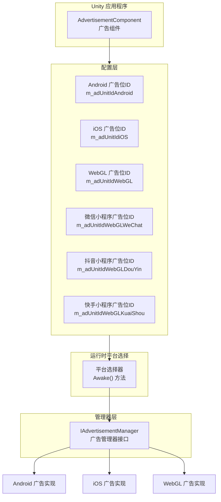

# 平台配置

本文档介绍 Game Frame X 广告组件的平台配置机制，说明如何在不同的发布平台上配置广告位ID。

## 概述

Game Frame X 广告组件采用平台无关的设计架构，通过 `AdvertisementComponent` 组件提供统一的广告接口。底层通过 Unity 的条件编译指令实现不同平台自动适配，开发者只需在 Inspector 面板中配置各平台的广告位ID，即可实现一次配置、多平台发布。

> 注意：本组件仅提供广告功能的抽象层和核心逻辑框架。要实现真正的广告展示，您需要在项目中集成具体的广告 SDK（如 AdMob、Unity Ads、穿山甲等），并实现 `IAdvertisementManager` 接口。

## 支持的平台

Game Frame X 广告组件支持以下平台配置：

| 平台 | 配置字段 | 条件编译指令 | 说明 |
|------|----------|--------------|------|
| Android | `m_adUnitIdAndroid` | `UNITY_ANDROID` | Android 原生平台 |
| iOS | `m_adUnitIdiOS` | `UNITY_IOS` | iOS 平台 |
| WebGL | `m_adUnitIdWebGL` | `UNITY_WEBGL` | 标准 WebGL 平台 |
| WebGL (微信小程序) | `m_adUnitIdWebGLWeChat` | `UNITY_WEBGL` + `ENABLE_WECHAT_MINI_GAME` | 微信小游戏环境 |
| WebGL (抖音小程序) | `m_adUnitIdWebGLDouYin` | `UNITY_WEBGL` + `ENABLE_DOUYIN_MINI_GAME` | 抖音小游戏环境 |
| WebGL (快手小程序) | `m_adUnitIdWebGLKuaiShou` | `UNITY_WEBGL` + `ENABLE_KUAISHOU_MINI_GAME` | 快手小游戏环境 |

## 架构设计



平台选择逻辑在 `AdvertisementComponent` 的 `Awake()` 方法中实现，根据当前编译平台自动选择对应的广告位ID：

```csharp
AdUnitId =
#if UNITY_WEBGL
#if ENABLE_WECHAT_MINI_GAME
    m_adUnitIdWebGLWeChat
#elif ENABLE_DOUYIN_MINI_GAME
    m_adUnitIdWebGLDouYin
#elif ENABLE_KUAISHOU_MINI_GAME
    m_adUnitIdWebGLKuaiShou
#else
    m_adUnitIdWebGL
#endif
#elif UNITY_ANDROID
    m_adUnitIdAndroid
#elif UNITY_IOS
    m_adUnitIdiOS
#else
    string.Empty
#endif
;
```

> Source: [AdvertisementComponent.cs](https://cnb.cool/GameFrameX/com.gameframex.unity.advertisement/blob/main/Runtime/Advertisement/AdvertisementComponent.cs#L69-L87)

## 配置流程

### 步骤1：添加组件

在 Unity 场景中创建一个空 GameObject（或选择现有对象），然后添加 `AdvertisementComponent` 组件：

1. 在 Unity 菜单中选择 **GameObject** → **GameFrameX** → **Advertisement**
2. 或者在 Inspector 面板中点击 **Add Component**，搜索并添加 `Advertisement`

### 步骤2：配置广告位ID

在 Inspector 面板中配置各平台的广告位ID：

```csharp
[SerializeField] private string m_adUnitIdAndroid = string.Empty;      // Android 广告位ID
[SerializeField] private string m_adUnitIdiOS = string.Empty;           // iOS 广告位ID
[SerializeField] private string m_adUnitIdWebGL = string.Empty;         // WebGL 广告位ID
[SerializeField] private string m_adUnitIdWebGLWeChat = string.Empty;   // 微信小程序广告位ID
[SerializeField] private string m_adUnitIdWebGLDouYin = string.Empty;   // 抖音小程序广告位ID
[SerializeField] private string m_adUnitIdWebGLKuaiShou = string.Empty;  // 快手小程序广告位ID
```

> Source: [AdvertisementComponent.cs](https://cnb.cool/GameFrameX/com.gameframex.unity.advertisement/blob/main/Runtime/Advertisement/AdvertisementComponent.cs#L15-L43)

### 步骤3：配置测试模式（可选）

如果需要在调试时查看广告日志，可以启用测试模式：

```csharp
[SerializeField] private bool m_debug = false;  // 是否是测试模式
```

> Source: [AdvertisementComponent.cs](https://cnb.cool/GameFrameX/com.gameframex.unity.advertisement/blob/main/Runtime/Advertisement/AdvertisementComponent.cs#L48)

### 步骤4：实现广告管理器

本组件提供了配置层，您还需要实现具体的广告管理器。典型的实现流程如下：

```csharp
using GameFrameX.Advertisement.Runtime;
using GameFrameX.Runtime;
using UnityEngine;

public class MyAdvertisementManager : BaseAdvertisementManager
{
    public override void Initialize(string adUnitId, bool debug = false)
    {
        // 实现具体的初始化逻辑
    }

    public override void Play(Action<bool> playResult, string customData = null)
    {
        // 实现广告播放逻辑
    }

    public override void Show(Action<string> success, Action<string> fail, Action<bool> onShowResult, string customData = null)
    {
        // 实现广告展示逻辑
    }

    public override void Load(Action<string> success, Action<string> fail, string customData = null)
    {
        // 实现广告加载逻辑
    }
}
```

## Unity Editor 配置界面

Game Frame X 提供了自定义的 Inspector 界面，方便开发者在编辑器中配置广告位ID：

```csharp
[CustomEditor(typeof(AdvertisementComponent))]
internal sealed class AdvertisementComponentInspector : ComponentTypeComponentInspector
{
    // 在此自定义 Inspector 中显示各平台的广告位ID配置字段
}
```

> Source: [AdvertisementComponentInspector.cs](https://cnb.cool/GameFrameX/com.gameframex.unity.advertisement/blob/main/Editor/Inspector/AdvertisementComponentInspector.cs#L16-L71)

Inspector 界面显示效果：

```
┌─────────────────────────────────────────────┐
│ Advertisement Component                      │
├─────────────────────────────────────────────┤
│ Debug Mode:  [ ]                              │
│                                          │
│ Android 广告位ID:  [________________]        │
│ IOS 广告位ID:      [________________]        │
│ WebGL 广告位ID:    [________________]         │
│ WebGL 微信 广告位ID: [________________]       │
│ WebGL 抖音 广告位ID: [________________]       │
│ WebGL 快手 广告位ID: [________________]       │
└─────────────────────────────────────────────┘
```

## 平台特定说明

### Android 平台

- 使用 `UnityEngine.RuntimePlatform.Android` 作为编译目标
- 需要在 Google AdMob 或其他 Android 广告平台申请广告位ID

### iOS 平台

- 使用 `UnityEngine.RuntimePlatform.IPhonePlayer` 作为编译目标
- 需要在 Apple App Store 政策允许的广告平台申请广告位ID

### WebGL 平台

WebGL 平台根据编译宏定义进一步细分：

| 编译宏 | 平台 | 说明 |
|--------|------|------|
| `ENABLE_WECHAT_MINI_GAME` | 微信小程序 | 微信小游戏环境 |
| `ENABLE_DOUYIN_MINI_GAME` | 抖音小程序 | 抖音小游戏环境 |
| `ENABLE_KUAISHOU_MINI_GAME` | 快手小程序 | 快手小游戏环境 |
| 无上述宏 | 标准 WebGL | 浏览器环境 |

> **重要提示**：在 Unity 构建设置中，需要根据目标平台正确设置预处理器宏。对于微信、抖音、快手小游戏，需要在 Player Settings → Other Settings → Scripting Define Symbols 中添加对应的宏定义。

## 配置验证

配置完成后，可以通过以下方式验证配置是否正确：

1. **运行时日志**：组件初始化时会输出选择的平台和广告位ID
2. **代码调试**：在 `Awake()` 方法中检查 `AdUnitId` 属性的值

```csharp
// 在 AdvertisementComponent 中
public string AdUnitId { get; private set; }

// 使用日志输出验证
Debug.Log($"当前平台广告位ID: {AdUnitId}");
```

## 常见问题

### Q1: 某平台的广告位ID应该填什么格式？

不同广告平台的广告位ID格式不同：
- **Google AdMob**: 格式如 `ca-app-pub-xxxxxx/xxxxxx`
- **Unity Ads**: 格式为数字ID
- **穿山甲**: 格式由广告平台提供

请参考具体广告平台的文档获取正确的广告位ID格式。

### Q2: 广告位ID配置正确但无法显示广告？

请检查以下几点：
1. 确认是否实现了 `IAdvertisementManager` 接口的具体类
2. 确认具体实现类已正确注册到 Game Frame X 框架
3. 检查广告平台后台是否已配置好应用和广告位
4. 开启 `m_debug` 模式查看详细日志

### Q3: WebGL 平台编译后广告不显示？

对于 WebGL 平台，确保：
1. 正确设置了 `m_adUnitIdWebGL` 字段
2. 如果是微信/抖音/快手小游戏，确保在 Player Settings 中添加了对应的编译宏
3. 浏览器控制台无 JavaScript 错误

## 相关链接

- [概述](./1-overview) - 了解广告组件的整体架构
- [安装指南](./2-installation) - 查看组件安装方法
- [快速开始](./3-getting-started) - 快速集成广告功能
- [核心概念](./4-core-concepts) - 深入了解核心概念
- [API 参考](./6-api-reference) - 完整的 API 接口文档
- [常见问题](./7-troubleshooting) - 常见问题解答
