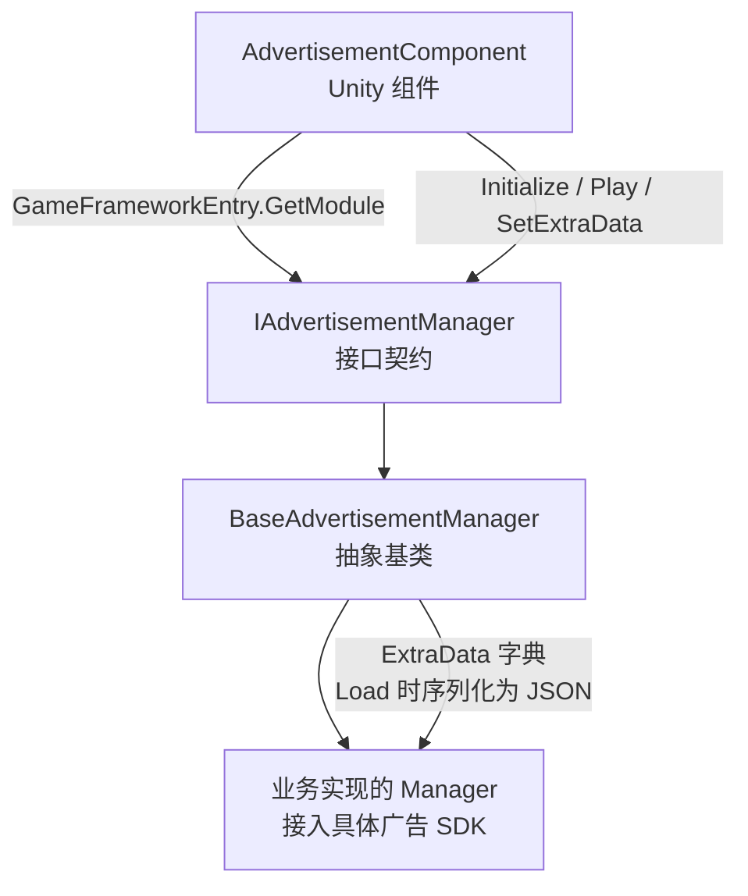

# 广告组件运行机制速览

GameFrameX 广告组件基于 Unity 组件 + 框架模块的双层结构,把广告 SDK 的初始化、播放、加载和回调都收敛到一个统一的 `IAdvertisementManager` 契约里,业务侧只面向 `AdvertisementComponent` 调用即可。

## 快速开始

1. 在场景里挂一个 `AdvertisementComponent`(菜单路径 `GameFrameX/Advertisement`),并在 Inspector 里为各平台填写广告位 ID(`m_adUnitIdAndroid` / `m_adUnitIdiOS` / `m_adUnitIdWebGL*`)。
2. 在 Inspector 的 `Config` 字段拖入一个继承自 `AdvertisementConfig` 的配置子类(例如 `DefaultAdvertisementConfig`)用于携带 `isDebug` 等扩展参数。
3. 启动场景后,框架会按当前平台自动选中广告位 ID,并在 `Start()` 里把 `m_config` 传给管理器;之后业务侧只需调用 `Play(AdvertisementPlayOption)`。

```csharp
// 触发播放(推荐用法)
var option = new AdvertisementPlayOption
{
    onPlayResult = success => Debug.Log($"播放结束:{success}"),
    customData = "revive_001",
};
FindObjectOfType<AdvertisementComponent>().Play(option);
```

Source: [AdvertisementComponent.cs](https://github.com/GameFrameX/com.gameframex.unity.advertisement/blob/main/Runtime/Advertisement/AdvertisementComponent.cs#L120-L219)

## 工作原理速览

广告组件由四类对象协作:组件层(`AdvertisementComponent`)→ 接口层(`IAdvertisementManager`)→ 抽象管理器(`BaseAdvertisementManager`)→ 平台具体实现(由业务项目继承 `BaseAdvertisementManager` 接入各家 SDK)。`Awake()` 通过反射解析实现类型并从 `GameFrameworkEntry` 取出管理器,然后按平台宏挑选广告位 ID。



要点:

- **平台广告位 ID 选择**:`Awake()` 通过 `#if UNITY_WEBGL` / `UNITY_ANDROID` / `UNITY_IOS` 等宏,在 WebGL 下还细分微信/抖音/快手小游戏子平台。([AdvertisementComponent.cs#L99-L117](https://github.com/GameFrameX/com.gameframex.unity.advertisement/blob/main/Runtime/Advertisement/AdvertisementComponent.cs#L99-L117))
- **配置对象**:`AdvertisementConfig` 是抽象基类,只含 `isDebug` 字段;业务侧按需派生并增加字段(如 `adUnitId`)。`BaseAdvertisementManager.Initialize(AdvertisementConfig)` 若收到 `DefaultAdvertisementConfig` 会把 `adUnitId` 取出来再走旧版 `Initialize(string, bool)` 路径。([AdvertisementConfig.cs#L41-L53](https://github.com/GameFrameX/com.gameframex.unity.advertisement/blob/main/Runtime/Advertisement/AdvertisementConfig.cs#L41-L53),[BaseAdvertisementManager.cs#L112-L163](https://github.com/GameFrameX/com.gameframex.unity.advertisement/blob/main/Runtime/Advertisement/BaseAdvertisementManager.cs#L112-L163))
- **新旧 API 兼容**:旧版 `Initialize(string, bool)` / `Show(...)` / `Play(Action<bool>, string)` / `Load(...)` 仍保留但被标记 `[Obsolete]`,实现里通过 `_delegating` 标志防止新旧互相递归调用;新推荐统一使用 `Play(AdvertisementPlayOption)`。([BaseAdvertisementManager.cs#L119-L134](https://github.com/GameFrameX/com.gameframex.unity.advertisement/blob/main/Runtime/Advertisement/BaseAdvertisementManager.cs#L119-L134))
- **扩展数据透传**:`SetExtraData(string, string)` 把键值写入基类 `ExtraData` 字典(`null` 值会移除键),业务实现可在 `Load` 阶段把字典序列化为 JSON 透传给广告服务端,用于服务端激励发放校验。([BaseAdvertisementManager.cs#L174-L189](https://github.com/GameFrameX/com.gameframex.unity.advertisement/blob/main/Runtime/Advertisement/BaseAdvertisementManager.cs#L174-L189))
- **回调槽**:基类已声明 `OnShowResult` / `OnLoadSuccess` / `OnLoadFail` 三个回调字段,业务实现按需触发。([BaseAdvertisementManager.cs#L77-L93](https://github.com/GameFrameX/com.gameframex.unity.advertisement/blob/main/Runtime/Advertisement/BaseAdvertisementManager.cs#L77-L93))

## 接下来

- 在场景里挂组件并填写广告位 ID:见《如何接入广告组件》
- 接入具体 SDK(Unity Ads / 穿山甲 / GroMore 等):见《如何实现自定义广告管理器》
- 调用 `Play(AdvertisementPlayOption)` 的参数说明:见《广告播放选项参考》