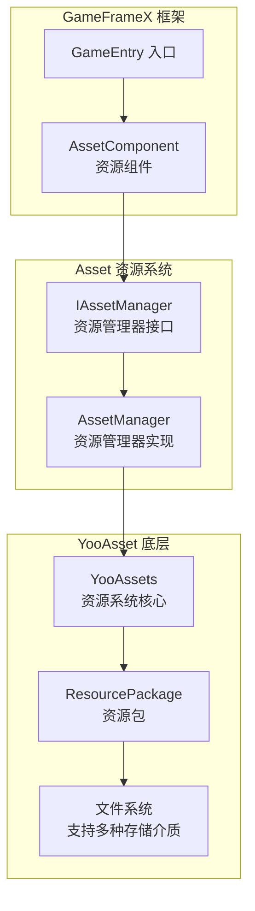
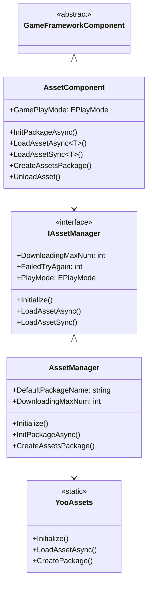
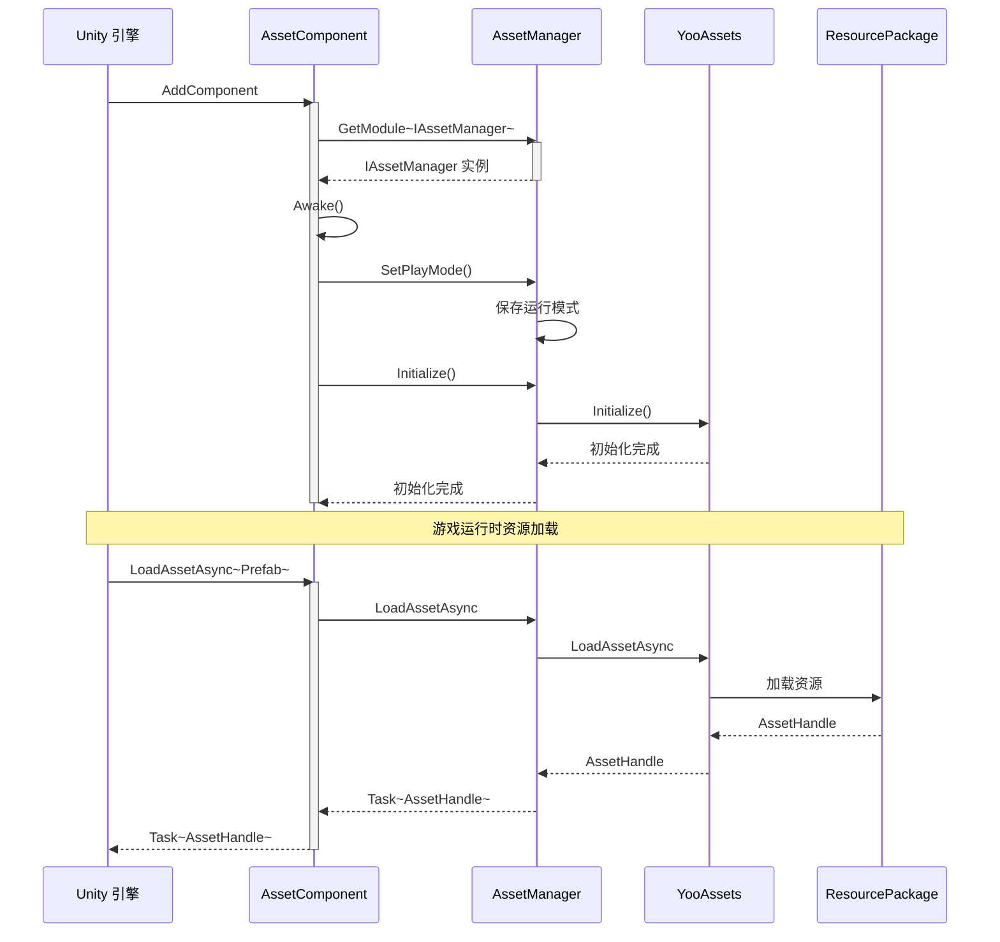
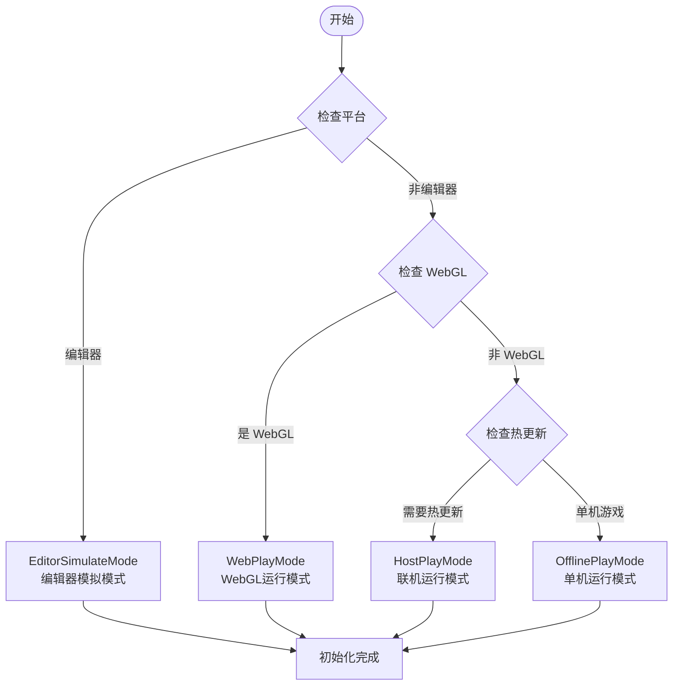

# Asset 资源组件介绍

GameFrameX 的 Asset 资源组件是 Unity 游戏资源的统一管理解决方案，基于 YooAsset 底层实现，为开发者提供了简洁、高效的资源加载与管理接口。该组件支持多种运行模式，能够满足从开发调试到热更新生产环境的全流程需求。

## 概述

Asset 资源组件是 GameFrameX 框架的核心模块之一，专门用于解决 Unity 项目中的资源管理问题。在游戏开发过程中，资源的加载、缓存、卸载以及热更新是非常关键的环节，直接影响游戏的性能和用户体验。Asset 组件通过封装 YooAsset 的强大功能，提供了一套统一、简洁且易于使用的 API，开发者无需深入了解底层实现细节，即可快速实现资源的加载和管理。

该组件的核心设计理念是将复杂的资源管理逻辑封装为简单的接口调用，同时保留足够的灵活性以满足不同项目需求。无论是简单的单机游戏还是需要热更新的大型商业项目，Asset 组件都能够提供合适的解决方案。通过支持多种运行模式，开发者可以在开发阶段使用编辑器模拟模式快速迭代，在测试阶段使用单机模式进行功能验证，在生产环境中使用热更新模式实现资源的动态更新。



## 核心功能

Asset 资源组件提供了全面的资源管理能力，涵盖了游戏开发中常见的所有资源操作场景。

### 资源加载

组件支持同步和异步两种资源加载方式，开发者可以根据实际需求选择合适的加载方法。异步加载适用于大多数场景，能够保持游戏的流畅运行；同步加载则在某些特定场景下（如资源预加载完成后的切换）更为高效。

- **异步加载**：通过 Task 异步模式加载资源，支持协程和回调两种使用方式
- **同步加载**：直接返回资源句柄，适用于已知资源已加载完成的场景
- **泛型支持**：提供强类型的泛型方法，避免类型转换错误
- **多种资源类型**：支持普通资源、子资源、原生文件和场景的加载

### 资源包管理

资源包是资源管理的基本单位，组件支持创建、获取、设置默认包等操作。通过资源包机制，可以实现资源的模块化管理，不同功能模块使用不同的资源包，便于资源的组织和更新。

```csharp
// 创建资源包
var package = assetComponent.CreateAssetsPackage("GameplayPackage");

// 尝试获取资源包
var existingPackage = assetComponent.TryGetAssetsPackage("GameplayPackage");

// 设置默认资源包
assetComponent.SetDefaultAssetsPackage(existingPackage);

// 检查资源包是否存在
if (assetComponent.HasAssetsPackage("GameplayPackage"))
{
    // 资源包存在
}
```

> Source: [AssetComponent.cs](https://github.com/GameFrameX/com.gameframex.unity.asset/blob/main/Runtime/Asset/AssetComponent.cs#L463-L510)

### 资源信息查询

组件提供了丰富的资源信息查询功能，包括获取资源信息、检查资源是否存在、判断资源是否需要下载等。这些功能对于实现资源的按需下载和进度展示非常重要。

### 资源卸载与清理

合理的资源管理不仅包括加载，还包括及时的卸载和清理。组件提供了多种资源释放策略，包括指定资源卸载、无用资源卸载和强制清理等，帮助开发者有效控制内存使用。

## 架构设计

Asset 资源组件采用了分层架构设计，每一层都有明确的职责边界，这种设计使得系统具有良好的可扩展性和可维护性。

### 分层架构



### 组件交互流程



## 运行模式

Asset 组件支持四种运行模式，每种模式适用于不同的开发和部署场景。运行模式决定了资源的加载方式和来源，开发者需要根据项目的具体需求选择合适的模式。

### 1. 编辑器模拟模式 (EditorSimulateMode)

编辑器模拟模式主要用于开发阶段的快速迭代。在这种模式下，资源直接从 Unity 编辑器的资源文件夹中加载，无需进行资源打包。这种模式的优势是开发过程中修改资源后可以立即生效，无需重新打包，大大提高了开发效率。但是需要注意的是，这种模式只能用于编辑器环境，打包发布时必须切换到其他模式。

### 2. 单机运行模式 (OfflinePlayMode)

单机运行模式适用于不需要热更新的单机游戏或游戏的内置资源。在这种模式下，所有资源都从内置文件系统中加载，资源打包时会被打包到安装包中。这种模式的优势是简单可靠，游戏发布后不需要考虑资源服务器的维护问题，适合于不经常更新内容的游戏。

### 3. 联机运行模式 (HostPlayMode)

联机运行模式是大型游戏最常用的模式，特别适用于需要热更新的项目。在这种模式下，资源分为内置资源和远程资源两部分。内置资源随应用一起打包，远程资源则从资源服务器按需下载。这种模式支持资源的动态更新，游戏发布后仍然可以更新游戏内容、修复 bug 或添加新功能。组件支持主服务器和备用服务器的配置，确保资源下载的可靠性。

### 4. WebGL 运行模式 (WebPlayMode)

WebGL 运行模式专门针对 WebGL 平台进行了优化，适用于网页游戏和小程序游戏。这种模式考虑了 WebGL 平台的特殊限制，对资源加载进行了专门的适配。同时支持字节小游戏、微信小游戏和快手小游戏等多种平台，开发者可以根据目标平台进行相应的配置。



## 平台支持

Asset 资源组件基于 YooAsset 构建，天然支持 Unity 支持的所有平台，包括但不限于 Windows、macOS、iOS、Android、WebGL，以及各种小游戏平台。组件在 WebGL 平台上会自动切换到 WebPlayMode，确保资源加载的正确性。

## 快速开始

要在项目中使用 Asset 资源组件，首先需要在场景中添加 AssetComponent：

```csharp
// 在 Unity 场景中创建空物体，添加 AssetComponent
var assetComponent = gameObject.AddComponent<AssetComponent>();
assetComponent.GamePlayMode = EPlayMode.HostPlayMode;
```

然后通过 GameFrameX 的入口获取组件实例进行资源加载：

```csharp
// 获取资源组件
var assetComponent = GameEntry.GetComponent<AssetComponent>();

// 异步加载资源
var handle = await assetComponent.LoadAssetAsync<GameObject>("Assets/Prefabs/Player.prefab");
var prefab = handle.AssetObject as GameObject;

// 使用完成后释放资源
handle.Release();
```

> Source: [AssetComponent.cs](https://github.com/GameFrameX/com.gameframex.unity.asset/blob/main/Runtime/Asset/AssetComponent.cs#L225-L316)

## 相关链接

- [功能特性](./1-overview.features) - 了解更多功能特性
- [安装方式](./2-installation.index) - 安装配置指南
- [快速入门指南](./3-getting-started.index) - 快速开始使用
- [架构设计](./4-core-concepts.architecture) - 深入了解架构设计
- [资源管理器](./4-core-concepts.asset-manager) - 资源管理器详解
- [资源加载接口](./5-api-reference.loading-api) - API 参考
- [运行模式](./6-configuration.play-modes) - 运行模式配置
