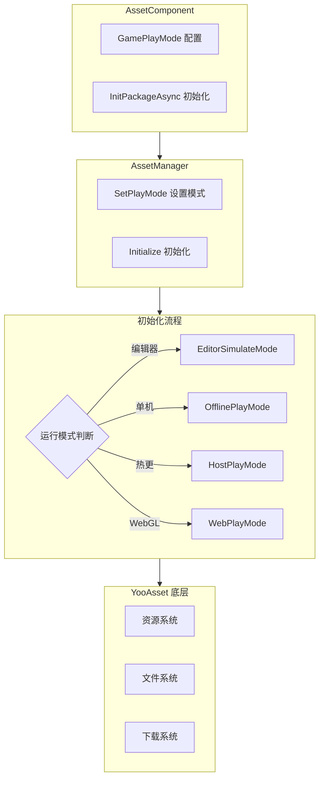

# 功能特性

Asset 资源组件是 GameFrameX 框架的核心模块之一，基于 YooAsset 封装构建，提供统一的资源加载、管理和更新能力。该组件将复杂的资源管理操作简化为直观的 API 接口，使开发者能够高效地进行资源加载、场景切换和资源包管理。

## 概述

Asset 资源组件旨在解决 Unity 项目中的资源管理痛点，包括资源加载方式不一致、资源更新困难、多平台适配复杂等问题。通过提供统一的接口抽象和多种运行模式支持，开发者可以在不同的开发和部署场景下灵活使用同一套代码。组件支持从简单的单机游戏到复杂的热更新游戏的各种需求，无论是编辑器下的快速迭代还是生产环境的热更新部署，都能提供完善的解决方案。

该组件的核心价值在于将底层资源管理框架（YooAsset）的复杂功能进行封装，同时保留其强大的能力。开发者无需了解底层实现细节，只需通过简单的 API 调用即可完成资源加载、场景切换等操作。此外，组件还提供了完整的事件系统，使开发者能够实时监控资源下载进度、状态变化等关键信息，从而实现更好的用户体验。

## 核心功能特性

### 多模式运行支持

Asset 组件支持四种不同的运行模式，每种模式针对特定的使用场景进行优化。这种设计使得同一套代码可以在不同的开发和部署环境中无缝切换，无需修改业务逻辑代码。

**编辑器模拟模式（EditorSimulateMode）** 适用于开发阶段的快速迭代。在此模式下，资源直接从 Unity 编辑器的工程目录中加载，无需进行任何打包操作。这极大地加快了开发速度，因为开发者可以在修改资源后立即看到效果，无需等待资源打包完成。该模式仅在 Unity 编辑器环境下有效，打包发布时会自动切换到其他模式。

**离线运行模式（OfflinePlayMode）** 适用于单机游戏或不需要热更新的场景。在此模式下，所有资源都从内置资源包（Buildin）中加载，不涉及任何网络请求。资源随应用一起分发，无需额外的下载步骤。这种模式最适合独立游戏开发或需要严格控制资源分发方式的场景。

**联机运行模式（HostPlayMode）** 适用于需要热更新功能的游戏。在此模式下，资源分为两部分：内置资源包用于存储初始资源，远程服务器用于存储热更新资源。组件会自动检测并下载需要更新的资源，支持断点续传和版本管理。这种模式是现代手游的标配，允许开发者在游戏发布后继续更新内容。

**WebGL 运行模式（WebPlayMode）** 专门针对 WebGL 平台优化。该模式针对浏览器环境的特殊性进行了适配，支持各种 Web 小游戏平台（如微信小游戏、抖音小游戏、快手小游戏等）。组件会自动检测目标平台并选择合适的文件系统参数，确保资源能够正确加载。



### 统一的资源加载接口

Asset 组件提供了丰富的资源加载接口，涵盖各种使用场景。所有加载接口都支持泛型版本，能够自动推断资源类型，减少类型转换的麻烦。

**异步加载** 是推荐的主要加载方式，特别适合需要加载多个资源或资源较大的场景。异步加载不会阻塞主线程，能够保持界面的流畅响应。组件将 YooAsset 的回调式 API 转换为 Task 式的异步接口，使代码更加简洁易读，支持 async/await 语法糖。

```csharp
// 异步加载资源
var handle = await assetComponent.LoadAssetAsync<Texture2D>("Textures/Background");
var texture = handle.AssetObject as Texture2D;

// 异步加载所有资源
var allHandle = await assetComponent.LoadAllAssetsAsync<GameObject>("Prefabs/Enemies");
foreach (var obj in allHandle.AllAssetObjects)
{
    // 处理每个资源
}

// 异步加载场景
await assetComponent.LoadSceneAsync("Scenes/GameLevel", LoadSceneMode.Single);
```

> Source: [AssetComponent.cs](https://github.com/GameFrameX/com.gameframex.unity.asset/blob/main/Runtime/Asset/AssetComponent.cs#L258-L261)

**同步加载** 适用于对加载时间有严格要求的场景，如需要立即显示的资源。同步加载会阻塞调用线程，可能导致界面卡顿，因此建议仅在必要时使用，并且避免在主线程中加载大型资源。

```csharp
// 同步加载资源
var handle = assetComponent.LoadAssetSync<AudioClip>("Audio/BGM");
var audio = handle.AssetObject as AudioClip;
```

> Source: [AssetComponent.cs](https://github.com/GameFrameX/com.gameframex.unity.asset/blob/main/Runtime/Asset/AssetComponent.cs#L426-L429)

**子资源加载** 用于处理带有子资源的资源，如 SpriteAtlas（包含多个 Sprite）。这使得开发者可以一次性加载整个图集，然后按需获取其中的单个精灵。

```csharp
// 加载子资源
var handle = await assetComponent.LoadSubAssetsAsync<Sprite>("UI/Atlas/MainUI");
foreach (var sprite in handle.SubAssetObjects)
{
    // 处理每个子资源
}
```

> Source: [AssetComponent.cs](https://github.com/GameFrameX/com.gameframex.unity.asset/blob/main/Runtime/Asset/AssetComponent.cs#L128-L131)

**原生文件加载** 用于加载非 Unity 资源格式的文件，如配置文件、文本文件、二进制数据等。加载后的数据以字节数组形式返回，开发者可以自行解析。

```csharp
// 加载原生文件
var handle = await assetComponent.LoadRawFileAsync("Config/GameConfig.json");
var data = handle.RawFileData;
var json = System.Text.Encoding.UTF8.GetString(data);
```

> Source: [AssetComponent.cs](https://github.com/GameFrameX/com.gameframex.unity.asset/blob/main/Runtime/Asset/AssetComponent.cs#L192-L195)

### 资源包管理

资源包（ResourcePackage）是组织和管理资源的基本单元。Asset 组件支持创建多个独立的资源包，使开发者能够按功能模块或加载策略划分资源。

**创建资源包** 允许开发者创建新的资源包来管理特定类别的资源。每个资源包有独立的初始化参数和资源集合，适用于需要按需加载不同资源集的场景。

```csharp
// 创建资源包
var package = assetComponent.CreateAssetsPackage("DLC_Package");
```

> Source: [AssetComponent.cs](https://github.com/GameFrameX/com.gameframex.unity.asset/blob/main/Runtime/Asset/AssetComponent.cs#L471-L474)

**获取和检查资源包** 提供了多种方式来查询已存在的资源包。可以根据名称获取资源包实例，也可以检查某个名称的资源包是否存在。

```csharp
// 检查资源包是否存在
if (assetComponent.HasAssetsPackage("DLC_Package"))
{
    var package = assetComponent.GetAssetsPackage("DLC_Package");
}
```

> Source: [AssetComponent.cs](https://github.com/GameFrameX/com.gameframex.unity.asset/blob/main/Runtime/Asset/AssetComponent.cs#L493-L506)

**设置默认资源包** 可以指定默认的资源包，后续的资源加载操作将默认使用该资源包。这简化了资源加载的代码，无需每次都指定资源包名称。

```csharp
// 设置默认资源包
assetComponent.SetDefaultAssetsPackage(package);
```

> Source: [AssetComponent.cs](https://github.com/GameFrameX/com.gameframex.unity.asset/blob/main/Runtime/Asset/AssetComponent.cs#L581-L584)

### 资源查询与验证

组件提供了完善的资源查询功能，帮助开发者在加载资源前了解资源的相关信息。

**获取资源信息** 可以根据资源的标签或路径获取资源的元数据。这些信息包括资源的依赖关系、所在资源包、加载方式等，对于实现更复杂的资源管理策略非常有用。

```csharp
// 根据标签获取资源信息
var infos = assetComponent.GetAssetInfos("UI");
// 根据路径获取单个资源信息
var info = assetComponent.GetAssetInfo("Prefabs/Player");
```

> Source: [AssetComponent.cs](https://github.com/GameFrameX/com.gameframex.unity.asset/blob/main/Runtime/Asset/AssetComponent.cs#L550-L562)

**检查资源路径** 验证指定的资源路径是否有效，避免加载不存在的资源导致错误。

```csharp
// 检查资源路径是否存在
if (assetComponent.HasAssetPath("Prefabs/Enemy"))
{
    // 资源存在，可以安全加载
}
```

> Source: [AssetComponent.cs](https://github.com/GameFrameX/com.gameframex.unity.asset/blob/main/Runtime/Asset/AssetComponent.cs#L570-L573)

**检查是否需要下载** 在联机运行模式下，可以检查某个资源是否需要从远程服务器下载。这对于实现预下载功能或显示下载进度非常有帮助。

```csharp
// 检查是否需要下载
if (assetComponent.IsNeedDownload("Textures/HighRes/Detail"))
{
    // 该资源需要从远程下载
}
```

> Source: [AssetComponent.cs](https://github.com/GameFrameX/com.gameframex.unity.asset/blob/main/Runtime/Asset/AssetComponent.cs#L528-L531)

### 资源卸载与清理

合理的资源管理不仅包括加载，还包括及时的卸载和清理，以释放内存并优化性能。

**卸载指定资源** 释放特定资源的内存占用。当某个资源不再需要时，应当及时卸载以释放内存。

```csharp
// 卸载指定资源
assetComponent.UnloadAsset("Prefabs/Enemy");
// 指定资源包卸载
assetComponent.UnloadAsset("DLC_Package", "Prefabs/Boss");
```

> Source: [AssetComponent.cs](https://github.com/GameFrameX/com.gameframex.unity.asset/blob/main/Runtime/Asset/AssetComponent.cs#L612-L615)

**卸载未使用资源** 扫描并卸载所有未被引用的资源。这通常在切换场景或进入新的游戏阶段时调用，以清理不再需要的资源。

```csharp
// 卸载未使用资源
assetComponent.UnloadUnusedAssetsAsync();
```

> Source: [AssetComponent.cs](https://github.com/GameFrameX/com.gameframex.unity.asset/blob/main/Runtime/Asset/AssetComponent.cs#L635-L638)

**清理资源文件** 不仅释放内存，还删除缓存的下载文件。这在需要释放磁盘空间或重置资源缓存时使用。

```csharp
// 清理无用资源文件
assetComponent.ClearUnusedBundleFilesAsync();
// 清理所有资源文件
assetComponent.ClearAllBundleFilesAsync();
```

> Source: [AssetComponent.cs](https://github.com/GameFrameX/com.gameframex.unity.asset/blob/main/Runtime/Asset/AssetComponent.cs#L645-L658)

### 更新事件系统

Asset 组件实现了完整的事件系统，使开发者能够实时监控资源管理的各个阶段。这对于实现加载界面、更新提示等功能至关重要。

**下载进度更新事件** 在资源下载过程中持续触发，提供当前的下载进度信息。事件参数包含总文件数、已下载文件数、总大小和已下载大小，开发者可以据此计算百分比并显示进度条。

```csharp
// 订阅下载进度更新事件
EventComponent.Subscribe<AssetDownloadProgressUpdateEventArgs>(OnDownloadProgress);

private void OnDownloadProgress(object sender, AssetDownloadProgressUpdateEventArgs e)
{
    var progress = (float)e.CurrentDownloadSizeBytes / e.TotalDownloadSizeBytes;
    Debug.Log($"下载进度: {progress * 100}%");
}
```

> Source: [AssetDownloadProgressUpdateEventArgs.cs](https://github.com/GameFrameX/com.gameframex.unity.asset/blob/main/Runtime/Update/EventArgs/AssetDownloadProgressUpdateEventArgs.cs#L66-L68)

**发现更新文件事件** 在检测到需要更新的资源文件时触发。此时可以向用户显示更新内容摘要，并询问是否开始下载。

**资源包状态变更事件** 在资源初始化流程的各个阶段触发，包括准备阶段、版本检测阶段、清单更新阶段、资源探测阶段和完成阶段。

```csharp
// 订阅状态变更事件
EventComponent.Subscribe<AssetPatchStatesChangeEventArgs>(OnPatchStatesChange);

private void OnPatchStatesChange(object sender, AssetPatchStatesChangeEventArgs e)
{
    Debug.Log($"当前状态: {e.CurrentStates}");
}
```

> Source: [AssetPatchStatesChangeEventArgs.cs](https://github.com/GameFrameX/com.gameframex.unity.asset/blob/main/Runtime/Update/EventArgs/AssetPatchStatesChangeEventArgs.cs#L41-L42)

**错误处理事件** 包括补丁清单更新失败、静态版本更新失败、网络文件下载失败等事件，使开发者能够针对不同类型的错误进行相应的处理。

```csharp
// 订阅下载失败事件
EventComponent.Subscribe<AssetWebFileDownloadFailedEventArgs>(OnDownloadFailed);

private void OnDownloadFailed(object sender, AssetWebFileDownloadFailedEventArgs e)
{
    Debug.LogError($"文件下载失败: {e.FileName}, 错误: {e.Error}");
}
```

> Source: [AssetWebFileDownloadFailedEventArgs.cs](https://github.com/GameFrameX/com.gameframex.unity.asset/blob/main/Runtime/Update/EventArgs/AssetWebFileDownloadFailedEventArgs.cs#L51-L53)

## 平台支持

Asset 组件针对不同的目标平台提供了专门的优化支持，确保在各种环境下都能正常工作。

**Unity 编辑器** 提供完整的开发支持，包括模拟运行模式、资源预览和调试功能。开发者可以在编辑器中快速测试和迭代资源管理逻辑。

**PC 平台**（Windows、Mac、Linux）支持所有运行模式，包括联机模式的热更新功能。由于磁盘和网络条件通常较好，资源加载体验流畅。

**移动平台**（iOS、Android）是组件的主要目标平台，支持完整的热更新能力。组件针对移动网络的不稳定性进行了优化，支持断点续传和失败重试。

**WebGL 平台** 具有专门的运行模式，针对浏览器环境进行了优化。组件支持主流的 Web 小游戏平台，包括微信小游戏、抖音小游戏和快手小游戏。

```mermaid
flowchart LR
    subgraph Platforms["支持的平台"]
        P1[Unity 编辑器]
        P2[PC (Win/Mac/Linux)]
        P3[移动端 (iOS/Android)]
        P4[WebGL]
        P5[小游戏平台]
    end
    
    subgraph Modes["支持的运行模式"]
        M1[EditorSimulateMode]
        M2[OfflinePlayMode]
        M3[HostPlayMode]
        M4[WebPlayMode]
    end
    
    P1 -->|EditorSimulateMode| M1
    P2 -->|OfflinePlayMode| M2
    P2 -->|HostPlayMode| M3
    P3 -->|OfflinePlayMode| M2
    P3 -->|HostPlayMode| M3
    P4 -->|WebPlayMode| M4
    P5 -->|WebPlayMode| M4
```

## 配置选项

Asset 组件提供多种配置选项，允许开发者根据项目需求调整行为。

| 配置项 | 类型 | 默认值 | 说明 |
|--------|------|--------|------|
| GamePlayMode | EPlayMode | EditorSimulateMode | 资源运行模式 |
| DownloadingMaxNum | int | 10 | 同时下载的最大文件数 |
| FailedTryAgain | int | 3 | 下载失败后的重试次数 |
| VerifyLevel | EFileVerifyLevel | Normal | 下载文件校验等级 |
| Milliseconds | long | 30 | 异步系统每帧执行的最大时间切片（毫秒） |
| ReadOnlyPath | string | - | 资源只读区路径 |
| ReadWritePath | string | - | 资源读写区路径 |

> Source: [IAssetManager.cs](https://github.com/GameFrameX/com.gameframex.unity.asset/blob/main/Runtime/Asset/IAssetManager.cs#L18-L75)

## 相关链接

- [Asset 资源组件介绍](./1-overview.introduction)
- [架构设计](./4-core-concepts.architecture)
- [资源组件](./4-core-concepts.asset-component)
- [资源管理器](./4-core-concepts.asset-manager)
- [运行模式](./6-configuration.play-modes)
- [资源加载接口](./5-api-reference.loading-api)
- [资源包管理](./5-api-reference.package-management)
- [更新事件](./5-api-reference.update-events)
