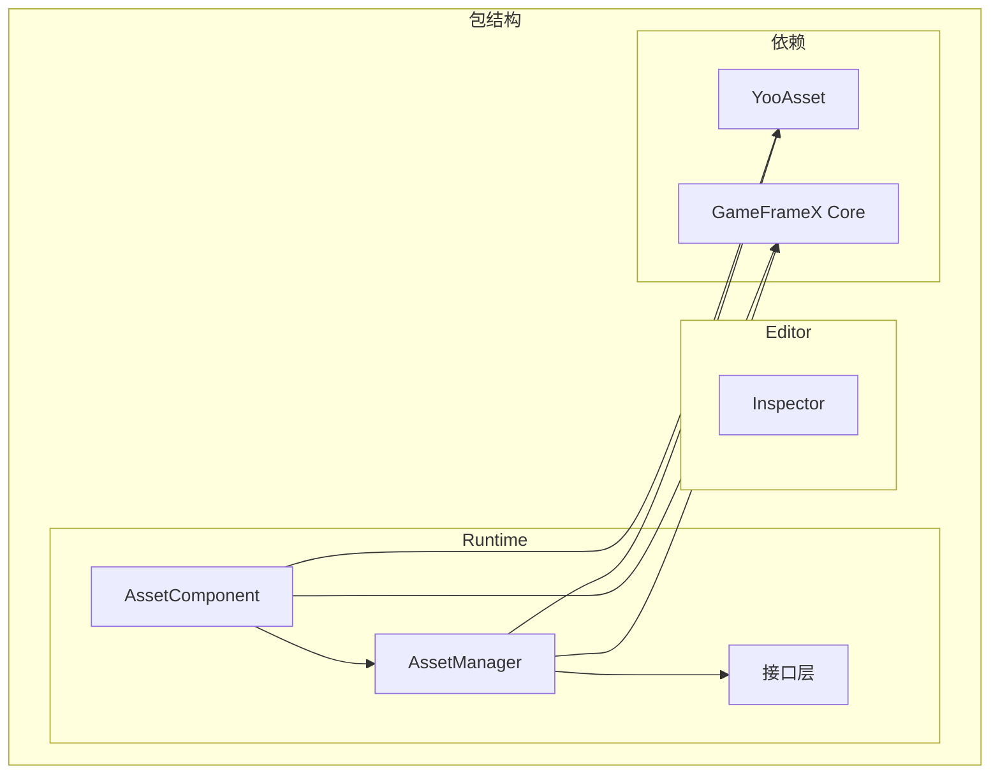

# 安装方式

GameFrameX Asset 资源组件支持多种安装方式，以适应不同的项目工作流和开发需求。本文将详细介绍每种安装方法及其适用场景。

## 概述

GameFrameX Asset 资源组件是基于 YooAsset 构建的 Unity 资源管理功能包，提供统一的资源加载、卸载和热更新接口。该组件采用 Unity Package Manager (UPM) 方式进行分发，支持多种安装途径，开发者可根据项目实际情况选择最合适的安装方法。

## 环境要求

| 要求项 | 最低版本 | 说明 |
|--------|----------|------|
| Unity 版本 | 2019.4 | LTS 版本推荐 |
| 包管理器 | UPM | Unity 内置 |
| 网络环境 | 需要访问 GitHub | 用于 Git URL 安装 |

## 安装方式

### 方式一：通过 manifest.json 安装

直接编辑项目的 `Packages/manifest.json` 文件，在 `dependencies` 节点下添加包引用。这是最常用的安装方式，适合需要版本控制的团队项目。

**操作步骤：**

1. 打开 Unity 项目目录下的 `Packages/manifest.json` 文件
2. 在 `dependencies` 节点中添加包引用
3. 保存文件后等待 Unity 自动下载并导入

```json
{
  "dependencies": {
    "com.gameframex.unity.asset": "https://github.com/AlianBlank/com.gameframex.unity.asset.git"
  }
}
```

> Source: [README.md](https://github.com/GameFrameX/com.gameframex.unity.asset/blob/main/README.md#L13-L16)

**适用场景：**
- 团队协作项目，需要版本锁定
- CI/CD 自动化构建环境
- 需要自定义包版本的开发流程

**注意事项：**
- 该方式会始终获取最新版本
- 如需锁定版本，可使用 `#分支名` 或 `#tag` 语法
- Git 仓库地址需保持可访问

### 方式二：通过 Unity Package Manager 安装

使用 Unity 编辑器内置的包管理器界面，通过 Git URL 添加包。这种方式无需手动编辑配置文件，适合快速尝试和临时测试。

**操作步骤：**

1. 在 Unity 编辑器中打开 `Window` → `Package Manager`
2. 点击左上角的 `+` 按钮
3. 选择 `Add package from git URL...`
4. 输入 Git 仓库地址：`https://github.com/AlianBlank/com.gameframex.unity.asset.git`
5. 点击 `Add` 等待包下载完成

```
https://github.com/AlianBlank/com.gameframex.unity.asset.git
```

> Source: [README.md](https://github.com/GameFrameX/com.gameframex.unity.asset/blob/main/README.md#L17)

**适用场景：**
- 快速原型开发和功能测试
- 独立开发者快速上手
- 临时需要引入的功能验证

**注意事项：**
- 需要保持网络连接
- 首次安装可能需要较长时间下载依赖
- 建议测试完成后切换到方式一进行版本控制

### 方式三：手动放置到 Packages 目录

将仓库克隆或下载后，直接放置到 Unity 项目的 `Packages` 目录下。这种方式完全离线，适合网络受限的环境。

**操作步骤：**

1. 克隆或下载仓库：`https://github.com/AlianBlank/com.gameframex.unity.asset.git`
2. 将仓库文件夹重命名为 `com.gameframex.unity.asset`
3. 将文件夹复制到 Unity 项目的 `Packages` 目录下
4. Unity 会自动识别并加载包

```
YourUnityProject/
└── Packages/
    └── com.gameframex.unity.asset/
        ├── package.json
        ├── Runtime/
        └── Editor/
```

> Source: [README.md](https://github.com/GameFrameX/com.gameframex.unity.asset/blob/main/README.md#L18)

**适用场景：**
- 网络受限或无法访问外部仓库
- 需要对包进行本地修改和调试
- 离线开发和构建环境

**注意事项：**
- 包不会自动更新，需要手动同步
- 修改后的包可能影响后续升级
- 建议保留原始包副本以便升级

## 依赖要求

GameFrameX Asset 组件依赖以下包，在安装过程中会自动一并安装：

| 依赖包 | 版本 | 说明 |
|--------|------|------|
| com.gameframex.unity | 1.1.1 | GameFrameX 核心框架 |
| YooAsset | - | 资源管理底层实现 |
| BetterStreamingAssets | - | 流资源访问支持 |

### YooAsset 集成

该组件基于 [YooAsset](https://github.com/yoomotion/YooAsset) 构建，提供以下核心功能：

- 资源打包与分配
- 资源加载与缓存管理
- 场景异步加载
- 资源热更新支持
- 多平台适配

> 详细 API 使用方式请参考 [资源加载接口](./5-api-reference.loading-api) 文档。

## 包结构说明

安装完成后，包目录结构如下：

```
com.gameframex.unity.asset/
├── package.json              # 包配置文件
├── Runtime/                  # 运行时代码
│   ├── GameFrameX.Asset.Runtime.asmdef
│   ├── Asset/
│   │   ├── AssetComponent.cs
│   │   ├── AssetManager.cs
│   │   ├── IAssetManager.cs
│   │   └── Constant.cs
│   └── Update/
│       ├── EPatchStates.cs
│       └── EventArgs/
├── Editor/                   # 编辑器代码
│   ├── GameFrameX.Asset.Editor.asmdef
│   └── Inspector/
│       └── AssetComponentInspector.cs
└── Tests/                   # 单元测试
    └── GameFrameX.Asset.Tests.asmdef
```



## 安装验证

安装完成后，可通过以下方式验证：

1. **检查 Package Manager**：在 Package Manager 窗口确认 `GameFrameX Asset` 包已显示
2. **检查程序集**：在 Project 窗口确认 `GameFrameX.Asset.Runtime` 和 `GameFrameX.Asset.Editor` 程序集已生成
3. **运行示例代码**：尝试加载资源验证功能正常

```csharp
// 验证安装成功的简单测试
using GameFrameX.Asset.Runtime;

public class InstallationTest : MonoBehaviour
{
    private void Start()
    {
        // 获取资源管理器实例
        var manager = AssetManager.Instance;
        Debug.Log($"Asset Manager initialized: {manager != null}");
    }
}
```

## 版本选择

| 版本格式 | 示例 | 说明 |
|----------|------|------|
| latest | - | 获取主分支最新代码 |
| 分支 | #main | 获取指定分支 |
| 标签 | #2.4.0 | 获取指定版本发布 |

建议在正式项目中锁定具体版本号，避免因自动更新导致兼容性问题。

## 常见问题

### 安装后编译报错

**原因**：缺少依赖包或 Unity 版本过低

**解决方案**：
1. 确认 Unity 版本 >= 2019.4
2. 检查 `manifest.json` 中依赖是否正确添加
3. 尝试删除 `Library` 文件夹后重新打开项目

### 无法连接到 Git 仓库

**原因**：网络问题或仓库地址变更

**解决方案**：
1. 检查网络连接
2. 确认 Git 仓库地址正确
3. 尝试使用方式三手动安装

### 版本升级问题

**解决方案**：
1. 备份当前项目
2. 删除旧版本包
3. 按本文档重新安装新版本
4. 检查 [CHANGELOG](./CHANGELOG.md) 了解版本变更

## 相关链接

- [GitHub 仓库](https://github.com/GameFrameX/com.gameframex.unity.asset.git)
- [依赖要求](./2-installation.dependencies)
- [快速入门指南](./3-getting-started.index)
- [官方文档](https://gameframex.doc.alianblank.com)
