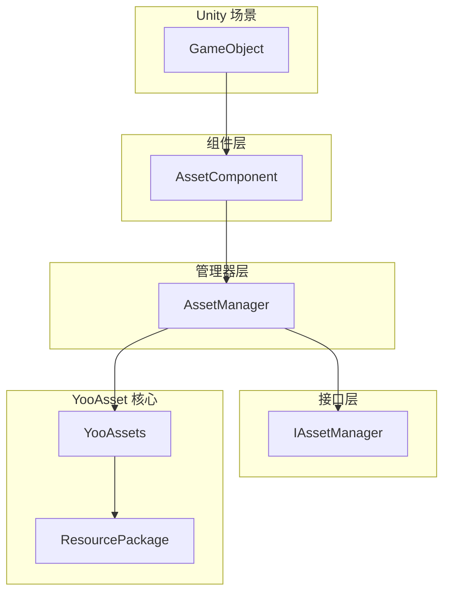
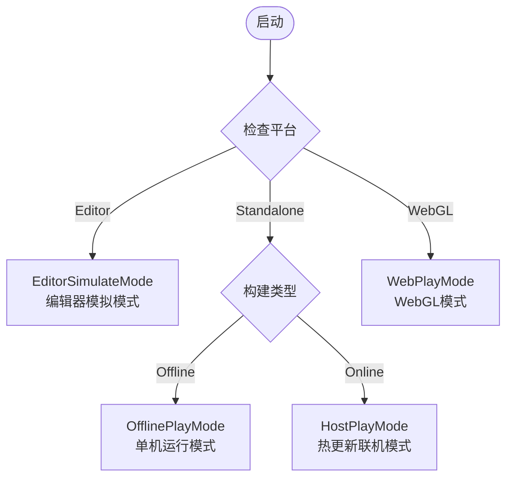

# 快速入门指南

本文档将帮助您快速上手 GameFrameX Asset 资源组件，了解如何在自己的 Unity 项目中集成和使用该组件进行资源管理。

## 概述

GameFrameX Asset 是基于 [YooAsset](https://yooasset.com/) 构建的 Unity 资源管理系统。它提供了统一的资源加载接口，支持多种运行模式，包括编辑器模拟模式、单机运行模式、热更新联机模式和 WebGL 模式。该组件是 GameFrameX 游戏框架的核心模块之一，专门负责处理游戏资源的加载、卸载和热更新流程。

 Asset 组件的主要设计目标是简化资源管理的复杂性，让开发者能够以更简洁的方式实现资源的异步加载、同步加载、场景切换以及热更新功能。通过封装 YooAsset 的底层 API，Asset 组件提供了一套更加直观易用的接口，同时保持了 YooAsset 强大的资源管理能力。

## 系统架构

Asset 组件采用分层架构设计，核心由三个主要部分组成：Unity 组件层、管理器层和接口层。这种分层设计确保了代码的可维护性和扩展性，同时提供了灵活的资源管理能力。



**各层职责说明：**

**组件层（AssetComponent）** 是 Unity 的 MonoBehaviour 组件，需要挂载到场景中的 GameObject 上。它负责在游戏启动时初始化资源管理系统，并根据目标平台自动选择合适的运行模式。在 WebGL 平台上，组件会自动切换到 WebPlayMode，确保资源能够正确从远程服务器加载。

**管理器层（AssetManager）** 是资源管理的核心实现类，继承自 GameFrameworkModule。它封装了所有资源操作，包括资源的加载、卸载、包管理和清理等。AssetManager 提供了同步和异步两套加载接口，满足不同场景的需求。

**接口层（IAssetManager）** 定义了资源管理的标准接口，确保了管理器实现的规范性。通过接口抽象，可以方便地进行单元测试和模块替换。

## 核心概念

### 运行模式（PlayMode）

Asset 组件支持四种运行模式，每种模式适用于不同的开发和部署场景：



**EditorSimulateMode（编辑器模拟模式）** 主要用于开发阶段。在这种模式下，资源直接从 Unity 编辑器的资源文件夹中加载，无需进行资源打包。这种模式可以大幅缩短开发迭代周期，让开发者能够快速测试资源加载功能。需要注意的是，在非编辑器环境下运行时，如果设置为此模式，系统会自动切换到 HostPlayMode。

**OfflinePlayMode（单机运行模式）** 适用于不需要热更新的单机游戏或内测阶段。在这种模式下，所有资源都从内置资源包（Buildin）中加载，不涉及远程资源下载。资源打包后内置到安装包中，玩家无需联网即可运行游戏。

**HostPlayMode（热更新联机模式）** 是最常用的生产模式，适用于需要持续更新的网络游戏。资源分为内置资源和远程资源两部分：内置资源随应用包一起分发，远程资源从热更新服务器按需下载。这种模式支持资源的动态更新，无需重新发布应用即可更新游戏内容。

**WebPlayMode（WebGL 模式）** 专门针对 WebGL 平台优化。由于浏览器安全限制和加载性能考虑，WebGL 平台需要使用特殊的资源加载方式。Asset 组件会自动检测 WebGL 平台并切换到此模式，同时支持字节小游戏、微信小游戏和快手小游戏等平台。

### 资源包（ResourcePackage）

资源包是组织和管理资源的基本单元。每个资源包都有独立的名称，可以配置不同的资源服务器地址。系统支持创建多个资源包，用于分离不同类型的资源，例如主资源包、DLC 资源包或语言资源包等。默认资源包名称为 "DefaultPackage"，系统会自动创建并设置为默认包。

### 资源句柄（AssetHandle）

资源句柄是加载资源的返回值封装类。通过句柄对象可以访问加载的资源，并且在不再需要时调用 Release 方法释放资源。系统提供多种类型的句柄：AssetHandle 用于普通资源、SubAssetsHandle 用于子资源、AllAssetsHandle 用于加载所有资源、SceneHandle 用于场景加载、RawFileHandle 用于原生文件。

## 快速开始流程

要在项目中使用 Asset 组件，需要完成以下几个关键步骤：

### 第一步：安装组件

首先需要将 Asset 组件安装到您的 Unity 项目中。安装方式请参阅 [安装方式](./2-installation.index) 文档。安装完成后，确保项目中已经包含 GameFrameX 核心框架和其他必要的依赖。

### 第二步：添加组件到场景

在 Unity 编辑器中，创建一个新的 GameObject（或者使用现有的游戏对象），然后通过菜单 "Component" -> "GameFrameX" -> "Asset" 添加 AssetComponent 组件。添加组件后，在 Inspector 面板中可以配置运行模式和其他参数。

```csharp
// 组件添加后的 Unity 场景层级结构示例
// GameObject (Root)
// └── Asset (添加了 AssetComponent 组件)
```

> Source: [AssetComponent.cs](https://github.com/GameFrameX/com.gameframex.unity.asset/blob/main/Runtime/Asset/AssetComponent.cs#L18-L35)

### 第三步：配置运行模式

在 Inspector 面板中，根据您的开发阶段和发布目标选择合适的运行模式：

- **开发阶段**：选择 EditorSimulateMode，可以直接从编辑器加载资源
- **单机测试**：选择 OfflinePlayMode，模拟单机环境
- **热更新测试**：选择 HostPlayMode，测试完整的热更新流程
- **WebGL 发布**：在 WebGL 平台下会自动切换到 WebPlayMode

```csharp
// 在代码中也可以动态设置运行模式
var assetComponent = gameObject.GetComponent<AssetComponent>();
assetComponent.GamePlayMode = EPlayMode.HostPlayMode;
```

> Source: [AssetComponent.cs](https://github.com/GameFrameX/com.gameframex.unity.asset/blob/main/Runtime/Asset/AssetComponent.cs#L20-L31)

### 第四步：初始化资源包

对于需要热更新的场景，需要初始化资源包并配置远程服务器地址。这一步通常在游戏启动时或资源更新流程中执行。

```csharp
// 初始化默认资源包
var assetComponent = gameObject.GetComponent<AssetComponent>();
bool success = await assetComponent.InitPackageAsync(
    "DefaultPackage",           // 资源包名称
    "https://your-server.com/", // 主服务器地址
    "https://backup-server.com/", // 备用服务器地址
    true                        // 是否设为默认包
);

if (success)
{
    Debug.Log("资源包初始化成功");
}
```

> Source: [AssetComponent.cs](https://github.com/GameFrameX/com.gameframex.unity.asset/blob/main/Runtime/Asset/AssetComponent.cs#L80-L95)

### 第五步：加载资源

初始化完成后，就可以使用组件提供的接口加载资源了。系统同时支持同步和异步两种加载方式：

```csharp
// 异步加载资源示例
var assetComponent = gameObject.GetComponent<AssetComponent>();
var handle = await assetComponent.LoadAssetAsync<Sprite>("UI/Icons/PlayerIcon");
var sprite = handle.AssetObject as Sprite;

// 使用完毕后释放资源
handle.Release();
```

> Source: [AssetComponent.cs](https://github.com/GameFrameX/com.gameframex.unity.asset/blob/main/Runtime/Asset/AssetComponent.cs#L258-L261)

## 资源加载方式详解

Asset 组件提供了丰富的资源加载接口，可以满足各种不同的加载需求。

### 异步加载

异步加载是推荐的主要加载方式，特别适用于需要加载大量资源的场景。异步加载不会阻塞主线程，能够保持游戏流畅运行。所有异步方法都返回 Task 对象，支持 await 语法：

```csharp
// 异步加载普通资源
var handle = await assetComponent.LoadAssetAsync<GameObject>("Prefabs/Player");

// 异步加载带类型的资源
var handle = await assetComponent.LoadAssetAsync<Sprite>("UI/Background");

// 异步加载多个资源
var allAssetsHandle = await assetComponent.LoadAllAssetsAsync<GameObject>("Prefabs/Enemies");

// 异步加载场景
var sceneHandle = await assetComponent.LoadSceneAsync("Scenes/GameLevel", LoadSceneMode.Single);
```

> Source: [AssetManager.cs](https://github.com/GameFrameX/com.gameframex.unity.asset/blob/main/Runtime/Asset/AssetManager.cs#L469-L481)

### 同步加载

同步加载适用于对加载时间要求不高、但需要立即获取资源的场景。由于同步加载会阻塞主线程，在加载大型资源时可能会造成卡顿，建议仅在必要时使用：

```csharp
// 同步加载资源
var handle = assetComponent.LoadAssetSync<GameObject>("Prefabs/Player");
var player = handle.AssetObject as GameObject;
```

> Source: [AssetManager.cs](https://github.com/GameFrameX/com.gameframex.unity.asset/blob/main/Runtime/Asset/AssetManager.cs#L603-L606)

### 子资源加载

子资源加载用于处理一个资源文件包含多个子资源的情况，例如 Sprite Atlas 或模型文件中的多个子对象：

```csharp
// 加载 Sprite Atlas 中的所有子图
var handle = await assetComponent.LoadSubAssetsAsync<Sprite>("Atlas/UIAtlas");
foreach (var sprite in handle.AssetObject)
{
    Debug.Log($"Sprite 名称: {sprite.name}");
}
handle.Release();
```

> Source: [AssetManager.cs](https://github.com/GameFrameX/com.gameframex.unity.asset/blob/main/Runtime/Asset/AssetManager.cs#L244-L250)

### 原生文件加载

如果需要加载非 Unity 资源类型的文件（如配置文件、文本文件等），可以使用原生文件加载接口：

```csharp
// 异步加载原生文件
var rawHandle = await assetComponent.LoadRawFileAsync("Config/GameConfig.json");
byte[] data = rawHandle.ReadRawFile();
rawHandle.Release();
```

> Source: [AssetManager.cs](https://github.com/GameFrameX/com.gameframex.unity.asset/blob/main/Runtime/Asset/AssetManager.cs#L314-L320)

## 资源管理最佳实践

### 及时释放资源

不再使用的资源应当及时释放，以释放内存空间。可以使用资源句柄的 Release 方法进行释放：

```csharp
// 加载并使用资源
var handle = await assetComponent.LoadAssetAsync<GameObject>("Prefabs/Player");
var player = Instantiate(handle.AssetObject as GameObject);

// 使用完毕后释放句柄（注意：资源实例不会被销毁）
handle.Release();

// 如果需要完全清理，包括资源实例
Destroy(player);
```

> Source: [AssetComponent.cs](https://github.com/GameFrameX/com.gameframex.unity.asset/blob/main/Runtime/Asset/AssetComponent.cs#L622-L628)

### 批量卸载无用资源

游戏运行一段时间后，可能会积累大量不再使用的资源。可以使用清理功能释放这些资源：

```csharp
// 卸载未被引用的资源
assetComponent.UnloadUnusedAssetsAsync();

// 清理未使用的资源包文件（可释放存储空间）
assetComponent.ClearUnusedBundleFilesAsync();
```

> Source: [AssetComponent.cs](https://github.com/GameFrameX/com.gameframex.unity.asset/blob/main/Runtime/Asset/AssetComponent.cs#L635-L658)

### 使用资源包进行资源隔离

对于大型项目，建议使用多个资源包来组织不同类型的资源。这样可以实现资源的按需加载和更新：

```csharp
// 创建额外的资源包
var dlcPackage = assetComponent.CreateAssetsPackage("DLC_Package");

// 获取已存在的资源包
var package = assetComponent.TryGetAssetsPackage("DefaultPackage");

// 设置默认资源包
assetComponent.SetDefaultAssetsPackage(package);
```

> Source: [AssetComponent.cs](https://github.com/GameFrameX/com.gameframex.unity.asset/blob/main/Runtime/Asset/AssetComponent.cs#L471-L507)

## 下一步

现在您已经了解了 Asset 组件的基本使用方法，可以继续深入学习以下内容：

- **[首个示例](./3-getting-started.first-steps)**：通过完整的代码示例深入学习资源加载的具体实现
- **[架构设计](./4-core-concepts.architecture)**：了解组件的详细架构设计和模块划分
- **[资源加载接口](./5-api-reference.loading-api)**：查阅完整的 API 接口文档
- **[运行模式](./6-configuration.play-modes)**：详细了解各种运行模式的配置和使用场景

## 相关链接

- [Asset 资源组件介绍](./1-overview.introduction)
- [功能特性](./1-overview.features)
- [支持的 Unity 版本](./1-overview.supported-versions)
- [安装方式](./2-installation.index)
- [依赖要求](./2-installation.dependencies)
- [首个示例](./3-getting-started.first-steps)
- [架构设计](./4-core-concepts.architecture)
- [资源组件](./4-core-concepts.asset-component)
- [资源管理器](./4-core-concepts.asset-manager)
