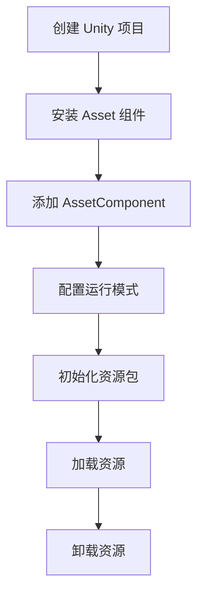

# 首个示例

本文档将引导您完成 GameFrameX Asset 资源组件的首次使用，通过一个完整的示例帮助您快速上手资源系统的核心功能。

## 概述

Asset 资源组件是基于 YooAssets 构建的 Unity 资源管理系统，提供统一的资源加载、卸载和热更新功能。本示例将展示如何在 Unity 项目中配置并使用该组件完成基本的资源加载操作。

## 快速开始流程

以下是使用 Asset 资源组件的标准流程：



## 使用步骤

### 步骤 1：添加 AssetComponent

在 Unity 场景中创建一个空的 GameObject，并添加 `AssetComponent` 组件。该组件会自动暴露资源管理的各项功能。

```csharp
// 在 Unity 编辑器中
// 1. 在场景中创建一个空的 GameObject
// 2. 点击 Add Component
// 3. 搜索 "GameFrameX/Asset" 并添加
// 4. 组件会自动挂载 AssetComponent
```

> Source: [AssetComponent.cs](https://github.com/GameFrameX/com.gameframex.unity.asset/blob/main/Runtime/Asset/AssetComponent.cs#L16-L18)

AssetComponent 继承自 `GameFrameworkComponent`，并通过 `[AddComponentMenu("GameFrameX/Asset")]` 属性在编辑器中方便添加。

### 步骤 2：配置运行模式

AssetComponent 提供 `GamePlayMode` 属性，用于设置资源的运行模式：

```csharp
// AssetComponent.cs 中的属性定义
public EPlayMode GamePlayMode { get; set; }
```

支持的运行模式包括：
- **EditorSimulateMode**：编辑器模拟模式，仅在开发时使用
- **HostPlayMode**：远程热更模式
- **WebPlayMode**：WebGL 平台专用模式

> 详细运行模式说明请参阅 [运行模式](./6-configuration.play-modes) 文档。

```csharp
// 运行时模式设置示例（在 AssetComponent.Awake 中）
_assetManager.SetPlayMode(GamePlayMode);
```

> Source: [AssetComponent.cs](https://github.com/GameFrameX/com.gameframex.unity.asset/blob/main/Runtime/Asset/AssetComponent.cs#L63)

### 步骤 3：初始化资源包

在使用资源系统前，需要先初始化资源包：

```csharp
// 在 AssetComponent.Start 中会自动调用初始化
private void Start()
{
    _assetManager.Initialize();
}
```

> Source: [AssetComponent.cs](https://github.com/GameFrameX/com.gameframex.unity.asset/blob/main/Runtime/Asset/AssetComponent.cs#L66-L70)

您也可以手动初始化特定的资源包：

```csharp
// 初始化资源包示例
public async Task<bool> InitPackageAsync(string packageName, string host, string fallbackHostServer, bool isDefaultPackage = false)
{
    return await _assetManager.InitPackageAsync(packageName, host, fallbackHostServer, isDefaultPackage);
}
```

> Source: [AssetComponent.cs](https://github.com/GameFrameX/com.gameframex.unity.asset/blob/main/Runtime/Asset/AssetComponent.cs#L80-L95)

## 资源加载示例

Asset 组件提供多种资源加载方式，下面分别展示异步加载和同步加载的用法。

### 异步加载资源

异步加载是推荐的主要方式，不会阻塞主线程：

```csharp
using UnityEngine;
using GameFrameX.Asset.Runtime;
using YooAsset;
using System.Threading.Tasks;

// 异步加载 Prefab 示例
public async void LoadAssetExample(AssetComponent assetComponent)
{
    // 方法1：使用泛型异步加载
    var handle = await assetComponent.LoadAssetAsync<GameObject>("Assets/Prefabs/Player.prefab");
    var prefab = handle.AssetObject as GameObject;
    
    // 实例化对象
    if (prefab != null)
    {
        Instantiate(prefab);
    }
    
    // 加载完成后释放句柄
    handle.Release();
}
```

> Source: [AssetComponent.cs](https://github.com/GameFrameX/com.gameframex.unity.asset/blob/main/Runtime/Asset/AssetComponent.cs#L257-L261)

```csharp
// 方法2：使用路径和类型加载
public async Task LoadAssetWithType(AssetComponent assetComponent)
{
    var handle = await assetComponent.LoadAssetAsync("Assets/Textures/Background.png", typeof(Texture2D));
    var texture = handle.AssetObject as Texture2D;
    
    // 使用纹理...
    handle.Release();
}
```

> Source: [AssetComponent.cs](https://github.com/GameFrameX/com.gameframex.unity.asset/blob/main/Runtime/Asset/AssetComponent.cs#L245-L249)

### 同步加载资源

同步加载适用于必须在当前帧获取资源的场景：

```csharp
// 同步加载 Prefab 示例
public void LoadAssetSyncExample(AssetComponent assetComponent)
{
    var handle = assetComponent.LoadAssetSync<GameObject>("Assets/Prefabs/Enemy.prefab");
    var enemy = handle.AssetObject as GameObject;
    
    if (enemy != null)
    {
        Instantiate(enemy);
    }
    
    // 同步加载也需要手动释放
    handle.Release();
}
```

> Source: [AssetComponent.cs](https://github.com/GameFrameX/com.gameframex.unity.asset/blob/main/Runtime/Asset/AssetComponent.cs#L425-L429)

### 加载场景

```csharp
// 异步加载场景示例
public async Task LoadSceneExample(AssetComponent assetComponent)
{
    var sceneHandle = await assetComponent.LoadSceneAsync(
        "Assets/Scenes/GameScene.unity", 
        UnityEngine.SceneManagement.LoadSceneMode.Single, 
        true
    );
    
    Debug.Log($"场景加载完成: {sceneHandle.Scene.name}");
}
```

> Source: [AssetComponent.cs](https://github.com/GameFrameX/com.gameframex.unity.asset/blob/main/Runtime/Asset/AssetComponent.cs#L442-L446)

### 加载多个资源

```csharp
// 加载指定路径下的所有资源
public async Task LoadAllAssetsExample(AssetComponent assetComponent)
{
    var allAssetsHandle = await assetComponent.LoadAllAssetsAsync<GameObject>("Assets/Prefabs/");
    
    foreach (var asset in allAssetsHandle.AllAssetObjects)
    {
        Debug.Log($"加载资源: {asset.name}");
    }
    
    // 全部使用完成后释放
    allAssetsHandle.Release();
}
```

> Source: [AssetComponent.cs](https://github.com/GameFrameX/com.gameframex.unity.asset/blob/main/Runtime/Asset/AssetComponent.cs#L269-L273)

## 资源卸载示例

正确管理资源生命周期对于避免内存泄漏至关重要：

```csharp
public class ResourceManager
{
    private AssetComponent _assetComponent;
    
    // 卸载指定资源
    public void UnloadSingleAsset(string assetPath)
    {
        _assetComponent.UnloadAsset(assetPath);
    }
    
    // 卸载未使用的资源（推荐定期调用）
    public void UnloadUnusedAssets()
    {
        _assetComponent.UnloadUnusedAssetsAsync();
    }
    
    // 清理无用资源包文件
    public void ClearUnusedBundles()
    {
        _assetComponent.ClearUnusedBundleFilesAsync();
    }
    
    // 强制卸载所有资源（谨慎使用）
    public void UnloadAllAssets()
    {
        _assetComponent.UnloadAllAssetsAsync(null);
    }
}
```

> Source: [AssetComponent.cs](https://github.com/GameFrameX/com.gameframex.unity.asset/blob/main/Runtime/Asset/AssetComponent.cs#L590-L658)

## 完整使用示例

以下是一个完整的 MonoBehaviour 脚本示例，展示从初始化到加载再到卸载的完整流程：

```csharp
using UnityEngine;
using GameFrameX.Asset.Runtime;
using YooAsset;
using System.Threading.Tasks;
using UnityEngine.SceneManagement;

public class GameEntry : MonoBehaviour
{
    private AssetComponent _assetComponent;
    
    private void Start()
    {
        // 获取 AssetComponent 组件
        _assetComponent = GetComponent<AssetComponent>();
        
        // 初始化资源包
        InitializePackage();
    }
    
    private async void InitializePackage()
    {
        // 初始化默认资源包
        bool success = await _assetComponent.InitPackageAsync(
            "DefaultPackage",           // 包名称
            "http://localhost:8080/",   // 主服务器地址
            "http://backup:8080/",     // 备用服务器地址
            true                        // 是否设为默认包
        );
        
        if (success)
        {
            Debug.Log("资源包初始化成功！");
            // 开始加载游戏内容
            LoadGameContent();
        }
        else
        {
            Debug.LogError("资源包初始化失败！");
        }
    }
    
    private async void LoadGameContent()
    {
        // 加载玩家预制体
        var playerHandle = await _assetComponent.LoadAssetAsync<GameObject>("Assets/Prefabs/Player.prefab");
        var playerPrefab = playerHandle.AssetObject as GameObject;
        
        if (playerPrefab != null)
        {
            Instantiate(playerPrefab);
        }
        
        // 加载背景音乐
        var audioHandle = await _assetComponent.LoadAssetAsync<AudioClip>("Assets/Audio/BGM.mp3");
        var bgm = audioHandle.AssetObject as AudioClip;
        
        // 加载主场景
        await _assetComponent.LoadSceneAsync(
            "Assets/Scenes/Main.unity",
            LoadSceneMode.Single,
            true
        );
        
        // 注意：实际项目中应根据需求决定何时释放资源句柄
    }
}
```

> Source: [AssetManager.cs](https://github.com/GameFrameX/com.gameframex.unity.asset/blob/main/Runtime/Asset/AssetManager.cs#L46-L56)

## 资源包管理

Asset 组件支持多资源包管理，可以创建和切换不同的资源包：

```csharp
public class PackageManagerExample
{
    private AssetComponent _assetComponent;
    
    // 创建新的资源包
    public void CreatePackage(string packageName)
    {
        var package = _assetComponent.CreateAssetsPackage(packageName);
        
        if (package != null)
        {
            Debug.Log($"创建资源包成功: {packageName}");
        }
    }
    
    // 获取资源包
    public void GetPackage(string packageName)
    {
        var package = _assetComponent.GetAssetsPackage(packageName);
        
        if (package != null)
        {
            Debug.Log($"获取到资源包: {package.Name}");
        }
    }
    
    // 检查资源包是否存在
    public bool CheckPackageExists(string packageName)
    {
        return _assetComponent.HasAssetsPackage(packageName);
    }
    
    // 设置默认资源包
    public void SetDefaultPackage(string packageName)
    {
        var package = _assetComponent.GetAssetsPackage(packageName);
        if (package != null)
        {
            _assetComponent.SetDefaultAssetsPackage(package);
        }
    }
}
```

> Source: [AssetComponent.cs](https://github.com/GameFrameX/com.gameframex.unity.asset/blob/main/Runtime/Asset/AssetComponent.cs#L470-L507)

## 最佳实践

### 1. 使用异步加载

```csharp
// ✅ 推荐：异步加载
public async Task<GameObject> LoadPlayerAsync()
{
    var handle = await _assetComponent.LoadAssetAsync<GameObject>("Assets/Prefabs/Player.prefab");
    return handle.AssetObject as GameObject;
}
```

### 2. 及时释放资源句柄

```csharp
// ✅ 推荐：使用完成后释放
var handle = await _assetComponent.LoadAssetAsync<GameObject>("Assets/Prefabs/Player.prefab");
var player = handle.AssetObject as GameObject;
Instantiate(player);
handle.Release();  // 立即释放句柄

// ❌ 不推荐：持有句柄不释放
var handle = await _assetComponent.LoadAssetAsync<GameObject>("Assets/Prefabs/Player.prefab");
// ... 长时间持有不释放
```

### 3. 使用资源标签进行批量查询

```csharp
// 根据标签批量获取资源信息
public void LoadByTag()
{
    var assets = _assetComponent.GetAssetInfos("UI");
    foreach (var asset in assets)
    {
        Debug.Log($"找到 UI 资源: {asset.AssetPath}");
    }
}
```

> Source: [AssetComponent.cs](https://github.com/GameFrameX/com.gameframex.unity.asset/blob/main/Runtime/Asset/AssetComponent.cs#L549-L553)

## 相关链接

- [快速入门指南](./3-getting-started.index) - 返回快速入门概览
- [架构设计](./4-core-concepts.architecture) - 了解系统架构
- [资源组件](./4-core-concepts.asset-component) - 深入了解 AssetComponent
- [资源管理器](./4-core-concepts.asset-manager) - 深入了解 AssetManager
- [资源加载接口](./5-api-reference.loading-api) - 完整的 API 参考
- [运行模式](./6-configuration.play-modes) - 配置不同的运行模式
- [组件配置](./6-configuration.component-settings) - 组件配置详解
