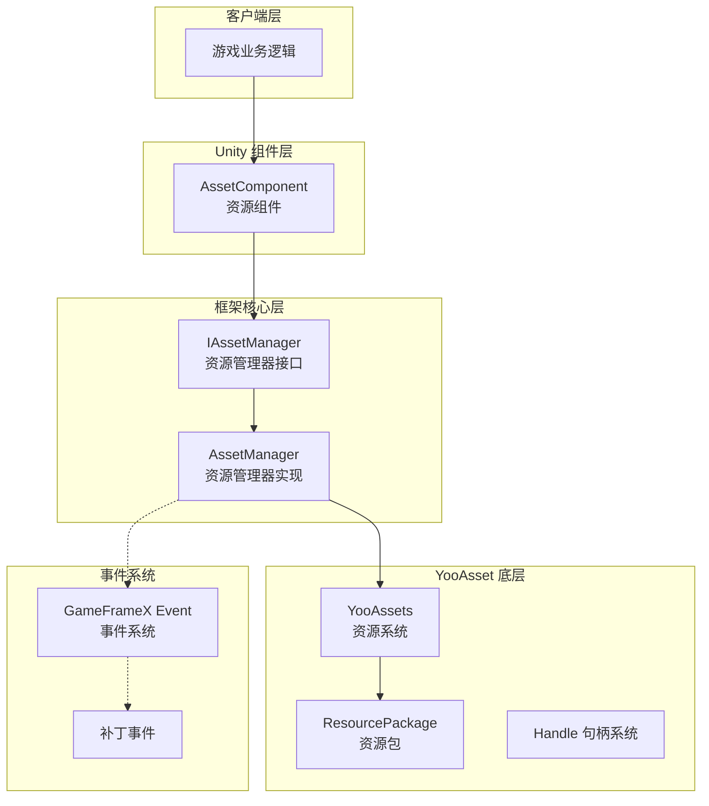
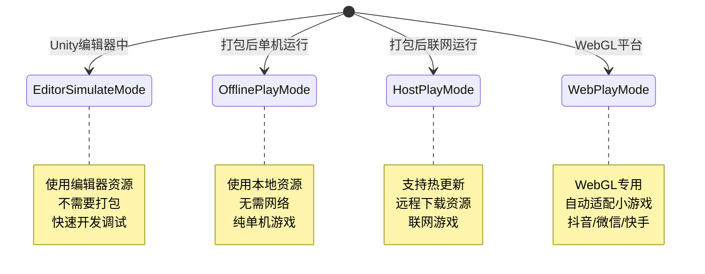
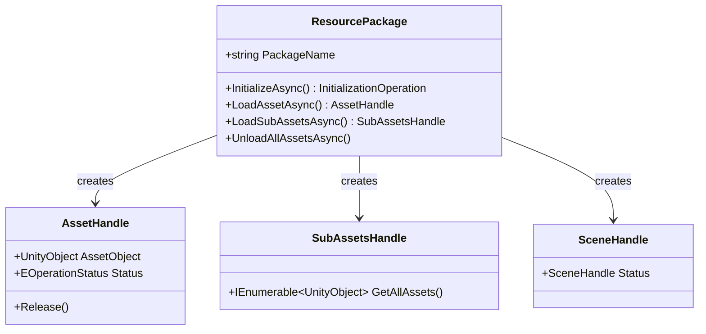
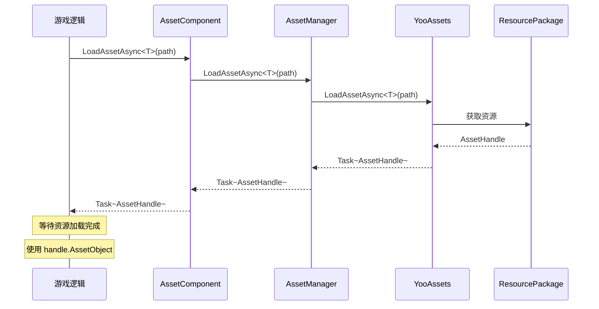

# 架构设计

本文档详细介绍 GameFrameX Asset 资源组件的整体架构设计，包括核心组件、模块职责、交互关系以及设计决策。

## 概述

GameFrameX Asset 资源组件是 GameFrameX 框架的核心模块之一，基于业界成熟的 **YooAsset** 资源管理系统构建。该组件通过封装 YooAsset 的底层 API，为 Unity 游戏应用提供了一套**统一、简洁、易用**的资源管理解决方案。

**设计目标：**
- 简化资源加载和卸载的复杂度
- 提供跨平台一致的 API 接口
- 支持多种运行模式（编辑器模拟、离线、热更新、WebGL）
- 集成 GameFrameX 事件系统，实现状态通知
- 支持多资源包管理

## 架构总览



### 各层职责说明

| 层级 | 组件 | 职责 |
|------|------|------|
| 客户端层 | 游戏业务逻辑 | 调用资源组件提供的 API 进行资源加载 |
| Unity 组件层 | AssetComponent | 作为 Unity 场景中的组件，提供面向用户的 API 入口 |
| 框架核心层 | AssetManager | 实现资源管理的核心业务逻辑 |
| YooAsset 底层 | YooAssets | 底层资源系统，处理实际的文件系统、下载、缓存等 |
| 事件系统 | EventSystem | 提供补丁流程状态通知、下载进度等事件 |

## 核心组件

### 1. AssetComponent（资源组件）

`AssetComponent` 是 Unity 游戏场景中的核心组件，继承自 `GameFrameworkComponent`。它作为资源系统的统一入口，为游戏逻辑层提供资源访问接口。

**主要职责：**
- 作为 Unity 组件挂载在场景中
- 配置运行模式（PlayMode）
- 管理资源包的初始化
- 代理转发资源加载请求到 AssetManager
- 处理平台差异（WebGL 自动切换模式）

> Source: [AssetComponent.cs](https://github.com/GameFrameX/com.gameframex.unity.asset/blob/main/Runtime/Asset/AssetComponent.cs#L18-L70)

```csharp
[DisallowMultipleComponent]
[AddComponentMenu("GameFrameX/Asset")]
public sealed class AssetComponent : GameFrameworkComponent
{
    [Tooltip("当目标平台为Web平台时，将会强制设置为WebPlayMode")]
    [SerializeField]
    private EPlayMode m_GamePlayMode;
    
    private IAssetManager _assetManager;
    
    protected override void Awake()
    {
        // 非编辑器环境下，自动调整运行模式
#if !UNITY_EDITOR
        if (GamePlayMode == EPlayMode.EditorSimulateMode)
        {
            GamePlayMode = EPlayMode.HostPlayMode;
        }
#if UNITY_WEBGL
        GamePlayMode = EPlayMode.WebPlayMode;
#endif
#endif
        base.Awake();
        _assetManager = GameFrameworkEntry.GetModule<IAssetManager>();
        _assetManager.SetPlayMode(GamePlayMode);
    }
}
```

**设计意图：**
- 使用 `[DisallowMultipleComponent]` 限制场景中只能有一个 AssetComponent，保证资源管理的唯一性
- 在 `Awake` 中处理平台差异，确保在非编辑器环境下使用正确的运行模式
- 通过依赖注入获取 IAssetManager 实例，实现解耦

### 2. IAssetManager（资源管理器接口）

`IAssetManager` 接口定义了资源管理的所有操作契约，确保实现的灵活性和可测试性。

> Source: [IAssetManager.cs](https://github.com/GameFrameX/com.gameframex.unity.asset/blob/main/Runtime/Asset/IAssetManager.cs#L1-L519)

**接口分类：**

| 功能分类 | 方法示例 |
|----------|----------|
| 初始化 | `Initialize()`, `InitPackageAsync()` |
| 异步加载 | `LoadAssetAsync<T>()`, `LoadSceneAsync()` |
| 同步加载 | `LoadAssetSync<T>()`, `LoadSubAssetSync()` |
| 资源包管理 | `CreateAssetsPackage()`, `GetAssetsPackage()` |
| 资源卸载 | `UnloadAsset()`, `UnloadUnusedAssetsAsync()` |
| 资源查询 | `GetAssetInfo()`, `HasAssetPath()`, `IsNeedDownload()` |

### 3. AssetManager（资源管理器实现）

`AssetManager` 是资源管理的核心实现类，继承自 `GameFrameworkModule` 并实现 `IAssetManager` 接口。它封装了对 YooAssets 的调用，并适配了 GameFrameX 的模块系统。

**主要职责：**
- 管理 YooAssets 初始化
- 处理不同运行模式的配置
- 封装资源加载/卸载操作
- 管理资源包（Package）

> Source: [AssetManager.cs](https://github.com/GameFrameX/com.gameframex.unity.asset/blob/main/Runtime/Asset/AssetManager.cs#L14-L60)

```csharp
[UnityEngine.Scripting.Preserve]
public partial class AssetManager : GameFrameworkModule, IAssetManager
{
    public string DefaultPackageName { get; set; } = ConstDefaultPackageName;
    public int DownloadingMaxNum { get; set; }
    public int FailedTryAgain { get; set; }
    public EFileVerifyLevel VerifyLevel { get; set; }
    public EPlayMode PlayMode { get; private set; }
    
    public void Initialize()
    {
        BetterStreamingAssets.Initialize();
        Log.Info($"资源系统运行模式：{PlayMode}");
        YooAssets.Initialize();
        YooAssets.SetOperationSystemMaxTimeSlice(30);
    }
}
```

## 运行模式

Asset 组件支持四种运行模式，通过 `EPlayMode` 枚举定义：



### 模式选择逻辑

> Source: [AssetManager.Initialization.cs](https://github.com/GameFrameX/com.gameframex.unity.asset/blob/main/Runtime/Asset/AssetManager.Initialization.cs#L18-L47)

```csharp
private InitializationOperation CreateInitializationOperationHandler(ResourcePackage resourcePackage, string hostServerURL, string fallbackHostServerURL)
{
    switch (PlayMode)
    {
        case EPlayMode.EditorSimulateMode:
            return InitializeYooAssetEditorSimulateMode(resourcePackage);
        case EPlayMode.OfflinePlayMode:
            return InitializeYooAssetOfflinePlayMode(resourcePackage);
        case EPlayMode.HostPlayMode:
            return InitializeYooAssetHostPlayMode(resourcePackage, hostServerURL, fallbackHostServerURL);
        case EPlayMode.WebPlayMode:
            return InitializeYooAssetWebPlayMode(resourcePackage, hostServerURL, fallbackHostServerURL);
        default:
            return null;
    }
}
```

### 模式初始化详情

| 模式 | 初始化方法 | 适用场景 |
|------|------------|----------|
| EditorSimulateMode | `InitializeYooAssetEditorSimulateMode()` | 编辑器开发调试，不打包 |
| OfflinePlayMode | `InitializeYooAssetOfflinePlayMode()` | 单机游戏，无需热更新 |
| HostPlayMode | `InitializeYooAssetHostPlayMode()` | 需要热更新的联网游戏 |
| WebPlayMode | `InitializeYooAssetWebPlayMode()` | WebGL/小游戏平台 |

## 资源包系统

Asset 组件采用**资源包（ResourcePackage）**机制管理不同类型的资源。



### 资源包操作

```csharp
// 创建资源包
ResourcePackage package = assetComponent.CreateAssetsPackage("MyPackage");

// 获取资源包
ResourcePackage pkg = assetComponent.TryGetAssetsPackage("MyPackage");

// 设置默认资源包
assetComponent.SetDefaultAssetsPackage(pkg);

// 检查资源包是否存在
if (assetComponent.HasAssetsPackage("MyPackage"))
{
    // 使用资源包
}
```

> Source: [AssetManager.cs](https://github.com/GameFrameX/com.gameframex.unity.asset/blob/main/Runtime/Asset/AssetManager.cs#L646-L692)

## 事件系统

Asset 组件集成了 GameFrameX 的事件系统，用于通知资源加载进度和状态变更。

### 补丁状态变更

> Source: [EPatchStates.cs](https://github.com/GameFrameX/com.gameframex.unity.asset/blob/main/Runtime/Update/EPatchStates.cs#L1-L33)

```csharp
public enum EPatchStates
{
    /// <summary>更新静态的资源版本</summary>
    UpdateStaticVersion,
    /// <summary>更新补丁清单</summary>
    UpdateManifest,
    /// <summary>创建下载器</summary>
    CreateDownloader,
    /// <summary>下载远端文件</summary>
    DownloadWebFiles,
    /// <summary>补丁流程完毕</summary>
    PatchDone,
}
```

### 事件类型

| 事件类 | 用途 |
|--------|------|
| AssetPatchStatesChangeEventArgs | 补丁流程状态变更 |
| AssetDownloadProgressUpdateEventArgs | 下载进度更新 |
| AssetFoundUpdateFilesEventArgs | 发现需要更新的文件 |
| AssetPatchManifestUpdateFailedEventArgs | 补丁清单更新失败 |
| AssetWebFileDownloadFailedEventArgs | 资源文件下载失败 |

> Source: [AssetPatchStatesChangeEventArgs.cs](https://github.com/GameFrameX/com.gameframex.unity.asset/blob/main/Runtime/Update/EventArgs/AssetPatchStatesChangeEventArgs.cs#L1-L49)

## 资源加载流程

### 异步资源加载



### 资源卸载流程

```mermaid
flowchart LR
    A[调用 UnloadAsset] --> B{指定资源包?}
    B -->|是| C[UnloadAsset(packageName, assetPath)]
    B -->|否| D[UnloadAsset(assetPath)]
    C --> E[获取目标资源包]
    D --> E
    E --> F[调用 Package.TryUnloadUnusedAsset]
    F --> G[YooAsset 释放资源]
    
    G --> H{调用 UnloadUnusedAssetsAsync?}
    H -->|是| I[释放未使用资源]
    H -->|否| J[结束]
```

## 配置选项

Asset 组件提供以下可配置项：

| 配置项 | 类型 | 默认值 | 说明 |
|--------|------|--------|------|
| GamePlayMode | EPlayMode | EditorSimulateMode | 资源运行模式 |
| DefaultPackageName | string | "DefaultPackage" | 默认资源包名称 |
| DownloadingMaxNum | int | - | 最大并发下载数量 |
| FailedTryAgain | int | - | 下载失败重试次数 |
| VerifyLevel | EFileVerifyLevel | - | 文件验证等级 |
| Milliseconds | long | - | 异步系统每帧最大执行时间(毫秒) |

> Source: [AssetComponent.cs](https://github.com/GameFrameX/com.gameframex.unity.asset/blob/main/Runtime/Asset/AssetComponent.cs#L20-L36)

## 设计决策说明

### 1. 为什么使用 YooAsset？

选择 YooAsset 作为底层资源系统的原因：
- **功能完善**：支持资源打包、依赖分析、热更新、缓存管理等完整功能
- **性能优化**：提供句柄机制、引用计数、资源释放优化
- **跨平台**：支持 Unity 所有主流平台
- **社区活跃**：持续维护更新

### 2. 为什么采用接口分离？

通过 `IAssetManager` 接口定义清晰的操作契约：
- 便于单元测试（可以 mock 实现）
- 提供扩展点，允许替换底层实现
- API 文档更清晰

### 3. 为什么区分同步/异步加载？

- **异步加载**：适合大规模资源加载，避免阻塞主线程
- **同步加载**：适合小资源或特定性能敏感场景
- 用户可以根据场景需求选择合适的加载方式

### 4. 为什么需要资源包？

多资源包设计支持：
- 按功能模块划分资源（UI、DLC、配置）
- 动态加载/卸载特定模块
- 资源按需下载，节省带宽

## 相关链接

- [资源组件](./4-core-concepts.asset-component) - AssetComponent 详细 API
- [资源管理器](./4-core-concepts.asset-manager) - AssetManager 实现细节
- [资源加载接口](./5-api-reference.loading-api) - 完整加载 API 参考
- [资源包管理](./5-api-reference.package-management) - 资源包操作 API
- [运行模式](./6-configuration.play-modes) - 各种运行模式配置
- [组件配置](./6-configuration.component-settings) - 组件配置选项
