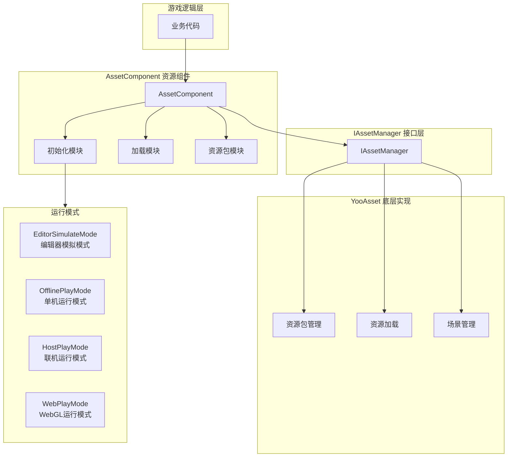
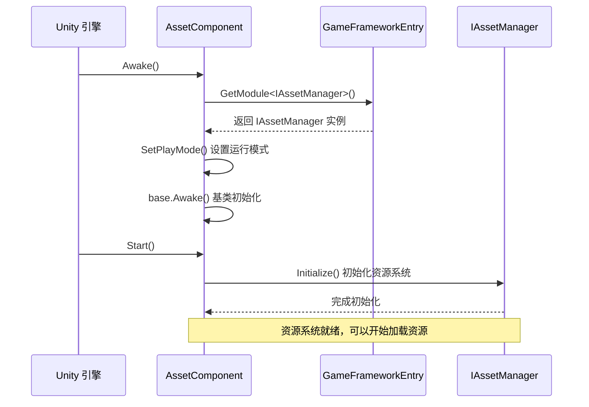
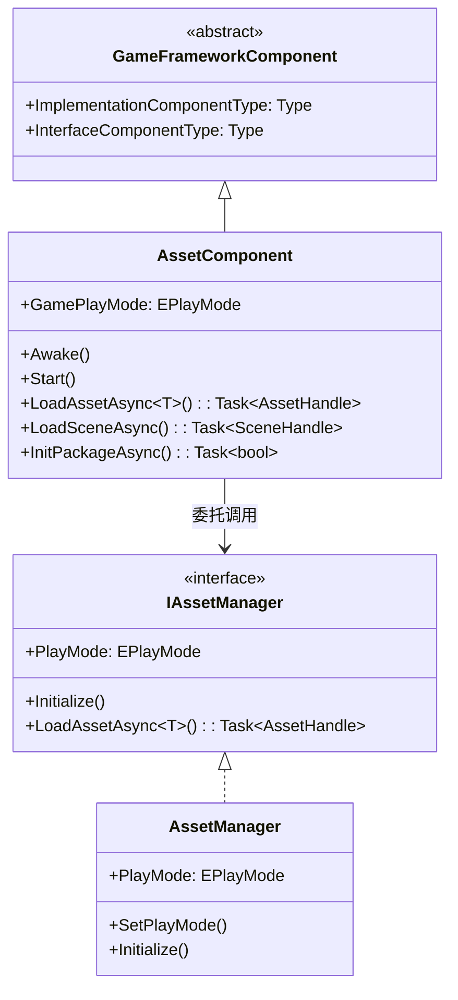

# 资源组件

资源组件（AssetComponent）是 GameFrameX 资源系统的核心入口，提供统一的资源加载、卸载和管理功能。该组件封装了 YooAsset 底层实现，为游戏项目提供简洁高效的资源管理 API。

## 概述

AssetComponent 是一个 Unity 组件（MonoBehaviour），继承自 GameFrameworkComponent。作为资源系统的门面（Facade），它简化了资源操作的复杂性，提供了同步/异步加载、场景管理、资源包管理等功能。

**设计目的**：
- 提供统一的资源访问接口，隐藏底层实现细节
- 支持多种运行模式，适应不同的开发和部署场景
- 实现资源的懒加载和自动释放，优化内存使用
- 支持热更新资源管理，适用于联机游戏

## 架构设计



**架构说明**：
- **游戏逻辑层**：业务代码通过 AssetComponent 访问资源系统
- **AssetComponent 层**：提供组件化的资源接口，包括初始化、加载、资源包管理模块
- **IAssetManager 接口层**：定义资源管理的抽象接口，实现关注点分离
- **YooAsset 层**：基于 YooAsset 库的实际资源管理实现
- **运行模式**：支持四种不同的资源运行模式，适应各种开发部署场景

## 核心功能

### 1. 运行模式支持

AssetComponent 支持四种运行模式，通过 `GamePlayMode` 属性配置：

| 模式 | 说明 | 适用场景 |
|------|------|----------|
| EditorSimulateMode | 编辑器模拟模式 | 开发阶段，无需打包即可测试资源 |
| OfflinePlayMode | 单机运行模式 | 纯本地资源，不涉及网络更新 |
| HostPlayMode | 联机运行模式 | 需要热更新的正式发布版本 |
| WebPlayMode | WebGL 运行模式 | Web 平台发布，支持小游戏平台 |

**平台自动适配**：

```csharp
// AssetComponent.cs - 运行时自动调整运行模式
#if !UNITY_EDITOR
    if (GamePlayMode == EPlayMode.EditorSimulateMode)
    {
        GamePlayMode = EPlayMode.HostPlayMode;
    }
#if UNITY_WEBGL
    GamePlayMode = EPlayMode.WebPlayMode;
#endif
#endif
```
> Source: [AssetComponent.cs](https://github.com/GameFrameX/com.gameframex.unity.asset/blob/main/Runtime/Asset/AssetComponent.cs#L44-L52)

### 2. 资源加载

AssetComponent 提供丰富的资源加载接口，支持同步和异步两种方式：

```csharp
// 异步加载资源
public async Task<AssetHandle> LoadAssetAsync<T>(string path) where T : Object

// 同步加载资源
public AssetHandle LoadAssetSync<T>(string path) where T : Object

// 异步加载子资源（如 SpriteAtlas 中的 Sprite）
public Task<SubAssetsHandle> LoadSubAssetsAsync<T>(string path) where T : Object

// 异步加载所有资源
public Task<AllAssetsHandle> LoadAllAssetsAsync<T>(string path) where T : Object
```
> Source: [AssetComponent.cs](https://github.com/GameFrameX/com.gameframex.unity.asset/blob/main/Runtime/Asset/AssetComponent.cs#L257-L305)

### 3. 场景加载

支持异步加载 Unity 场景：

```csharp
// 异步加载场景
public Task<SceneHandle> LoadSceneAsync(string path, LoadSceneMode sceneMode, bool activateOnLoad = true)
```
> Source: [AssetComponent.cs](https://github.com/GameFrameX/com.gameframex.unity.asset/blob/main/Runtime/Asset/AssetComponent.cs#L443-L459)

### 4. 资源包管理

支持多资源包管理，可以创建、获取、设置默认资源包：

```csharp
// 创建资源包
public ResourcePackage CreateAssetsPackage(string packageName)

// 尝试获取资源包（不存在返回 null）
public ResourcePackage TryGetAssetsPackage(string packageName)

// 检查资源包是否存在
public bool HasAssetsPackage(string packageName)

// 设置默认资源包
public void SetDefaultAssetsPackage(ResourcePackage assetsPackage)
```
> Source: [AssetComponent.cs](https://github.com/GameFrameX/com.gameframex.unity.asset/blob/main/Runtime/Asset/AssetComponent.cs#L471-L584)

### 5. 资源卸载与清理

提供多种资源释放策略：

```csharp
// 卸载指定资源
public void UnloadAsset(string assetPath)

// 卸载资源句柄
public void UnloadAssetHandle(object assetHandle)

// 卸载无用资源
public void UnloadUnusedAssetsAsync(string packageName = null)

// 清理无用资源包文件
public void ClearUnusedBundleFilesAsync(string packageName = null)

// 强制回收所有资源
public void UnloadAllAssetsAsync(string packageName)

// 清理所有资源包文件
public void ClearAllBundleFilesAsync(string packageName = null)
```
> Source: [AssetComponent.cs](https://github.com/GameFrameX/com.gameframex.unity.asset/blob/main/Runtime/Asset/AssetComponent.cs#L602-L658)

## 核心流程

### 组件初始化流程



### 资源加载流程

```mermaid
sequenceDiagram
    participant Client as 业务代码
    participant AC as AssetComponent
    participant IAM as IAssetManager
    package as YooAsset ResourcePackage

    Client->>AC: LoadAssetAsync<T>(path)
    AC->>IAM: LoadAssetAsync<T>(path)
    IAM->>package: LoadAssetAsync(path)
    
    rect rgb(240, 248, 255)
        Note right of package: 资源加载阶段
    end
    
    package-->>IAM: AssetHandle
    IAM-->>AC: AssetHandle
    AC-->>Client: Task<AssetHandle>
    
    Client->>Client: await Task
    Note over Client: 获取资源对象
    
    Client->>AC: UnloadAssetHandle(handle)
    AC->>IAM: handle.Release()
    Note over package: 资源已释放
```

## 使用示例

### 基础用法：异步加载资源

```csharp
using UnityEngine;
using GameFrameX.Asset.Runtime;
using YooAssets;

public class Example : MonoBehaviour
{
    private async void Start()
    {
        var assetComponent = GameEntry.GetComponent<AssetComponent>();
        
        // 异步加载 Prefab
        var handle = await assetComponent.LoadAssetAsync<GameObject>("Prefabs/Player");
        var prefab = handle.LoadAsset();
        
        // 实例化对象
        Instantiate(prefab);
        
        // 加载完成后释放资源句柄
        handle.Release();
    }
}
```
> Source: [AssetComponent.cs](https://github.com/GameFrameX/com.gameframex.unity.asset/blob/main/Runtime/Asset/AssetComponent.cs#L257-L261)

### 进阶用法：资源包初始化与多资源包管理

```csharp
using UnityEngine;
using GameFrameX.Asset.Runtime;

public class MultiPackageExample : MonoBehaviour
{
    private async void Start()
    {
        var assetComponent = GameEntry.GetComponent<AssetComponent>();
        
        // 初始化默认资源包
        await assetComponent.InitPackageAsync(
            "DefaultPackage",           // 包名称
            "https://cdn.example.com/", // 主下载地址
            "https://backup.example.com/", // 备用地址
            true                        // 是否默认包
        );
        
        // 创建额外的资源包
        var uiPackage = assetComponent.CreateAssetsPackage("UIPackage");
        var configPackage = assetComponent.CreateAssetsPackage("ConfigPackage");
        
        // 设置默认资源包
        assetComponent.SetDefaultAssetsPackage(uiPackage);
    }
}
```
> Source: [AssetComponent.cs](https://github.com/GameFrameX/com.gameframex.unity.asset/blob/main/Runtime/Asset/AssetComponent.cs#L80-L95)

### 高级用法：检查资源状态与条件加载

```csharp
using UnityEngine;
using GameFrameX.Asset.Runtime;

public class ResourceCheckExample : MonoBehaviour
{
    private async void LoadResourceWithCheck()
    {
        var assetComponent = GameEntry.GetComponent<AssetComponent>();
        
        string resourcePath = "Prefabs/HeavyModel";
        
        // 检查资源是否需要下载
        if (assetComponent.IsNeedDownload(resourcePath))
        {
            Debug.Log("资源需要下载，显示下载界面...");
            // 这里可以添加下载进度 UI
        }
        
        // 获取资源信息
        var assetInfo = assetComponent.GetAssetInfo(resourcePath);
        if (assetInfo != null)
        {
            Debug.Log($"资源路径: {assetInfo.AssetPath}");
        }
        
        // 检查资源路径是否存在
        if (assetComponent.HasAssetPath(resourcePath))
        {
            var handle = await assetComponent.LoadAssetAsync<GameObject>(resourcePath);
            // 处理资源
            handle.Release();
        }
    }
}
```
> Source: [AssetComponent.cs](https://github.com/GameFrameX/com.gameframex.unity.asset/blob/main/Runtime/Asset/AssetComponent.cs#L517-L573)

## 配置说明

### 在 Unity 编辑器中配置

在 Unity 场景中创建 GameObject，并添加 **AssetComponent** 组件：

1. 在 Inspector 面板中配置 **资源运行模式**（GamePlayMode）
2. 根据选择的模式配置相应的参数

```csharp
// AssetComponentInspector.cs - 编辑器配置界面
[CustomEditor(typeof(AssetComponent))]
internal sealed class AssetComponentInspector : ComponentTypeComponentInspector
{
    public override void OnInspectorGUI()
    {
        // 运行模式下禁用编辑
        EditorGUI.BeginDisabledGroup(EditorApplication.isPlayingOrWillChangePlaymode);
        {
            EditorGUILayout.PropertyField(m_GamePlayMode, m_GamePlayModeGUIContent);
        }
    }
}
```
> Source: [AssetComponentInspector.cs](https://github.com/GameFrameX/com.gameframex.unity.asset/blob/main/Editor/Inspector/AssetComponentInspector.cs#L48-L66)

### 组件属性

| 属性 | 类型 | 说明 |
|------|------|------|
| GamePlayMode | EPlayMode | 资源运行模式，决定资源加载方式 |
| ImplementationComponentType | Type | IAssetManager 的实现类型 |
| InterfaceComponentType | Type | 组件对应的接口类型 |

## 与资源管理器的关系

AssetComponent 是面向 Unity 组件系统的门面类，而 IAssetManager/AssetManager 提供了纯业务逻辑层面的资源管理能力：



**职责划分**：
- **AssetComponent**：作为 Unity 组件，处理生命周期（Awake/Start），提供 Unity 友好的 API
- **IAssetManager**：定义资源管理的接口契约，与 Unity 生命周期解耦
- **AssetManager**：接口的具体实现，处理 YooAsset 的底层调用

## 相关链接

- [资源管理器](./4-core-concepts.asset-manager) - 了解更多资源管理的底层实现
- [运行模式](./6-configuration.play-modes) - 了解四种运行模式的详细配置
- [资源加载 API](./5-api-reference.loading-api) - 完整的资源加载接口文档
- [资源包管理](./5-api-reference.package-management) - 资源包管理的详细说明
- [安装指南](./2-installation.index) - 如何安装和配置资源组件
- [快速入门](./3-getting-started.index) - 快速开始使用资源组件
