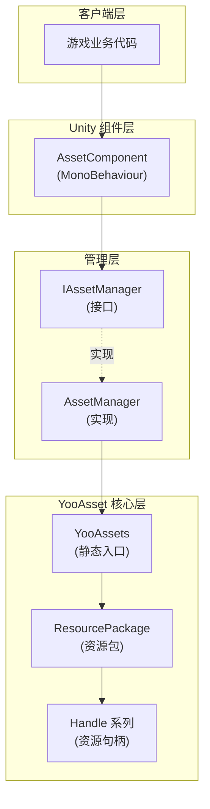
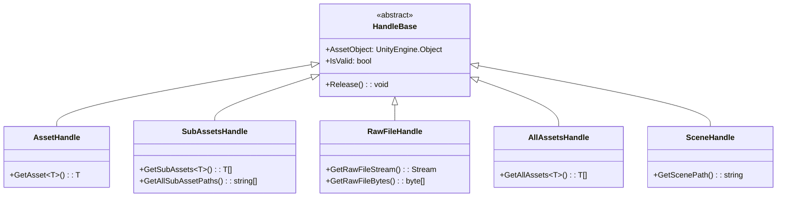
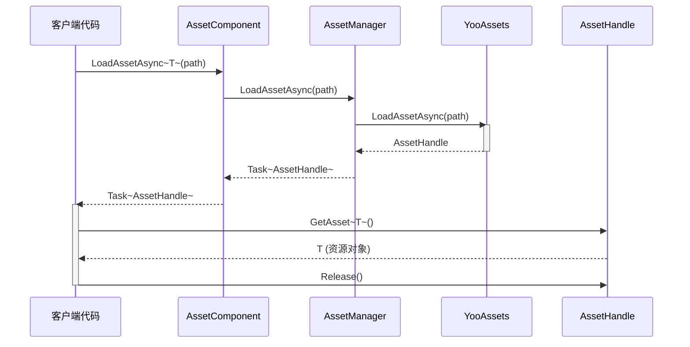

# 资源加载接口

资源加载接口是 GameFrameX Asset 模块的核心 API，提供了一套统一的资源加载和管理方案。该接口基于 YooAsset 库构建，支持同步/异步加载、资源包管理、场景加载等多种资源操作。

## 概述

`IAssetManager` 接口定义了资源组件的全部加载功能，涵盖以下核心能力：

- **多种资源加载方式**：支持同步和异步两种加载模式
- **丰富的资源类型**：支持普通资源、子资源、原生文件、场景等多种类型
- **资源包管理**：支持创建、获取、切换多个资源包
- **资源生命周期管理**：提供资源卸载、清理、回收等完整管理能力

资源加载接口采用 Handle 模式管理资源生命周期，所有加载操作都返回对应的 Handle 对象，通过 Handle 对象可以获取加载的资源和进行释放操作。

> Source: [IAssetManager.cs](https://github.com/GameFrameX/com.gameframex.unity.asset/blob/main/Runtime/Asset/IAssetManager.cs#L1-L519)

## 架构设计

资源加载系统采用分层架构设计，核心组件包括：



**架构说明：**

- **客户端层**：游戏业务代码通过 `AssetComponent` 或 `IAssetManager` 接口调用资源功能
- **Unity 组件层**：`AssetComponent` 是挂载在 GameObject 上的 MonoBehaviour 组件，提供组件方式的访问
- **管理层**：`AssetManager` 实现了 `IAssetManager` 接口，是资源的核心管理器
- **YooAsset 核心层**：实际的资源加载由 YooAsset 完成，返回各种 Handle 对象进行资源管理

### Handle 对象体系

资源加载返回的 Handle 对象是资源管理的核心：



> Handle 类型定义来自 YooAsset 库，详情请参考 [YooAsset 官方文档](https://www.yooasset.com/)

## 核心加载 API

### 异步加载资源

异步加载是推荐的主要加载方式，不会阻塞主线程。

```csharp
/// <summary>
/// 异步加载资源
/// </summary>
/// <param name="path">资源路径</param>
/// <typeparam name="T">资源类型</typeparam>
/// <returns>返回一个 Task，包含 AssetHandle 对象</returns>
Task<AssetHandle> LoadAssetAsync<T>(string path) where T : UnityEngine.Object;
```

> Source: [IAssetManager.cs](https://github.com/GameFrameX/com.gameframex.unity.asset/blob/main/Runtime/Asset/IAssetManager.cs#L234)

**使用示例：**

```csharp
// 通过 AssetComponent 异步加载 Prefab
var handle = await assetComponent.LoadAssetAsync<GameObject>("Prefabs/Player");
GameObject player = handle.GetAsset<GameObject>();
// 使用完毕后释放资源
handle.Release();
```

> Source: [AssetComponent.cs](https://github.com/GameFrameX/com.gameframex.unity.asset/blob/main/Runtime/Asset/AssetComponent.cs#L258-L261)

### 同步加载资源

同步加载会立即返回资源，但在加载过程中会阻塞主线程，应谨慎使用。

```csharp
/// <summary>
/// 同步加载资源
/// </summary>
/// <param name="path">资源路径</param>
/// <returns>返回 AssetHandle 对象</returns>
AssetHandle LoadAssetSync<T>(string path) where T : UnityEngine.Object;
```

> Source: [IAssetManager.cs](https://github.com/GameFrameX/com.gameframex.unity.asset/blob/main/Runtime/Asset/IAssetManager.cs#L365)

**使用示例：**

```csharp
// 同步加载 Sprite
var handle = assetManager.LoadAssetSync<Sprite>("UI/Sprites/Icon");
Sprite sprite = handle.GetAsset<Sprite>();
handle.Release();
```

> Source: [AssetManager.cs](https://github.com/GameFrameX/com.gameframex.unity.asset/blob/main/Runtime/Asset/AssetManager.cs#L603-L606)

### 加载子资源

子资源加载用于获取一个资源包内的所有子资源，例如图集中的所有 Sprite。

```csharp
/// <summary>
/// 异步加载子资源对象
/// </summary>
/// <param name="path">资源路径</param>
/// <typeparam name="T">资源类型</typeparam>
Task<SubAssetsHandle> LoadSubAssetsAsync<T>(string path) where T : UnityEngine.Object;
```

> Source: [IAssetManager.cs](https://github.com/GameFrameX/com.gameframex.unity.asset/blob/main/Runtime/Asset/IAssetManager.cs#L134)

**使用示例：**

```csharp
// 加载图集中的所有 Sprite
var handle = await assetComponent.LoadSubAssetsAsync<Sprite>("Atlas/UI/MainAtlas");
Sprite[] sprites = handle.GetSubAssets<Sprite>();
foreach (var sprite in sprites)
{
    Debug.Log($"Sprite: {sprite.name}");
}
handle.Release();
```

> Source: [AssetComponent.cs](https://github.com/GameFrameX/com.gameframex.unity.asset/blob/main/Runtime/Asset/AssetComponent.cs#L128-L131)

### 加载原生文件

原生文件加载用于加载非 Unity 资源类型的原始文件，如配置文件、文本文件等。

```csharp
/// <summary>
/// 异步加载原生文件
/// </summary>
/// <param name="path">资源路径</param>
Task<RawFileHandle> LoadRawFileAsync(string path);
```

> Source: [IAssetManager.cs](https://github.com/GameFrameX/com.gameframex.unity.asset/blob/main/Runtime/Asset/IAssetManager.cs#L183)

**使用示例：**

```csharp
// 加载 JSON 配置文件
var handle = await assetComponent.LoadRawFileAsync("Config/GameConfig.json");
string json = System.Text.Encoding.UTF8.GetString(handle.GetRawFileBytes());
handle.Release();
```

> Source: [AssetComponent.cs](https://github.com/GameFrameX/com.gameframex.unity.asset/blob/main/Runtime/Asset/AssetComponent.cs#L192-L195)

### 加载所有资源

加载指定资源包内所有的资源对象。

```csharp
/// <summary>
/// 异步加载资源包内所有资源对象
/// </summary>
/// <param name="path">资源的定位地址</param>
Task<AllAssetsHandle> LoadAllAssetsAsync(string path);
```

> Source: [IAssetManager.cs](https://github.com/GameFrameX/com.gameframex.unity.asset/blob/main/Runtime/Asset/IAssetManager.cs#L267)

**使用示例：**

```csharp
// 加载某个目录下的所有 Prefab
var handle = await assetComponent.LoadAllAssetsAsync<GameObject>("Prefabs/Enemies");
GameObject[] enemies = handle.GetAllAssets<GameObject>();
handle.Release();
```

> Source: [AssetComponent.cs](https://github.com/GameFrameX/com.gameframex.unity.asset/blob/main/Runtime/Asset/AssetComponent.cs#L292-L295)

### 加载场景

异步加载 Unity 场景。

```csharp
/// <summary>
/// 异步加载场景
/// </summary>
/// <param name="path">资源路径</param>
/// <param name="sceneMode">场景模式</param>
/// <param name="activateOnLoad">是否加载完成自动激活</param>
Task<SceneHandle> LoadSceneAsync(string path, LoadSceneMode sceneMode, bool activateOnLoad = true);
```

> Source: [IAssetManager.cs](https://github.com/GameFrameX/com.gameframex.unity.asset/blob/main/Runtime/Asset/IAssetManager.cs#L379)

**使用示例：**

```csharp
// 异步加载并激活场景
var handle = await assetComponent.LoadSceneAsync("Scenes/Game", LoadSceneMode.Single);
Debug.Log("场景加载完成");
// 场景会自动激活，如果需要手动激活：
// handle.Activate();
```

> Source: [AssetComponent.cs](https://github.com/GameFrameX/com.gameframex.unity.asset/blob/main/Runtime/Asset/AssetComponent.cs#L443-L446)

## 资源管理 API

### 资源包管理

资源包（ResourcePackage）是资源管理的基本单位，可以创建多个独立的资源包。

```csharp
/// <summary>
/// 创建资源包
/// </summary>
ResourcePackage CreateAssetsPackage(string packageName);

/// <summary>
/// 尝试获取资源包
/// </summary>
ResourcePackage TryGetAssetsPackage(string packageName);

/// <summary>
/// 检查资源包是否存在
/// </summary>
bool HasAssetsPackage(string packageName);

/// <summary>
/// 获取资源包
/// </summary>
ResourcePackage GetAssetsPackage(string packageName);

/// <summary>
/// 设置默认资源包
/// </summary>
void SetDefaultAssetsPackage(ResourcePackage resourcePackage);
```

> Source: [IAssetManager.cs](https://github.com/GameFrameX/com.gameframex.unity.asset/blob/main/Runtime/Asset/IAssetManager.cs#L393-L481)

### 资源卸载与清理

```csharp
/// <summary>
/// 卸载资源
/// </summary>
void UnloadAsset(string assetPath);
void UnloadAsset(string packageName, string assetPath);

/// <summary>
/// 卸载无用资源
/// </summary>
void UnloadUnusedAssetsAsync(string packageName = null);

/// <summary>
/// 清理无用资源
/// </summary>
void ClearUnusedBundleFilesAsync(string packageName = null);

/// <summary>
/// 清理所有资源
/// </summary>
void ClearAllBundleFilesAsync(string packageName = null);

/// <summary>
/// 强制回收所有资源
/// </summary>
void UnloadAllAssetsAsync(string packageName = null);
```

> Source: [IAssetManager.cs](https://github.com/GameFrameX/com.gameframex.unity.asset/blob/main/Runtime/Asset/IAssetManager.cs#L107-L509)

### 资源信息查询

```csharp
/// <summary>
/// 是否需要下载（资源是否在远程服务器）
/// </summary>
bool IsNeedDownload(AssetInfo assetInfo);
bool IsNeedDownload(string path);

/// <summary>
/// 获取资源信息
/// </summary>
AssetInfo[] GetAssetInfos(string[] assetTags);
AssetInfo[] GetAssetInfos(string assetTag);
AssetInfo GetAssetInfo(string path);

/// <summary>
/// 检查指定的资源路径是否有效
/// </summary>
bool HasAssetPath(string assetPath);
```

> Source: [IAssetManager.cs](https://github.com/GameFrameX/com.gameframex.unity.asset/blob/main/Runtime/Asset/IAssetManager.cs#L429-L481)

## 初始化与配置

### 初始化资源系统

在使用资源加载功能前，必须先初始化资源系统。

```csharp
/// <summary>
/// 初始化
/// </summary>
void Initialize();
```

> Source: [IAssetManager.cs](https://github.com/GameFrameX/com.gameframex.unity.asset/blob/main/Runtime/Asset/IAssetManager.cs#L89)

初始化操作由 `AssetComponent` 在 Start 阶段自动调用，一般不需要手动调用。

### 初始化资源包

```csharp
/// <summary>
/// 异步初始化操作
/// </summary>
Task<bool> InitPackageAsync(
    string packageName, 
    string hostServerURL, 
    string fallbackHostServerURL, 
    bool isDefaultPackage = true
);
```

> Source: [IAssetManager.cs](https://github.com/GameFrameX/com.gameframex.unity.asset/blob/main/Runtime/Asset/IAssetManager.cs#L100)

**使用示例：**

```csharp
// 在 AssetComponent 中初始化资源包
bool success = await assetComponent.InitPackageAsync(
    "DefaultPackage",                    // 包名称
    "https://cdn.example.com/assets",   // 主服务器地址
    "https://backup.example.com/assets", // 备用服务器地址
    true                                 // 设为默认包
);

if (success)
{
    Debug.Log("资源包初始化成功");
}
```

> Source: [AssetComponent.cs](https://github.com/GameFrameX/com.gameframex.unity.asset/blob/main/Runtime/Asset/AssetComponent.cs#L80-L95)

### 配置属性

```csharp
/// <summary>
/// 同时下载的最大数目
/// </summary>
int DownloadingMaxNum { get; set; }

/// <summary>
/// 失败重试最大数目
/// </summary>
int FailedTryAgain { get; set; }

/// <summary>
/// 获取资源只读区路径
/// </summary>
string ReadOnlyPath { get; }

/// <summary>
/// 获取资源读写区路径
/// </summary>
string ReadWritePath { get; }

/// <summary>
/// 获取或设置运行模式
/// </summary>
EPlayMode PlayMode { get; }

/// <summary>
/// 获取或设置下载文件校验等级
/// </summary>
EFileVerifyLevel VerifyLevel { get; set; }
```

> Source: [IAssetManager.cs](https://github.com/GameFrameX/com.gameframex.unity.asset/blob/main/Runtime/Asset/IAssetManager.cs#L15-L75)

### 运行模式

系统支持四种运行模式，由 `EPlayMode` 枚举定义：

| 模式 | 说明 | 使用场景 |
|------|------|----------|
| `EditorSimulateMode` | 编辑器模拟模式 | 开发阶段，不需要打包即可测试 |
| `OfflinePlayMode` | 单机运行模式 | 纯本地资源，不支持热更新 |
| `HostPlayMode` | 联机运行模式 | 支持热更新的正式环境 |
| `WebPlayMode` | WebGL 运行模式 | WebGL 平台专用 |

> 运行模式详细介绍请参考 [运行模式](./6-configuration.play-modes)

```csharp
/// <summary>
/// 设置运行模式
/// </summary>
void SetPlayMode(EPlayMode playMode);
```

> Source: [IAssetManager.cs](https://github.com/GameFrameX/com.gameframex.unity.asset/blob/main/Runtime/Asset/IAssetManager.cs#L82)

## 加载流程

### 典型异步加载流程



### 完整使用示例

```csharp
using UnityEngine;
using System;
using System.Threading.Tasks;
using YooAsset;
using GameFrameX.Asset.Runtime;

public class ResourceLoaderExample : MonoBehaviour
{
    private AssetComponent _assetComponent;
    
    async void Start()
    {
        // 获取 AssetComponent
        _assetComponent = GetComponent<AssetComponent>();
        
        // 初始化资源包（通常在启动界面完成）
        await InitializePackages();
        
        // 示例 1: 异步加载单个资源
        await LoadSingleAssetAsync();
        
        // 示例 2: 加载子资源（图集）
        await LoadSubAssetsAsync();
        
        // 示例 3: 加载场景
        await LoadSceneAsync();
    }
    
    async Task InitializePackages()
    {
        bool success = await _assetComponent.InitPackageAsync(
            "DefaultPackage",
            "https://cdn.example.com/assets",
            "https://backup.example.com/assets",
            true
        );
        Debug.Log($"资源包初始化: {(success ? "成功" : "失败")}");
    }
    
    async Task LoadSingleAssetAsync()
    {
        // 加载 Prefab
        var handle = await _assetComponent.LoadAssetAsync<GameObject>("Prefabs/Player");
        if (handle.IsValid())
        {
            GameObject player = handle.GetAsset<GameObject>();
            Instantiate(player);
            Debug.Log($"加载 Prefab 成功: {player.name}");
            
            // 使用完毕后必须释放
            handle.Release();
        }
    }
    
    async Task LoadSubAssetsAsync()
    {
        // 加载图集中的所有 Sprite
        var handle = await _assetComponent.LoadSubAssetsAsync<Sprite>("Atlas/UI/MainUI");
        if (handle.IsValid())
        {
            var sprites = handle.GetSubAssets<Sprite>();
            Debug.Log($"加载了 {sprites.Length} 个 Sprite");
            
            foreach (var sprite in sprites)
            {
                Debug.Log($"  - {sprite.name}");
            }
            
            handle.Release();
        }
    }
    
    async Task LoadSceneAsync()
    {
        // 加载游戏场景
        var handle = await _assetComponent.LoadSceneAsync(
            "Scenes/GameMain", 
            UnityEngine.SceneManagement.LoadSceneMode.Single,
            true
        );
        
        if (handle.IsValid())
        {
            Debug.Log("场景加载成功");
        }
    }
}
```

> Source: [AssetManager.cs](https://github.com/GameFrameX/com.gameframex.unity.asset/blob/main/Runtime/Asset/AssetManager.cs#L1-L829)

## API 参考

### 初始化方法

#### `Initialize(): void`

初始化资源系统。通常由 `AssetComponent` 在启动时自动调用。

#### `InitPackageAsync(packageName, hostServerURL, fallbackHostServerURL, isDefaultPackage): Task<bool>`

异步初始化资源包。

**参数：**
- `packageName` (string): 资源包名称
- `hostServerURL` (string): 主热更服务器地址
- `fallbackHostServerURL` (string): 备用热更服务器地址
- `isDefaultPackage` (bool, 可选): 是否设为默认包，默认 true

**返回：** 初始化是否成功

### 异步加载方法

#### `LoadAssetAsync<T>(path): Task<AssetHandle>`

异步加载单个资源。

**参数：**
- `path` (string): 资源路径
- `T`: 资源类型（泛型参数）

**返回：** 包含 AssetHandle 的 Task

#### `LoadSubAssetsAsync<T>(path): Task<SubAssetsHandle>`

异步加载子资源。

#### `LoadRawFileAsync(path): Task<RawFileHandle>`

异步加载原生文件。

#### `LoadAllAssetsAsync(path): Task<AllAssetsHandle>`

异步加载资源包内所有资源对象。

#### `LoadSceneAsync(path, sceneMode, activateOnLoad): Task<SceneHandle>`

异步加载场景。

### 同步加载方法

同步加载方法与异步方法对应，但立即返回结果：
- `LoadAssetSync<T>(path): AssetHandle`
- `LoadSubAssetSync<T>(path): SubAssetsHandle`
- `LoadRawFileSync(path): RawFileHandle`
- `LoadAllAssetsSync<T>(path): AllAssetsHandle`

### 资源管理方法

| 方法 | 说明 |
|------|------|
| `CreateAssetsPackage(name)` | 创建资源包 |
| `GetAssetsPackage(name)` | 获取资源包 |
| `HasAssetsPackage(name)` | 检查资源包是否存在 |
| `SetDefaultAssetsPackage(package)` | 设置默认资源包 |
| `UnloadAsset(path)` | 卸载指定资源 |
| `UnloadUnusedAssetsAsync()` | 异步卸载无用资源 |
| `ClearUnusedBundleFilesAsync()` | 清理无用资源包文件 |
| `UnloadAllAssetsAsync()` | 强制回收所有资源 |

### 查询方法

| 方法 | 说明 |
|------|------|
| `IsNeedDownload(path)` | 检查资源是否需要下载 |
| `GetAssetInfo(path)` | 获取资源信息 |
| `GetAssetInfos(tag)` | 根据标签获取资源信息列表 |
| `HasAssetPath(path)` | 检查资源路径是否有效 |

## 最佳实践

### 1. 使用异步加载

优先使用异步加载方法，避免阻塞主线程影响游戏帧率：

```csharp
// ✅ 推荐：异步加载
var handle = await assetComponent.LoadAssetAsync<GameObject>("Prefables/Player");

// ⚠️ 谨慎：同步加载
var handle = assetManager.LoadAssetSync<GameObject>("Prefables/Player");
```

### 2. 及时释放资源

使用完资源后必须调用 Release() 释放，避免内存泄漏：

```csharp
var handle = await assetComponent.LoadAssetAsync<GameObject>("Prefabs/Player");
GameObject obj = handle.GetAsset<GameObject>();
// ... 使用资源对象
handle.Release(); // 释放资源
```

### 3. 使用 try-finally 确保释放

使用 try-finally 确保资源一定被释放：

```csharp
var handle = await assetComponent.LoadAssetAsync<GameObject>("Prefabs/Player");
try
{
    GameObject obj = handle.GetAsset<GameObject>();
    // 使用资源
}
finally
{
    handle.Release();
}
```

### 4. 合理使用资源包

根据游戏结构合理划分资源包：

```csharp
// 创建UI资源包
var uiPackage = assetManager.CreateAssetsPackage("UI");
// 设置为默认包
assetManager.SetDefaultAssetsPackage(uiPackage);
```

### 5. 检查资源有效性

在获取资源前检查 Handle 有效性：

```csharp
var handle = await assetComponent.LoadAssetAsync<GameObject>("Prefabs/Player");
if (handle.IsValid())
{
    GameObject obj = handle.GetAsset<GameObject>();
    // 使用资源
}
else
{
    Debug.LogError("资源加载失败");
}
handle.Release();
```

## 相关链接

- [资源组件](./4-core-concepts.asset-component) - Unity 组件方式访问资源
- [资源管理器](./4-core-concepts.asset-manager) - 资源管理器核心实现
- [运行模式](./6-configuration.play-modes) - 四种运行模式详解
- [资源包管理](./5-api-reference.package-management) - 资源包管理 API
- [更新事件](./5-api-reference.update-events) - 资源更新事件
- [YooAsset 官方文档](https://www.yooasset.com/)
