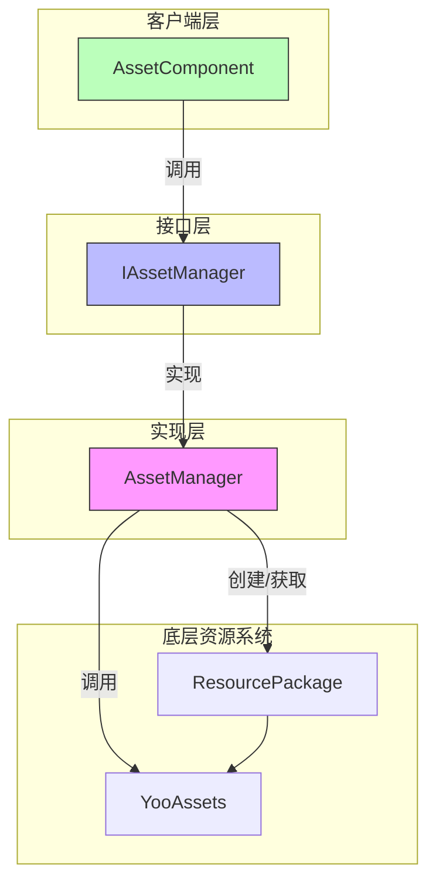
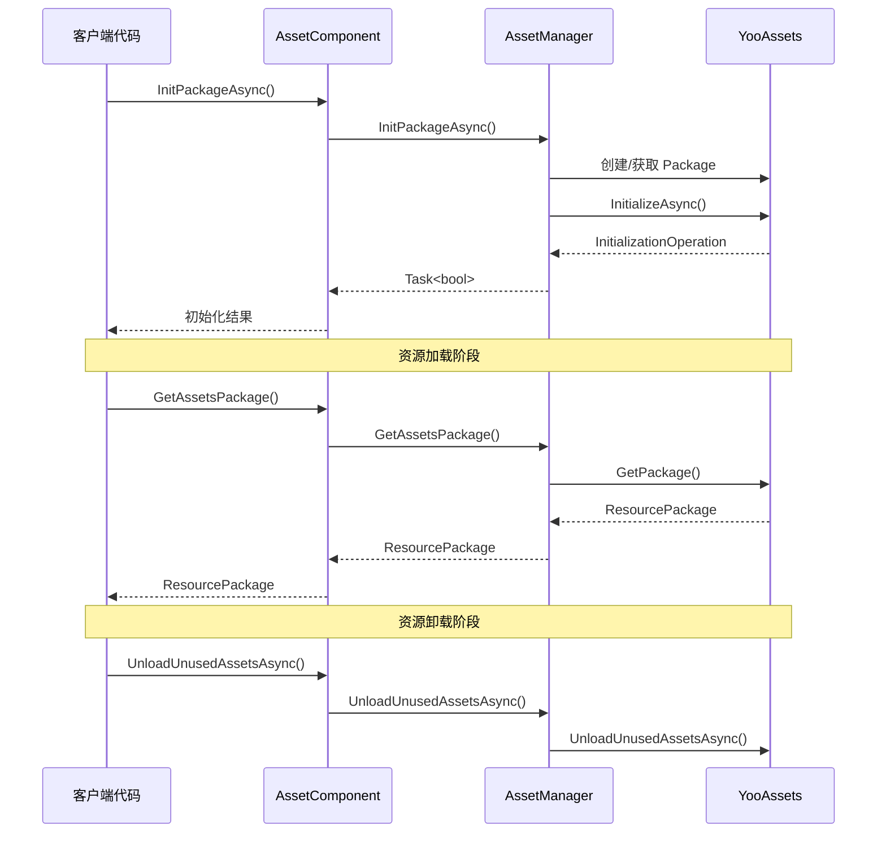

# 资源包管理

资源包管理 API 提供了对资源包（ResourcePackage）的完整生命周期管理能力，包括包的创建、初始化、获取、卸载等操作。该模块基于 YooAssets 库构建，为 GameFrameX 提供了统一且强大的资源包管理功能。

## 概述

资源包（ResourcePackage）是 GameFrameX 资源系统中用于组织和管理资源的核心概念。每个资源包代表一个独立的资源集合，可以拥有自己的下载地址、初始化方式和资源加载规则。通过资源包管理 API，开发者可以：

- 创建多个独立的资源包以实现资源的模块化管理
- 为每个资源包配置不同的远程服务器地址
- 设置默认资源包以简化加载接口的使用
- 灵活地控制资源的加载和卸载时机

系统支持同时管理多个资源包，但同一时间只能设置一个默认包。默认包可以使用简化的加载接口，无需显式指定包名。

> 注意：默认资源包名称为 `DefaultPackage`，定义在 `AssetManager.ConstDefaultPackageName` 常量中。

## 架构

资源包管理的架构采用了典型的分层设计模式，通过接口抽象实现了底层 YooAssets 的封装：



**组件说明：**

| 组件 | 职责 |
|------|------|
| AssetComponent | Unity 组件层，提供公开的 API 接口 |
| IAssetManager | 定义资源管理的抽象接口 |
| AssetManager | 具体实现类，负责与 YooAssets 交互 |
| ResourcePackage | YooAssets 的资源包对象 |

## 核心功能

### 资源包初始化

资源包在使用前必须先进行初始化。初始化过程会根据运行模式（PlayMode）配置不同的文件系统，并连接到远程服务器（如果需要）。

#### 异步初始化资源包

```csharp
public async Task<bool> InitPackageAsync(string packageName, string host, string fallbackHostServer, bool isDefaultPackage = false)
```

> Source: [AssetComponent.cs](https://github.com/GameFrameX/com.gameframex.unity.asset/blob/main/Runtime/Asset/AssetComponent.cs#L80-L95)

**参数说明：**
- `packageName` (string): 资源包名称，用于标识和获取该资源包
- `host` (string): 主下载地址，用于下载远程资源
- `fallbackHostServer` (string): 备用下载地址，当主地址不可用时使用
- `isDefaultPackage` (bool): 是否设置为默认包，默认为 false

**返回值：** 
- `Task<bool>`: 初始化是否成功

**使用示例：**

```csharp
var assetComponent = GameEntry.GetComponent<AssetComponent>();
bool success = await assetComponent.InitPackageAsync(
    "MyPackage", 
    "https://cdn.example.com/assets", 
    "https://backup.example.com/assets", 
    true
);
```

初始化过程会根据当前设置的运行模式（EPlayMode）选择不同的初始化策略：

- **EditorSimulateMode**: 编辑器模拟模式，使用编辑器内的模拟资源
- **OfflinePlayMode**: 单机运行模式，仅使用内置资源
- **HostPlayMode**: 联机运行模式，支持远程资源下载和热更新
- **WebPlayMode**: WebGL 运行模式，针对 Web 平台优化

> 运行模式的详细说明请参阅 [运行模式](./6-configuration.play-modes) 文档。

### 资源包创建与获取

#### 创建资源包

```csharp
public ResourcePackage CreateAssetsPackage(string packageName)
```

> Source: [AssetComponent.cs](https://github.com/GameFrameX/com.gameframex.unity.asset/blob/main/Runtime/Asset/AssetComponent.cs#L471-L474)

创建一个新的资源包。如果包已存在，则返回已存在的包实例。

**参数：**
- `packageName` (string): 资源包名称

**返回值：**
- ResourcePackage: 创建的资源包对象

#### 尝试获取资源包

```csharp
public ResourcePackage TryGetAssetsPackage(string packageName)
```

> Source: [AssetComponent.cs](https://github.com/GameFrameX/com.gameframex.unity.asset/blob/main/Runtime/Asset/AssetComponent.cs#L482-L485)

安全获取资源包，如果包不存在则返回 null 而不会抛出异常。

**参数：**
- `packageName` (string): 资源包名称

**返回值：**
- ResourcePackage: 资源包对象，如果不存在则返回 null

#### 检查资源包是否存在

```csharp
public bool HasAssetsPackage(string packageName)
```

> Source: [AssetComponent.cs](https://github.com/GameFrameX/com.gameframex.unity.asset/blob/main/Runtime/Asset/AssetComponent.cs#L493-L496)

检查指定名称的资源包是否已创建。

**参数：**
- `packageName` (string): 资源包名称

**返回值：**
- bool: 是否存在

#### 获取资源包

```csharp
public ResourcePackage GetAssetsPackage(string packageName)
```

> Source: [AssetComponent.cs](https://github.com/GameFrameX/com.gameframex.unity.asset/blob/main/Runtime/Asset/AssetComponent.cs#L504-L507)

获取指定名称的资源包。如果包不存在，将抛出异常。

**参数：**
- `packageName` (string): 资源包名称

**返回值：**
- ResourcePackage: 资源包对象

### 默认资源包

#### 设置默认资源包

```csharp
public void SetDefaultAssetsPackage(ResourcePackage assetsPackage)
```

> Source: [AssetComponent.cs](https://github.com/GameFrameX/com.gameframex.unity.asset/blob/main/Runtime/Asset/AssetComponent.cs#L581-L584)

设置默认资源包。设置后，加载资源时无需显式指定包名，系统会自动从默认包中加载。

**参数：**
- `assetsPackage` (ResourcePackage): 要设置为默认的资源包

**使用示例：**

```csharp
var assetComponent = GameEntry.GetComponent<AssetComponent>();
var package = assetComponent.GetAssetsPackage("MyPackage");
assetComponent.SetDefaultAssetsPackage(package);
// 之后可以使用简化的加载接口
var handle = await assetComponent.LoadAssetAsync("Prefabs/Player");
```

## 资源卸载与清理

GameFrameX 提供了多层次的资源卸载和清理机制，以满足不同场景的需求。

### 卸载单个资源

```csharp
public void UnloadAsset(string assetPath)
public void UnloadAsset(string packageName, string assetPath)
```

> Source: [AssetComponent.cs](https://github.com/GameFrameX/com.gameframex.unity.asset/blob/main/Runtime/Asset/AssetComponent.cs#L602-L615)

卸载指定路径的资源。

**参数：**
- `packageName` (string): 资源包名称（可选，不指定则使用默认包）
- `assetPath` (string): 资源路径

### 强制回收所有资源

```csharp
public void UnloadAllAssetsAsync(string packageName)
```

> Source: [AssetComponent.cs](https://github.com/GameFrameX/com.gameframex.unity.asset/blob/main/Runtime/Asset/AssetComponent.cs#L591-L594)

强制回收指定资源包中的所有已加载资源。此操作会立即释放所有资源内存，应谨慎使用。

**参数：**
- `packageName` (string): 资源包名称

### 卸载无用资源

```csharp
public void UnloadUnusedAssetsAsync(string packageName = null)
```

> Source: [AssetComponent.cs](https://github.com/GameFrameX/com.gameframex.unity.asset/blob/main/Runtime/Asset/AssetComponent.cs#L635-L638)

卸载未被引用的资源。这是推荐使用的资源释放方式，系统会自动识别并释放不再使用的资源。

**参数：**
- `packageName` (string): 资源包名称，为 null 时清理默认包

### 清理资源文件

```csharp
public void ClearAllBundleFilesAsync(string packageName = null)
public void ClearUnusedBundleFilesAsync(string packageName = null)
```

> Source: [AssetComponent.cs](https://github.com/GameFrameX/com.gameframex.unity.asset/blob/main/Runtime/Asset/AssetComponent.cs#L645-L658)

清理本地缓存的资源包文件。

- `ClearAllBundleFilesAsync`: 清理所有资源文件
- `ClearUnusedBundleFilesAsync`: 仅清理未被使用的资源文件

**参数：**
- `packageName` (string): 资源包名称，为 null 时清理默认包

## 使用流程

以下是多资源包场景的典型使用流程：



## 典型使用场景

### 场景一：DLC 资源包管理

在游戏发布后需要动态加载额外的 DLC 内容时，可以使用独立的资源包：

```csharp
var assetComponent = GameEntry.GetComponent<AssetComponent>();

// 初始化 DLC 资源包
await assetComponent.InitPackageAsync(
    "DLC_LevelPack1",
    "https://cdn.example.com/dlc/levelpack1",
    "https://backup.example.com/dlc/levelpack1"
);

// 获取 DLC 包并加载资源
var dlcPackage = assetComponent.GetAssetsPackage("DLC_LevelPack1");
assetComponent.SetDefaultAssetsPackage(dlcPackage);

var levelHandle = await assetComponent.LoadAssetAsync<Scene>("Levels/Level01");
```

### 场景二：资源热更新

使用联机模式时，资源包用于管理热更新资源：

```csharp
var assetComponent = GameEntry.GetComponent<AssetComponent>();

// 初始化默认包（用于热更新）
bool success = await assetComponent.InitPackageAsync(
    "HotUpdate",
    "https://gamecdn.example.com/hotupdate",
    "https://backup.example.com/hotupdate",
    true
);

if (success)
{
    Debug.Log("热更新资源包初始化成功");
}
```

### 场景三：资源清理

在切换游戏场景或进入特定流程时清理不需要的资源：

```csharp
var assetComponent = GameEntry.GetComponent<AssetComponent>();

// 卸载未使用的资源（推荐）
assetComponent.UnloadUnusedAssetsAsync();

// 或者清理特定资源包的所有缓存
assetComponent.ClearUnusedBundleFilesAsync("OldDLC");
```

## API 参考

### AssetComponent

| 方法 | 返回类型 | 描述 |
|------|----------|------|
| InitPackageAsync | Task\<bool\> | 异步初始化资源包 |
| CreateAssetsPackage | ResourcePackage | 创建资源包 |
| TryGetAssetsPackage | ResourcePackage | 尝试获取资源包（安全） |
| HasAssetsPackage | bool | 检查资源包是否存在 |
| GetAssetsPackage | ResourcePackage | 获取资源包 |
| SetDefaultAssetsPackage | void | 设置默认资源包 |
| UnloadAsset | void | 卸载指定资源 |
| UnloadAllAssetsAsync | void | 强制回收所有资源 |
| UnloadUnusedAssetsAsync | void | 卸载无用资源 |
| ClearAllBundleFilesAsync | void | 清理所有资源文件 |
| ClearUnusedBundleFilesAsync | void | 清理无用资源文件 |

### IAssetManager

| 属性 | 类型 | 描述 |
|------|------|------|
| DefaultPackageName | string | 默认资源包名称 |
| PlayMode | EPlayMode | 当前运行模式 |
| VerifyLevel | EFileVerifyLevel | 文件验证等级 |
| Milliseconds | long | 异步系统时间片 |

> 完整的接口定义请参阅 [IAssetManager.cs](https://github.com/GameFrameX/com.gameframex.unity.asset/blob/main/Runtime/Asset/IAssetManager.cs)

## 相关链接

- [资源加载接口](./5-api-reference.loading-api) - 了解如何在包中加载资源
- [运行模式](./6-configuration.play-modes) - 了解不同的运行模式配置
- [资源组件](./4-core-concepts.asset-component) - 了解 AssetComponent 组件
- [架构设计](./4-core-concepts.architecture) - 了解整体架构设计
