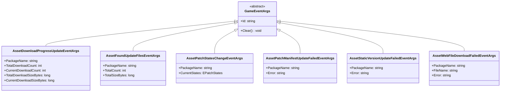
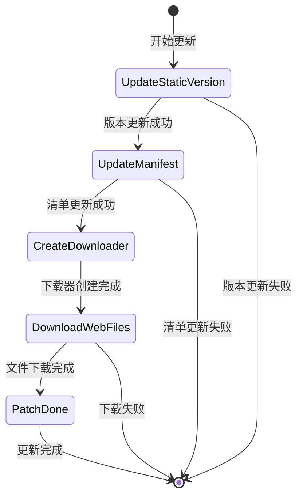

# 更新事件

资源系统提供的更新事件机制，允许开发者在资源热更新过程中监听关键节点并执行自定义逻辑。

## 概述

在资源热更新流程中，系统会触发多种事件来通知当前更新的进度和状态。这些事件基于 GameFrameX 的事件系统构建，遵循发布-订阅模式。开发者可以通过订阅这些事件来实现：
- 显示更新进度 UI
- 统计下载数据
- 处理更新失败情况
- 执行自定义业务逻辑

所有更新事件都继承自 `GameEventArgs` 基类，每个事件具有唯一的事件 ID（EventId），用于事件订阅和分发。

## 事件体系架构



## 更新流程状态

更新流程由 `EPatchStates` 枚举定义，包含以下五个状态：



| 状态 | 描述 |
|------|------|
| UpdateStaticVersion | 更新静态资源版本号 |
| UpdateManifest | 更新补丁清单文件 |
| CreateDownloader | 创建下载器 |
| DownloadWebFiles | 下载远程文件 |
| PatchDone | 补丁流程完毕 |

## 事件详细说明

### 下载进度更新事件 (AssetDownloadProgressUpdateEventArgs)

在资源下载过程中实时触发，用于报告当前下载进度。

> Source: [Runtime/Update/EventArgs/AssetDownloadProgressUpdateEventArgs.cs](https://github.com/GameFrameX/com.gameframex.unity.asset/blob/main/Runtime/Update/EventArgs/AssetDownloadProgressUpdateEventArgs.cs#L1-L77)

**事件ID:**
```csharp
public static readonly string EventId = typeof(AssetDownloadProgressUpdateEventArgs).FullName;
```

**属性说明:**

| 属性 | 类型 | 描述 |
|------|------|------|
| PackageName | string | 资源包名称 |
| TotalDownloadCount | int | 总下载数量 |
| CurrentDownloadCount | int | 当前已下载数量 |
| TotalDownloadSizeBytes | long | 总下载大小（字节） |
| CurrentDownloadSizeBytes | long | 当前已下载大小（字节） |

**创建方法:**
```csharp
public static AssetDownloadProgressUpdateEventArgs Create(
    string packageName, 
    int totalDownloadCount, 
    int currentDownloadCount, 
    long totalDownloadSizeBytes, 
    long currentDownloadSizeBytes)
```

### 发现更新文件事件 (AssetFoundUpdateFilesEventArgs)

当系统扫描并发现需要更新的文件时触发，携带待更新文件的统计信息。

> Source: [Runtime/Update/EventArgs/AssetFoundUpdateFilesEventArgs.cs](https://github.com/GameFrameX/com.gameframex.unity.asset/blob/main/Runtime/Update/EventArgs/AssetFoundUpdateFilesEventArgs.cs#L1-L60)

**事件ID:**
```csharp
public static readonly string EventId = typeof(AssetFoundUpdateFilesEventArgs).FullName;
```

**属性说明:**

| 属性 | 类型 | 描述 |
|------|------|------|
| PackageName | string | 资源包名称 |
| TotalCount | int | 需要更新的文件总数量 |
| TotalSizeBytes | long | 需要更新的文件总大小（字节） |

**创建方法:**
```csharp
public static AssetFoundUpdateFilesEventArgs Create(
    string packageName, 
    int totalCount, 
    long totalSizeBytes)
```

### 补丁流程状态变更事件 (AssetPatchStatesChangeEventArgs)

当资源更新流程进入新的状态阶段时触发，用于通知当前更新进度。

> Source: [Runtime/Update/EventArgs/AssetPatchStatesChangeEventArgs.cs](https://github.com/GameFrameX/com.gameframex.unity.asset/blob/main/Runtime/Update/EventArgs/AssetPatchStatesChangeEventArgs.cs#L1-L49)

**事件ID:**
```csharp
public static readonly string EventId = typeof(AssetPatchStatesChangeEventArgs).FullName;
```

**属性说明:**

| 属性 | 类型 | 描述 |
|------|------|------|
| PackageName | string | 资源包名称 |
| CurrentStates | EPatchStates | 当前更新状态 |

**创建方法:**
```csharp
public static AssetPatchStatesChangeEventArgs Create(
    string packageName, 
    EPatchStates currentStates)
```

### 补丁清单更新失败事件 (AssetPatchManifestUpdateFailedEventArgs)

当补丁清单文件更新失败时触发，包含错误信息。

> Source: [Runtime/Update/EventArgs/AssetPatchManifestUpdateFailedEventArgs.cs](https://github.com/GameFrameX/com.gameframex.unity.asset/blob/main/Runtime/Update/EventArgs/AssetPatchManifestUpdateFailedEventArgs.cs#L1-L52)

**事件ID:**
```csharp
public static readonly string EventId = typeof(AssetPatchManifestUpdateFailedEventArgs).FullName;
```

**属性说明:**

| 属性 | 类型 | 描述 |
|------|------|------|
| PackageName | string | 资源包名称 |
| Error | string | 错误信息 |

**创建方法:**
```csharp
public static AssetPatchManifestUpdateFailedEventArgs Create(
    string packageName, 
    string error)
```

### 资源版本号更新失败事件 (AssetStaticVersionUpdateFailedEventArgs)

当资源版本号更新失败时触发，包含错误信息。

> Source: [Runtime/Update/EventArgs/AssetStaticVersionUpdateFailedEventArgs.cs](https://github.com/GameFrameX/com.gameframex.unity.asset/blob/main/Runtime/Update/EventArgs/AssetStaticVersionUpdateFailedEventArgs.cs#L1-L52)

**事件ID:**
```csharp
public static readonly string EventId = typeof(AssetStaticVersionUpdateFailedEventArgs).FullName;
```

**属性说明:**

| 属性 | 类型 | 描述 |
|------|------|------|
| PackageName | string | 资源包名称 |
| Error | string | 错误信息 |

**创建方法:**
```csharp
public static AssetStaticVersionUpdateFailedEventArgs Create(
    string packageName, 
    string error)
```

### 网络文件下载失败事件 (AssetWebFileDownloadFailedEventArgs)

当某个资源文件下载失败时触发，包含文件名和错误信息。

> Source: [Runtime/Update/EventArgs/AssetWebFileDownloadFailedEventArgs.cs](https://github.com/GameFrameX/com.gameframex.unity.asset/blob/main/Runtime/Update/EventArgs/AssetWebFileDownloadFailedEventArgs.cs#L1-L60)

**事件ID:**
```csharp
public static readonly string EventId = typeof(AssetWebFileDownloadFailedEventArgs).FullName;
```

**属性说明:**

| 属性 | 类型 | 描述 |
|------|------|------|
| PackageName | string | 资源包名称 |
| FileName | string | 下载失败的文件名 |
| Error | string | 错误信息 |

**创建方法:**
```csharp
public static AssetWebFileDownloadFailedEventArgs Create(
    string packageName, 
    string fileName, 
    string error)
```

## 使用示例

### 订阅更新状态变化事件

```csharp
// 订阅补丁流程状态变更事件
GameEntry.Event.Subscribe(AssetPatchStatesChangeEventArgs.EventId, OnPatchStatesChange);

private void OnPatchStatesChange(object sender, AssetPatchStatesChangeEventArgs e)
{
    switch (e.CurrentStates)
    {
        case EPatchStates.UpdateStaticVersion:
            Debug.Log("正在更新资源版本号...");
            break;
        case EPatchStates.UpdateManifest:
            Debug.Log("正在更新补丁清单...");
            break;
        case EPatchStates.CreateDownloader:
            Debug.Log("正在创建下载器...");
            break;
        case EPatchStates.DownloadWebFiles:
            Debug.Log("正在下载远程文件...");
            break;
        case EPatchStates.PatchDone:
            Debug.Log("更新完成！");
            break;
    }
}
```

> Source: [Runtime/Update/EventArgs/AssetPatchStatesChangeEventArgs.cs](https://github.com/GameFrameX/com.gameframex.unity.asset/blob/main/Runtime/Update/EventArgs/AssetPatchStatesChangeEventArgs.cs#L35-L47)

### 订阅下载进度更新事件

```csharp
// 订阅下载进度更新事件
GameEntry.Event.Subscribe(AssetDownloadProgressUpdateEventArgs.EventId, OnDownloadProgress);

private void OnDownloadProgress(object sender, AssetDownloadProgressUpdateEventArgs e)
{
    float progress = (float)e.CurrentDownloadCount / e.TotalDownloadCount;
    long downloadedSize = e.CurrentDownloadSizeBytes / 1024 / 1024; // MB
    long totalSize = e.TotalDownloadSizeBytes / 1024 / 1024; // MB
    
    Debug.Log($"下载进度: {progress * 100:F1}% ({e.CurrentDownloadCount}/{e.TotalDownloadCount}) - {downloadedSize}MB / {totalSize}MB");
}
```

> Source: [Runtime/Update/EventArgs/AssetDownloadProgressUpdateEventArgs.cs](https://github.com/GameFrameX/com.gameframex.unity.asset/blob/main/Runtime/Update/EventArgs/AssetDownloadProgressUpdateEventArgs.cs#L60-L75)

### 订阅发现更新文件事件

```csharp
// 订阅发现更新文件事件
GameEntry.Event.Subscribe(AssetFoundUpdateFilesEventArgs.EventId, OnFoundUpdateFiles);

private void OnFoundUpdateFiles(object sender, AssetFoundUpdateFilesEventArgs e)
{
    long totalSizeMB = e.TotalSizeBytes / 1024 / 1024;
    Debug.Log($"发现 {e.TotalCount} 个需要更新的文件，总大小: {totalSizeMB}MB");
}
```

> Source: [Runtime/Update/EventArgs/AssetFoundUpdateFilesEventArgs.cs](https://github.com/GameFrameX/com.gameframex.unity.asset/blob/main/Runtime/Update/EventArgs/AssetFoundUpdateFilesEventArgs.cs#L44-L58)

### 订阅错误事件

```csharp
// 订阅版本号更新失败事件
GameEntry.Event.Subscribe(AssetStaticVersionUpdateFailedEventArgs.EventId, OnStaticVersionUpdateFailed);

// 订阅清单更新失败事件
GameEntry.Event.Subscribe(AssetPatchManifestUpdateFailedEventArgs.EventId, OnManifestUpdateFailed);

// 订阅文件下载失败事件
GameEntry.Event.Subscribe(AssetWebFileDownloadFailedEventArgs.EventId, OnFileDownloadFailed);

private void OnStaticVersionUpdateFailed(object sender, AssetStaticVersionUpdateFailedEventArgs e)
{
    Debug.LogError($"资源版本号更新失败: {e.Error}");
    // 可以在这里显示错误提示或执行重试逻辑
}

private void OnManifestUpdateFailed(object sender, AssetPatchManifestUpdateFailedEventArgs e)
{
    Debug.LogError($"补丁清单更新失败: {e.Error}");
}

private void OnFileDownloadFailed(object sender, AssetWebFileDownloadFailedEventArgs e)
{
    Debug.LogError($"文件下载失败: {e.FileName}, 错误: {e.Error}");
}
```

> Sources:
> - [Runtime/Update/EventArgs/AssetStaticVersionUpdateFailedEventArgs.cs](https://github.com/GameFrameX/com.gameframex.unity.asset/blob/main/Runtime/Update/EventArgs/AssetStaticVersionUpdateFailedEventArgs.cs#L38-L50)
> - [Runtime/Update/EventArgs/AssetPatchManifestUpdateFailedEventArgs.cs](https://github.com/GameFrameX/com.gameframex.unity.asset/blob/main/Runtime/Update/EventArgs/AssetPatchManifestUpdateFailedEventArgs.cs#L38-L50)
> - [Runtime/Update/EventArgs/AssetWebFileDownloadFailedEventArgs.cs](https://github.com/GameFrameX/com.gameframex.unity.asset/blob/main/Runtime/Update/EventArgs/AssetWebFileDownloadFailedEventArgs.cs#L44-L58)

## 事件使用注意事项

1. **事件订阅时机**：建议在游戏启动时或资源系统初始化前订阅事件，确保不会遗漏任何更新事件。

2. **事件取消订阅**：在合适的时机（如场景切换或组件销毁）取消事件订阅，避免内存泄漏。

3. **对象池机制**：所有事件参数类都实现了对象池模式，使用 `Create` 方法从池中获取实例，使用后会自动回收。开发者无需手动管理其生命周期。

4. **错误处理**：强烈建议订阅错误类型的事件，以便在更新失败时能够及时感知并做出相应处理（如提示用户重试）。

5. **进度计算**：`AssetDownloadProgressUpdateEventArgs` 提供了字节级别的下载进度，可用于实现精细的下载进度显示。

## 相关链接

- [资源加载接口](./5-api-reference.loading-api)
- [资源包管理](./5-api-reference.package-management)
- [运行模式](./6-configuration.play-modes)
- [核心概念 - 资源管理器](./4-core-concepts.asset-manager)
