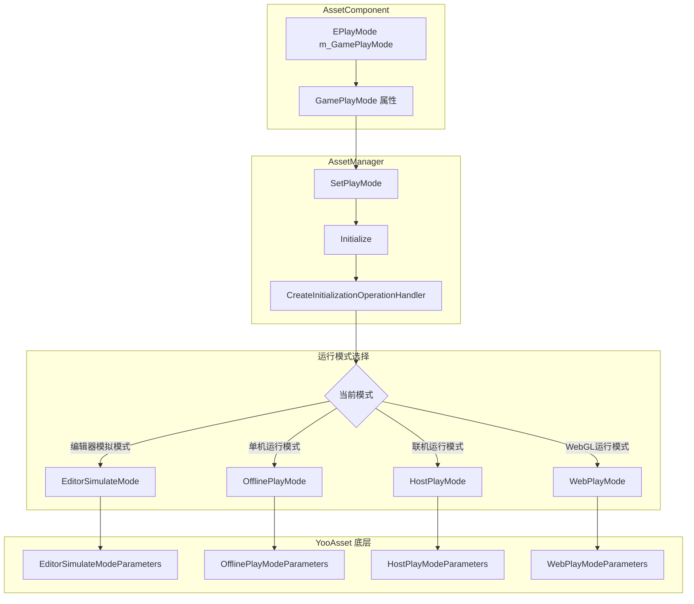
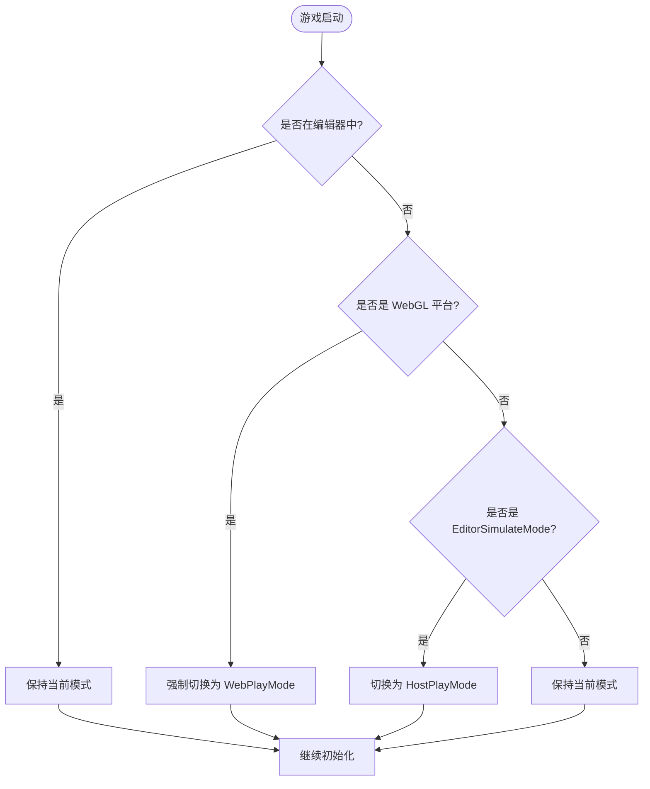

# 运行模式

运行模式定义了资源系统在游戏启动时如何初始化和加载资源。根据不同的开发和部署场景，GameFrameX 提供了四种运行模式供选择。

## 概述

资源系统的运行模式决定了资源的加载方式和数据来源。正确选择运行模式对于游戏的开发和发布至关重要：

- **EditorSimulateMode**：仅在 Unity 编辑器中使用，用于快速开发和调试
- **OfflinePlayMode**：单机游戏模式，无需网络连接
- **HostPlayMode**：热更新模式，支持从远程服务器更新资源
- **WebPlayMode**：WebGL 及小游戏平台专用模式

> **注意**：当目标平台为 WebGL 时，系统会自动将运行模式强制设置为 `EPlayMode.WebPlayMode`，无法手动更改。

## 架构设计



### 组件职责

| 组件 | 职责 |
|------|------|
| AssetComponent | 存储运行模式配置，在运行时自动检测平台并调整模式 |
| AssetManager | 根据运行模式创建相应的初始化参数，并完成资源系统初始化 |
| YooAsset | 底层资源系统，根据不同的参数类型执行对应的初始化逻辑 |

## 各运行模式详解

### 1. 编辑器模拟模式 (EditorSimulateMode)

编辑器模拟模式仅在 Unity 编辑器环境中运行，不打包到最终发布的游戏包中。该模式使用 `EditorSimulateModeParameters` 进行初始化：

```csharp
// Source: Runtime/Asset/AssetManager.Initialization.cs#L55-L60
private InitializationOperation InitializeYooAssetEditorSimulateMode(ResourcePackage resourcePackage)
{
    var simulateBuildResult = EditorSimulateModeHelper.SimulateBuild(nameof(EDefaultBuildPipeline.BuiltinBuildPipeline), ConstDefaultPackageName);
    var createParameters = new EditorSimulateModeParameters();
    createParameters.EditorFileSystemParameters = FileSystemParameters.CreateDefaultEditorFileSystemParameters(simulateBuildResult);
    return resourcePackage.InitializeAsync(createParameters);
}
```

**特点**：
- 不需要执行资源打包操作
- 直接从编辑器中的源资源文件加载
- 加载速度最快，适合快速迭代开发
- 打包发布时会自动切换到其他模式

**使用场景**：
- 编辑器下的功能开发和调试
- 快速验证资源加载逻辑

### 2. 单机运行模式 (OfflinePlayMode)

单机运行模式用于完全离线的游戏场景，所有资源都打包在游戏安装包内。该模式使用 `OfflinePlayModeParameters` 进行初始化：

```csharp
// Source: Runtime/Asset/AssetManager.Initialization.cs#L69-L74
private InitializationOperation InitializeYooAssetOfflinePlayMode(ResourcePackage resourcePackage)
{
    var buildinFileSystem = FileSystemParameters.CreateDefaultBuildinFileSystemParameters();
    var initParameters = new OfflinePlayModeParameters();
    initParameters.BuildinFileSystemParameters = buildinFileSystem;
    return resourcePackage.InitializeAsync(initParameters);
}
```

**特点**：
- 无需网络连接
- 资源从应用内置的只读区域（StreamingAssets）加载
- 不支持运行时资源更新
- 适合单机游戏或网络环境不稳定的场景

**使用场景**：
- 单机游戏
- 无需热更新的独立游戏
- 网络环境受限的发布平台

### 3. 联机运行模式 (HostPlayMode)

联机运行模式（热更新模式）是大型游戏最常用的模式，支持资源的热更新。该模式使用 `HostPlayModeParameters` 进行初始化：

```csharp
// Source: Runtime/Asset/AssetManager.Initialization.cs#L155-L163
private InitializationOperation InitializeYooAssetHostPlayMode(ResourcePackage resourcePackage, string hostServerURL, string fallbackHostServerURL)
{
    var remoteServices = new RemoteServices(hostServerURL, fallbackHostServerURL);
    var createParameters = new HostPlayModeParameters
    {
        BuildinFileSystemParameters = FileSystemParameters.CreateDefaultBuildinFileSystemParameters(),
        CacheFileSystemParameters = FileSystemParameters.CreateDefaultCacheFileSystemParameters(remoteServices),
    };
    return resourcePackage.InitializeAsync(createParameters);
}
```

**特点**：
- 支持资源的热更新功能
- 优先从远程服务器下载最新资源
- 内置资源作为后备方案
- 支持断点续传和缓存管理

**使用场景**：
- 需要持续更新内容的网络游戏
- 需要分批下载资源的大型游戏
- 希望通过热更新修复 bug 或添加新内容的游戏

### 4. WebGL 运行模式 (WebPlayMode)

WebGL 运行模式专门为 WebGL 平台和小游戏平台设计，支持多种小游戏平台的文件系统：

```csharp
// Source: Runtime/Asset/AssetManager.Initialization.cs#L85-L145
private InitializationOperation InitializeYooAssetWebPlayMode(ResourcePackage resourcePackage, string hostServerURL, string fallbackHostServerURL)
{
    var initParameters = new WebPlayModeParameters();
    FileSystemSystemParameters webFileSystem = null;
#if UNITY_WEBGL
#if ENABLE_DOUYIN_MINI_GAME
    // 字节小游戏文件系统
    webFileSystem = ByteGameFileSystemCreater.CreateByteGameFileSystemParameters(hostServerURL);
#elif ENABLE_WECHAT_MINI_GAME
    // 微信小游戏文件系统
    webFileSystem = WechatFileSystemCreater.CreateWechatPathFileSystemParameters(hostServerURL);
#elif ENABLE_KUAISHOU_MINI_GAME
    // 快手小游戏文件系统
    webFileSystem = KuaiShouFileSystemCreater.CreateKuaiShouPathFileSystemParameters(hostServerURL);
#else
    // 默认 WebGL 文件系统
    webFileSystem = FileSystemParameters.CreateDefaultWebFileSystemParameters();
#endif
#else
    webFileSystem = FileSystemParameters.CreateDefaultWebFileSystemParameters();
#endif
    initParameters.WebFileSystemParameters = webFileSystem;
    return resourcePackage.InitializeAsync(initParameters);
}
```

**支持的平台**：
- WebGL 浏览器平台
- 抖音小游戏 (ByteDance Mini Game)
- 微信小游戏 (WeChat Mini Game)
- 快手小游戏 (Kuaishou Mini Game)

**特点**：
- 自动检测目标平台并选择合适的文件系统
- 针对小游戏平台的特殊优化
- 支持小游戏平台特有的预加载机制

## 平台自动切换逻辑

系统在运行时自动处理平台兼容性问题：

```csharp
// Source: Runtime/Asset/AssetComponent.cs#L42-L63
protected override void Awake()
{
#if !UNITY_EDITOR
    if (GamePlayMode == EPlayMode.EditorSimulateMode)
    {
        GamePlayMode = EPlayMode.HostPlayMode;
    }
#if UNITY_WEBGL
    GamePlayMode = EPlayMode.WebPlayMode;
#endif
#endif
    // ... 其他初始化代码
    _assetManager.SetPlayMode(GamePlayMode);
}
```



## 配置说明

运行模式通过 Unity 场景中的 AssetComponent 组件进行配置：

```csharp
// Source: Runtime/Asset/AssetComponent.cs#L18-L31
[Tooltip("当目标平台为Web平台时，将会强制设置为 WebPlayMode")] [SerializeField]
private EPlayMode m_GamePlayMode;

/// <summary>
/// 资源的运行模式
/// </summary>
public EPlayMode GamePlayMode
{
    get { return m_GamePlayMode; }
    set { m_GamePlayMode = value; }
}
```

### 配置属性

| 属性 | 类型 | 说明 |
|------|------|------|
| GamePlayMode | EPlayMode | 资源的运行模式 |

### EPlayMode 枚举值

| 枚举值 | 说明 |
|--------|------|
| EditorSimulateMode | 编辑器模拟模式，仅编辑器可用 |
| OfflinePlayMode | 单机运行模式 |
| HostPlayMode | 联机运行模式（热更新模式） |
| WebPlayMode | WebGL 运行模式 |

## 使用建议

### 开发阶段

- 在 Unity 编辑器中使用 **EditorSimulateMode**，可以快速迭代开发
- 配合资源打包工具进行完整的打包测试

### 测试阶段

- 使用 **OfflinePlayMode** 进行完整的离线功能测试
- 使用 **HostPlayMode** 测试热更新流程

### 发布阶段

- 根据目标平台选择合适的运行模式
- WebGL 平台会自动使用 WebPlayMode，无需手动设置
- 移动端网络游戏建议使用 HostPlayMode

## 相关链接

- [资源组件](./4-core-concepts.asset-component)
- [资源管理器](./4-core-concepts.asset-manager)
- [架构设计](./4-core-concepts.architecture)
- [组件配置](./6-configuration.component-settings)
- [WebGL 平台配置](./7-platforms.webgl)
