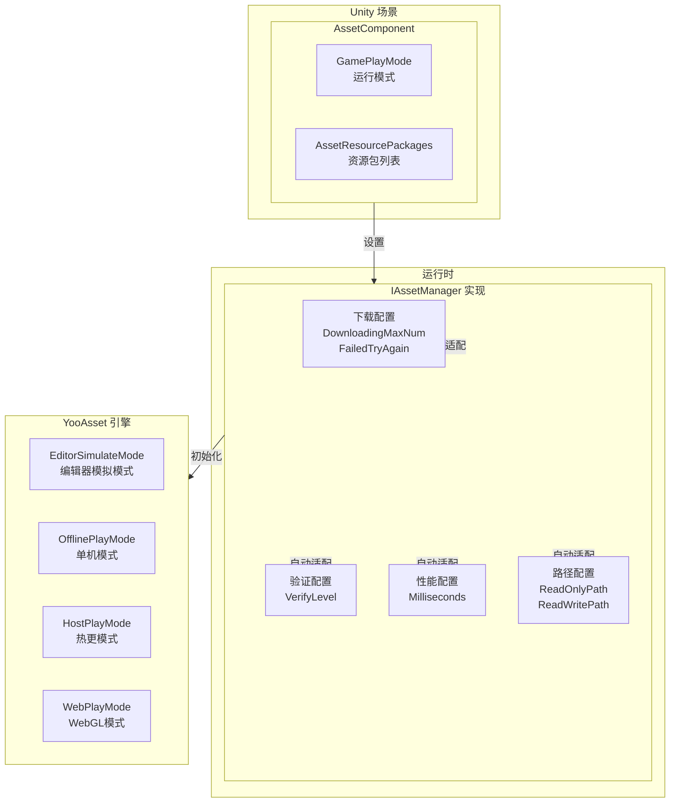
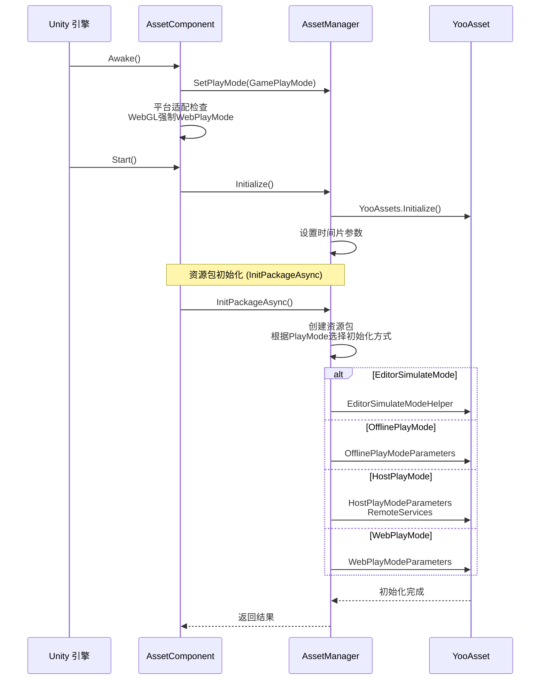

# 组件配置

AssetComponent 是 GameFrameX 资源系统的核心 Unity 组件，负责配置和管理资源的运行时行为。通过该组件，开发者可以灵活配置资源加载模式、下载参数、资源包信息等关键配置。

## 概述

AssetComponent 继承自 GameFrameworkComponent，是 Unity 场景中的核心组件，用于初始化和管理资源系统。该组件通过 Unity Inspector 面板进行配置，支持多种运行模式，能够根据不同平台自动适配最佳的资源加载策略。



**配置流程说明：**
1. 在 Unity Inspector 中配置 AssetComponent 的运行模式和资源包信息
2. AssetComponent 在 Awake 阶段获取配置并传递给 AssetManager
3. AssetManager 根据配置初始化 YooAsset 引擎
4. 系统根据运行模式选择合适的资源加载策略

## 核心配置属性

### 运行模式配置

AssetComponent 提供了 `GamePlayMode` 属性，用于设置资源的运行模式：

```csharp
[Tooltip("当目标平台为Web平台时，将会强制设置为" + nameof(EPlayMode.WebPlayMode))] [SerializeField]
private EPlayMode m_GamePlayMode;
```
> Source: [Runtime/Asset/AssetComponent.cs](https://github.com/GameFrameX/com.gameframex.unity.asset/blob/main/Runtime/Asset/AssetComponent.cs#L20-L21)

**运行模式说明：**

| 模式 | 枚举值 | 说明 | 适用场景 |
|------|--------|------|----------|
| 编辑器模拟模式 | `EPlayMode.EditorSimulateMode` | 在 Unity 编辑器中使用模拟方式加载资源，无需打包即可测试 | 开发调试阶段 |
| 单机运行模式 | `EPlayMode.OfflinePlayMode` | 使用本地内置资源文件，无需网络下载 | 纯单机游戏 |
| 联机运行模式 | `EPlayMode.HostPlayMode` | 支持热更新，从远程服务器下载资源 | 需要热更的游戏 |
| WebGL运行模式 | `EPlayMode.WebPlayMode` | 针对 WebGL 平台的特殊优化模式 | WebGL 平台 |

**平台自动适配机制：**

```csharp
protected override void Awake()
{
#if !UNITY_EDITOR
    if (GamePlayMode == EPlayMode.EditorSimulateMode)
    {
        GamePlayMode = EPlayMode.HostPlayMode;
    }
#if UNITY_WEBGL
    GamePlayMode = EPlayMode.WebPlayMode;
#endif
#endif
    // ... 后续初始化逻辑
}
```
> Source: [Runtime/Asset/AssetComponent.cs](https://github.com/GameFrameX/com.gameframex.unity.asset/blob/main/Runtime/Asset/AssetComponent.cs#L42-L64)

**自动适配规则：**
- 在非编辑器环境下，`EditorSimulateMode` 会被自动转换为 `HostPlayMode`
- 在 WebGL 平台环境下，无论配置何种模式，都会被强制设置为 `WebPlayMode`

### 资源包配置

在编辑器环境下，可以通过 `AssetResourcePackages` 配置多个资源包信息：

```csharp
#if UNITY_EDITOR
[SerializeField] private List<AssetResourcePackageInfo> m_assetResourcePackages = new List<AssetResourcePackageInfo>();
#endif
```
> Source: [Runtime/Asset/AssetComponent.cs](https://github.com/GameFrameX/com.gameframex.unity.asset/blob/main/Runtime/Asset/AssetComponent.cs#L33-L34)

**资源包信息结构：**

```csharp
[Serializable]
public sealed class AssetResourcePackageInfo
{
    [SerializeField] public string PackageName;
    [SerializeField] public string DownloadURL;
    [SerializeField] public string FallbackDownloadURL;
}
```
> Source: [Runtime/Asset/AssetComponent.cs](https://github.com/GameFrameX/com.gameframex.unity.asset/blob/main/Runtime/Asset/AssetComponent.cs#L661-L667)

| 配置项 | 类型 | 说明 |
|--------|------|------|
| PackageName | string | 资源包名称 |
| DownloadURL | string | 主下载地址 |
| FallbackDownloadURL | string | 备用下载地址 |

## 运行时配置接口

IAssetManager 接口提供了丰富的运行时配置属性，可在代码中动态调整：

```csharp
public interface IAssetManager
{
    /// <summary>
    /// 同时下载的最大数目。
    /// </summary>
    int DownloadingMaxNum { get; set; }

    /// <summary>
    /// 失败重试最大数目。
    /// </summary>
    int FailedTryAgain { get; set; }

    /// <summary>
    /// 获取或设置资源包名称。
    /// </summary>
    string DefaultPackageName { get; set; }

    /// <summary>
    /// 获取或设置下载文件校验等级。
    /// </summary>
    EFileVerifyLevel VerifyLevel { get; }

    /// <summary>
    /// 获取或设置异步系统参数，每帧执行消耗的最大时间切片（单位：毫秒）。
    /// </summary>
    long Milliseconds { get; set; }

    /// <summary>
    /// 获取资源只读区路径。
    /// </summary>
    string ReadOnlyPath { get; }

    /// <summary>
    /// 获取资源读写区路径。
    /// </summary>
    string ReadWritePath { get; }
}
```
> Source: [Runtime/Asset/IAssetManager.cs](https://github.com/GameFrameX/com.gameframex.unity.asset/blob/main/Runtime/Asset/IAssetManager.cs#L13-L76)

### 下载配置

| 配置项 | 类型 | 默认值 | 说明 |
|--------|------|--------|------|
| DownloadingMaxNum | int | - | 同时下载的最大数量，建议根据网络状况设置 |
| FailedTryAgain | int | - | 下载失败后的重试次数，建议设置为 3-5 次 |

### 验证配置

| 配置项 | 类型 | 说明 |
|--------|------|------|
| VerifyLevel | EFileVerifyLevel | 文件校验等级，用于确保下载文件的完整性 |

**校验等级说明：**
- `None` - 不进行校验
- `Low` - 轻度校验，仅校验文件是否存在
- `Medium` - 中度校验，校验文件大小和部分哈希
- `High` - 高度校验，校验完整文件哈希

### 性能配置

| 配置项 | 类型 | 默认值 | 说明 |
|--------|------|--------|------|
| Milliseconds | long | 30 | 异步系统每帧执行的最大时间切片（毫秒），用于控制每帧的资源加载时间，避免卡顿 |

### 路径配置

| 配置项 | 类型 | 说明 |
|--------|------|------|
| ReadOnlyPath | string | 资源只读区路径，通常指向 StreamingAssets |
| ReadWritePath | string | 资源读写区路径，用于存储下载的资源和缓存 |

## 配置初始化流程



**初始化代码示例：**

```csharp
public void Initialize()
{
    BetterStreamingAssets.Initialize();
    Log.Info($"资源系统运行模式：{PlayMode}");
    YooAssets.Initialize();
    YooAssets.SetOperationSystemMaxTimeSlice(30);
    Log.Info("Asset Init Over");
}
```
> Source: [Runtime/Asset/AssetManager.cs](https://github.com/GameFrameX/com.gameframex.unity.asset/blob/main/Runtime/Asset/AssetManager.cs#L46-L56)

## 编辑器配置界面

AssetComponent 提供了自定义的 Unity Inspector 编辑器界面：

```csharp
[CustomEditor(typeof(AssetComponent))]
internal sealed class AssetComponentInspector : ComponentTypeComponentInspector
{
    public override void OnInspectorGUI()
    {
        // 运行模式配置（播放时不可修改）
        EditorGUI.BeginDisabledGroup(EditorApplication.isPlayingOrWillChangePlaymode);
        {
            EditorGUILayout.PropertyField(m_GamePlayMode, m_GamePlayModeGUIContent);
            GUI.enabled = false;
            EditorGUILayout.PropertyField(m_AssetResourcePackages, m_AssetResourcePackagesGUIContent);
            GUI.enabled = true;
        }
        EditorGUI.EndDisabledGroup();
    }
}
```
> Source: [Editor/Inspector/AssetComponentInspector.cs](https://github.com/GameFrameX/com.gameframex.unity.asset/blob/main/Editor/Inspector/AssetComponentInspector.cs#L39-L79)

**配置界面特性：**
- 运行模式配置：下拉选择框，可在编辑器中直观选择
- 包列表配置：显示已配置的资源包信息（播放时禁用）
- 播放保护：进入播放模式后无法修改配置项

## 配置示例代码

### 基础配置

```csharp
// 获取 AssetComponent
var assetComponent = GameEntry.GetComponent<AssetComponent>();

// 获取当前运行模式
var playMode = assetComponent.GamePlayMode;
Debug.Log($"当前运行模式: {playMode}");
```
> Source: [Runtime/Asset/AssetComponent.cs](https://github.com/GameFrameX/com.gameframex.unity.asset/blob/main/Runtime/Asset/AssetComponent.cs#L27-L31)

### 运行时配置调整

```csharp
// 获取资源管理器
var assetManager = GameFrameworkEntry.GetModule<IAssetManager>();

// 配置下载参数
assetManager.DownloadingMaxNum = 10;  // 最多同时下载10个资源
assetManager.FailedTryAgain = 3;       // 失败重试3次

// 配置性能参数
assetManager.Milliseconds = 30;        // 每帧最多30毫秒

// 配置验证等级
assetManager.VerifyLevel = EFileVerifyLevel.Medium;

// 配置路径
assetManager.SetReadOnlyPath(Application.streamingAssetsPath);
assetManager.SetReadWritePath(Application.persistentDataPath);
```
> Source: [Runtime/Asset/AssetManager.cs](https://github.com/GameFrameX/com.gameframex.unity.asset/blob/main/Runtime/Asset/AssetManager.cs#L24-L39)

### 资源包初始化

```csharp
// 初始化默认资源包
var success = await assetComponent.InitPackageAsync(
    "DefaultPackage",                      // 包名称
    "https://cdn.example.com/assets/",      // 主下载地址
    "https://backup.example.com/assets/",  // 备用下载地址
    true                                    // 是否为默认包
);

if (success)
{
    Debug.Log("资源包初始化成功");
}
else
{
    Debug.LogError("资源包初始化失败");
}
```
> Source: [Runtime/Asset/AssetComponent.cs](https://github.com/GameFrameX/com.gameframex.unity.asset/blob/main/Runtime/Asset/AssetComponent.cs#L80-L95)

## 平台特殊配置

### WebGL 平台

在 WebGL 平台下，系统会自动处理不同小游戏平台的适配：

```csharp
// 字节小游戏
#if ENABLE_DOUYIN_MINI_GAME
GameEntry.GetComponent<AssetComponent>().gameObject.GetOrAddComponent<DouYinConfigHandler>();
#endif

// 微信小游戏
#if ENABLE_WECHAT_MINI_GAME
GameEntry.GetComponent<AssetComponent>().gameObject.GetOrAddComponent<WeChatConfigHandler>();
#endif

// 快手小游戏
#if ENABLE_KUAISHOU_MINI_GAME
GameEntry.GetComponent<AssetComponent>().gameObject.GetOrAddComponent<KuaiShouConfigHandler>();
#endif
```
> Source: [Runtime/Asset/AssetManager.Initialization.cs](https://github.com/GameFrameX/com.gameframex.unity.asset/blob/main/Runtime/Asset/AssetManager.Initialization.cs#L90-L126)

**小游戏平台特殊处理：**
- **字节小游戏**：使用字节专用文件系统，自动控制并发数量
- **微信小游戏**：使用微信文件系统，缓存到用户数据目录
- **快手小游戏**：使用快手文件系统

## 配置最佳实践

### 开发阶段

```csharp
// 开发阶段推荐配置
assetManager.DownloadingMaxNum = 5;
assetManager.FailedTryAgain = 3;
assetManager.VerifyLevel = EFileVerifyLevel.Low;
assetManager.Milliseconds = 20;
```

### 生产阶段

```csharp
// 生产阶段推荐配置
assetManager.DownloadingMaxNum = 10;
assetManager.FailedTryAgain = 5;
assetManager.VerifyLevel = EFileVerifyLevel.High;
assetManager.Milliseconds = 30;
```

### 网络环境适配

```csharp
// 弱网环境
if (Application.internetReachability == NetworkReachability.NotReachable)
{
    assetManager.GamePlayMode = EPlayMode.OfflinePlayMode;
}

// 移动网络
else if (Application.internetReachability == NetworkReachability.ReachableViaCarrierDataNetwork)
{
    assetManager.DownloadingMaxNum = 3;
}

// WiFi环境
else if (Application.internetReachability == NetworkReachability.ReachableViaLocalAreaNetwork)
{
    assetManager.DownloadingMaxNum = 10;
}
```

## 常见配置问题

### 问题 1：编辑器模式无法正常运行

**原因**：在非编辑器环境下使用了 `EditorSimulateMode`

**解决方案**：确保在打包发布时将运行模式改为 `HostPlayMode` 或 `OfflinePlayMode`

### 问题 2：WebGL 平台资源加载失败

**原因**：WebGL 平台被强制设置为 `WebPlayMode`，需要配置正确的下载服务器

**解决方案**：确保在 `InitPackageAsync` 中提供正确的 `DownloadURL` 和 `FallbackDownloadURL`

### 问题 3：资源下载速度慢

**原因**：`DownloadingMaxNum` 配置过低

**解决方案**：在 WiFi 环境下适当增大 `DownloadingMaxNum` 的值

## 相关链接

- [运行模式](./6-configuration.play-modes) - 详细了解各种运行模式的区别
- [资源加载接口](./5-api-reference.loading-api) - 资源加载 API 文档
- [资源包管理](./5-api-reference.package-management) - 资源包管理文档
- [AssetComponent API](./4-core-concepts.asset-component) - 组件核心概念
