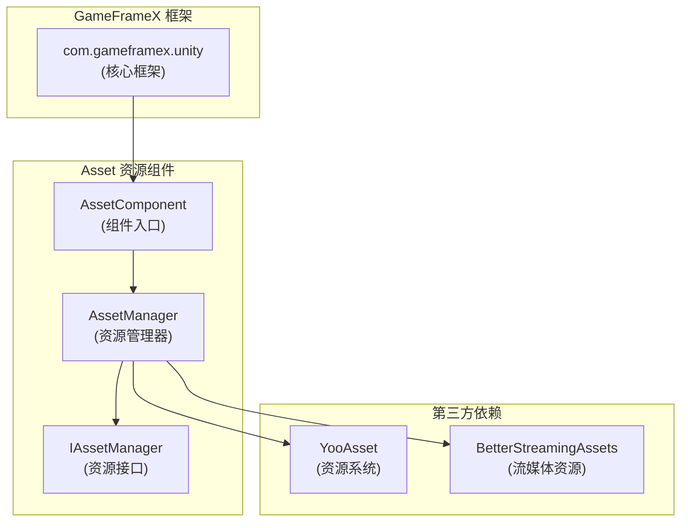

# 依赖要求

本文档详细说明 GameFrameX Asset 资源组件的依赖要求，包括 Unity 版本要求、框架依赖以及第三方依赖。

## 概述

GameFrameX Asset 资源组件是 GameFrameX 框架的核心模块之一，负责提供统一的资源管理功能。在使用该组件之前，需要确保开发环境和项目满足以下依赖要求。

## Unity 版本要求

| 项目 | 要求 |
|------|------|
| 最低 Unity 版本 | **2019.4** |
| 推荐 Unity 版本 | 2020.3 LTS 或更高 |

> Source: [package.json](https://github.com/GameFrameX/com.gameframex.unity.asset/blob/main/package.json#L7)

## 框架依赖

### 核心依赖

Asset 资源组件依赖于 GameFrameX 核心框架包，这是使用该组件的**必要前提**。

| 依赖包 | 版本 | 说明 |
|--------|------|------|
| `com.gameframex.unity` | **1.1.1** | GameFrameX 核心框架，提供基础架构和模块系统 |

```json
{
  "dependencies": {
    "com.gameframex.unity.asset": "2.4.0",
    "com.gameframex.unity": "1.1.1"
  }
}
```

> Source: [package.json](https://github.com/GameFrameX/com.gameframex.unity.asset/blob/main/package.json#L21-L23)

### 框架架构

Asset 组件在 GameFrameX 框架中的位置如下：



**设计说明：**
- `AssetComponent` 继承自 `GameFrameworkComponent`，是组件的入口点
- `AssetManager` 实现 `IAssetManager` 接口，提供资源管理的具体实现
- 底层使用 YooAsset 作为资源管理系统，BetterStreamingAssets 作为流媒体资源支持

## 第三方依赖

### YooAsset

YooAsset 是 Asset 组件的核心资源管理系统，负责：
- 资源的异步/同步加载
- 资源包管理
- 资源版本管理
- 资源热更新支持

```csharp
// AssetManager.cs 中使用 YooAsset
using YooAsset;

public partial class AssetManager : GameFrameworkModule, IAssetManager
{
    public void Initialize()
    {
        BetterStreamingAssets.Initialize();
        YooAssets.Initialize();
        YooAssets.SetOperationSystemMaxTimeSlice(30);
    }
}
```

> Source: [Runtime/Asset/AssetManager.cs](https://github.com/GameFrameX/com.gameframex.unity.asset/blob/main/Runtime/Asset/AssetManager.cs#L46-L56)

### BetterStreamingAssets

用于支持流媒体资源的高效访问，是 YooAsset 的依赖组件。

## 命名空间依赖

Asset 组件使用以下命名空间：

| 命名空间 | 说明 |
|----------|------|
| `GameFrameX.Runtime` | 核心框架运行时命名空间 |
| `GameFrameX.Asset.Runtime` | Asset 组件自身命名空间 |
| `YooAsset` | 资源管理系统 |
| `UnityEngine` | Unity 引擎核心 |
| `UnityEngine.SceneManagement` | 场景管理 |

```csharp
using GameFrameX.Runtime;
using GameFrameX.Asset.Runtime;
using YooAsset;
using UnityEngine;
using UnityEngine.SceneManagement;
using Object = UnityEngine.Object;
```

> Source: [Runtime/Asset/AssetComponent.cs](https://github.com/GameFrameX/com.gameframex.unity.asset/blob/main/Runtime/Asset/AssetComponent.cs#L1-L8)

## 安装依赖

### 自动安装（推荐）

在 Unity 项目的 `Packages/manifest.json` 文件中添加依赖：

```json
{
  "dependencies": {
    "com.gameframex.unity.asset": "https://github.com/GameFrameX/com.gameframex.unity.asset.git",
    "com.gameframex.unity": "1.1.1"
  }
}
```

> 更多信息请参考 [安装方式](./2-installation.index)

### Git URL 安装

在 Unity Package Manager 中使用 Git URL 添加：
- Asset 组件：`https://github.com/GameFrameX/com.gameframex.unity.asset.git`
- 核心框架：`https://github.com/GameFrameX/com.gameframex.unity.git`

### 本地安装

直接将仓库克隆到 Unity 项目的 `Packages` 目录下：

```bash
git clone https://github.com/GameFrameX/com.gameframex.unity.asset.git Packages/com.gameframex.unity.asset
git clone https://github.com/GameFrameX/com.gameframex.unity.git Packages/com.gameframex.unity
```

## 版本兼容性

| Asset 组件版本 | Unity 版本 | 框架版本 | 说明 |
|----------------|------------|----------|------|
| 2.4.0 | 2019.4+ | 1.1.1 | 当前最新版本 |
| 2.3.0 | 2019.4+ | 1.1.1 | 支持抖音小游戏 |
| 2.2.x | 2019.4+ | 1.1.0 | 基础功能稳定版 |

## 常见问题

### Q: 没有安装核心框架会怎样？

A: Asset 组件依赖 `GameFrameworkComponent` 基类，如果未安装核心框架，将导致编译错误。请确保先安装 `com.gameframex.unity` 包。

### Q: YooAsset 需要单独安装吗？

A: 不需要。YooAsset 作为 YooAsset 包的依赖，会在安装 Asset 组件时自动作为子依赖安装。

### Q: 支持哪些 Unity 平台？

A: Asset 组件支持以下平台：
- Windows/Mac/Linux 桌面平台
- iOS/Android 移动平台
- WebGL 平台
- 微信小游戏
- 抖音小游戏
- 快手小游戏

> 更多信息请参考 [平台支持概览](./7-platforms.index)

## 相关链接

- [安装方式](./2-installation.index)
- [Asset 资源组件介绍](./1-overview.introduction)
- [功能特性](./1-overview.features)
- [核心概念](./4-core-concepts.architecture)
- [API 参考](./5-api-reference.loading-api)
