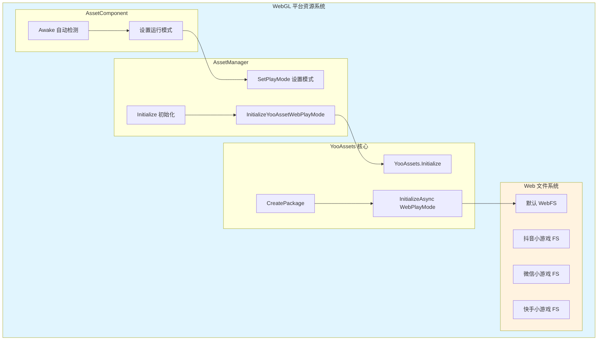
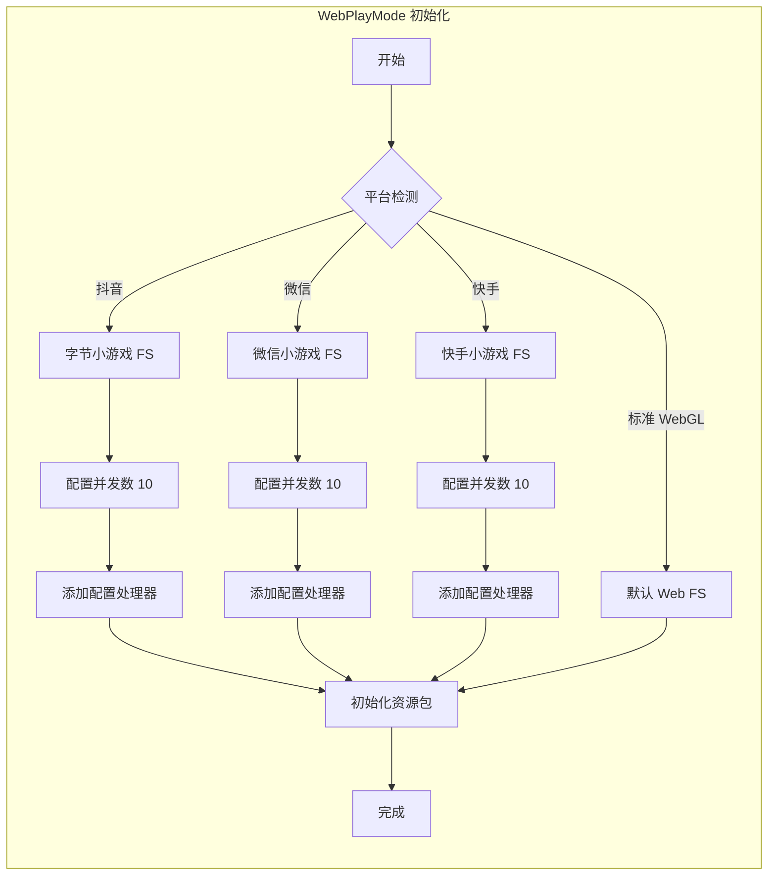

# WebGL 平台

本文档介绍 GameFrameX Asset 资源组件对 WebGL 平台的支持和配置。

## 概述

WebGL 平台是 Unity 部署到 Web 浏览器的重要目标平台。GameFrameX Asset 组件基于 YooAssets 框架，提供了完整的 WebGL 资源加载解决方案。该方案支持标准 WebGL 构建以及多种小游戏平台（抖音小游戏、微信小游戏、快手小游戏）。

WebGL 平台的主要特点包括：
- **浏览器环境限制**：无法使用传统的文件系统，需要特殊的资源加载机制
- **单线程执行**：JavaScript 环境下资源加载需要异步处理
- **缓存机制**：依赖浏览器缓存存储下载的资源
- **小游戏平台支持**：针对国内主流小游戏平台进行了专门适配

## 架构设计



### 核心组件说明

| 组件 | 职责 |
|------|------|
| AssetComponent | 在 Awake 时自动检测 WebGL 环境并设置运行模式 |
| AssetManager | 管理资源初始化和加载，调用 YooAssets |
| YooAssets | 底层资源系统，提供 WebPlayMode 初始化 |
| Web 文件系统 | 处理 Web 环境下的资源加载和缓存 |

## 自动平台检测

GameFrameX 实现了智能的自动平台检测机制。在非编辑器环境下构建时，AssetComponent 会自动识别目标平台并选择合适的运行模式。

```csharp
using GameFrameX.Asset.Runtime;
using UnityEngine;

[DisallowMultipleComponent]
[AddComponentMenu("GameFrameX/Asset")]
public sealed class AssetComponent : GameFrameworkComponent
{
    [Tooltip("当目标平台为Web平台时，将会强制设置为WebPlayMode")]
    [SerializeField]
    private EPlayMode m_GamePlayMode;

    protected override void Awake()
    {
#if !UNITY_EDITOR
        if (GamePlayMode == EPlayMode.EditorSimulateMode)
        {
            GamePlayMode = EPlayMode.HostPlayMode;
        }
#if UNITY_WEBGL
        GamePlayMode = EPlayMode.WebPlayMode;
#endif
#endif
        base.Awake();
        _assetManager.SetPlayMode(GamePlayMode);
    }
}
```

> Source: [AssetComponent.cs](https://github.com/GameFrameX/com.gameframex.unity.asset/blob/main/Runtime/Asset/AssetComponent.cs#L42-L64)

### 检测逻辑说明

| 条件 | 行为 |
|------|------|
| 编辑器环境 | 使用配置的 GamePlayMode |
| 非编辑器 + EditorSimulateMode | 转换为 HostPlayMode |
| 非编辑器 + UNITY_WEBGL | 自动切换为 WebPlayMode |
| 其他情况 | 保持配置的运行模式 |

## WebPlayMode 初始化流程

当设置为 WebPlayMode 时，AssetManager 会调用 `InitializeYooAssetWebPlayMode` 方法进行初始化。该方法支持多种 Web 环境配置。

```csharp
/// <summary>
/// 初始化YooAsset WebGL运行模式
/// </summary>
private InitializationOperation InitializeYooAssetWebPlayMode(
    ResourcePackage resourcePackage,
    string hostServerURL,
    string fallbackHostServerURL)
{
    var initParameters = new WebPlayModeParameters();
    FileSystemParameters webFileSystem = null;

#if UNITY_WEBGL
#if ENABLE_DOUYIN_MINI_GAME
    // 抖音小游戏配置
    TTSDK.TT.PreloadConcurrent(10);
    GameEntry.GetComponent<AssetComponent>().gameObject
        .GetOrAddComponent<DouYinConfigHandler>();
    
    if (hostServerURL.IsNullOrWhiteSpace())
    {
        webFileSystem = ByteGameFileSystemCreater.CreateByteGameFileSystemParameters();
    }
    else
    {
        webFileSystem = ByteGameFileSystemCreater.CreateByteGameFileSystemParameters(hostServerURL);
    }
#elif ENABLE_WECHAT_MINI_GAME
    // 微信小游戏配置
    WeChatWASM.WXBase.PreloadConcurrent(10);
    GameEntry.GetComponent<AssetComponent>().gameObject
        .GetOrAddComponent<WeChatConfigHandler>();
    
    string packageRoot = $"{WeChatWASM.WXBase.env.USER_DATA_PATH}/__GAME_FILE_CACHE/{YooAssetSettingsData.Setting.DefaultYooFolderName}";
    
    if (hostServerURL.IsNullOrWhiteSpace())
    {
        webFileSystem = WechatFileSystemCreater.CreateWechatFileSystemParameters();
    }
    else
    {
        webFileSystem = WechatFileSystemCreater.CreateWechatPathFileSystemParameters(hostServerURL);
    }
#elif ENABLE_KUAISHOU_MINI_GAME
    // 快手小游戏配置
#if !UNITY_EDITOR
    KSWASM.KSBase.PreloadConcurrent(10);
#endif
    GameEntry.GetComponent<AssetComponent>().gameObject
        .GetOrAddComponent<KuaiShouConfigHandler>();
    
    if (hostServerURL.IsNullOrWhiteSpace())
    {
        webFileSystem = KuaiShouFileSystemCreater.CreateKuaiShouFileSystemParameters();
    }
    else
    {
        webFileSystem = KuaiShouFileSystemCreater.CreateKuaiShouPathFileSystemParameters(hostServerURL);
    }
#else
    // 标准 WebGL 文件系统
    webFileSystem = FileSystemParameters.CreateDefaultWebFileSystemParameters();
#endif
#else
    // 非 WebGL 环境回退
    webFileSystem = FileSystemParameters.CreateDefaultWebFileSystemParameters();
#endif

    initParameters.WebFileSystemParameters = webFileSystem;
    return resourcePackage.InitializeAsync(initParameters);
}
```

> Source: [AssetManager.Initialization.cs](https://github.com/GameFrameX/com.gameframex.unity.asset/blob/main/Runtime/Asset/AssetManager.Initialization.cs#L85-L146)

## 小程序平台支持

GameFrameX Asset 组件针对国内主流小程序平台提供了专门的适配支持。

### 支持的平台

| 平台 | 预定义符号 | 特性 |
|------|-----------|------|
| 抖音小程序 | ENABLE_DOUYIN_MINI_GAME | 字节小游戏文件系统 |
| 微信小程序 | ENABLE_WECHAT_MINI_GAME | 微信缓存目录配置 |
| 快手小程序 | ENABLE_KUAISHOU_MINI_GAME | 快手文件系统适配 |

### 平台初始化差异



### 配置处理器说明

每个小程序平台都需要添加对应的配置处理器：
- **DouYinConfigHandler**：处理抖音小游戏配置
- **WeChatConfigHandler**：处理微信小游戏配置
- **KuaiShouConfigHandler**：处理快手小游戏配置

这些处理器负责平台特定的文件系统配置和资源路径映射。

## 资源包初始化

在 WebGL 平台上使用资源包时，需要正确配置初始化参数：

```csharp
using UnityEngine;
using GameFrameX.Runtime;

public class WebGLBootstrap : MonoBehaviour
{
    private async void Start()
    {
        var assetComponent = GameEntry.GetComponent<AssetComponent>();
        
        // 初始化默认资源包
        bool success = await assetComponent.InitPackageAsync(
            "DefaultPackage",           // 包名称
            "https://cdn.example.com/", // 主服务器地址
            "https://backup.example.com/", // 备用服务器地址
            true                        // 设为默认包
        );
        
        if (success)
        {
            Debug.Log("WebGL 资源包初始化成功");
        }
    }
}
```

## 运行模式配置

GameFrameX Asset 组件支持多种运行模式，WebGL 平台主要使用 WebPlayMode：

| 模式 | 适用场景 | WebGL 支持 |
|------|----------|------------|
| EditorSimulateMode | 编辑器开发调试 | ❌ 不支持 |
| OfflinePlayMode | 单机运行 | ⚠️ 有限支持 |
| HostPlayMode | 热更新模式 | ⚠️ 有条件支持 |
| WebPlayMode | WebGL 运行环境 | ✅ 完全支持 |

> 关于运行模式的详细配置，请参考 [运行模式](./6-configuration.play-modes) 文档。

## 常见问题

### Q1: WebGL 构建后资源加载失败

**可能原因**：
- 服务器地址配置错误
- CORS 跨域策略问题
- 资源包未正确构建

**解决方案**：
1. 检查资源服务器是否支持 CORS
2. 确认资源包已使用 WebGL 平台构建
3. 验证 hostServerURL 配置正确

### Q2: 小程序平台资源加载缓慢

**可能原因**：
- 并发下载数过高
- 资源未进行分包处理

**解决方案**：
1. 在代码中调整 PreloadConcurrent 参数
2. 使用资源标签进行按需加载
3. 启用资源压缩和合并

### Q3: 内存占用过高

**可能原因**：
- 同时加载过多资源
- 未及时释放资源句柄

**解决方案**：
1. 使用 `UnloadAsset` 及时释放已使用完的资源
2. 合理设置 `DownloadingMaxNum` 控制并发
3. 定期调用 `UnloadUnusedAssetsAsync` 清理无用资源

## 相关链接

- [运行模式配置](./6-configuration.play-modes) - 详细的运行模式说明
- [组件配置](./6-configuration.component-settings) - AssetComponent 配置详解
- [资源加载接口](./5-api-reference.loading-api) - 异步/同步加载 API
- [资源包管理](./5-api-reference.package-management) - 资源包操作
- [Asset 组件介绍](./1-overview.introduction) - Asset 组件概述
- [功能特性](./1-overview.features) - 完整功能列表
