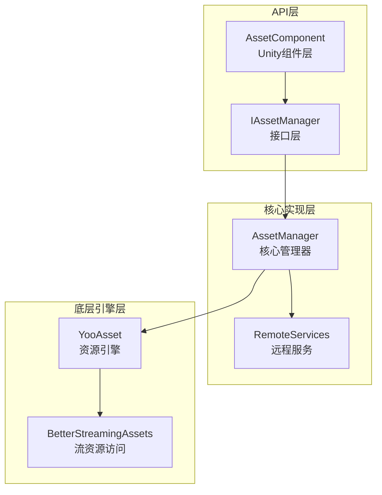
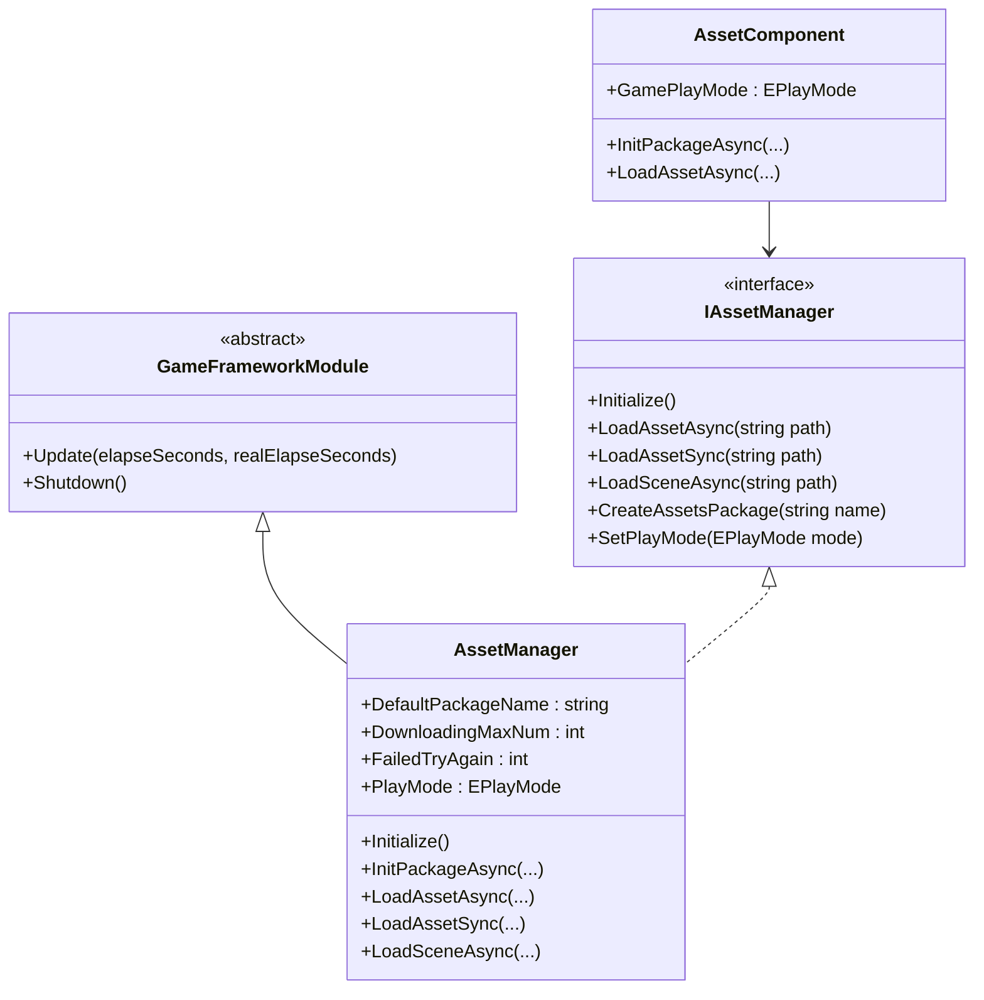
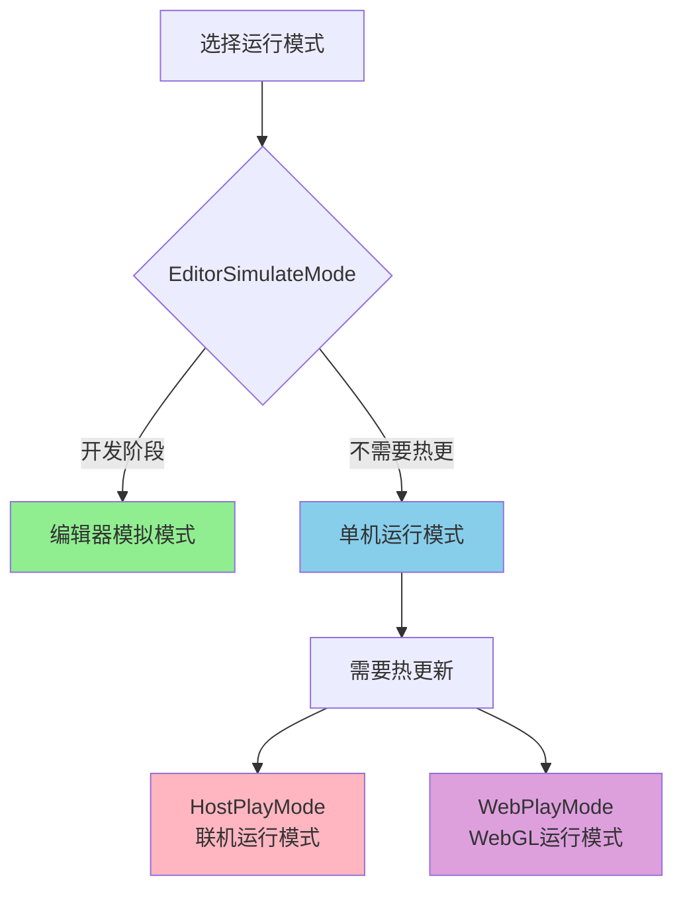
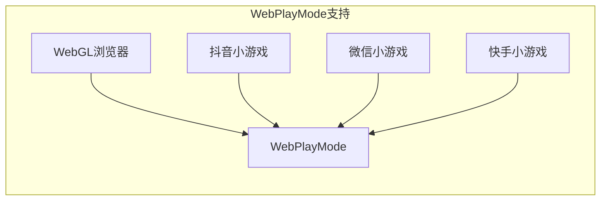

# 资源管理器

资源管理器（Asset Manager）是 GameFrameX 资产系统的核心组件，负责统一管理游戏资源的加载、卸载、热更新和资源包管理。该组件基于 YooAsset 库构建，提供了简洁易用的 API 接口，支持多种运行模式和平台。

## 概述

资源管理器作为游戏框架的核心模块，承担着游戏运行时资源管理的关键职责。在现代游戏开发中，资源的有效管理直接影响着游戏的性能、加载速度和用户体验。资源管理器通过统一封装 YooAsset 的功能，为开发者提供了一套完整的资源管理解决方案。

该组件支持以下核心功能：

- **同步/异步资源加载**：提供同步和异步两种加载方式，满足不同场景需求
- **多资源包管理**：支持创建和管理多个独立的资源包
- **场景加载**：支持异步场景加载和切换
- **热更新支持**：在 HostPlayMode 和 WebPlayMode 下支持资源热更新
- **资源清理**：提供多种资源释放策略，优化内存使用

资源管理器的设计理念是将复杂的底层资源管理逻辑封装起来，开发者只需关注业务层面的资源使用，无需关心资源如何从磁盘或网络加载、如何进行版本管理等问题。

## 架构设计

资源管理器的架构采用了分层设计模式，从上到下分为三个主要层次：



### 组件说明

**API 层**负责与 Unity 引擎和业务代码的交互。`AssetComponent` 是挂载在 GameObject 上的 Unity 组件，提供了 Inspector 面板配置和组件生命周期管理。`IAssetManager` 接口定义了资源管理的所有操作契约，确保了代码的可测试性和可替换性。

**核心实现层**实现了资源管理的核心逻辑。`AssetManager` 继承自 `GameFrameworkModule`，是整个资源系统的核心。它封装了 YooAsset 的所有功能，并添加了更适合游戏开发的功能。`RemoteServices` 是内部类，负责解析热更新资源的远程 URL。

**底层引擎层**是实际的资源操作实现。YooAsset 是业界优秀的 Unity 资源管理解决方案，提供了强大的资源打包、加载和热更新能力。BetterStreamingAssets 提供了对 StreamingAssets 目录的高效访问。

### 核心类图



## 核心功能

### 资源加载

资源管理器提供了丰富的资源加载接口，支持同步和异步两种加载模式。同步加载适用于对加载时间要求不高、且在主线程中执行的场景；异步加载则适用于需要保持帧率稳定的大型资源加载场景。

#### 异步加载资源

异步加载是游戏开发中最常用的资源加载方式，它不会阻塞主线程，可以保持游戏的流畅运行。资源管理器提供了多种异步加载接口：

```csharp
// 通过路径异步加载资源
var handle = await assetComponent.LoadAssetAsync<GameObject>("Prefabs/Player");

// 获取加载完成的资源对象
var playerPrefab = handle.AssetObject as GameObject;
if (playerPrefab != null)
{
    Instantiate(playerPrefab);
}

// 加载完成后释放句柄
handle.Release();
```

> Source: [AssetManager.cs](https://github.com/GameFrameX/com.gameframex.unity.asset/blob/main/Runtime/Asset/AssetManager.cs#L454-L480)

异步加载返回一个 Handle 对象，通过该对象可以获取加载的资源、监控加载进度、以及在适当时机释放资源。开发者应当注意，在资源不再需要时及时释放 Handle，避免内存泄漏。

#### 同步加载资源

对于某些必须在当前帧获取资源的场景，可以使用同步加载接口：

```csharp
// 同步加载资源
var handle = assetComponent.LoadAssetSync<GameObject>("Prefabs/Enemy");
var enemyPrefab = handle.AssetObject as GameObject;
handle.Release();
```

> Source: [AssetManager.cs](https://github.com/GameFrameX/com.gameframex.unity.asset/blob/main/Runtime/Asset/AssetManager.cs#L603-L606)

同步加载会阻塞调用线程，在资源未加载完成前不会返回。因此，同步加载不适用于大型资源的加载，一般仅用于配置数据等小规模资源的加载。

#### 加载子资源

某些资源包含多个子资源，例如一个 prefab 中引用的材质或纹理。资源管理器提供了专门的子资源加载接口：

```csharp
// 异步加载子资源
var handle = await assetComponent.LoadSubAssetsAsync<Sprite>("Atlas/GameUI");
foreach (var subAsset in handle.SubAssets)
{
    var sprite = subAsset.AssetObject as Sprite;
    // 处理sprite...
}
handle.Release();
```

> Source: [AssetManager.cs](https://github.com/GameFrameX/com.gameframex.unity.asset/blob/main/Runtime/Asset/AssetManager.cs#L244-L250)

### 资源包管理

资源包（Resource Package）是资源管理的基本单元，每个资源包可以独立进行打包、版本管理和热更新。资源管理器支持同时管理多个资源包。

#### 创建资源包

```csharp
// 创建新的资源包
var package = assetComponent.CreateAssetsPackage("DLC_Package");
assetComponent.SetDefaultAssetsPackage(package);
```

> Source: [AssetManager.cs](https://github.com/GameFrameX/com.gameframex.unity.asset/blob/main/Runtime/Asset/AssetManager.cs#L654-L657)

#### 获取资源包

```csharp
// 获取已存在的资源包
var package = assetComponent.TryGetAssetsPackage("DLC_Package");
if (package != null)
{
    // 使用资源包...
}
```

> Source: [AssetManager.cs](https://github.com/GameFrameX/com.gameframex.unity.asset/blob/main/Runtime/Asset/AssetManager.cs#L665-L668)

### 场景管理

资源管理器支持异步加载 Unity 场景，这在大型游戏的关卡切换中尤为重要：

```csharp
// 异步加载场景
var handle = await assetComponent.LoadSceneAsync(
    "Scenes/Level1", 
    LoadSceneMode.Single, 
    true
);
```

> Source: [AssetManager.cs](https://github.com/GameFrameX/com.gameframex.unity.asset/blob/main/Runtime/Asset/AssetManager.cs#L620-L626)

第三个参数控制是否在加载完成后自动激活场景。如果需要在加载过程中显示 Loading 界面，可以先将参数设为 false，待 Loading 完成后手动激活。

### 资源清理

合理管理资源内存是游戏性能优化的重要环节。资源管理器提供了多种资源释放接口：

```csharp
// 卸载指定资源
assetComponent.UnloadAsset("Prefabs/Player");

// 卸载无用资源
assetComponent.UnloadUnusedAssetsAsync();

// 清理未使用的Bundle文件
assetComponent.ClearUnusedBundleFilesAsync();

// 强制回收所有资源
assetComponent.UnloadAllAssetsAsync();
```

> Source: [AssetManager.cs](https://github.com/GameFrameX/com.gameframex.unity.asset/blob/main/Runtime/Asset/AssetManager.cs#L591-L658)

这些接口的使用场景各不相同：UnloadAsset 用于卸载特定资源；UnloadUnusedAssetsAsync 卸载当前未被引用的资源；ClearUnusedBundleFilesAsync 清理未使用的 Bundle 文件以释放磁盘空间；UnloadAllAssetsAsync 则会强制卸载资源包内的所有资源。

## 运行模式

资源管理器支持四种运行模式，每种模式适用于不同的开发和部署场景：



### 编辑器模拟模式

编辑器模拟模式（EditorSimulateMode）是开发阶段最常用的模式。在这种模式下，资源直接从 Unity 编辑器的源资源文件夹中加载，无需进行资源打包。这大大加速了开发迭代速度，修改资源后可以立即看到效果。

```csharp
// 设置运行模式
assetComponent.GamePlayMode = EPlayMode.EditorSimulateMode;
```

> Source: [AssetManager.Initialization.cs](https://github.com/GameFrameX/com.gameframex.unity.asset/blob/main/Runtime/Asset/AssetManager.Initialization.cs#L55-L61)

**特点：**
- 无需打包，修改资源即时生效
- 不支持热更新功能
- 仅在编辑器环境下可用

### 单机运行模式

单机运行模式（OfflinePlayMode）适用于不需要热更新的单机游戏或独立应用。在这种模式下，所有资源都从本地存储中加载。

```csharp
// 设置运行模式
assetComponent.GamePlayMode = EPlayMode.OfflinePlayMode;
```

> Source: [AssetManager.Initialization.cs](https://github.com/GameFrameX/com.gameframex.unity.asset/blob/main/Runtime/Asset/AssetManager.Initialization.cs#L69-L75)

**特点：**
- 所有资源从本地加载
- 无网络请求，性能稳定
- 适用于单机游戏或发布版本

### 联机运行模式

联机运行模式（HostPlayMode）是最常用的生产模式，支持完整的热更新功能。在这种模式下，资源分为内置资源和远程资源两部分，内置资源随应用一起发布，远程资源从服务器动态下载。

```csharp
// 设置运行模式
assetComponent.GamePlayMode = EPlayMode.HostPlayMode;

// 初始化资源包（异步）
await assetComponent.InitPackageAsync(
    "DefaultPackage",           // 包名称
    "http://192.168.1.100:8000", // 主服务器地址
    "http://backup.example.com"   // 备用服务器地址
);
```

> Source: [AssetManager.Initialization.cs](https://github.com/GameFrameX/com.gameframex.unity.asset/blob/main/Runtime/Asset/AssetManager.Initialization.cs#L155-L164)

**特点：**
- 支持资源热更新
- 内置资源 + 远程资源的混合模式
- 适用于需要频繁更新内容的游戏

### WebGL 运行模式

WebGL 运行模式（WebPlayMode）是专门为 WebGL 平台设计的模式，兼容各种小程序游戏环境：

```csharp
// Web平台自动使用WebPlayMode
#if UNITY_WEBGL && !UNITY_EDITOR
assetComponent.GamePlayMode = EPlayMode.WebPlayMode;
#endif
```

> Source: [AssetComponent.cs](https://github.com/GameFrameX/com.gameframex.unity.asset/blob/main/Runtime/Asset/AssetComponent.cs#L49-L51)

**支持的平台：**
- WebGL 浏览器
- 抖音小游戏
- 微信小游戏
- 快手小游戏



## 使用示例

### 基础初始化

在游戏启动时，需要正确初始化资源系统：

```csharp
public class GameBootstrap : MonoBehaviour
{
    public AssetComponent assetComponent;
    
    private async void Start()
    {
        // 配置运行模式
        assetComponent.GamePlayMode = EPlayMode.HostPlayMode;
        
        // 初始化默认资源包
        bool success = await assetComponent.InitPackageAsync(
            "DefaultPackage",
            "http://localhost:8080",
            "http://localhost:8081",
            true
        );
        
        if (success)
        {
            Debug.Log("资源系统初始化成功");
            // 开始游戏逻辑...
        }
    }
}
```

> Source: [AssetComponent.cs](https://github.com/GameFrameX/com.gameframex.unity.asset/blob/main/Runtime/Asset/AssetComponent.cs#L80-L95)

### 资源加载最佳实践

```csharp
public class ResourceManager
{
    private AssetComponent _assetComponent;
    
    // 使用泛型加载资源，推荐方式
    public async Task<T> LoadAssetAsync<T>(string path) where T : UnityEngine.Object
    {
        var handle = await _assetComponent.LoadAssetAsync<T>(path);
        return handle.AssetObject as T;
    }
    
    // 加载多个同类型资源
    public async Task<T[]> LoadAssetsAsync<T>(string path) where T : UnityEngine.Object
    {
        var handle = await _assetComponent.LoadAllAssetsAsync<T>(path);
        var assets = new List<T>();
        foreach (var asset in handle.AllAssets())
        {
            assets.Add(asset.AssetObject as T);
        }
        handle.Release();
        return assets.ToArray();
    }
    
    // 加载Sprite图集
    public async Task<Sprite[]> LoadSprites(string atlasPath)
    {
        var handle = await _assetComponent.LoadSubAssetsAsync<Sprite>(atlasPath);
        var sprites = new List<Sprite>();
        foreach (var subAsset in handle.SubAssets)
        {
            sprites.Add(subAsset.AssetObject as Sprite);
        }
        handle.Release();
        return sprites.ToArray();
    }
}
```

### 热更新检查

在需要检查资源是否需要热更新时：

```csharp
public async Task<bool> CheckAndUpdateResources()
{
    var assetComponent = GameEntry.GetComponent<AssetComponent>();
    
    // 检查是否需要下载资源
    if (assetComponent.IsNeedDownload("Prefabs/Player"))
    {
        Debug.Log("发现新资源，需要下载...");
        // 实现下载逻辑...
    }
    
    return true;
}
```

> Source: [AssetManager.cs](https://github.com/GameFrameX/com.gameframex.unity.asset/blob/main/Runtime/Asset/AssetManager.cs#L700-L714)

## 配置说明

### AssetComponent 配置

在 Unity 编辑器中，AssetComponent 提供了以下配置选项：

| 配置项 | 类型 | 说明 |
|--------|------|------|
| GamePlayMode | EPlayMode | 资源运行模式 |

> Source: [AssetComponent.cs](https://github.com/GameFrameX/com.gameframex.unity.asset/blob/main/Runtime/Asset/AssetComponent.cs#L18-L31)

### 资源管理器配置

资源管理器提供了多个可配置属性：

| 属性 | 类型 | 默认值 | 说明 |
|------|------|--------|------|
| DefaultPackageName | string | "DefaultPackage" | 默认资源包名称 |
| DownloadingMaxNum | int | - | 同时下载的最大数目 |
| FailedTryAgain | int | - | 失败重试次数 |
| VerifyLevel | EFileVerifyLevel | - | 下载文件校验等级 |
| Milliseconds | long | - | 异步系统时间切片（毫秒） |

> Source: [AssetManager.cs](https://github.com/GameFrameX/com.gameframex.unity.asset/blob/main/Runtime/Asset/AssetManager.cs#L14-L39)

## API 参考

### 初始化接口

#### `Initialize()`

初始化资源系统。在 Unity 组件的 Start 阶段自动调用。

```csharp
public void Initialize()
```

> Source: [AssetManager.cs](https://github.com/GameFrameX/com.gameframex.unity.asset/blob/main/Runtime/Asset/AssetManager.cs#L46-L56)

#### `InitPackageAsync`

异步初始化资源包。

```csharp
public Task<bool> InitPackageAsync(
    string packageName,           // 资源包名称
    string hostServerURL,         // 主服务器URL
    string fallbackHostServerURL, // 备用服务器URL
    bool isDefaultPackage = true  // 是否设为默认包
)
```

> Source: [AssetManager.cs](https://github.com/GameFrameX/com.gameframex.unity.asset/blob/main/Runtime/Asset/AssetManager.cs#L68-L100)

### 资源加载接口

#### `LoadAssetAsync<T>`

异步加载单个资源。

```csharp
public Task<AssetHandle> LoadAssetAsync<T>(string path) where T : UnityEngine.Object
```

**参数：**
- `path` (string): 资源路径

**返回：** `Task<AssetHandle>` - 资源句柄

> Source: [AssetManager.cs](https://github.com/GameFrameX/com.gameframex.unity.asset/blob/main/Runtime/Asset/AssetManager.cs#L469-L481)

#### `LoadAssetSync<T>`

同步加载单个资源。

```csharp
public AssetHandle LoadAssetSync<T>(string path) where T : UnityEngine.Object
```

**参数：**
- `path` (string): 资源路径

**返回：** AssetHandle - 资源句柄

> Source: [AssetManager.cs](https://github.com/GameFrameX/com.gameframex.unity.asset/blob/main/Runtime/Asset/AssetManager.cs#L603-L606)

#### `LoadSceneAsync`

异步加载场景。

```csharp
public Task<SceneHandle> LoadSceneAsync(
    string path,                      // 场景路径
    LoadSceneMode sceneMode,          // 场景加载模式
    bool activateOnLoad = true        // 加载完成是否自动激活
)
```

> Source: [AssetManager.cs](https://github.com/GameFrameX/com.gameframex.unity.asset/blob/main/Runtime/Asset/AssetManager.cs#L620-L626)

### 资源包管理接口

#### `CreateAssetsPackage`

创建新的资源包。

```csharp
public ResourcePackage CreateAssetsPackage(string packageName)
```

> Source: [AssetManager.cs](https://github.com/GameFrameX/com.gameframex.unity.asset/blob/main/Runtime/Asset/AssetManager.cs#L654-L657)

#### `GetAssetsPackage`

获取已存在的资源包。

```csharp
public ResourcePackage GetAssetsPackage(string packageName)
```

> Source: [AssetManager.cs](https://github.com/GameFrameX/com.gameframex.unity.asset/blob/main/Runtime/Asset/AssetManager.cs#L687-L690)

### 资源清理接口

#### `UnloadAsset`

卸载指定资源。

```csharp
public void UnloadAsset(string assetPath)
```

> Source: [AssetManager.cs](https://github.com/GameFrameX/com.gameframex.unity.asset/blob/main/Runtime/Asset/AssetManager.cs#L107-L112)

#### `UnloadUnusedAssetsAsync`

异步卸载无用资源。

```csharp
public void UnloadUnusedAssetsAsync(string packageName = null)
```

> Source: [AssetManager.cs](https://github.com/GameFrameX/com.gameframex.unity.asset/blob/main/Runtime/Asset/AssetManager.cs#L153-L165)

#### `ClearUnusedBundleFilesAsync`

清理未使用的 Bundle 文件。

```csharp
public void ClearUnusedBundleFilesAsync(string packageName = null)
```

> Source: [AssetManager.cs](https://github.com/GameFrameX/com.gameframex.unity.asset/blob/main/Runtime/Asset/AssetManager.cs#L191-L204)

## 相关链接

- [资源组件](./4-core-concepts.asset-component) - Unity 组件层面的资源访问
- [资源加载接口](./5-api-reference.loading-api) - 详细 API 参考
- [资源包管理](./5-api-reference.package-management) - 资源包操作指南
- [运行模式](./6-configuration.play-modes) - 各运行模式详细配置
- [组件配置](./6-configuration.component-settings) - Unity 组件配置说明
- [WebGL 平台](./7-platforms.webgl) - WebGL 平台特殊配置
