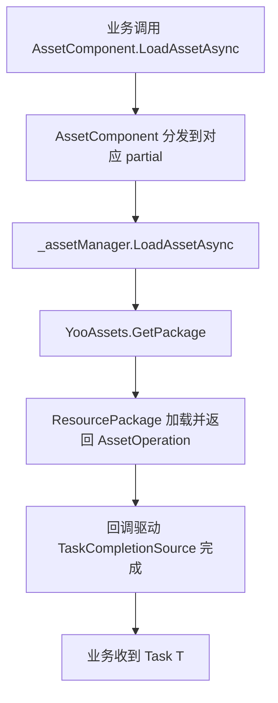

# 工作原理:资源组件与 YooAsset 的协作流程

`AssetComponent` 是框架在 Unity 一侧对外暴露的资源门面,`AssetManager` 是它的运行期实现,二者均把 YooAsset 作为底层加载引擎。本页解释三者是如何衔接、初始化、分发任务并最终把资产交付给业务代码的。

## 角色分层

| 层 | 类型 | 职责 |
|----|------|------|
| 组件层 | `AssetComponent : GameFrameworkComponent` | 挂场景、序列化运行模式、把外部调用转发到管理器层 |
| 管理器层 | `AssetManager : GameFrameworkModule, IAssetManager` | 面向业务提供 `LoadAsset` / `UnloadAsset` / `InitPackageAsync` 等 API,持有 `PlayMode` |
| 引擎层 | YooAsset(`YooAssets`、`ResourcePackage`) | 真正完成资源包初始化、文件寻址、加载/卸载、缓存 |

`AssetComponent` 在 `Awake` 中按 `ImplementationComponentType = Utility.Assembly.GetType(componentType)` 反射得到实现类,并通过 `GameFrameworkEntry.GetModule<IAssetManager>()` 拿到管理器单例,后续所有调用都经由 `_assetManager`。

## 启动与初始化流程

1. `AssetComponent.Awake()` 读取 `m_GamePlayMode`,在非编辑器或 WebGL 下把模式强制纠正后,调用 `_assetManager.SetPlayMode(GamePlayMode)`。
2. `AssetComponent.Start()` 触发 `_assetManager.Initialize()`。
3. `AssetManager.Initialize()` 调用 `YooAssets.Initialize()`,并按需设置 `SetOperationSystemMaxTimeSlice`。
4. 业务调用 `AssetComponent.InitPackageAsync(packageName, host, fallback, isDefaultPackage)`,逐层转发到 `AssetManager.InitPackageAsync`。

```csharp
// 摘自 AssetManager.cs:66-97
public Task<bool> InitPackageAsync(string packageName, string hostServerURL, string fallbackHostServerURL, bool isDefaultPackage = false)
{
    var taskCompletionSource = new TaskCompletionSource<bool>();
    // ... 参数校验 ...

    var resourcePackage = YooAssets.TryGetPackage(packageName);
    if (resourcePackage == null)
    {
        resourcePackage = YooAssets.CreatePackage(packageName);
        if (isDefaultPackage)
        {
            YooAssets.SetDefaultPackage(resourcePackage);
        }
    }

    var initializationOperationHandler = CreateInitializationOperationHandler(resourcePackage, hostServerURL, fallbackHostServerURL);
    initializationOperationHandler.Completed += asyncOperationBase =>
    {
        if (asyncOperationBase.Error == null && asyncOperationBase.Status == EOperationStatus.Succeed && asyncOperationBase.IsDone)
        {
            taskCompletionSource.TrySetResult(true);
        }
        else
        {
            taskCompletionSource.TrySetException(new Exception(asyncOperationBase.Error));
        }
    };
    return taskCompletionSource.Task;
}
```

关键点:`TaskCompletionSource<bool>` 把 YooAsset 的回调式 `InitializationOperation` 适配成可 `await` 的 `Task<bool>`。

## 运行模式分发

`CreateInitializationOperationHandler` 是一个 switch 派发器,把 `EPlayMode` 映射到 YooAsset 的四种初始化参数:

| `EPlayMode` | YooAsset 初始化参数 | 典型用途 |
|-------------|---------------------|----------|
| `EditorSimulateMode` | `EditorSimulateModeParameters` + `CreateDefaultEditorFileSystemParameters` | 编辑器内直接走构建产物模拟加载 |
| `OfflinePlayMode` | `OfflinePlayModeParameters` + `CreateDefaultBuildinFileSystemParameters` | 单机/纯本地 |
| `HostPlayMode` | `HostPlayModeParameters` + 内置文件系统 + `RemoteServices` 缓存文件系统 | 需要热更新 |
| `WebPlayMode` | `WebPlayModeParameters` + WebGL/小游戏文件系统 | WebGL、微信、抖音、快手小游戏 |

```csharp
// 摘自 AssetManager.Initialization.cs:18-47
switch (PlayMode)
{
    case EPlayMode.EditorSimulateMode: return InitializeYooAssetEditorSimulateMode(resourcePackage);
    case EPlayMode.OfflinePlayMode:    return InitializeYooAssetOfflinePlayMode(resourcePackage);
    case EPlayMode.HostPlayMode:       return InitializeYooAssetHostPlayMode(resourcePackage, hostServerURL, fallbackHostServerURL);
    case EPlayMode.WebPlayMode:        return InitializeYooAssetWebPlayMode(resourcePackage, hostServerURL, fallbackHostServerURL);
    default: throw new ArgumentOutOfRangeException(nameof(PlayMode), PlayMode, $"Unsupported play mode: {PlayMode}");
}
```

`HostPlayMode` 还负责把主备两个下载地址打包成 `RemoteServices`,分别作为 `CacheFileSystemParameters` 的下载源与兜底:

```csharp
// 摘自 AssetManager.Initialization.cs:155-164
var remoteServices = new RemoteServices(hostServerURL, fallbackHostServerURL);
var createParameters = new HostPlayModeParameters
{
    BuildinFileSystemParameters = FileSystemParameters.CreateDefaultBuildinFileSystemParameters(),
    CacheFileSystemParameters   = FileSystemParameters.CreateDefaultCacheFileSystemParameters(remoteServices),
};
```

## 加载与卸载的转发路径

各资源类型的便捷 API(`LoadAssetAsync<T>`、`LoadSceneAsync` 等)由 `AssetComponent` 的 partial 类提供(例如 `AssetComponent.Prefab.cs`、`AssetComponent.Texture2D.cs`),它们都最终调用 `_assetManager` 上的同名方法;`_assetManager` 再用 `YooAssets.GetPackage(packageName)` 取得 `ResourcePackage`,执行 `LoadAssetAsync` / `TryUnloadUnusedAsset` / `UnloadAllAssetsAsync` 等操作。

卸载时,`AssetManager.UnloadAsset(string assetPath)` 默认作用于 `DefaultPackageName`,而带包名的重载则按指定包名取包:

```csharp
// 摘自 AssetManager.cs:104-124
public void UnloadAsset(string assetPath)
{
    var package = YooAssets.GetPackage(DefaultPackageName);
    package.TryUnloadUnusedAsset(assetPath);
}

public void UnloadAsset(string packageName, string assetPath)
{
    var package = YooAssets.GetPackage(packageName);
    package.TryUnloadUnusedAsset(assetPath);
}
```

## 协作时序



## 背景

- 之所以把 YooAsset 嵌入 `GameFrameworkModule`,是为了让框架上层组件和热更新/多包逻辑保持引擎无关;只有 `AssetManager` 直接 `using YooAsset`。
- `AssetComponent` 的 `Awake` 把 `EditorSimulateMode` 在非编辑器下重写为 `HostPlayMode`,并把 `WebGL` 一律改为 `WebPlayMode`,防止打包配置错误。
- 多端小游戏支持(`ENABLE_DOUYIN_MINI_GAME` / `ENABLE_WECHAT_MINI_GAME` / `ENABLE_KUAISHOU_MINI_GAME`)在 `InitializeYooAssetWebPlayMode` 内通过编译宏分别创建对应的文件系统,同时限制并发数,避免被平台底层限制拖垮。

## 相关链接

- [AssetComponent.cs](https://github.com/GameFrameX/com.gameframex.unity.asset/blob/main/Runtime/Asset/AssetComponent.cs)
- [AssetManager.cs](https://github.com/GameFrameX/com.gameframex.unity.asset/blob/main/Runtime/Asset/AssetManager.cs)
- [AssetManager.Initialization.cs](https://github.com/GameFrameX/com.gameframex.unity.asset/blob/main/Runtime/Asset/AssetManager.Initialization.cs)
- [AssetComponent.Prefab.cs](https://github.com/GameFrameX/com.gameframex.unity.asset/blob/main/Runtime/Asset/AssetComponent.Prefab.cs)