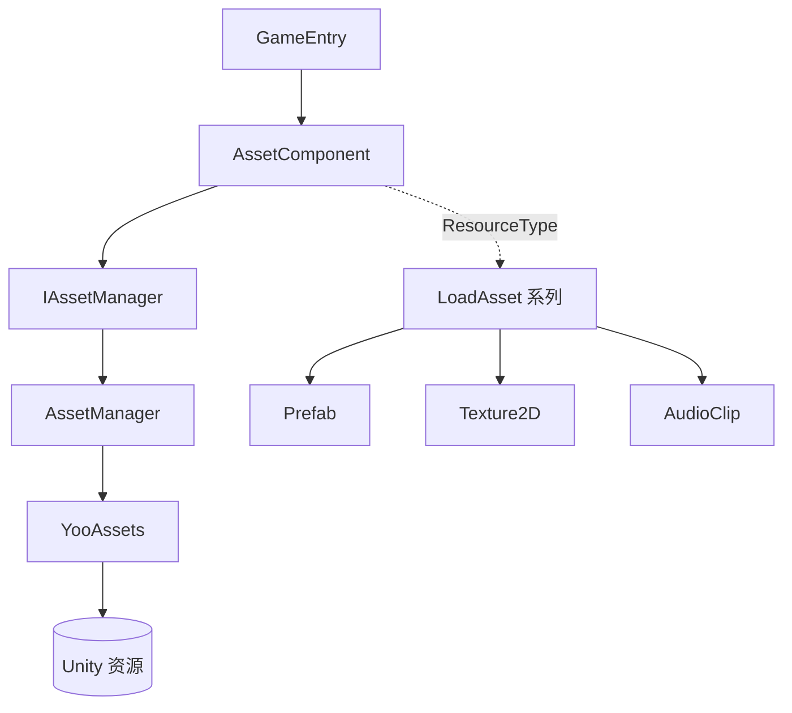

# 认识 GameFrameX Asset

GameFrameX Asset 是基于 GameFrameX 框架封装的 Unity 资源管理组件,以 [YooAsset](https://github.com/tuyoogame/YooAsset) 为底层引擎,提供统一的资源加载、卸载与分包管理接口,让游戏运行时按路径或类型安全地拿到 `Prefab`、`Texture2D`、`AudioClip` 等 Unity 资源。

## 快速开始

1. 在 Unity 项目的 `Packages/manifest.json` 中加入 scoped registry,然后在 `dependencies` 节点下声明依赖:

```json
{
  "scopedRegistries": [
    {
      "name": "GameFrameX",
      "url": "https://gameframex.upm.alianblank.uk",
      "scopes": ["com.gameframex"]
    }
  ],
  "dependencies": {
    "com.gameframex.unity.asset": "3.0.1"
  }
}
```

`scopes` 控制只有 `com.gameframex` 开头的包走这个注册表,其它包仍走 Unity 官方源。也可以直接把 Git URL 写到 `dependencies`,或放进 `Packages` 目录离线加载。

2. 在场景中确认 `AssetComponent` 已挂上(自动注册到 `GameEntry`)。然后从 `GameEntry` 拿到组件,调用加载接口:

```csharp
// 标准方式:通过 GameEntry(不依赖 com.gameframex.unity.entry)
var assetComponent = GameEntry.GetComponent<AssetComponent>();
assetComponent.LoadAsset("AssetPath");
```

## 工作原理速览



- `AssetComponent` 是 `GameFrameworkComponent`,自动注册到 GameFrameX 框架,在编辑器里通过 `AssetComponentInspector` 配置。
- `IAssetManager` 是接口,默认实现 `AssetManager` 持有 YooAssets 的初始化操作 `InitializationOperation`、包信息列表以及加载/卸载任务队列。
- 每种 Unity 资源类型对应一个 partial 文件(如 `AssetComponent.Prefab.cs`、`AssetComponent.Texture2D.cs`),提供 `LoadAssetAsync` 等强类型接口。

## 接下来

- 安装依赖与注册表配置:见 `README.zh-CN.md` 中的安装章节。
- 各类型资源的加载接口:见 `Runtime/Asset/AssetComponent.*.cs` 系列文件。
- 编辑器侧 Inspector 配置:见 [AssetComponentInspector.cs](https://github.com/GameFrameX/com.gameframex.unity.asset/blob/main/Editor/Inspector/AssetComponentInspector.cs)。

## 相关链接

- 仓库地址:https://github.com/GameFrameX/com.gameframex.unity.asset
- 文档站:https://gameframex.doc.alianblank.com
- 问题反馈:https://github.com/GameFrameX/com.gameframex.unity.asset/issues
- 源码主入口:[AssetComponent.cs](https://github.com/GameFrameX/com.gameframex.unity.asset/blob/main/Runtime/Asset/AssetComponent.cs)、[AssetManager.cs](https://github.com/GameFrameX/com.gameframex.unity.asset/blob/main/Runtime/Asset/AssetManager.cs)