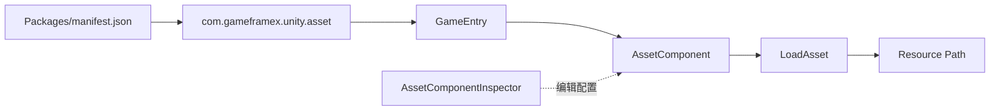

# 快速上手:安装并加载第一个资源

安装 `com.gameframex.unity.asset` 后，可通过 `GameEntry` 获取 `AssetComponent`，再用 `LoadAsset` 加载指定路径的资源。本页给出仓库 README 中可直接复制的安装与调用路径。

## 快速开始

### 前置条件

- Unity `2019.4`。
- 项目已安装 GameFrameX 核心包；当前包清单声明依赖 `com.gameframex.unity: 1.1.1` 和 `com.gameframex.unity.event: 1.1.0`。
- 准备一个可用的资源路径，示例使用占位字符串 `AssetPath`；实际地址需替换为你的资源地址。

### 操作步骤

1. 在 Unity 中打开 `Packages/manifest.json`，将包加入 `dependencies`：

```json
{
  "dependencies": {
    "com.gameframex.unity.asset": "3.0.1"
  }
}
```

> Source: [README.zh-CN.md](https://github.com/GameFrameX/com.gameframex.unity.asset/blob/main/README.zh-CN.md#L32-L63)

2. 等待 Unity Package Manager 解析并加载包。也可以选择 README 列出的 scoped registry、Git URL 或直接放入 `Packages` 目录的安装方式。

3. 在项目代码中通过 `GameEntry` 获取 `AssetComponent`：

```csharp
var assetComponent = GameEntry.GetComponent<AssetComponent>();
assetComponent.LoadAsset("AssetPath");
```

> Source: [README.zh-CN.md](https://github.com/GameFrameX/com.gameframex.unity.asset/blob/main/README.zh-CN.md#L64-L70)

4. 将 `AssetPath` 替换成你的资源地址，然后从实际运行你的资源加载流程。仓库当前包版本为 `3.1.1`；README 的安装示例使用 `3.0.1`，使用时应以项目锁定版本为准。

```json
{
  "name": "com.gameframex.unity.asset",
  "version": "3.1.1",
  "unity": "2019.4",
  "dependencies": {
    "com.gameframex.unity": "1.1.1",
    "com.gameframex.unity.event": "1.1.0"
  }
}
```

> Source: [package.json](https://github.com/GameFrameX/com.gameframex.unity.asset/blob/main/package.json#L1-L25)

## 常见变体

| 安装方式 | 配置 |
|------|------|
| Scoped registry | 注册表 URL 为 `https://gameframex.upm.alianblank.uk`，scope 为 `com.gameframex` |
| Git URL | `https://github.com/gameframex/com.gameframex.unity.asset.git` |
| 本地目录 | 将仓库直接放入 Unity 项目的 `Packages` 目录 |

## 常见错误

| 症状 | 原因 | 修复 |
|------|------|------|
| Package Manager 找不到包 | `scopedRegistries`、scope 或版本不一致 | 检查 `manifest.json` 的 `scopes` 是否为 `com.gameframex`，并确认 Unity 使用目标版本 |
| `GetComponent<AssetComponent>()` 无法编译 | GameFrameX 核心依赖未安装，或未引用相应命名空间 | 安装 `com.gameframex.unity: 1.1.1`；仓库源码未提供可安全照抄的完整命名空间用法，源码中未找到实现细节 |
| 加载不到资源 | 传入的路径不是有效资源地址，或组件/包尚未准备完成 | 使用实际资源地址，并检查包加载与资源构建配置；仓库 README 未提供更具体的加载前置步骤 |

## 工作原理速览

安装完成后，Unity 通过包清单加载 `com.gameframex.unity.asset`；运行时从 `GameEntry` 获取 `AssetComponent`，由该组件调用 `LoadAsset` 加载资源。编辑器侧还提供 `AssetComponentInspector`，用于显示 `资源运行模式` 和 `包列表` 配置。



> Source: [README.zh-CN.md](https://github.com/GameFrameX/com.gameframex.unity.asset/blob/main/README.zh-CN.md#L26-L29)；[README.zh-CN.md](https://github.com/GameFrameX/com.gameframex.unity.asset/blob/main/README.zh-CN.md#L64-L70)；[Editor/Inspector/AssetComponentInspector.cs](https://github.com/GameFrameX/com.gameframex.unity.asset/blob/main/Editor/Inspector/AssetComponentInspector.cs#L32-L40)；[Editor/Inspector/AssetComponentInspector.cs](https://github.com/GameFrameX/com.gameframex.unity.asset/blob/main/Editor/Inspector/AssetComponentInspector.cs#L73-L78)

## 接下来

- 关于资源包的安装、加载和运行时配置，优先参考 [项目 README](https://github.com/GameFrameX/com.gameframex.unity.asset/blob/main/README.zh-CN.md#L30-L80)。
- 关于包版本和依赖约束，参考 [package.json](https://github.com/GameFrameX/com.gameframex.unity.asset/blob/main/package.json#L1-L25)。
- 关于 `AssetComponent` 的编辑器配置入口，参考 [AssetComponentInspector.cs](https://github.com/GameFrameX/com.gameframex.unity.asset/blob/main/Editor/Inspector/AssetComponentInspector.cs#L39-L78)。
- 官方文档入口：[GameFrameX 文档](https://gameframex.doc.alianblank.com)。