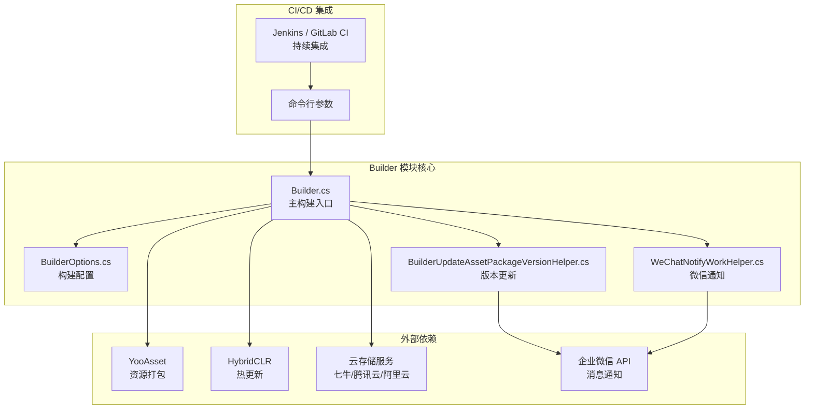
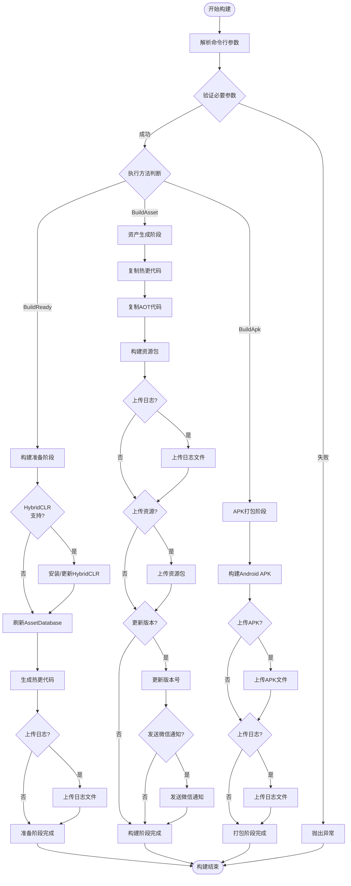

# 概述

GameFrameX Builder 是 GameFrameX 游戏框架的 Unity 自动化构建模块，提供完整的 CI/CD 构建流程支持。该模块通过命令行参数驱动的构建方式，能够与 Jenkins、GitLab CI、GitHub Actions 等持续集成平台无缝集成，实现游戏项目的自动化打包、资产生成和版本发布。

## Overview

GameFrameX Builder 是 GameFrameX 游戏框架的核心组件之一，专注于解决 Unity 游戏项目的自动化构建问题。在游戏开发过程中，频繁的版本发布和多渠道打包是一项耗时且容易出错的工作。Builder 模块通过标准化的命令行接口和模块化的构建流程设计，将这些重复性工作自动化，从而显著提升开发效率和发布质量。

该模块的核心设计理念是将构建过程拆分为多个独立的阶段，每个阶段专注于特定的任务。这种设计不仅提高了代码的可维护性，还使得构建流程可以根据项目需求进行灵活配置。从技术实现角度来看，Builder 模块深度整合了 HybridCLR 热更新解决方案、YooAsset 资源管理系统以及多种云存储服务，形成了一套完整的游戏发布解决方案。

## 架构设计

GameFrameX Builder 采用模块化的架构设计，将构建过程中的不同功能分离到独立的类中实现。这种设计模式使得每个模块的职责清晰明确，便于维护和扩展。以下是 Builder 模块的整体架构图：



从架构图中可以看出，Builder 模块处于整个构建流程的核心位置，它负责协调各个外部依赖组件的工作。命令行参数首先被解析为 BuilderOptions 对象，然后 Builder 主类根据这些配置执行相应的构建任务。构建过程中产生的资源包可以通过云存储服务进行上传，同时版本更新信息可以通过企业微信自动通知相关人员。

## 核心功能

### 命令行构建支持

GameFrameX Builder 完全基于命令行运行，所有的构建参数都通过命令行传递。这种设计使得构建过程可以完全自动化，无需人工干预。在 Builder.cs 中，通过 `BuildParamsParse()` 方法解析命令行参数，将各种构建选项存储到 BuilderOptions 对象中。

```csharp
private static void BuildParamsParse()
{
    var commandLineArgs = Environment.GetCommandLineArgs();
    _builderOptions = new BuilderOptions();
    for (var index = 0; index < commandLineArgs.Length; index++)
    {
        var commandLineArg = commandLineArgs[index];
        if (commandLineArg == "-logFile")
        {
            _builderOptions.LogFilePath = commandLineArgs[index + 1].Replace("/Unity/", "/");
        }
        else if (commandLineArg == "-executeMethod")
        {
            _builderOptions.ExecuteMethod = commandLineArgs[index + 1].Trim();
        }
        // ... 更多参数解析
    }
}
```
> Source: [Builder.cs](https://github.com/GameFrameX/com.gameframex.unity.builder/blob/main/Editor/Builder.cs#L60-L74)

这种参数解析机制支持丰富的构建选项，包括构建编号、任务名称、包名、版本号、渠道名称等。通过合理配置这些参数，开发团队可以实现完全自定义的构建流程。

### 资产生成与打包

Builder 模块集成了 YooAsset 资源管理系统，提供强大的资产生成和打包功能。在 `BuildAsset()` 方法中，实现了完整的资源打包流程，包括热更新代码复制、AOT 代码处理、资源包构建等步骤。

```csharp
public static void BuildAsset()
{
    // 复制热更新程序集
    Debug.Log("BuildReady Start Copy Hotfix Code");
    BuildHotfixHelper.CopyHotfixCode();
    AssetDatabase.Refresh();
    
    // 复制AOT代码
    Debug.Log("BuildReady Start Copy AOT Code");
    BuildHotfixHelper.CopyAOTCode();
    AssetDatabase.Refresh();
    
    // 构建资源包
    var buildInFileCopyParams = AssetBundleBuilderSetting.GetPackageBuildinFileCopyParams(_builderOptions.PackageName, EBuildPipeline.BuiltinBuildPipeline);
    BuiltinBuildPipeline pipeline = new BuiltinBuildPipeline();
    BuildParameters buildParameters = new BuildParameters();
    buildParameters.BuildMode = _builderOptions.IsIncrementalBuildPackage ? EBuildMode.IncrementalBuild : EBuildMode.ForceRebuild;
    // ... 更多配置
    pipeline.Run(buildParameters, true);
}
```
> Source: [Builder.cs](https://github.com/GameFrameX/com.gameframex.unity.builder/blob/main/Editor/Builder.cs#L255-L296)

资源打包支持增量构建和全量构建两种模式，开发者可以根据实际需求选择合适的构建方式。增量构建模式可以显著减少构建时间，特别适合开发阶段的频繁打包需求。

### 热更新支持

Builder 模块原生支持 HybridCLR 热更新解决方案。在构建准备阶段（`BuildReady()` 方法），系统会自动检查 HybridCLR 的安装状态，并在必要时进行自动安装和配置。这一功能对于需要支持热更新的游戏项目至关重要。

```csharp
public static void BuildReady()
{
#if ENABLE_GAME_FRAME_X_HYBRID_CLR
    Debug.Log("BuildReady Start HybridCLR");
    var installerController = new InstallerController();
    var isInstalled = installerController.HasInstalledHybridCLR();
    if (!isInstalled || installerController.InstalledLibil2cppVersion != installerController.PackageVersion)
    {
        installerController.InstallDefaultHybridCLR();
    }
    // 生成热更新代理
    PrebuildCommand.GenerateAll();
#endif
    AssetDatabase.Refresh();
}
```
> Source: [Builder.cs](https://github.com/GameFrameX/com.gameframex.unity.builder/blob/main/Editor/Builder.cs#L215-L244)

通过条件编译指令 `ENABLE_GAME_FRAME_X_HYBRID_CLR`，开发者可以灵活控制是否启用热更新功能。这种设计使得模块可以同时满足需要热更新和不需要热更新的不同项目需求。

### 云存储集成

GameFrameX Builder 支持多种云存储服务的集成，包括七牛云、腾讯云和阿里云。通过统一的接口设计，可以方便地在不同云服务商之间切换。在构建过程中，生成的资源包和 APK 文件可以自动上传到指定的云存储空间。

```csharp
#if ENABLE_GAME_FRAME_X_OBJECT_STORAGE
#if ENABLE_GAME_FRAME_X_OBJECT_STORAGE_QI_NIU
    ObjectStorageUploadManager = ObjectStorageUploadFactory.Create<QiNiuYunObjectStorageUploadManager>(_builderOptions.ObjectStorageKey, _builderOptions.ObjectStorageSecret, _builderOptions.ObjectStorageBucketName, _builderOptions.ObjectStorageEndPoint);
#endif

#if ENABLE_GAME_FRAME_X_OBJECT_STORAGE_TENCENT
    ObjectStorageUploadManager = ObjectStorageUploadFactory.Create<TencentCloudObjectStorageUploadManager>(_builderOptions.ObjectStorageKey, _builderOptions.ObjectStorageSecret, _builderOptions.ObjectStorageBucketName, _builderOptions.ObjectStorageEndPoint);
#endif

#if ENABLE_GAME_FRAME_X_OBJECT_STORAGE_A_LI_YUN
    ObjectStorageUploadManager = ObjectStorageUploadFactory.Create<ALiYunObjectStorageUploadManager>(_builderOptions.ObjectStorageKey, _builderOptions.ObjectStorageSecret, _builderOptions.ObjectStorageBucketName, _builderOptions.ObjectStorageEndPoint);
#endif
#endif
```
> Source: [Builder.cs](https://github.com/GameFrameX/com.gameframex.unity.builder/blob/main/Editor/Builder.cs#L32-L54)

云存储上传功能通过 `IObjectStorageUploadManager` 接口进行抽象，使用工厂模式创建不同云服务商的具体实现。这种设计遵循了开闭原则，便于未来添加新的云存储支持。

### 版本管理与通知

Builder 模块提供了完整的版本管理功能。构建完成后，可以自动更新资源包版本号，并通过企业微信发送构建通知。这些功能大大提升了团队协作效率，使得相关人员能够及时了解构建状态和版本信息。

```csharp
if (_builderOptions.IsUpdateAssetPackageVersion)
{
    var result = BuilderUpdateAssetPackageVersionHelper.Run(buildParameters, _builderOptions);
    if (result)
    {
        WeChatNotifyWorkHelper.Run(buildParameters, _builderOptions);
    }
}
```
> Source: [Builder.cs](https://github.com/GameFrameX/com.gameframex.unity.builder/blob/main/Editor/Builder.cs#L335-L342)

版本更新通过 HTTP POST 请求将构建信息发送到指定的服务器，而微信通知则使用企业微信的 Webhook 接口发送 Markdown 格式的构建报告。

## 构建流程

GameFrameX Builder 的构建流程分为多个阶段，每个阶段都有明确的目标和职责。以下是完整的构建流程图：



从流程图中可以看出，Builder 模块支持三种主要的构建方法：构建准备（BuildReady）、资产生成（BuildAsset）和 APK 打包（BuildApk）。每种方法都可以独立运行，也可以按顺序组合使用以完成完整的构建流程。

## 配置选项

BuilderOptions 类定义了所有可用的构建参数，这些参数通过命令行传递给构建系统。以下是主要的配置选项：

| 选项 | 类型 | 默认值 | 说明 |
|------|------|--------|------|
| ExecuteMethod | string | - | **必需**。指定要执行的构建方法（BuildReady、BuildAsset、BuildApk） |
| BuildNumber | string | - | **必需**。构建编号，用于版本追踪 |
| JobName | string | - | 任务名称，用于区分不同的构建任务 |
| PackageName | string | "DefaultPackage" | 资源包名称 |
| ChannelName | string | "default" | 渠道名称，用于多渠道打包 |
| BundleId | string | - | 包名，为空时使用项目默认包名 |
| AppVersion | string | - | 程序版本号，为空时使用项目默认版本 |
| IsIncrementalBuildPackage | bool | false | 是否使用增量构建 |
| IsUploadAsset | bool | false | 是否上传资源包到云存储 |
| IsUploadApk | bool | false | 是否上传 APK 到云存储 |
| IsUploadLogFile | bool | false | 是否上传日志文件到云存储 |
| IsUpdateAssetPackageVersion | bool | false | 是否更新资源包版本 |
| UpdateAssetPackageVersionUrl | string | - | 版本更新服务器的 URL |
| UpdateAssetPackageVersionAuthorization | string | - | 版本更新请求的授权信息 |
| WeChatBotKey | string | - | 企业微信机器人的 Key |
| Language | string | "default" | 多语言配置 |

## 使用场景

GameFrameX Builder 适用于多种游戏开发和发布场景：

**持续集成环境**：在 Jenkins、GitLab CI 或 GitHub Actions 中配置自动化构建任务，当代码提交或合并到主分支时自动触发构建流程。Builder 的命令行接口可以方便地与这些 CI 系统集成，实现全自动化的构建和发布。

**多渠道打包**：通过配置不同的 ChannelName 和 PackageName 参数，可以快速生成针对不同渠道的游戏包。这种能力对于需要在多个平台或渠道发布游戏的项目尤为重要。

**热更新发布**：结合 HybridCLR 热更新功能，可以在不重新发布游戏的情况下更新游戏内容。Builder 自动处理热更新代码的复制和打包，简化了热更新的发布流程。

**版本管理**：通过版本更新和微信通知功能，团队成员可以及时了解每次构建的结果和变更内容，提高协作效率。

## 相关链接

- [安装](./2-installation) - 了解如何安装和配置 Builder 模块
- [快速开始](./3-getting-started) - 快速上手 Builder 的基本使用
- [使用方法](./4-usage) - 详细的构建命令和使用方法
- [配置选项](./5-configuration) - 完整的配置参数参考
- [对象存储](./6-object-storage) - 云存储服务配置指南
- [常见问题](./7-troubleshooting) - 常见问题排查和解决方案

- 官方文档：https://gameframex.doc.alianblank.com
- GitHub 仓库：https://github.com/GameFrameX/com.gameframex.unity.builder
