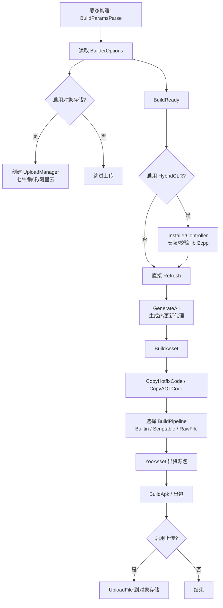

# 工作原理:Builder 流水线

Builder 流水线是 GameFrameX Unity Builder 在 Editor 端按顺序触发的一组打包入口,负责从 `BuildReady` 准备环境,到 `BuildAsset` 构建 YooAsset 资源包,再到 `BuildApk` 出包并可选地上传到对象存储。整条流水线通过 `Builder.cs` 中以 `partial` 方式分文件组织的静态方法串联,每个方法对应一个流水线阶段。

## 流水线阶段一览

| 阶段 | 入口方法 | 主要工作 |
|------|---------|---------|
| 1. 参数解析 | `Builder.BuildParamsParse()`(静态构造函数中调用) | 解析 JSON 配置文件并填充 `BuilderOptions`;按脚本宏创建 `IObjectStorageUploadManager`(七牛/腾讯云/阿里云) |
| 2. 构建准备 | `Builder.BuildReady()` | 启用 HybridCLR 时安装/校验 libil2cpp、刷新 `AssetDatabase`、生成热更新代理 |
| 3. 构建资源 | `Builder.BuildAsset()` | 复制热更新与 AOT 程序集、选择构建管线、调用 YooAsset 出资源包 |
| 4. 出包 | `Builder.BuildApk()`(其它平台类似方法) | 调用平台构建器,可选上传 APK 与日志到对象存储 |

## 工作原理速览



## 阶段 1:参数解析

`Builder.cs` 的静态构造函数会先调用 `BuildParamsParse()` 读取 JSON 配置填充 `_builderOptions`,再按脚本宏决定是否实例化对象存储上传管理器,并设置保存路径模板。

Source:[Editor/Builder.cs#L32-L49](https://github.com/GameFrameX/com.gameframex.unity.builder/blob/main/Editor/Builder.cs#L32-L49)

```csharp
static Builder()
{
    BuildParamsParse();
#if ENABLE_GAME_FRAME_X_OBJECT_STORAGE_QI_NIU
    ObjectStorageUploadManager = ObjectStorageUploadFactory.Create<QiNiuYunObjectStorageUploadManager>(
        _builderOptions.ObjectStorageKey, _builderOptions.ObjectStorageSecret,
        _builderOptions.ObjectStorageBucketName, _builderOptions.ObjectStorageEndPoint);
#endif
    /* ... 腾讯云 / 阿里云分支类似 ... */
    ObjectStorageUploadManager.SetSavePath($"builder/{PlayerSettings.productName}/{EditorUserBuildSettings.activeBuildTarget}/{_builderOptions.JobName}/{Application.version}/{_builderOptions.BuildNumber}");
}
```

## 阶段 2:`BuildReady` 构建准备

`BuildReady` 在开始打包前把环境拉到一致:HybridCLR 启用时校验/安装 libil2cpp,刷新 AssetDatabase,生成 HybridCLR 热更新代理;之后如开启了日志上传,会把日志先上传一次。

Source:[Editor/Builder.BuildReady.cs#L15-L50](https://github.com/GameFrameX/com.gameframex.unity.builder/blob/main/Editor/Builder.BuildReady.cs#L15-L50)

```csharp
public static void BuildReady()
{
#if ENABLE_GAME_FRAME_X_HYBRID_CLR
    var installerController = new InstallerController();
    var isInstalled = installerController.HasInstalledHybridCLR();
    if (!isInstalled || installerController.InstalledLibil2cppVersion != installerController.PackageVersion)
    {
        installerController.InstallDefaultHybridCLR();
    }
    PrebuildCommand.GenerateAll();
#endif
    AssetDatabase.Refresh();
    if (_builderOptions.IsUploadLogFile)
    {
        ObjectStorageUploadManager.UploadFile(_builderOptions.LogFilePath);
    }
}
```

## 阶段 3:`BuildAsset` 构建资源

`BuildAsset` 先把热更新/AOT 程序集拷贝到运行时目录,再根据 `_builderOptions.BuildPipeline` 选择 `BuiltinBuildPipeline`、`ScriptableBuildPipeline` 或 `RawFileBuildPipeline`,最后调用 YooAsset 出包。

Source:[Editor/Builder.BuildAsset.cs#L15-L80](https://github.com/GameFrameX/com.gameframex.unity.builder/blob/main/Editor/Builder.BuildAsset.cs#L15-L80)

```csharp
BuildHotfixHelper.CopyHotfixCode();
AssetDatabase.Refresh();
BuildHotfixHelper.CopyAOTCode();
AssetDatabase.Refresh();

var buildPipeline = (EBuildPipeline)buildPipelineObj;
switch (buildPipeline)
{
    case EBuildPipeline.ScriptableBuildPipeline:
        pipeline = new ScriptableBuildPipeline();
        buildParameters = new ScriptableBuildParameters();
        break;
    case EBuildPipeline.RawFileBuildPipeline:
        pipeline = new RawFileBuildPipeline();
        buildParameters = new RawFileBuildParameters();
        break;
    default:
        pipeline = new BuiltinBuildPipeline();
        buildParameters = new BuiltinBuildParameters();
        break;
}
buildParameters.BuildMode = _builderOptions.IsIncrementalBuildPackage ? EBuildMode.IncrementalBuild : EBuildMode.ForceRebuild;
```

`EBuildPipeline` 字符串配置错误时会打印 `无效的构建管线类型` 并直接 `return`,不会进入出包阶段。

## 阶段 4:`BuildApk` 出包与上传

`BuildApk` 委托 `BuildProductHelper.BuildPlayerAndroid()` 出 APK,然后按 `IsUploadApk` / `IsUploadLogFile` 选项,把产物与日志上传到对象存储。

Source:[Editor/Builder.cs#L62-L78](https://github.com/GameFrameX/com.gameframex.unity.builder/blob/main/Editor/Builder.cs#L62-L78)

```csharp
public static void BuildApk()
{
    var apkPath = BuildProductHelper.BuildPlayerAndroid();
    if (_builderOptions.IsUploadApk)
    {
        ObjectStorageUploadManager.UploadFile(apkPath);
    }
    if (_builderOptions.IsUploadLogFile)
    {
        ObjectStorageUploadManager.UploadFile(_builderOptions.LogFilePath);
    }
}
```

## 关键配置项(`BuilderOptions`)

| 字段 | 作用 | 默认值 |
|------|------|--------|
| `BuildPipeline` | 选 `BuiltinBuildPipeline` / `ScriptableBuildPipeline` / `RawFileBuildPipeline` | — |
| `PackageName` | YooAsset 资源包名 | — |
| `PackageVersion` | 资源包版本号,空时取 `yyyyMMddHHmmss` | 空字符串 |
| `IsIncrementalBuildPackage` | `true`=增量构建,`false`=强制重建 | — |
| `BuildinFileCopyOption` | 内置文件拷贝选项,空时按 `ClearAndCopyAll` | 空字符串 |
| `IsUploadApk` / `IsUploadLogFile` | 是否上传 APK / 日志 | — |
| `ObjectStorageKey/Secret/BucketName/EndPoint` | 对象存储凭据 | 空字符串 |
| `JobName` / `BuildNumber` | 拼到对象存储路径 `builder/{product}/{target}/{job}/{version}/{buildNumber}` | 空字符串 |

Source:[Editor/BuilderOptions.cs#L1-L60](https://github.com/GameFrameX/com.gameframex.unity.builder/blob/main/Editor/BuilderOptions.cs#L1-L60)

## 上传路径模板

对象存储启用后,保存路径统一为:

```text
builder/{PlayerSettings.productName}/{activeBuildTarget}/{JobName}/{Application.version}/{BuildNumber}
```

Source:[Editor/Builder.cs#L47](https://github.com/GameFrameX/com.gameframex.unity.builder/blob/main/Editor/Builder.cs#L47)

## 接下来

- 关于各平台出包方法的差异,见《平台出包》任务页(若目录中存在)。
- 关于 `BuilderOptions` 字段的完整清单,见《构建选项速查》参考页。
- 关于构建失败的排查,见《构建失败怎么办》排查页。