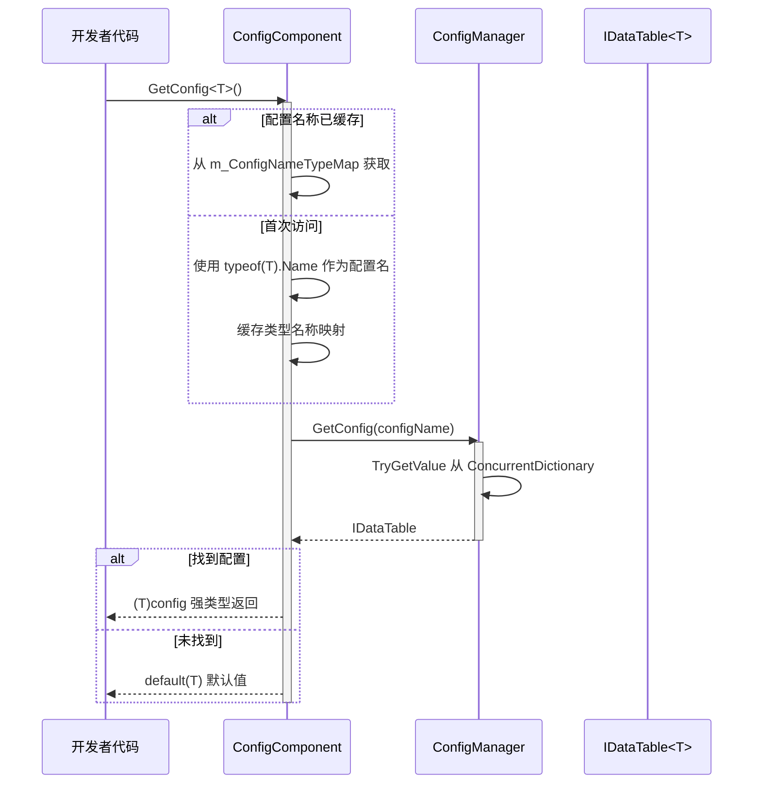
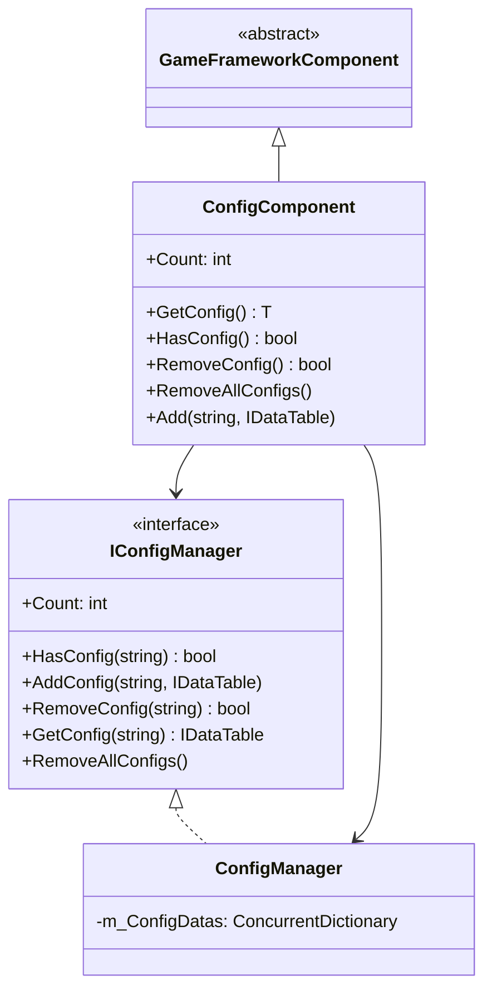

# ConfigComponent 配置组件

ConfigComponent 是 GameFrameX 配置系统的 Unity 组件层，作为游戏配置管理的核心入口，提供类型安全的配置数据访问能力。

## 概述

ConfigComponent 是 Unity 场景中的 `MonoBehaviour` 组件，继承自 `GameFrameworkComponent`。它充当了配置管理系统与 Unity 引擎之间的桥梁，使开发者能够在游戏运行时方便地获取和管理配置数据。

### 核心职责

- **类型安全的配置访问**：通过泛型方法提供编译时类型检查
- **配置缓存管理**：维护类型到配置名称的映射关系
- **统一配置入口**：封装 ConfigManager 的复杂性，提供简洁的 API
- **生命周期管理**：在 Awake 阶段初始化配置管理器

### 设计意图

ConfigComponent 采用门面模式（Facade Pattern）设计，旨在简化配置管理的复杂性。开发者无需直接与 ConfigManager 交互，只需通过 ConfigComponent 即可完成配置的获取、查询和管理操作。泛型方法的使用确保了编译时的类型安全，减少了运行时错误。

## 架构

### 组件层次结构

```mermaid
graph TD
    subgraph Unity["Unity 层 (Scene)"]
        ConfigComp["ConfigComponent<br/>(MonoBehaviour)"]
    end
    
    subgraph Framework["GameFrameX 核心层"]
        IConfigMgr["IConfigManager<br/>(接口)"]
        ConfigMgr["ConfigManager<br/>(实现)"]
    end
    
    subgraph Data["数据层"]
        IDataTable["IDataTable<T><br/>(接口)"]
        BaseDataTable["BaseDataTable<T><br/>(基类)"]
        CustomDT["自定义数据表<br/>(继承BaseDataTable)"]
    end
    
    ConfigComp -->|"获取配置"| IConfigMgr
    IConfigMgr <|.. ConfigMgr
    ConfigMgr -->|"存储/查询"| IDataTable
    IDataTable <|.. BaseDataTable
    BaseDataTable <|-- CustomDT
```

### 配置访问流程



## 核心功能

### 配置获取

ConfigComponent 提供了两种方式获取配置：

1. **泛型方法获取**（推荐）：自动使用类型名称作为配置键
2. **手动添加配置**：允许显式指定配置名称和实例

### 类型名称映射机制

内部使用 `ConcurrentDictionary<Type, string>` 缓存类型到名称的映射，避免频繁调用 `typeof(T).Name`：

```csharp
private ConcurrentDictionary<Type, string> m_ConfigNameTypeMap = new ConcurrentDictionary<Type, string>();
```

> Source: [ConfigComponent.cs](https://github.com/GameFrameX/com.gameframex.unity.config/blob/main/Runtime/Config/ConfigComponent.cs#L51)

### 配置数量统计

通过 `Count` 属性可以快速获取当前已加载的配置项总数：

```csharp
public int Count
{
    get { return m_ConfigManager.Count; }
}
```

> Source: [ConfigComponent.cs](https://github.com/GameFrameX/com.gameframex.unity.config/blob/main/Runtime/Config/ConfigComponent.cs#L61-L64)

## 使用示例

### 在 Unity 场景中使用

1. 在 Unity 编辑器中创建空物体
2. 添加 `GameFrameX/Config` 组件（自动添加 ConfigComponent）
3. 通过脚本获取并使用配置

### 获取配置数据

```csharp
using GameFrameX.Config.Runtime;

// 获取配置组件
var configComponent = UnityEngine.GameObject.Find("GameFrameX").GetComponent<ConfigComponent>();

// 检查配置是否存在
if (configComponent.HasConfig<WeaponDataTable>())
{
    // 获取配置
    var weaponTable = configComponent.GetConfig<WeaponDataTable>();
    
    // 通过 ID 获取数据
    var weapon = weaponTable[1001];
    
    // 使用 TryGet 安全获取
    if (weaponTable.TryGetValue(1001, out var weapon2))
    {
        // 使用 weapon2
    }
}
```

> Source: [ConfigComponent.cs](https://github.com/GameFrameX/com.gameframex.unity.config/blob/main/Runtime/Config/ConfigComponent.cs#L117-L127)

### 添加自定义配置

```csharp
// 手动添加配置
var customTable = new MyCustomDataTable();
configComponent.Add("MyCustomConfig", customTable);

// 移除指定配置
configComponent.RemoveConfig<WeaponDataTable>();

// 清空所有配置
configComponent.RemoveAllConfigs();
```

> Source: [ConfigComponent.cs](https://github.com/GameFrameX/com.gameframex.unity.config/blob/main/Runtime/Config/ConfigComponent.cs#L153-L170)

### 数据表查询示例

```csharp
var config = configComponent.GetConfig<ItemDataTable>();

// 获取所有数据
var allItems = config.All;

// 条件查询
var rareItems = config.FindList(item => item.Quality >= 4);

// 聚合操作
var maxPrice = config.Max(item => item.Price);
var totalCount = config.Sum(item => item.Count);

// 遍历操作
config.ForEach(item => {
    UnityEngine.Debug.Log(item.Name);
});
```

> Source: [BaseDataTable.cs](https://github.com/GameFrameX/com.gameframex.unity.config/blob/main/Runtime/Config/Config/BaseDataTable.cs#L296-L349)

## API 参考

### 属性

#### `Count: int`

获取全局配置项数量。

```csharp
int count = configComponent.Count;
```

| 属性 | 值 |
|------|-----|
| 类型 | `int` |
| 访问 | 只读 |
| 说明 | 返回 ConfigManager 中存储的配置项总数 |

### 方法

#### `GetConfig<T>(): T`

获取指定类型的全局配置项。

```csharp
var config = configComponent.GetConfig<WeaponDataTable>();
```

| 参数 | 类型 | 说明 |
|------|------|------|
| T | 泛型参数 | 配置项类型，必须实现 `IDataTable` 接口 |

| 返回值 | 说明 |
|--------|------|
| T | 找到的配置项；未找到时返回 `default(T)` |

> Source: [ConfigComponent.cs](https://github.com/GameFrameX/com.gameframex.unity.config/blob/main/Runtime/Config/ConfigComponent.cs#L117-L127)

---

#### `HasConfig<T>(): bool`

检查指定类型的配置项是否存在。

```csharp
bool exists = configComponent.HasConfig<MonsterDataTable>();
```

| 参数 | 类型 | 说明 |
|------|------|------|
| T | 泛型参数 | 配置项类型，必须实现 `IDataTable` 接口 |

| 返回值 | 说明 |
|--------|------|
| `bool` | 配置项存在返回 `true`，否则返回 `false` |

> Source: [ConfigComponent.cs](https://github.com/GameFrameX/com.gameframex.unity.config/blob/main/Runtime/Config/ConfigComponent.cs#L138-L142)

---

#### `RemoveConfig<T>(): bool`

移除指定类型的配置项。

```csharp
bool success = configComponent.RemoveConfig<WeaponDataTable>();
```

| 参数 | 类型 | 说明 |
|------|------|------|
| T | 泛型参数 | 配置项类型，必须实现 `IDataTable` 接口 |

| 返回值 | 说明 |
|--------|------|
| `bool` | 移除成功返回 `true`；配置不存在返回 `false` |

> Source: [ConfigComponent.cs](https://github.com/GameFrameX/com.gameframex.unity.config/blob/main/Runtime/Config/ConfigComponent.cs#L153-L157)

---

#### `RemoveAllConfigs(): void`

清空所有全局配置项。

```csharp
configComponent.RemoveAllConfigs();
```

> Source: [ConfigComponent.cs](https://github.com/GameFrameX/com.gameframex.unity.config/blob/main/Runtime/Config/ConfigComponent.cs#L166-L170)

---

#### `Add(configName: string, dataTable: IDataTable): void`

增加指定的全局配置项。

```csharp
configComponent.Add("MyConfig", myDataTable);
```

| 参数 | 类型 | 说明 |
|------|------|------|
| configName | `string` | 全局配置项的名称 |
| dataTable | `IDataTable` | 全局配置项的数据表实例 |

> Source: [ConfigComponent.cs](https://github.com/GameFrameX/com.gameframex.unity.config/blob/main/Runtime/Config/ConfigComponent.cs#L181-L184)

## 继承结构



## 相关链接

- [ConfigManager 配置管理器](./4-core-concepts.config-manager)
- [IDataTable 数据表接口](./4-core-concepts.idata-table)
- [接口定义](./5-api-reference.interfaces)
- [事件参数](./5-api-reference.event-args)
- [二进制配置表](./6-configuration.binary-config)
- [脚本宏定义](./6-configuration.scripting-define-symbols)
