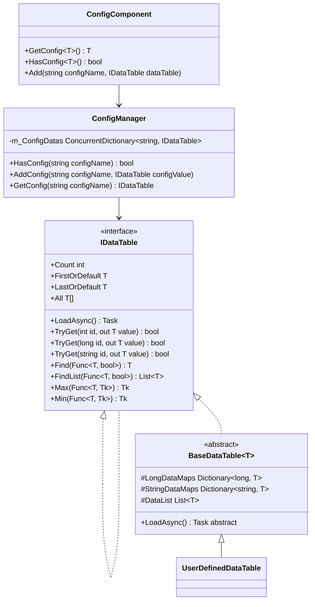
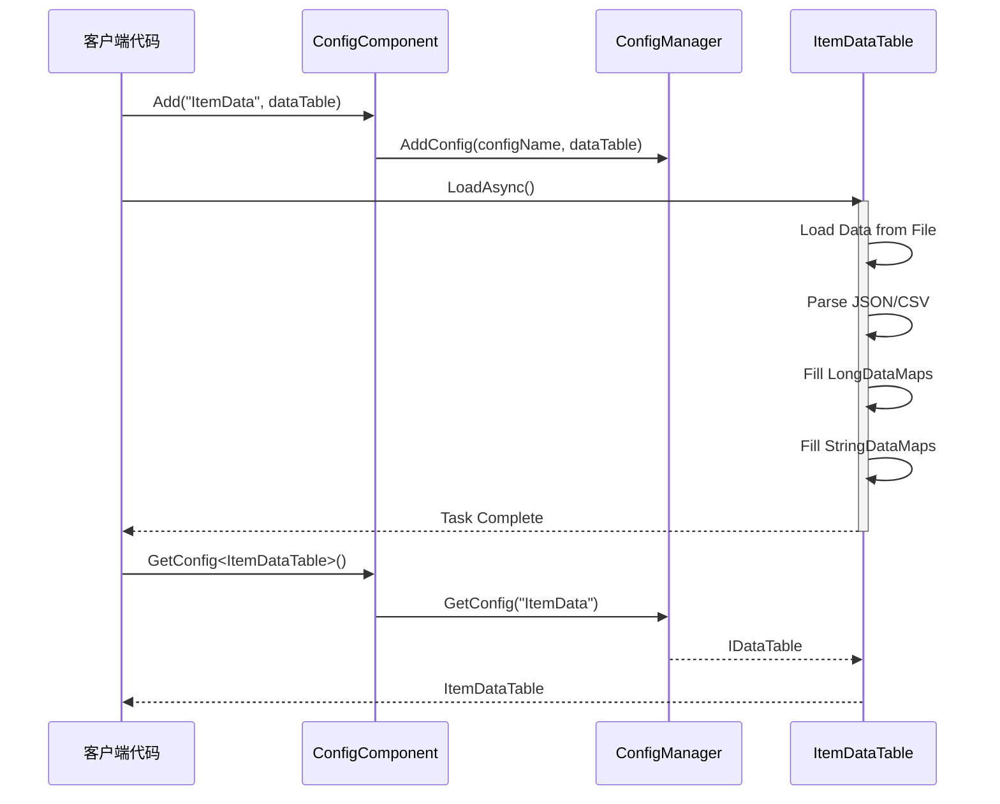

# 数据表定义

数据表（Data Table）是 GameFrameX Config 配置系统中用于存储和管理配置数据的核心抽象。通过数据表，开发者可以高效地访问、查询和管理游戏配置。

## 概述

数据表是 GameFrameX 配置系统的核心组成部分，提供了一种类型安全的方式来存储和检索配置数据。每个数据表本质上是一个键值对集合，支持通过整数 ID、长整数 ID 或字符串 ID 进行快速查找。

数据表系统的主要设计目标是：

- **高性能查询**：使用 Dictionary 实现 O(1) 时间复杂度的数据查找
- **类型安全**：通过泛型接口确保编译时类型检查
- **灵活的数据组织**：支持多种主键类型，满足不同业务场景
- **丰富的查询操作**：提供类似 LINQ 的查询接口，支持条件筛选、聚合计算等操作

## 数据表架构

数据表系统采用分层架构设计，从底层到上层依次为：



### 架构层级说明

| 层级 | 组件 | 职责 |
|------|------|------|
| 接口层 | `IDataTable` / `IDataTable<T>` | 定义数据表的抽象操作契约 |
| 实现层 | `BaseDataTable<T>` | 提供数据存储和查询的通用实现 |
| 组件层 | `ConfigComponent` | Unity 组件封装，提供 Inspector 配置界面 |
| 管理层 | `ConfigManager` | 全局配置管理器，负责配置的统一管理 |

## 定义数据表

### 定义数据模型

首先，需要定义数据表中的数据模型（实体类）。数据模型可以是任何引用类型的类：

```csharp
using UnityEngine;

[System.Serializable]
public class ItemData
{
    public int Id;
    public string Name;
    public string Description;
    public int Quality;
    public int Price;
    public string Icon;
}
```

> Source: [数据模型示例](https://github.com/GameFrameX/com.gameframex.unity.config/blob/main/Runtime/Config/Config/BaseDataTable.cs#L46-L48)

### 继承 BaseDataTable

然后，创建一个继承自 `BaseDataTable<T>` 的数据表类，并实现 `LoadAsync` 方法：

```csharp
using GameFrameX.Config.Runtime;
using System.Collections.Generic;
using System.Threading.Tasks;
using UnityEngine;

public class ItemDataTable : BaseDataTable<ItemData>
{
    private const string DataTablePath = "Assets/Game/Configs/ItemData.json";

    public override async Task LoadAsync()
    {
        // 加载数据并填充到字典中
        var jsonText = await LoadJsonAsync(DataTablePath);
        var items = DeserializeItems(jsonText);
        
        foreach (var item in items)
        {
            // 同时添加到长整型和字符串索引中
            LongDataMaps.Add(item.Id, item);
            StringDataMaps.Add(item.Name, item);
            DataList.Add(item);
        }
    }
    
    private Task<string> LoadJsonAsync(string path)
    {
        // 实现资源加载逻辑
        return Task.FromResult(string.Empty);
    }
    
    private List<ItemData> DeserializeItems(string json)
    {
        // 实现反序列化逻辑
        return new List<ItemData>();
    }
}
```

> Source: [BaseDataTable 定义](https://github.com/GameFrameX/com.gameframex.unity.config/blob/main/Runtime/Config/Config/BaseDataTable.cs#L48-L69)

### 注册数据表

在 Unity 场景中添加 ConfigComponent 组件，并注册数据表：

```csharp
using UnityEngine;
using GameFrameX.Config.Runtime;

public class GameBootstrap : MonoBehaviour
{
    private ConfigComponent _configComponent;
    
    private async void Start()
    {
        _configComponent = FindObjectOfType<ConfigComponent>();
        
        // 创建并加载数据表
        var itemDataTable = new ItemDataTable();
        await itemDataTable.LoadAsync();
        
        // 注册到 ConfigComponent
        _configComponent.Add("ItemData", itemDataTable);
    }
}
```

> Source: [ConfigComponent.Add 方法](https://github.com/GameFrameX/com.gameframex.unity.config/blob/main/Runtime/Config/ConfigComponent.cs#L181-L184)

## 数据表操作

### 基本查询

数据表支持多种查询方式：

```csharp
// 通过索引器获取（推荐）
var item = _configComponent.GetConfig<ItemDataTable>()[1001];

// 使用 TryGet 方法获取（安全版本）
if (_configComponent.GetConfig<ItemDataTable>().TryGet(1001, out var item))
{
    Debug.Log($"找到物品: {item.Name}");
}

// 通过字符串键获取
var itemByName = _configComponent.GetConfig<ItemDataTable>()["武器"];
```

> Source: [TryGet 实现](https://github.com/GameFrameX/com.gameframex.unity.config/blob/main/Runtime/Config/Config/BaseDataTable.cs#L128-L162)

### 条件查询

数据表提供了类似 LINQ 的查询接口：

```csharp
var dataTable = _configComponent.GetConfig<ItemDataTable>();

// 查找第一个匹配的元素
var firstQualityItem = dataTable.Find(item => item.Quality == 1);

// 查找所有匹配的元素
var expensiveItems = dataTable.FindList(item => item.Price > 1000);

// 遍历所有元素
dataTable.ForEach(item => 
{
    Debug.Log($"{item.Name}: {item.Price}");
});
```

> Source: [Find 和 ForEach 方法](https://github.com/GameFrameX/com.gameframex.unity.config/blob/main/Runtime/Config/Config/BaseDataTable.cs#L296-L349)

### 聚合操作

支持常用的聚合计算：

```csharp
var dataTable = _configComponent.GetConfig<ItemDataTable>();

// 计算所有物品的总价
var totalValue = dataTable.Sum(item => item.Price);

// 获取最高价格的物品
var maxPrice = dataTable.Max(item => item.Price);

// 获取最低价格的物品
var minPrice = dataTable.Min(item => item.Price);

// 获取物品数量
var count = dataTable.Count;
```

> Source: [聚合方法实现](https://github.com/GameFrameX/com.gameframex.unity.config/blob/main/Runtime/Config/Config/BaseDataTable.cs#L351-L449)

## 数据加载流程

数据表的加载遵循异步模式，整个流程如下：



## 核心数据结构

`BaseDataTable<T>` 内部维护三个核心数据结构：

```csharp
protected readonly Dictionary<long, T> LongDataMaps = new Dictionary<long, T>(DefaultSize);
protected readonly Dictionary<string, T> StringDataMaps = new Dictionary<string, T>(DefaultSize);
protected readonly List<T> DataList = new List<T>(DefaultSize);
```

| 数据结构 | 用途 | 访问方式 |
|---------|------|---------|
| `LongDataMaps` | 存储以长整数为主键的数据 | `TryGet(long id)` |
| `StringDataMaps` | 存储以字符串为主键的数据 | `TryGet(string id)` |
| `DataList` | 按插入顺序存储所有数据 | 遍历、聚合操作 |

这种设计确保了：
- 通过主键查询时具有 O(1) 的时间复杂度
- 支持同时通过多种键类型进行查询
- 保留了数据的插入顺序，便于遍历和批量操作

## 缓存机制

为了优化性能，`BaseDataTable<T>` 实现了缓存机制：

```csharp
private bool _cacheInitialized;
private T _firstOrDefaultCache;
private T _lastOrDefaultCache;
private bool _countCacheInitialized;
private int _countCache;
```

> Source: [缓存实现](https://github.com/GameFrameX/com.gameframex.unity.config/blob/main/Runtime/Config/Config/BaseDataTable.cs#L55-L59)

- **首尾缓存**：首次访问 `FirstOrDefault` 或 `LastOrDefault` 时，会遍历数据列表找到第一个和最后一个非空元素并缓存
- **数量缓存**：首次访问 `Count` 属性时，会计算并缓存数据数量

这种懒加载缓存策略避免了在数据加载时进行额外的计算，同时确保了后续访问的高效性。

## 最佳实践

### 数据模型设计

1. **使用值类型字段**：对于简单数据，优先使用值类型（int、float、bool）以减少内存占用
2. **避免嵌套复杂对象**：配置数据应保持扁平化，复杂关系通过 ID 引用实现
3. **添加索引字段**：为需要频繁查询的字段在数据表中添加对应的索引字典

### 性能优化

1. **批量加载**：在游戏启动时一次性加载所有配置数据
2. **按需加载**：对于大型配置，可以使用场景或功能模块按需加载
3. **缓存查询结果**：对于频繁访问的配置数据，考虑添加应用层缓存

### 错误处理

数据表加载失败时，应提供适当的错误处理：

```csharp
try
{
    var dataTable = new ItemDataTable();
    await dataTable.LoadAsync();
    _configComponent.Add("ItemData", dataTable);
}
catch (System.Exception ex)
{
    Debug.LogError($"加载配置失败: {ex.Message}");
    // 使用默认配置或显示错误界面
}
```

## 相关链接

- [ConfigComponent 配置组件](./4-core-concepts.config-component)
- [ConfigManager 配置管理器](./4-core-concepts.config-manager)
- [IDataTable 数据表接口](./4-core-concepts.idata-table)
- [基础使用](./3-getting-started.basic-usage)
