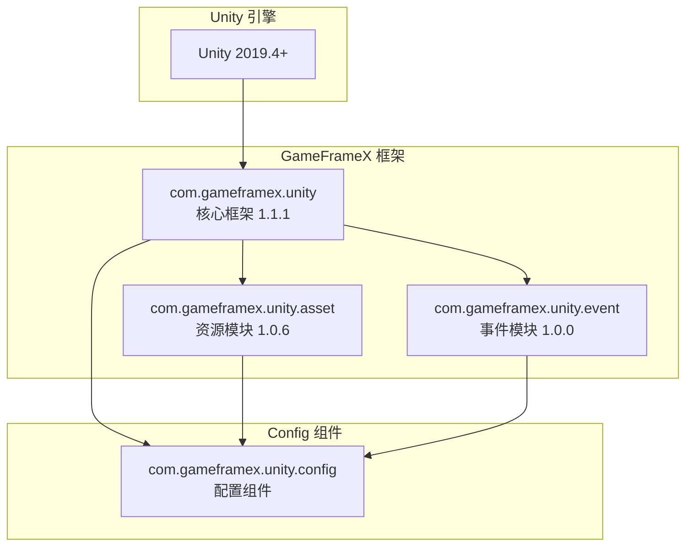

# 依赖要求

本文档详细介绍 Config 配置组件的依赖要求，包括 Unity 版本要求、GameFrameX 核心包依赖以及内部程序集引用关系。

## 概述

Config 配置组件是 GameFrameX 框架的核心模块之一，用于管理游戏中的配置数据表。该组件依赖于 GameFrameX 核心框架的其他模块，需要在满足特定版本要求的 Unity 环境中运行，并正确配置相关依赖包才能正常工作。

## 依赖架构



## Unity 版本要求

| 项目 | 要求 |
|------|------|
| 最低版本 | Unity 2019.4 |
| 推荐版本 | Unity 2020.3 LTS 或更高 |
| 脚本运行时 | .NET Standard 2.0+ |

> Source: [package.json](https://github.com/GameFrameX/com.gameframex.unity.config/blob/main/package.json#L7)

Unity 版本要求定义在 `package.json` 文件的 `unity` 字段中，确保您的项目使用兼容的 Unity 版本以获得最佳兼容性。

## GameFrameX 核心包依赖

Config 组件依赖于以下 GameFrameX 官方包，这些依赖在 `package.json` 中声明：

### 依赖包列表

| 包名 | 最低版本 | 用途说明 |
|------|----------|----------|
| com.gameframex.unity | 1.1.1 | 核心框架，提供基础组件和模块管理功能 |
| com.gameframex.unity.asset | 1.0.6 | 资源加载模块，用于异步加载配置表文件 |
| com.gameframex.unity.event | 1.0.0 | 事件系统，用于配置加载成功/失败等事件通知 |

```json
{
  "dependencies": {
    "com.gameframex.unity": "1.1.1",
    "com.gameframex.unity.asset": "1.0.6",
    "com.gameframex.unity.event": "1.0.0"
  }
}
```

> Source: [package.json](https://github.com/GameFrameX/com.gameframex.unity.config/blob/main/package.json#L21-L25)

### 依赖关系说明

**com.gameframex.unity (核心框架)**
- 提供 `GameFrameworkComponent` 基类，ConfigComponent 继承自此类
- 提供模块管理系统，通过 `GameFrameworkEntry` 获取各模块实例
- 提供程序集工具 `Utility.Assembly` 用于类型反射

**com.gameframex.unity.asset (资源模块)**
- 提供资源异步加载能力，ConfigManager 使用 `GameFrameX.Asset.Runtime` 命名空间
- 用于加载配置表二进制文件或 JSON/XML 配置文件
- 支持配置表的按需加载和缓存管理

**com.gameframex.unity.event (事件模块)**
- 提供事件系统，用于通知配置加载状态
- 定义了以下事件参数类：
  - `LoadConfigSuccessEventArgs`: 配置加载成功事件
  - `LoadConfigFailureEventArgs`: 配置加载失败事件
  - `LoadConfigUpdateEventArgs`: 配置加载更新事件

## 内部程序集引用

Config 组件的运行时程序集 `GameFrameX.Config.Runtime.asmdef` 定义了以下程序集引用：

```csharp
// Runtime/GameFrameX.Config.Runtime.asmdef
{
    "references": [
        "GameFrameX.Runtime",
        "GameFrameX.Event.Runtime",
        "GameFrameX.Asset.Runtime"
    ]
}
```

> Source: [Runtime/GameFrameX.Config.Runtime.asmdef](https://github.com/GameFrameX/com.gameframex.unity.config/blob/main/Runtime/GameFrameX.Config.Runtime.asmdef#L3-L6)

### 程序集引用详情

| 程序集 | 命名空间 | 功能说明 |
|--------|----------|----------|
| GameFrameX.Runtime | `GameFrameX.Runtime` | 核心运行时，提供 GameFrameworkComponent、GameFrameworkModule、IConfigManager 接口 |
| GameFrameX.Event.Runtime | `GameFrameX.Event.Runtime` | 事件系统基础接口和实现 |
| GameFrameX.Asset.Runtime | `GameFrameX.Asset.Runtime` | 资源加载接口和实现 |

### 关键类型依赖

Config 组件中使用的关键类型及其来源：

```csharp
using GameFrameX.Runtime;           // GameFrameworkComponent, GameFrameworkModule
using GameFrameX.Asset.Runtime;      // 资源加载相关接口
using GameFrameX.Event.Runtime;     // 事件参数基类

// ConfigComponent 继承关系
public sealed class ConfigComponent : GameFrameworkComponent

// ConfigManager 继承关系  
public sealed class ConfigManager : GameFrameworkModule, IConfigManager
```

> Source: [Runtime/Config/ConfigComponent.cs](https://github.com/GameFrameX/com.gameframex.unity.config/blob/main/Runtime/Config/ConfigComponent.cs#L48)
> Source: [Runtime/Config/Config/ConfigManager.cs](https://github.com/GameFrameX/com.gameframex.unity.config/blob/main/Runtime/Config/Config/ConfigManager.cs#L47)

## 安装依赖

### 自动安装（推荐）

通过 Unity Package Manager 添加包时，依赖包会自动安装：

1. 打开 Unity 项目的 `Packages/manifest.json` 文件
2. 在 `dependencies` 中添加 Config 组件：

```json
{
  "dependencies": {
    "com.gameframex.unity.config": "https://github.com/AlianBlank/com.gameframex.unity.config.git"
  }
}
```

3. Unity 会自动解析并安装所有必需的依赖包

### 手动安装

如果需要手动安装，请确保按以下顺序安装依赖：

1. **安装核心框架**
   ```json
   { "com.gameframex.unity": "1.1.1" }
   ```

2. **安装资源模块**
   ```json
   { "com.gameframex.unity.asset": "1.0.6" }
   ```

3. **安装事件模块**
   ```json
   { "com.gameframex.unity.event": "1.0.0" }
   ```

4. **最后安装 Config 组件**
   ```json
   { "com.gameframex.unity.config": "1.1.3" }
   ```

## 依赖版本兼容性

| Config 版本 | Unity 版本 | 核心框架版本 | 资源模块版本 | 事件模块版本 |
|------------|------------|--------------|--------------|--------------|
| 1.1.3 | 2019.4+ | 1.1.1 | 1.0.6 | 1.0.0 |
| 1.1.2 | 2019.4+ | 1.1.0 | 1.0.5 | 1.0.0 |
| 1.1.1 | 2019.4+ | 1.1.0 | 1.0.5 | 1.0.0 |

建议始终使用最新版本的依赖包以获得最佳兼容性和新功能支持。

## 常见依赖问题

### 问题 1：缺少核心框架依赖

**症状**: 编译时报错找不到 `GameFrameworkComponent` 类型

**解决方案**: 确保已安装 `com.gameframex.unity` 核心框架包

### 问题 2：事件系统未初始化

**症状**: 配置加载事件无法触发

**解决方案**: 确保 `com.gameframex.unity.event` 已正确安装，并在场景中初始化事件系统

### 问题 3：资源加载失败

**症状**: 配置表文件无法加载

**解决方案**: 确认 `com.gameframex.unity.asset` 版本与要求一致，并检查资源路径配置

## 相关链接

- [安装方式](./2-installation.install-methods) - 了解不同的安装方法
- [ConfigComponent 配置组件](./4-core-concepts.config-component) - 了解组件的使用
- [ConfigManager 配置管理器](./4-core-concepts.config-manager) - 了解管理器功能
- [IDataTable 数据表接口](./4-core-concepts.idata-table) - 了解数据表接口定义
- [官方文档](https://gameframex.doc.alianblank.com/) - GameFrameX 完整文档
