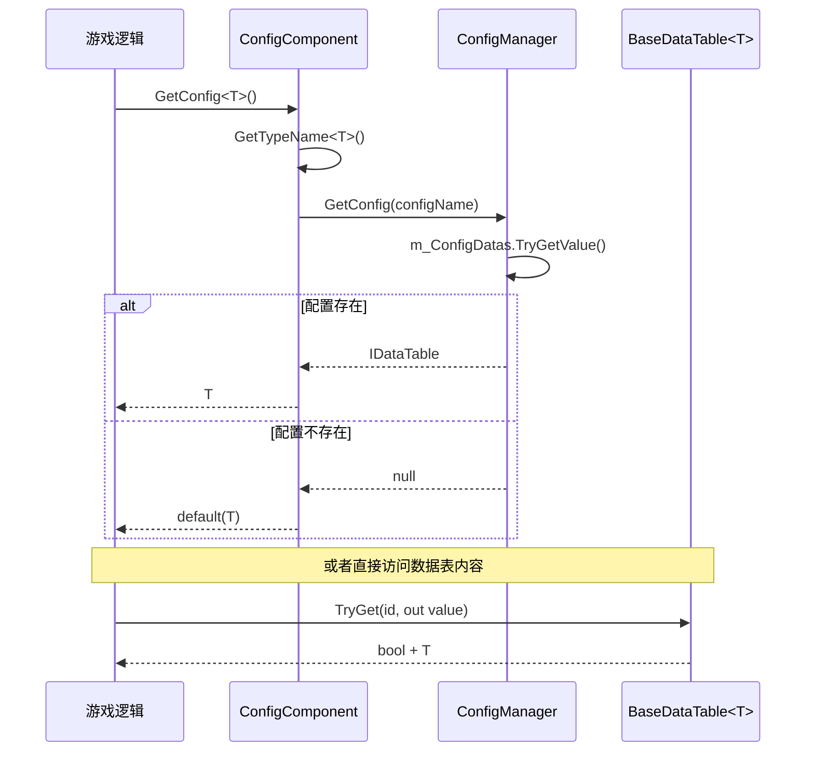

# Config 组件简介

Config 组件是 GameFrameX 框架中用于管理配置表数据的核心模块。它提供了统一的配置加载、存储和查询机制，使配置数据的使用更加简单高效。

## 概述

GameFrameX Config 组件是一个轻量级、高性能的 Unity 配置管理解决方案，专门为游戏开发场景设计。该组件采用模块化架构，将配置数据的存储、查询和管理分离，提供清晰的分层结构。

### 设计目标

- **简化配置访问**：通过泛型接口提供强类型的配置访问方式
- **高性能查询**：支持多种 ID 类型（int、long、string）的快速查找
- **灵活的数据操作**：提供丰富的数据查询和聚合方法
- **事件驱动**：支持配置加载成功/失败的事件通知

### 核心特性

1. **强类型支持**：配置数据以泛型 `IDataTable<T>` 形式访问，编译时类型安全
2. **多键值索引**：支持 `int`、`long`、`string` 三种主键类型的查询
3. **数据聚合能力**：内置 Max、Min、Sum 等聚合函数
4. **异步加载**：配置数据支持异步加载模式
5. **线程安全**：使用 `ConcurrentDictionary` 保证多线程安全

## 架构设计

Config 组件采用三层架构设计，各层职责清晰，依赖关系明确：

```mermaid
graph TD
    subgraph UnityComponent["Unity 组件层"]
        CC[ConfigComponent<br/>配置组件]
    end

    subgraph ManagerLayer["管理器层"]
        ICM[IConfigManager<br/>配置管理器接口]
        CM[ConfigManager<br/>配置管理器实现]
    end

    subgraph DataTableLayer["数据表层"]
        IDataTable[IDataTable<br/>数据表接口]
        IDataTableG[IDataTable&lt;T&gt;<br/>泛型数据表接口]
        BDT[BaseDataTable&lt;T&gt;<br/>数据表基类]
    end

    subgraph EventLayer["事件层"]
        LCSEA[LoadConfigSuccessEventArgs<br/>加载成功事件]
        LCFA[LoadConfigFailureEventArgs<br/>加载失败事件]
    end

    CC --> ICM
    ICM <|.. CM
    IDataTable <|.. IDataTableG
    IDataTableG <|.. BDT
    CM -.->|存储| BDT
```

### 各层职责

| 层级 | 组件 | 职责描述 |
|------|------|----------|
| Unity 组件层 | ConfigComponent | 作为 Unity 组件暴露给场景，提供游戏逻辑调用的入口 |
| 管理器层 | ConfigManager | 管理所有配置表的存储、检索和生命周期 |
| 数据表层 | `BaseDataTable<T>` | 实现具体配置数据的存储和查询逻辑 |
| 事件层 | EventArgs | 提供配置加载状态的事件通知 |

## 核心概念

### 配置组件 (ConfigComponent)

`ConfigComponent` 是直接挂载在 Unity 场景中的组件，继承自 `GameFrameworkComponent`。它负责：

- 初始化 `ConfigManager` 模块
- 提供面向游戏逻辑的配置访问接口
- 维护类型到配置名称的映射

> Source: [ConfigComponent.cs](https://github.com/GameFrameX/com.gameframex.unity.config/blob/main/Runtime/Config/ConfigComponent.cs#L46-L185)

### 配置管理器 (ConfigManager)

`ConfigManager` 是框架内部的配置管理模块，实现了 `IConfigManager` 接口。使用 `ConcurrentDictionary<string, IDataTable>` 存储所有配置表数据。

### 数据表接口 (IDataTable)

数据表接口分为两个层次：

- **IDataTable**：非泛型基础接口，定义通用的异步加载方法
- **`IDataTable<T>`**：泛型接口，继承自 `IDataTable`，提供强类型的数据访问方法

> Source: [IDataTable.cs](https://github.com/GameFrameX/com.gameframex.unity.config/blob/main/Runtime/Config/Config/IDataTable.cs#L39-L355)

### 数据表基类 (`BaseDataTable<T>`)

`BaseDataTable<T>` 是所有具体配置数据表的抽象基类，提供了：

- 内部使用 `Dictionary<long, T>` 和 `Dictionary<string, T>` 分别存储不同主键类型的数据
- 实现了 `TryGet` 系列方法用于安全的查询
- 提供了索引器支持直接通过 `table[id]` 方式访问
- 实现了 `FirstOrDefault`、`LastOrDefault`、`All` 等便捷属性
- 提供了 `Find`、`FindList`、`FindListArray` 等查询方法
- 内置 `Max`、`Min`、`Sum` 等聚合计算方法

> Source: [BaseDataTable.cs](https://github.com/GameFrameX/com.gameframex.unity.config/blob/main/Runtime/Config/Config/BaseDataTable.cs#L40-L520)

## 数据访问流程

配置数据从创建到访问的完整流程如下：



## 快速开始

### 基本使用步骤

1. **创建数据表类**：继承 `BaseDataTable<T>`，实现 `LoadAsync` 方法
2. **挂载组件**：在 Unity 场景中挂载 `ConfigComponent` 组件
3. **获取配置**：通过 `ConfigComponent.GetConfig<T>()` 获取配置实例

### 代码示例

```csharp
// 1. 定义配置数据类型
public class ItemData
{
    public int Id { get; set; }
    public string Name { get; set; }
    public string Description { get; set; }
}

// 2. 创建具体的数据表实现
public class ItemTable : BaseDataTable<ItemData>
{
    public override async Task LoadAsync()
    {
        // 在这里实现从文件或网络加载数据的逻辑
        // 加载完成后将数据添加到字典中
        LongDataMaps.Add(1, new ItemData { Id = 1, Name = "武器", Description = "新手武器" });
        LongDataMaps.Add(2, new ItemData { Id = 2, Name = "护甲", Description = "新手护甲" });
        DataList.AddRange(LongDataMaps.Values);
    }
}

// 3. 在游戏逻辑中使用配置
public class GameManager : MonoBehaviour
{
    private ConfigComponent _configComponent;
    
    private async void Start()
    {
        _configComponent = UnityEngine.Component.FindObjectOfType<ConfigComponent>();
        
        // 加载配置
        var itemTable = new ItemTable();
        await itemTable.LoadAsync();
        _configComponent.Add("ItemTable", itemTable);
        
        // 访问配置数据 - 使用 TryGet 安全获取
        if (itemTable.TryGet(1, out var item))
        {
            Debug.Log($"物品名称: {item.Name}");
        }
        
        // 使用索引器访问
        var item2 = itemTable[2];
        
        // 条件查询
        var foundItems = itemTable.FindList(x => x.Name.Contains("护"));
    }
}
```

> Source: [ConfigComponent.cs](https://github.com/GameFrameX/com.gameframex.unity.config/blob/main/Runtime/Config/ConfigComponent.cs#L108-L127)

## API 概览

### ConfigComponent 核心方法

| 方法 | 描述 |
|------|------|
| `GetConfig<T>()` | 获取指定类型的配置表实例 |
| `HasConfig<T>()` | 检查指定类型的配置是否存在 |
| `RemoveConfig<T>()` | 移除指定类型的配置 |
| `RemoveAllConfigs()` | 移除所有配置 |
| `Add(string, IDataTable)` | 添加新的配置表 |

### `IDataTable<T>` 核心成员

| 成员 | 描述 |
|------|------|
| `TryGet(int/long/string, out T)` | 尝试根据主键获取数据 |
| `this[int/long/string id]` | 索引器，支持直接通过主键访问 |
| `FirstOrDefault` | 获取第一个数据元素 |
| `LastOrDefault` | 获取最后一个数据元素 |
| `All` | 获取所有数据元素 |
| `Find(Func<T, bool>)` | 查找第一个匹配的元素 |
| `FindList(Func<T, bool>)` | 查找所有匹配的元素 |
| `ForEach(Action<T>)` | 遍历所有元素 |
| `Max/Min<Tk>()` | 获取最大值/最小值 |
| `Sum()` | 计算总和 |

## 依赖关系

Config 组件依赖以下 GameFrameX 核心模块：

| 依赖模块 | 最低版本 | 用途说明 |
|----------|----------|----------|
| com.gameframex.unity | 1.1.1 | 核心框架基础 |
| com.gameframex.unity.asset | 1.0.6 | 资源加载支持 |
| com.gameframex.unity.event | 1.0.0 | 事件系统 |

> 详细依赖要求请参考 [依赖要求](../2-installation/dependencies) 文档

## 相关链接

- [功能特性](./1-overview.features) - 了解 Config 组件的完整功能列表
- [安装方式](../2-installation.install-methods) - 掌握组件的正确安装步骤
- [基础使用](../3-getting-started.basic-usage) - 快速上手配置组件的使用
- [数据表定义](../3-getting-started.data-table-definition) - 学习如何定义自己的数据表
- [配置组件详解](../4-core-concepts.config-component) - ConfigComponent 深入解析
- [配置管理器详解](../4-core-concepts.config-manager) - ConfigManager 实现细节
- [IDataTable 接口详解](../4-core-concepts.idata-table) - 数据表接口完整文档
