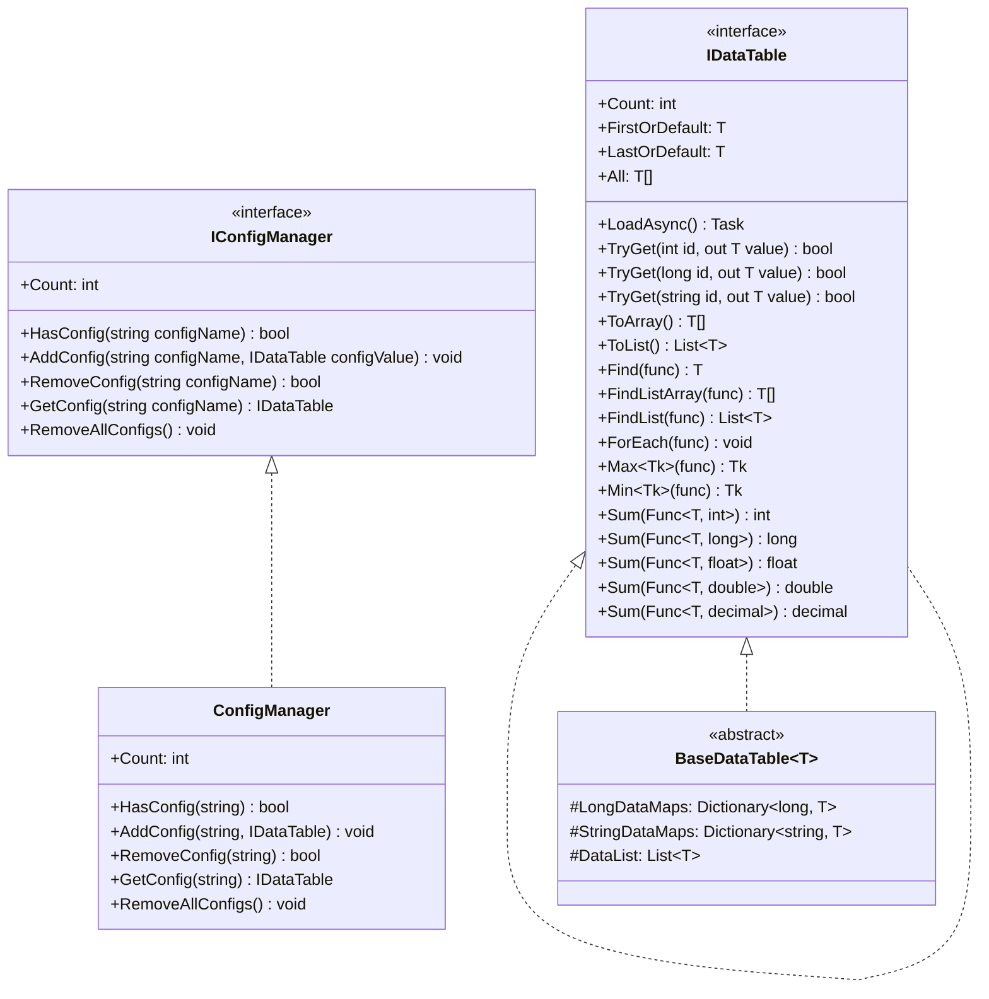
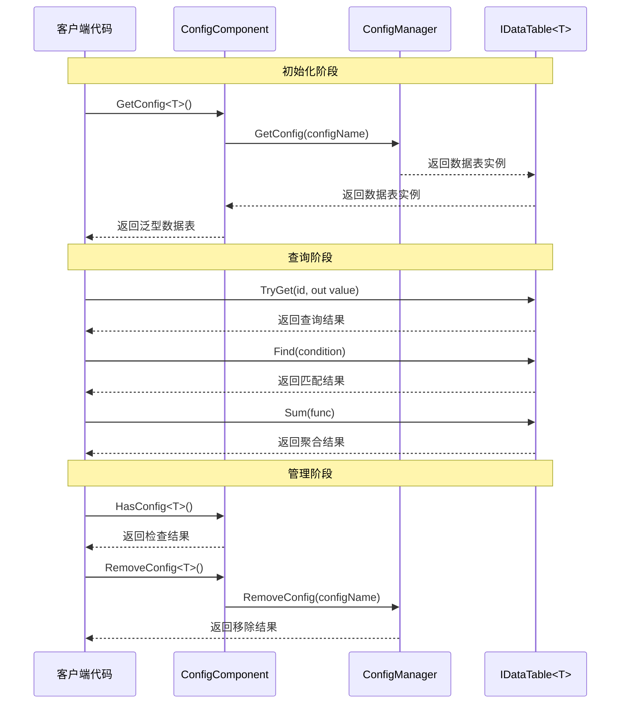

# 接口定义

本文档详细介绍 GameFrameX Config 配置模块中定义的核心接口，包括数据表接口 IDataTable、泛型数据表接口 `IDataTable<T>` 以及全局配置管理器接口 IConfigManager。这些接口为配置系统提供了统一的抽象层，使开发者能够以类型安全的方式访问和管理游戏配置数据。

## 概述

GameFrameX Config 配置模块采用接口驱动设计，通过定义清晰的接口契约来实现配置数据的解耦管理。接口设计遵循以下核心原则：

- **类型安全**：通过泛型接口 `IDataTable<T>` 确保编译时的类型检查
- **灵活查询**：提供多种数据查询方式，包括主键查询、条件查询、聚合运算等
- **异步加载**：所有数据加载操作均支持异步模式，避免阻塞游戏主线程
- **事件驱动**：通过事件参数类实现加载状态的精确通知

## 接口层次结构



如上图所示，接口之间存在明确的继承和实现关系。`IDataTable<T>` 继承自 IDataTable，添加了强类型的数据访问方法。`BaseDataTable<T>` 实现了 `IDataTable<T>` 接口，提供了数据存储和查询的基类实现。ConfigManager 实现了 IConfigManager 接口，负责管理所有的配置数据表实例。

## IDataTable 非泛型接口

IDataTable 是数据表的非泛型基础接口，定义了所有数据表都必须实现的核心功能。该接口位于 Runtime/Config/Config/IDataTable.cs 文件中。

> Source: [IDataTable.cs](https://github.com/GameFrameX/com.gameframex.unity.config/blob/main/Runtime/Config/Config/IDataTable.cs#L46-L67)

### 接口定义

```csharp
[Preserve]
public interface IDataTable
{
    [Preserve]
    Task LoadAsync();

    [Preserve]
    int Count { get; }
}
```

### 成员说明

**LoadAsync 方法**
- **签名**: `Task LoadAsync()`
- **说明**: 异步加载数据表内容。此方法由具体实现类实现，用于从各种数据源（如二进制文件、JSON、XML 等）加载配置数据
- **返回值**: 表示异步操作的任务对象

**Count 属性**
- **签名**: `int Count { get; }`
- **说明**: 获取数据表中包含的数据对象数量
- **返回值**: 非负整数，表示数据项总数

## `IDataTable<T>` 泛型接口

`IDataTable<T>` 是数据表的泛型接口，继承自 IDataTable 接口，提供了强类型的数据访问和查询能力。该接口同样位于 Runtime/Config/Config/IDataTable.cs 文件中。

> Source: [IDataTable.cs](https://github.com/GameFrameX/com.gameframex.unity.config/blob/main/Runtime/Config/Config/IDataTable.cs#L77-L355)

### 接口定义

```csharp
[Preserve]
public interface IDataTable<T> : IDataTable where T : class
{
    // 主键查询方法
    [Obsolete("请使用TryGet方法")]
    [Preserve]
    T Get(int id);

    [Obsolete("请使用TryGet方法")]
    [Preserve]
    T Get(long id);

    [Obsolete("请使用TryGet方法")]
    [Preserve]
    T Get(string id);

    [Preserve]
    bool TryGet(int id, out T value);

    [Preserve]
    bool TryGet(long id, out T value);

    [Preserve]
    bool TryGet(string id, out T value);

    // 索引器
    [Preserve]
    T this[int id] { get; }

    [Preserve]
    T this[long id] { get; }

    [Preserve]
    T this[string id] { get; }

    // 快捷访问属性
    [Preserve]
    T FirstOrDefault { get; }

    [Preserve]
    T LastOrDefault { get; }

    [Preserve]
    T[] All { get; }

    // 集合转换方法
    [Preserve]
    T[] ToArray();

    [Preserve]
    List<T> ToList();

    // 查询方法
    [Preserve]
    T Find(System.Func<T, bool> func);

    [Preserve]
    T[] FindListArray(System.Func<T, bool> func);

    [Preserve]
    List<T> FindList(Func<T, bool> func);

    [Preserve]
    void ForEach(Action<T> func);

    // 聚合方法
    [Preserve]
    Tk Max<Tk>(Func<T, Tk> func) where Tk : IComparable<Tk>;

    [Preserve]
    Tk Min<Tk>(Func<T, Tk> func) where Tk : IComparable<Tk>;

    [Preserve]
    int Sum(Func<T, int> func);

    [Preserve]
    long Sum(Func<T, long> func);

    [Preserve]
    float Sum(Func<T, float> func);

    [Preserve]
    double Sum(Func<T, double> func);

    [Preserve]
    decimal Sum(Func<T, decimal> func);
}
```

### 成员详细说明

#### 主键查询方法

**TryGet 方法重载**
- **说明**: 尝试根据指定的主键获取数据对象。相比已废弃的 Get 方法，TryGet 方法更加安全，不会抛出异常
- **参数**:
  - `id`: 数据对象的主键，支持 int、long、string 三种类型
  - `value`: 输出参数，当找到对应主键的数据时，返回该数据对象；否则返回默认值
- **返回值**: bool 类型，找到对应主键的数据返回 true，否则返回 false

```csharp
// 使用 TryGet 方法安全地获取数据
if (dataTable.TryGet(1001, out var item))
{
    Debug.Log($"找到数据: {item.Name}");
}
else
{
    Debug.LogWarning("未找到指定数据");
}
```

> Source: [BaseDataTable.cs](https://github.com/GameFrameX/com.gameframex.unity.config/blob/main/Runtime/Config/Config/BaseDataTable.cs#L119-L162)

#### 索引器

**说明**: 提供了三种类型的索引器用于便捷访问数据。索引器内部调用 TryGet 方法实现，当找不到对应数据时返回 null

```csharp
// 使用索引器访问数据
var item1 = dataTable[1001];      // int 类型主键
var item2 = dataTable[10001L];     // long 类型主键
var item3 = dataTable["item_001"]; // string 类型主键
```

> Source: [BaseDataTable.cs](https://github.com/GameFrameX/com.gameframex.unity.config/blob/main/Runtime/Config/Config/BaseDataTable.cs#L164-L204)

#### 快捷访问属性

**FirstOrDefault 属性**
- **类型**: `T`
- **说明**: 获取数据表中的第一个数据对象，如果数据表为空则返回 null

**LastOrDefault 属性**
- **类型**: `T`
- **说明**: 获取数据表中的最后一个数据对象，如果数据表为空则返回 null

**All 属性**
- **类型**: `T[]`
- **说明**: 获取数据表中所有数据对象的数组副本

```csharp
// 使用快捷属性访问数据
var first = dataTable.FirstOrDefault;
var last = dataTable.LastOrDefault;
var allItems = dataTable.All;
```

> Source: [BaseDataTable.cs](https://github.com/GameFrameX/com.gameframex.unity.config/blob/main/Runtime/Config/Config/BaseDataTable.cs#L223-L268)

#### 查询方法

**Find 方法**
- **签名**: `T Find(Func<T, bool> func)`
- **说明**: 根据指定的条件查找第一个匹配的数据对象
- **参数**: `func` - 定义匹配条件的委托函数
- **返回值**: 第一个匹配的对象，如果未找到则返回 null

**FindListArray 方法**
- **签名**: `T[] FindListArray(Func<T, bool> func)`
- **说明**: 根据指定的条件查找所有匹配的数据对象，并返回数组

**FindList 方法**
- **签名**: `List<T> FindList(Func<T, bool> func)`
- **说明**: 根据指定的条件查找所有匹配的数据对象，并返回列表

**ForEach 方法**
- **签名**: `void ForEach(Action<T> func)`
- **说明**: 对数据表中的每个数据对象执行指定的操作

```csharp
// 使用查询方法
var found = dataTable.Find(item => item.Level > 10);
var matched = dataTable.FindList(item => item.Rarity == "SSR");
var arrayMatched = dataTable.FindListArray(item => item.IsAvailable);

dataTable.ForEach(item => Debug.Log(item.Name));
```

> Source: [BaseDataTable.cs](https://github.com/GameFrameX/com.gameframex.unity.config/blob/main/Runtime/Config/Config/BaseDataTable.cs#L296-L349)

#### 聚合方法

**Max 方法**
- **签名**: `Tk Max<Tk>(Func<T, Tk> func) where Tk : IComparable<Tk>`
- **说明**: 获取数据表中指定属性的最大值
- **泛型约束**: Tk 必须实现 `IComparable<Tk>` 接口

**Min 方法**
- **签名**: `Tk Min<Tk>(Func<T, Tk> func) where Tk : IComparable<Tk>`
- **说明**: 获取数据表中指定属性的最小值
- **泛型约束**: Tk 必须实现 `IComparable<Tk>` 接口

**Sum 方法重载**
- **说明**: 计算数据表中指定数值属性的总和，支持 int、long、float、double、decimal 五种数值类型
- **签名**: 
  - `int Sum(Func<T, int> func)`
  - `long Sum(Func<T, long> func)`
  - `float Sum(Func<T, float> func)`
  - `double Sum(Func<T, double> func)`
  - `decimal Sum(Func<T, decimal> func)`

```csharp
// 使用聚合方法
var maxLevel = dataTable.Max(item => item.Level);
var minPrice = dataTable.Min(item => item.Price);
var totalDamage = dataTable.Sum(item => item.BaseDamage);
```

> Source: [BaseDataTable.cs](https://github.com/GameFrameX/com.gameframex.unity.config/blob/main/Runtime/Config/Config/BaseDataTable.cs#L351-L449)

## IConfigManager 全局配置管理器接口

IConfigManager 接口定义了全局配置管理器的核心功能，负责管理所有的配置数据表实例。该接口位于 Runtime/Config/Config/IConfigManager.cs 文件中。

> Source: [IConfigManager.cs](https://github.com/GameFrameX/com.gameframex.unity.config/blob/main/Runtime/Config/Config/IConfigManager.cs#L34-L99)

### 接口定义

```csharp
public interface IConfigManager
{
    /// <summary>
    /// 获取全局配置项数量。
    /// </summary>
    int Count { get; }

    /// <summary>
    /// 检查是否存在指定全局配置项。
    /// </summary>
    bool HasConfig(string configName);

    /// <summary>
    /// 增加指定全局配置项。
    /// </summary>
    void AddConfig(string configName, IDataTable configValue);

    /// <summary>
    /// 移除指定全局配置项。
    /// </summary>
    bool RemoveConfig(string configName);

    /// <summary>
    /// 获取指定全局配置项。
    /// </summary>
    IDataTable GetConfig(string configName);

    /// <summary>
    /// 清空所有全局配置项。
    /// </summary>
    void RemoveAllConfigs();
}
```

### 成员详细说明

**Count 属性**
- **类型**: `int`
- **说明**: 获取当前已加载的全局配置项数量

**HasConfig 方法**
- **签名**: `bool HasConfig(string configName)`
- **说明**: 检查是否存在指定名称的全局配置项
- **参数**: `configName` - 要检查的配置项名称
- **返回值**: 存在返回 true，否则返回 false

**AddConfig 方法**
- **签名**: `void AddConfig(string configName, IDataTable configValue)`
- **说明**: 添加一个新的全局配置项
- **参数**:
  - `configName` - 配置项的名称，用于后续检索
  - `configValue` - 配置项的数据表实例

**RemoveConfig 方法**
- **签名**: `bool RemoveConfig(string configName)`
- **说明**: 移除指定名称的全局配置项
- **参数**: `configName` - 要移除的配置项名称
- **返回值**: 移除成功返回 true，否则返回 false

**GetConfig 方法**
- **签名**: `IDataTable GetConfig(string configName)`
- **说明**: 获取指定名称的全局配置项
- **参数**: `configName` - 要获取的配置项名称
- **返回值**: 配置项的数据表实例，如果不存在则返回 null

**RemoveAllConfigs 方法**
- **签名**: `void RemoveAllConfigs()`
- **说明**: 移除所有已加载的全局配置项

## 接口使用流程



如序列图所示，使用接口的基本流程分为三个阶段：初始化阶段通过 ConfigComponent 获取泛型数据表实例；查询阶段使用 `IDataTable<T>` 接口提供的方法进行数据访问；管理阶段通过 ConfigComponent 或 ConfigManager 进行配置项的检查和移除操作。

## ConfigComponent 组件接口封装

ConfigComponent 是 Unity 组件，对 IConfigManager 接口进行了面向 Unity 的封装，提供了更便捷的泛型访问方式。该组件位于 Runtime/Config/ConfigComponent.cs 文件中。

> Source: [ConfigComponent.cs](https://github.com/GameFrameX/com.gameframex.unity.config/blob/main/Runtime/Config/ConfigComponent.cs#L40-L185)

### 核心方法

**`GetConfig<T>` 方法**
- **签名**: `T GetConfig<T>() where T : IDataTable`
- **说明**: 获取指定类型的全局配置项，返回强类型的泛型数据表
- **返回值**: 泛型数据表实例，如果不存在则返回默认值

**`HasConfig<T>` 方法**
- **签名**: `bool HasConfig<T>() where T : IDataTable`
- **说明**: 检查是否存在指定类型的全局配置项

**`RemoveConfig<T>` 方法**
- **签名**: `bool RemoveConfig<T>() where T : IDataTable`
- **说明**: 移除指定类型的全局配置项

**Add 方法**
- **签名**: `void Add(string configName, IDataTable dataTable)`
- **说明**: 添加一个新的全局配置项

```csharp
// ConfigComponent 使用示例
public class MyGameController : MonoBehaviour
{
    private ConfigComponent configComponent;
    
    private void Start()
    {
        configComponent = GetComponent<ConfigComponent>();
        
        // 检查配置是否存在
        if (configComponent.HasConfig<WeaponDataTable>())
        {
            // 获取配置
            var weaponTable = configComponent.GetConfig<WeaponDataTable>();
            
            // 查询数据
            var weapon = weaponTable[1001];
            var fireWeapons = weaponTable.FindList(w => w.Type == WeaponType.Fire);
        }
    }
}
```

## 相关链接

- [ConfigComponent 配置组件](./4-core-concepts.config-component) - 了解 ConfigComponent 组件的详细信息
- [ConfigManager 配置管理器](./4-core-concepts.config-manager) - 了解 ConfigManager 实现细节
- [IDataTable 数据表接口](./4-core-concepts.idata-table) - 了解数据表接口的核心概念
- [事件参数](./5-api-reference.event-args) - 了解配置加载相关的事件参数
- [基础使用](./3-getting-started.basic-usage) - 快速开始配置模块的使用
- [数据表定义](./3-getting-started.data-table-definition) - 了解如何定义数据表
