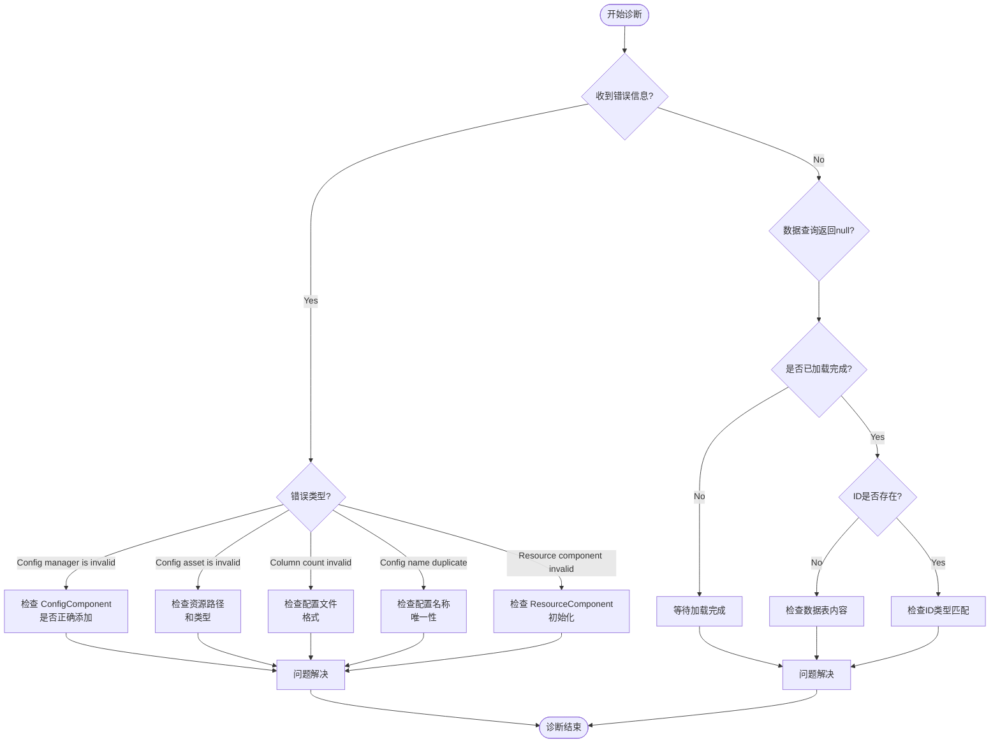

# 常见问题

本文档汇总了使用 Config 配置表组件时可能遇到的常见问题、错误信息及其解决方案。

## 概述

Config 配置表组件为 Unity 游戏提供了一套完整的配置数据管理解决方案。在实际使用过程中，开发者可能会遇到配置加载失败、数据解析错误、组件未正确初始化等问题。本文档旨在帮助开发者快速定位和解决这些问题。

## 常见问题列表

### 1. Config Manager 未初始化

**错误信息：**
```
Config manager is invalid.
```

**原因分析：**
此错误表示 `ConfigComponent` 在初始化时无法从 GameFrameworkEntry 获取到 `IConfigManager` 模块。这通常发生在框架初始化顺序不正确的情况下。

**解决方案：**

1. 确保在场景中正确添加了 `ConfigComponent` 组件：
```csharp
// 在 Unity 场景中添加 ConfigComponent
// GameObject -> Add Component -> GameFrameX -> Config
```

2. 确保 GameFramework 核心组件已正确初始化。检查场景中是否存在 `GameEntry` 对象：
> 详情请参考 [核心概念 - ConfigComponent](./4-core-concepts.config-component)

---

### 2. 配置资源类型无效

**错误信息：**
```
Config asset 'xxx' is invalid.
```

**原因分析：**
此警告表示系统无法将加载的资产识别为有效的配置资源。可能原因包括：
- 资源路径不正确
- 资源类型不是 `TextAsset` 或 `.bytes` 文件
- 资源文件损坏

**解决方案：**

1. 检查配置文件的路径是否正确
2. 确保配置文件是纯文本文件（`.txt`）或二进制文件（`.bytes`）
3. 验证资源已正确打包到最终的游戏构建中

---

### 3. 配置列数不匹配

**错误信息：**
```
Can not parse config line string 'xxx' which column count is invalid.
```

**原因分析：**
在解析文本格式的配置文件时，解析器期望每行有 4 列数据（使用 Tab 分隔）。如果列数不符合预期，解析将失败。

配置文件格式要求：
```
#ID    名称    注释    值
1      config1 示例     value1
2      config2 示例     value2
```

**解决方案：**

1. 检查配置文件的列数是否正确（应为 4 列）
2. 确保使用 Tab 字符作为列分隔符
3. 检查是否有空行或格式不正确的行

> 详情请参考 [配置选项 - 二进制配置表](./6-configuration.binary-config)

---

### 4. 配置名称重复或无效

**错误信息：**
```
Can not add config with config name 'xxx' which may be invalid or duplicate.
```

**原因分析：**
此警告表示尝试添加的配置名称无效或已存在。每个配置名称必须是唯一的。

**解决方案：**

1. 检查是否存在重复的配置名称
2. 确保配置名称不为空字符串
3. 使用唯一标识符作为配置名称

---

### 5. Resource Component 未找到

**错误信息：**
```
Resource component is invalid.
```

**原因分析：**
`DefaultConfigHelper` 依赖 `ResourceComponent` 来加载配置资源。如果 `ResourceComponent` 未正确初始化，配置将无法加载。

**解决方案：**

1. 确保场景中存在 `ResourceComponent` 组件
2. 检查资源系统的初始化顺序
3. 确保资源包已正确加载

---

### 6. 二进制配置表不生效

**问题描述：**
启用 `ENABLE_BINARY_CONFIG` 宏定义后，二进制配置表功能未生效。

**解决方案：**

1. 在 Unity 菜单中启用二进制配置：
   - 打开菜单：`GameFrameX -> Scripting Define Symbols -> Enable Binary Config(开启二进制配置表)`

2. 确保配置文件扩展名为 `.bytes`

> 详情请参考 [配置选项 - 脚本宏定义](./6-configuration.scripting-define-symbols)

---

### 7. 数据表加载失败

**问题描述：**
调用 `IDataTable.LoadAsync()` 方法后，数据未正确加载。

**排查步骤：**

1. 检查异步加载是否完成：
```csharp
// 正确等待加载完成
IDataTable<MyConfig> configTable = component.GetConfig<MyConfigTable>();
await configTable.LoadAsync();

// 检查是否加载成功
if (component.HasConfig<MyConfigTable>()) {
    // 配置已加载
}
```

2. 检查事件是否捕获到错误：
> 详情请参考 [API 参考 - 事件参数](./5-api-reference.event-args)

---

### 8. 数据查询返回 null

**问题描述：**
使用 `TryGet` 方法查询配置数据时，返回 `false` 或 `null`。

**可能原因：**

1. 数据表尚未加载完成
2. 查询的 ID 不存在
3. 数据表类型不匹配

**解决方案：**

1. 确保在数据加载完成后再进行查询
2. 使用 `HasConfig<T>()` 方法先检查配置是否存在
3. 验证查询的 ID 类型（int/long/string）与数据表定义一致

```csharp
// 正确的数据查询流程
var configTable = component.GetConfig<MyConfigTable>();
if (component.HasConfig<MyConfigTable>()) {
    if (configTable.TryGet(1, out var config)) {
        // 成功获取配置
    }
}
```

---

## 诊断流程



## 调试技巧

### 1. 启用日志调试

Config 组件会输出详细的日志信息。在开发阶段，确保日志级别设置为 `Debug` 或 `Info`：

```csharp
// 在游戏启动时设置日志级别
Log.SetLogHelper(new DebugLogHelper());
```

### 2. 使用事件监听

监听配置加载事件可以帮助快速定位问题：

```csharp
// 监听配置加载成功事件
GameEntry.Event.Subscribe(LoadConfigSuccessEventArgs.EventId, OnLoadConfigSuccess);

// 监听配置加载失败事件
GameEntry.Event.Subscribe(LoadConfigFailureEventArgs.EventId, OnLoadConfigFailure);

private void OnLoadConfigSuccess(object sender, LoadConfigSuccessEventArgs e)
{
    UnityEngine.Debug.Log($"配置加载成功: {e.ConfigAssetName}, 耗时: {e.Duration}秒");
}

private void OnLoadConfigFailure(object sender, LoadConfigFailureEventArgs e)
{
    UnityEngine.Debug.LogError($"配置加载失败: {e.ConfigAssetName}, 错误: {e.ErrorMessage}");
}
```

### 3. 检查配置数量

在调试时，可以检查当前加载的配置数量：

```csharp
var configComponent = GameEntry.GetComponent<ConfigComponent>();
UnityEngine.Debug.Log($"当前配置数量: {configComponent.Count}");
```

---

## 最佳实践

1. **始终使用 TryGet 方法**：避免使用已标记为 `[Obsolete]` 的 `Get` 方法
2. **检查配置存在性**：在使用配置前先调用 `HasConfig<T>()` 方法
3. **异步加载**：配置加载是异步的，确保在加载完成后再使用数据
4. **错误处理**：订阅加载失败事件，以便及时发现和处理错误

---

## 相关链接

- [核心概念 - ConfigComponent](./4-core-concepts.config-component)
- [核心概念 - ConfigManager](./4-core-concepts.config-manager)
- [核心概念 - IDataTable](./4-core-concepts.idata-table)
- [API 参考 - 接口定义](./5-api-reference.interfaces)
- [API 参考 - 事件参数](./5-api-reference.event-args)
- [配置选项 - 二进制配置表](./6-configuration.binary-config)
- [配置选项 - 脚本宏定义](./6-configuration.scripting-define-symbols)
