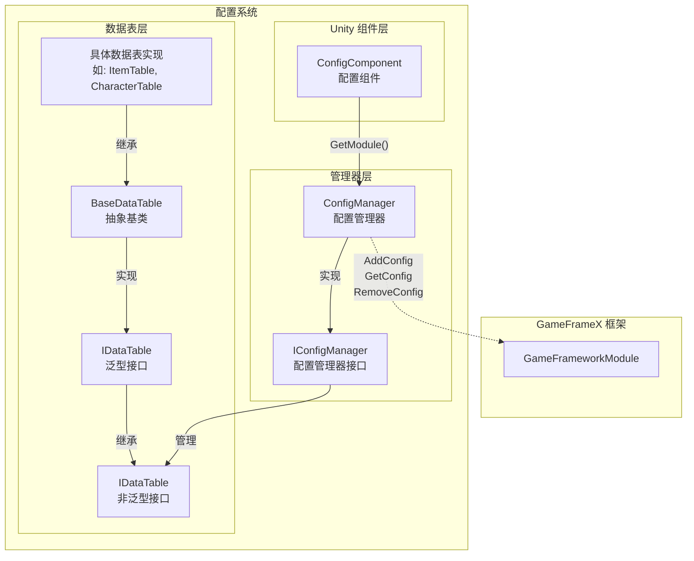
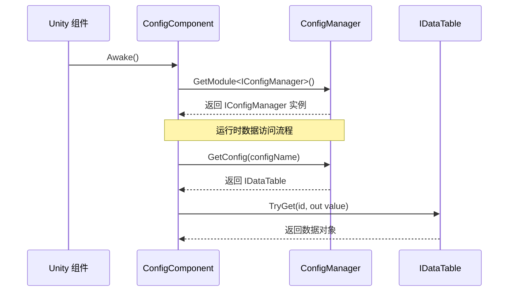

# ConfigManager 配置管理器

ConfigManager 是 GameFrameX 配置系统的核心模块，负责统一管理游戏中的所有配置数据表。它提供了配置数据的存储、查询、添加、移除等核心功能，是游戏运行时访问配置数据的主要入口。

## 概述

ConfigManager 作为全局配置管理器，扮演着配置数据中央仓库的角色。在游戏开发中，通常会有大量的配置数据（如物品表、角色属性表、关卡配置等），这些数据需要统一的管理机制来确保高效访问。ConfigManager 通过键值对的方式管理 `IDataTable` 类型的配置数据表，支持通过配置名称快速查找和获取对应的数据表。

该管理器采用线程安全的 `ConcurrentDictionary` 实现，确保在多线程环境下也能安全地进行配置数据的访问和修改。作为 GameFramework 的核心模块之一，ConfigManager 在游戏启动时初始化，在游戏关闭时清理所有配置数据。

### 核心职责

- **配置存储管理**：统一管理所有游戏配置数据表的存储
- **配置查询**：提供快速的配置数据查找和获取功能
- **配置生命周期**：管理配置数据的添加、移除和清空操作
- **线程安全保障**：在多线程环境下安全地访问配置数据

## 架构设计



上图展示了配置系统的整体架构，从 Unity 组件层到数据表层的完整调用链路。

### 核心类说明

| 类名 | 职责 | 说明 |
|------|------|------|
| ConfigManager | 配置管理器核心实现 | 继承 GameFrameworkModule，管理所有配置数据表 |
| IConfigManager | 配置管理器接口 | 定义配置管理器的标准操作接口 |
| ConfigComponent | Unity 组件 | 作为 Unity 层面的入口点，获取 ConfigManager 实例 |
| IDataTable | 数据表基础接口 | 定义数据表的基本操作 |
| `IDataTable<T>` | 泛型数据表接口 | 提供强类型的数据表查询能力 |
| `BaseDataTable<T>` | 数据表抽象基类 | 实现数据表的核心功能，如字典存储、查询等 |

## 工作流程



## 核心功能

### 配置数据存储

ConfigManager 使用 `ConcurrentDictionary<string, IDataTable>` 来存储所有的配置数据表。这种设计具有以下优势：

- **线程安全**：ConcurrentDictionary 是线程安全的集合，适用于多线程环境
- **高性能查找**：字典的 O(1) 时间复杂度确保了配置数据的高速访问
- **键值对管理**：通过配置名称（字符串）作为键，方便管理和查找

```csharp
// 源代码位置: Runtime/Config/Config/ConfigManager.cs#L47-L61
public sealed partial class ConfigManager : GameFrameworkModule, IConfigManager
{
    private readonly ConcurrentDictionary<string, IDataTable> m_ConfigDatas;

    public ConfigManager()
    {
        m_ConfigDatas = new ConcurrentDictionary<string, IDataTable>(StringComparer.Ordinal);
    }
}
```
> Source: [ConfigManager.cs](https://github.com/GameFrameX/com.gameframex.unity.config/blob/main/Runtime/Config/Config/ConfigManager.cs#L47-L61)

### 配置数据操作

ConfigManager 提供了完整的配置数据操作接口，包括检查、增加、移除和获取配置：

```csharp
// 检查配置是否存在
public bool HasConfig(string configName)
{
    return m_ConfigDatas.TryGetValue(configName, out _);
}

// 添加配置
public void AddConfig(string configName, IDataTable configValue)
{
    m_ConfigDatas.TryAdd(configName, configValue);
}

// 移除配置
public bool RemoveConfig(string configName)
{
    return m_ConfigDatas.TryRemove(configName, out _);
}

// 获取配置
public IDataTable GetConfig(string configName)
{
    return m_ConfigDatas.TryGetValue(configName, out var value) ? value : null;
}

// 清空所有配置
public void RemoveAllConfigs()
{
    m_ConfigDatas.Clear();
}
```
> Source: [ConfigManager.cs](https://github.com/GameFrameX/com.gameframex.unity.config/blob/main/Runtime/Config/Config/ConfigManager.cs#L99-L167)

这些方法的设计遵循了简单直接的原则，通过字符串键来管理配置数据表，支持动态添加和移除配置。

## 使用示例

### 通过 ConfigComponent 访问配置

在游戏代码中，通常通过 ConfigComponent 来访问配置管理器：

```csharp
// 获取 ConfigComponent 组件
var configComponent = UnityEngine.Object.FindObjectOfType<ConfigComponent>();

// 检查配置是否存在
if (configComponent.HasConfig<CharacterTable>())
{
    // 获取配置数据表
    var characterTable = configComponent.GetConfig<CharacterTable>();
    
    // 根据 ID 查找角色数据
    if (characterTable.TryGet(1001, out var character))
    {
        UnityEngine.Debug.Log($"角色名称: {character.Name}");
    }
}
```
> Source: [ConfigComponent.cs](https://github.com/GameFrameX/com.gameframex.unity.config/blob/main/Runtime/Config/ConfigComponent.cs#L117-L142)

### 数据表查询操作

数据表提供了丰富的查询方法，支持多种查找方式：

```csharp
// 根据 ID 查找（推荐使用 TryGet）
var item = itemTable.TryGet(1001, out var itemData) ? itemData : null;

// 使用索引器查找
var character = characterTable[1001];

// 查找所有满足条件的对象
var allWarriors = characterTable.FindList(c => c.Type == "Warrior");

// 计算属性总和
var totalAttack = characterTable.Sum(c => c.Attack);

// 遍历所有数据
characterTable.ForEach(character => {
    UnityEngine.Debug.Log(character.Name);
});
```
> Source: [BaseDataTable.cs](https://github.com/GameFrameX/com.gameframex.unity.config/blob/main/Runtime/Config/Config/BaseDataTable.cs#L296-L349)

### 自定义数据表实现

开发者可以继承 BaseDataTable 来创建自己的数据表实现：

```csharp
// 示例：定义角色数据表
public class CharacterData
{
    public int Id { get; set; }
    public string Name { get; set; }
    public int Attack { get; set; }
    public int Defense { get; set; }
}

public class CharacterTable : BaseDataTable<CharacterData>
{
    public override async Task LoadAsync()
    {
        // 在这里实现数据加载逻辑
        // 可以从 Resources、AssetBundle 或网络加载数据
    }
}
```

## API 参考

### IConfigManager 接口

配置管理器的核心接口，定义了配置数据的基本操作：

| 方法 | 返回类型 | 描述 |
|------|----------|------|
| `HasConfig(configName)` | `bool` | 检查指定名称的配置是否存在 |
| `AddConfig(configName, configValue)` | `void` | 添加一个新的配置数据表 |
| `RemoveConfig(configName)` | `bool` | 移除指定名称的配置数据表 |
| `GetConfig(configName)` | `IDataTable` | 获取指定名称的配置数据表 |
| `RemoveAllConfigs()` | `void` | 清空所有配置数据表 |
| `Count` | `int` | 获取配置数据表的数量 |

### IDataTable 接口

数据表的基础接口，提供数据表的元数据和加载能力：

| 成员 | 类型 | 描述 |
|------|------|------|
| `LoadAsync()` | `Task` | 异步加载数据表 |
| `Count` | `int` | 获取数据表中数据的数量 |

### `IDataTable<T>` 泛型接口

强类型的数据表接口，提供数据查询和统计功能：

#### 查询方法

| 方法 | 描述 |
|------|------|
| `TryGet(int id, out T value)` | 根据整数 ID 尝试获取数据 |
| `TryGet(long id, out T value)` | 根据长整数 ID 尝试获取数据 |
| `TryGet(string id, out T value)` | 根据字符串 ID 尝试获取数据 |
| `Find(Func<T, bool> func)` | 根据条件查找第一个匹配项 |
| `FindList(Func<T, bool> func)` | 根据条件查找所有匹配项并返回列表 |
| `FindListArray(Func<T, bool> func)` | 根据条件查找所有匹配项并返回数组 |

#### 索引器

| 索引器 | 描述 |
|--------|------|
| `this[int id]` | 通过整数主键获取数据 |
| `this[long id]` | 通过长整数主键获取数据 |
| `this[string id]` | 通过字符串键获取数据 |

#### 聚合方法

| 方法 | 描述 |
|------|------|
| `Max<Tk>(Func<T, Tk> func)` | 获取指定属性的最大值 |
| `Min<Tk>(Func<T, Tk> func)` | 获取指定属性的最小值 |
| `Sum(Func<T, int> func)` | 计算 int 类型属性的总和 |
| `Sum(Func<T, long> func)` | 计算 long 类型属性的总和 |
| `Sum(Func<T, float> func)` | 计算 float 类型属性的总和 |

#### 转换方法

| 方法 | 描述 |
|------|------|
| `All` | 获取所有数据组成的数组 |
| `ToArray()` | 转换为数组 |
| `ToList()` | 转换为列表 |
| `FirstOrDefault` | 获取第一个元素 |
| `LastOrDefault` | 获取最后一个元素 |

## 相关链接

- [ConfigComponent 配置组件](./4-core-concepts.config-component) - Unity 组件层面的配置入口
- [IDataTable 数据表接口](./4-core-concepts.idata-table) - 数据表的接口定义和详细规范
- [快速开始 - 数据表定义](./3-getting-started.data-table-definition) - 如何定义和使用数据表
- [API 参考 - 接口定义](./5-api-reference.interfaces) - 完整的 API 接口文档
