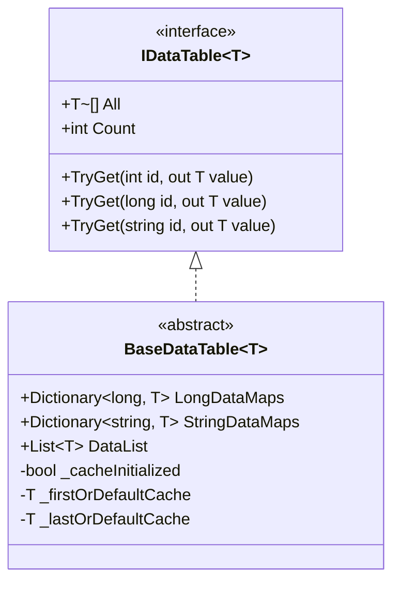

# 二进制配置表

二进制配置表是 GameFrameX Config 配置系统的重要组成部分，用于以二进制格式存储和加载游戏配置数据。相比文本格式，二进制配置表具有加载速度快、占用空间小、解析效率高等优点，特别适合对性能要求较高的游戏场景。

## 概述

二进制配置表功能允许开发者在 Unity 项目中使用 `.bytes` 格式的二进制配置文件。系统通过文件扩展名自动识别配置类型：当配置资源名称以 `.bytes` 结尾时，系统会将其作为二进制数据进行解析；否则按文本格式处理。

这种设计提供了极大的灵活性，开发者可以根据实际需求选择使用文本配置表或二进制配置表，甚至可以在同一个项目中混合使用两种格式。

### 二进制配置的核心优势

**加载性能**：二进制数据无需进行字符串解析，直接通过 BinaryReader 读取即可，能够显著减少加载时间。在大型游戏或多配置场景下，这一优势尤为明显。

**存储效率**：二进制格式将数据紧凑存储，相比文本格式（如 JSON、XML）能够节省 30%-50% 的存储空间，同时减少运行时内存占用。

**安全性**：二进制配置表不易被直接阅读和修改，为游戏数据提供了一定程度的保护。虽然不能完全防止破解，但相比明文存储的文本配置文件安全系数更高。

## 架构设计

```mermaid
flowchart TD
    subgraph ConfigSystem["配置系统架构"]
        subgraph UnityLayer["Unity 层"]
            CC[ConfigComponent<br/>配置组件]
        end
        
        subgraph ManagerLayer["管理层"]
            CM[ConfigManager<br/>配置管理器]
        end
        
        subgraph DataLayer["数据层"]
            DT[IDataTable&lt;T&gt;<br/>数据表接口]
            BDT[BaseDataTable&lt;T&gt;<br/>数据表基类]
        end
        
        subgraph StorageLayer["存储层"]
            DictLong[Dictionary&lt;long, T&gt;<br/>长整型索引]
            DictStr[Dictionary&lt;string, T&gt;<br/>字符串索引]
            List[List&lt;T&gt;<br/>数据列表]
        end
    end
    
    CC --> CM
    CM --> DT
    DT <|-- BDT
    BDT --> DictLong
    BDT --> DictStr
    BDT --> List
```

### 核心组件职责

**ConfigComponent** 是 Unity 层面的入口组件，继承自 GameFrameworkComponent，通过挂载到游戏物体上提供配置功能。它负责初始化 ConfigManager 并暴露配置访问接口给游戏逻辑层。

**ConfigManager** 实现 IConfigManager 接口，是整个配置系统的核心管理器。它维护一个线程安全的 ConcurrentDictionary，用于存储所有已加载的配置表实例，并提供配置的查询、添加、移除等操作。

**`BaseDataTable<T>`** 是所有数据表的泛型基类，提供了数据存储和查询的完整实现。它内部维护三个数据结构：LongDataMaps 用于长整型 ID 索引、StringDataMaps 用于字符串 ID 索引、DataList 用于顺序遍历和批量操作。

## 二进制配置加载流程

```mermaid
sequenceDiagram
    participant Game as 游戏逻辑
    participant CC as ConfigComponent
    participant CM as ConfigManager
    participant RC as ResourceComponent
    participant Parser as 配置解析器

    Game->>CC: 请求加载配置
    CC->>CM: GetConfig&lt;T&gt;()
    CM->>RC: LoadAsset(configName.bytes)
    RC-->>CM: 返回 TextAsset.bytes
    CM->>Parser: ParseData(bytes)
    
    alt 文件扩展名为 .bytes
        Parser->>Parser: 使用 BinaryReader 解析
        Parser->>Parser: 循环读取 string-key 和 string-value
    else 其他扩展名
        Parser->>Parser: 使用文本解析器
    end
    
    Parser-->>CM: 返回解析结果
    CM-->>CM: 存储到 Dictionary
    CM-->>CC: 返回 IDataTable
    CC-->>Game: 返回配置数据
```

## 脚本宏定义

二进制配置功能通过 Unity 脚本宏定义（Scripting Define Symbols）进行控制。Editor 目录下提供了 ConfigDefineSymbols 工具类来管理此宏定义。

### 启用二进制配置

在 Unity 编辑器中，可以通过菜单操作来启用或禁用二进制配置功能：

```csharp
// Source: [Editor/ConfigDefineSymbols.cs](https://github.com/GameFrameX/com.gameframex.unity.config/blob/main/Editor/ConfigDefineSymbols.cs#L1-L31)

namespace GameFrameX.Config.Editor
{
    /// <summary>
    /// 配置表二进制功能脚本宏定义。
    /// </summary>
    public static class ConfigDefineSymbols
    {
        public const string EnableBinaryConfigScriptingDefineSymbol = "ENABLE_BINARY_CONFIG";

        /// <summary>
        /// 开启配置表为二进制的脚本宏定义。
        /// </summary>
        [MenuItem("GameFrameX/Scripting Define Symbols/Enable Binary Config(开启二进制配置表)", false, 501)]
        public static void EnableBinaryConfig()
        {
            ScriptingDefineSymbols.AddScriptingDefineSymbol(EnableBinaryConfigScriptingDefineSymbol);
        }

        /// <summary>
        /// 禁用配置表为二进制的脚本宏定义。
        /// </summary>
        [MenuItem("GameFrameX/Scripting Define Symbols/Disable Binary Config(关闭二进制配置表)", false, 500)]
        public static void DisableBinaryConfig()
        {
            ScriptingDefineSymbols.RemoveScriptingDefineSymbol(EnableBinaryConfigScriptingDefineSymbol);
        }
    }
}
```

通过菜单 **GameFrameX → Scripting Define Symbols → Enable Binary Config(开启二进制配置表)** 即可启用二进制配置支持。

## 二进制配置格式

二进制配置表采用简单的键值对格式存储数据，每条记录包含两个字符串：配置名称（键）和配置值（值）。

### 二进制格式规范

二进制文件使用 BinaryWriter 按以下顺序写入数据：

```
[配置名称1 (string)] [配置值1 (string)]
[配置名称2 (string)] [配置值2 (string)]
...
```

每个字符串使用 UTF-8 编码，并通过 BinaryWriter.Write(string) 方法写入。

### 数据解析实现

系统使用 BinaryReader 进行二进制数据的解析，核心实现逻辑如下：

```csharp
// Source: [Runtime/Config/DefaultConfigHelper.cs](https://github.com/GameFrameX/com.gameframex.unity.config/blob/main/Runtime/Config/DefaultConfigHelper.cs#L147-L184)

/// <summary>
/// 解析全局配置（二进制格式）。
/// </summary>
public override bool ParseData(IConfigManager configManager, byte[] configBytes, int startIndex, int length, object userData)
{
    try
    {
        using (MemoryStream memoryStream = new MemoryStream(configBytes, startIndex, length, false))
        {
            using (BinaryReader binaryReader = new BinaryReader(memoryStream, Encoding.UTF8))
            {
                while (binaryReader.BaseStream.Position < binaryReader.BaseStream.Length)
                {
                    string configName = binaryReader.ReadString();
                    string configValue = binaryReader.ReadString();
                    if (!configManager.AddConfig(configName, configValue))
                    {
                        Log.Warning("Can not add config with config name '{0}' which may be invalid or duplicate.", configName);
                        return false;
                    }
                }
            }
        }

        return true;
    }
    catch (Exception exception)
    {
        Log.Warning("Can not parse config bytes with exception '{0}'.", exception);
        return false;
    }
}
```

解析过程中，系统会持续读取字符串对，直到流末尾。每读取到一个配置项，就调用 AddConfig 方法将其添加到配置管理器中。

### 文件扩展名识别

系统通过资源文件扩展名自动判断配置类型：

```csharp
// Source: [Runtime/Config/DefaultConfigHelper.cs](https://github.com/GameFrameX/com.gameframex.unity.config/blob/main/Runtime/Config/DefaultConfigHelper.cs#L61-L78)

private static readonly string BytesAssetExtension = ".bytes";

public override bool ReadData(IConfigManager configManager, string configAssetName, object configAsset, object userData)
{
    TextAsset configTextAsset = configAsset as TextAsset;
    if (configTextAsset != null)
    {
        if (configAssetName.EndsWith(BytesAssetExtension, StringComparison.Ordinal))
        {
            // 二进制格式解析
            return configManager.ParseData(configTextAsset.bytes, userData);
        }
        else
        {
            // 文本格式解析
            return configManager.ParseData(configTextAsset.text, userData);
        }
    }

    Log.Warning("Config asset '{0}' is invalid.", configAssetName);
    return false;
}
```

## 数据表存储结构

`BaseDataTable<T>` 使用多种数据结构来满足不同的查询需求，这种设计在保证功能完整性的同时，也优化了常见操作的性能。



### 存储结构说明

**LongDataMaps**：使用 Dictionary<long, T> 存储以长整数作为主键的配置数据，提供 O(1) 时间复杂度的按 ID 查询。

**StringDataMaps**：使用 Dictionary<string, T> 存储以字符串作为主键的配置数据，适用于需要使用字符串标识符的场景。

**DataList**：使用 `List<T>` 存储所有配置数据对象，支持顺序遍历、批量操作以及 First/Last 查询。

**缓存机制**：BaseDataTable 实现了缓存机制，用于缓存数据表中的首尾元素和数量统计，避免频繁遍历底层数据结构。

## 配置查询示例

数据表支持多种查询方式，开发者可以根据实际场景选择最合适的方法：

```csharp
// Source: [Runtime/Config/Config/BaseDataTable.cs](https://github.com/GameFrameX/com.gameframex.unity.config/blob/main/Runtime/Config/Config/BaseDataTable.cs#L119-L162)

/// <summary>
/// 尝试根据整数ID获取对象。
/// </summary>
public bool TryGet(int id, out T value)
{
    return LongDataMaps.TryGetValue(id, out value);
}

/// <summary>
/// 尝试根据长整数ID获取对象。
/// </summary>
public bool TryGet(long id, out T value)
{
    return LongDataMaps.TryGetValue(id, out value);
}

/// <summary>
/// 尝试根据字符串ID获取对象。
/// </summary>
public bool TryGet(string id, out T value)
{
    return StringDataMaps.TryGetValue(id, out value);
}
```

### 常用查询方法

| 方法 | 描述 | 返回类型 |
|------|------|----------|
| TryGet(int id) | 根据整数 ID 尝试获取数据 | bool |
| TryGet(long id) | 根据长整数 ID 尝试获取数据 | bool |
| TryGet(string id) | 根据字符串 ID 尝试获取数据 | bool |
| Find(func) | 根据条件查找第一个匹配对象 | T |
| FindListArray(func) | 根据条件查找所有匹配对象 | T[] |
| FirstOrDefault | 获取第一个对象 | T |
| LastOrDefault | 获取最后一个对象 | T |
| All | 获取所有对象数组 | T[] |

## 相关链接

- [Config 组件简介](./1-overview.introduction)
- [功能特性](./1-overview.features)
- [安装方式](./2-installation.install-methods)
- [依赖要求](./2-installation.dependencies)
- [基础使用](./3-getting-started.basic-usage)
- [数据表定义](./3-getting-started.data-table-definition)
- [ConfigComponent 配置组件](./4-core-concepts.config-component)
- [ConfigManager 配置管理器](./4-core-concepts.config-manager)
- [IDataTable 数据表接口](./4-core-concepts.idata-table)
- [接口定义](./5-api-reference.interfaces)
- [事件参数](./5-api-reference.event-args)
- [脚本宏定义](./6-configuration.scripting-define-symbols)
- [常见问题](./7-troubleshooting)
