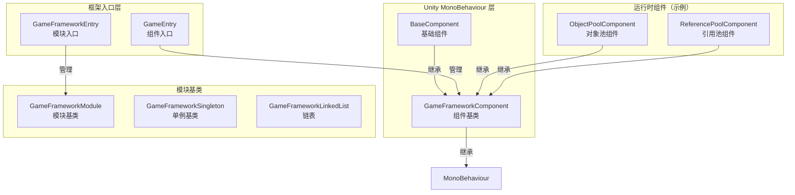
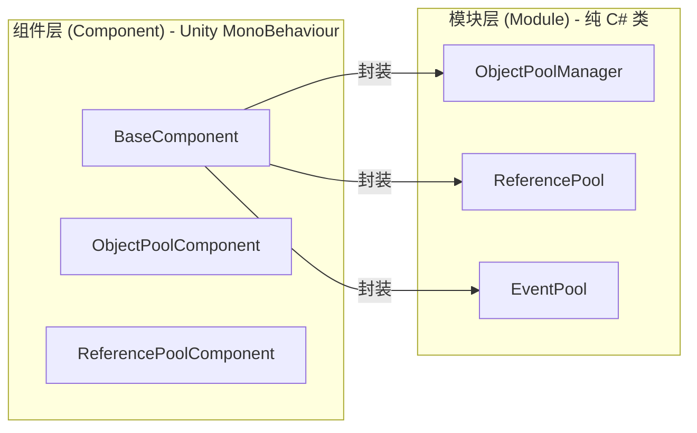
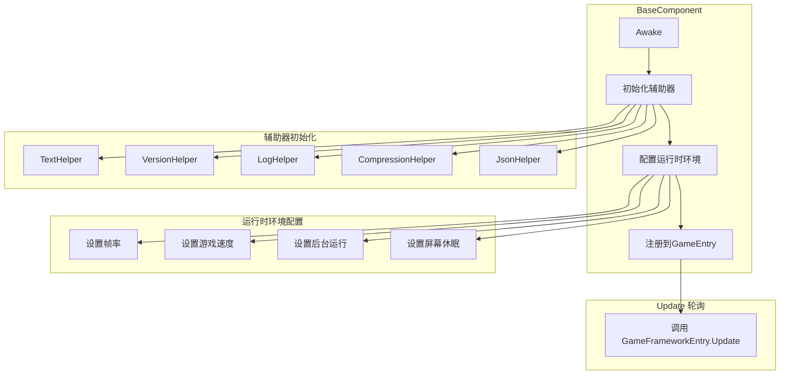
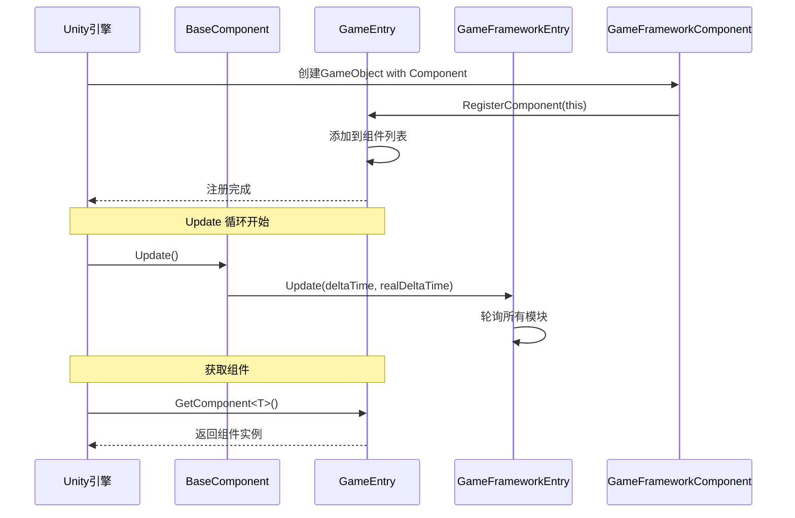

# 基础组件

基础组件是 GameFrameX 框架的核心底层架构，提供了游戏运行时所需的基础功能和组件管理机制。它们构成了整个框架的支柱，其他所有功能模块都依赖于这些基础组件。

## 概述

GameFrameX 的基础组件位于 `Runtime/Base` 目录下，包含了框架的核心入口、组件基类、模块基类以及基础数据结构。这些组件负责：

- **游戏运行时环境配置**：帧率、游戏速度、后台运行、屏幕休眠等
- **组件生命周期管理**：注册、获取、销毁
- **模块系统**：模块的创建、轮询、关闭
- **单例与数据结构**：提供常用的设计模式实现

### 核心类关系



## 架构详解

### 组件系统架构

GameFrameX 采用双层架构设计：组件层（Component）和模块层（Module）。



**设计意图：**
- **组件层**继承自 `MonoBehaviour`，可以直接挂载到 Unity 场景中的 GameObject 上
- **模块层**是纯 C# 类，负责具体的业务逻辑实现
- 组件层作为模块层的门面（Facade），对外提供统一的访问方式

### BaseComponent 详解

`BaseComponent` 是框架的核心组件，必须挂载在场景中。它负责初始化游戏运行时环境和各种辅助工具。



### 组件注册与获取流程



## 核心功能

### 1. 运行时环境控制

BaseComponent 提供了对游戏运行时环境的全面控制能力：

| 功能 | 属性 | 说明 |
|------|------|------|
| 帧率控制 | `FrameRate` | 设置 `Application.targetFrameRate` |
| 游戏速度 | `GameSpeed` | 控制 `Time.timeScale`，支持慢动作 |
| 暂停状态 | `IsGamePaused` | 读取游戏是否已暂停 |
| 正常速度 | `IsNormalGameSpeed` | 检查是否以1x速度运行 |
| 后台运行 | `RunInBackground` | 设置 `Application.runInBackground` |
| 屏幕休眠 | `NeverSleep` | 控制 `Screen.sleepTimeout` |

**代码示例：**

```csharp
// 获取基础组件
var baseComponent = GameEntry.GetComponent<BaseComponent>();

// 控制帧率
baseComponent.FrameRate = 60;

// 暂停游戏
baseComponent.PauseGame();

// 恢复游戏
baseComponent.ResumeGame();

// 禁止休眠
baseComponent.NeverSleep = true;
```
> Source: [BaseComponent.cs](https://github.com/GameFrameX/com.gameframex.unity/blob/main/Runtime/Base/BaseComponent.cs#L220-L243)

### 2. 组件访问

通过 `GameEntry` 静态类可以访问所有已注册的框架组件：

```csharp
// 通过泛型获取组件
var baseComponent = GameEntry.GetComponent<BaseComponent>();
var objectPool = GameEntry.GetComponent<ObjectPoolComponent>();

// 通过类型获取组件
var component = GameEntry.GetComponent(typeof(BaseComponent));

// 通过类型名称获取组件
var component = GameEntry.GetComponent("BaseComponent");
```
> Source: [GameEntry.cs](https://github.com/GameFrameX/com.gameframex.unity/blob/main/Runtime/Base/GameEntry.cs#L67-L121)

### 3. 模块管理

`GameFrameworkEntry` 负责管理所有框架模块的创建、轮询和销毁：

```csharp
// 获取模块（通过接口）
var module = GameFrameworkEntry.GetModule<IObjectPoolManager>();

// 模块会自动按优先级排序
// Update 会在每一帧被调用
```
> Source: [GameFrameworkEntry.cs](https://github.com/GameFrameX/com.gameframex.unity/blob/main/Runtime/Base/GameFrameworkEntry.cs#L95-L120)

### 4. 框架关闭

框架支持三种关闭模式：

```csharp
// 仅关闭框架（不退出）
GameEntry.Shutdown(ShutdownType.None);

// 关闭并重启游戏
GameEntry.Shutdown(ShutdownType.Restart);

// 关闭并退出游戏
GameEntry.Shutdown(ShutdownType.Quit);
```
> Source: [ShutdownType.cs](https://github.com/GameFrameX/com.gameframex.unity/blob/main/Runtime/Base/ShutdownType.cs#L41-L66)

## 基础数据结构

### 单例模式

GameFrameX 提供了线程安全的单例基类：

```csharp
public class MySingleton : GameFrameworkSingleton<MySingleton>
{
    public void DoSomething()
    {
        // 单例方法
    }
}

// 使用
MySingleton.Instance.DoSomething();
```
> Source: [GameFrameworkSingleton.cs](https://github.com/GameFrameX/com.gameframex.unity/blob/main/Runtime/Base/GameFrameworkSingleton.cs#L1-L47)

### 链表数据结构

自定义链表实现，带有节点缓存机制：

```csharp
var list = new GameFrameworkLinkedList<GameFrameworkComponent>();
list.AddLast(component);
var node = list.First;
// ... 使用链表
```
> Source: [GameFrameworkLinkedList.cs](https://github.com/GameFrameX/com.gameframex.unity/blob/main/Runtime/Base/GameFrameworkLinkedList.cs#L47-L59)

## 配置选项

在 Unity 编辑器中，BaseComponent 提供了以下可配置项：

| 配置项 | 类型 | 默认值 | 说明 |
|--------|------|--------|------|
| TextHelperTypeName | string | "UnityGameFramework.Runtime.DefaultTextHelper" | 文本辅助器类型 |
| VersionHelperTypeName | string | "UnityGameFramework.Runtime.DefaultVersionHelper" | 版本辅助器类型 |
| LogHelperTypeName | string | "UnityGameFramework.Runtime.DefaultLogHelper" | 日志辅助器类型 |
| CompressionHelperTypeName | string | "UnityGameFramework.Runtime.DefaultCompressionHelper" | 压缩辅助器类型 |
| JsonHelperTypeName | string | "UnityGameFramework.Runtime.DefaultJsonHelper" | JSON辅助器类型 |
| FrameRate | int | 30 | 游戏目标帧率 |
| GameSpeed | float | 1f | 游戏运行速度 |
| RunInBackground | bool | true | 是否允许后台运行 |
| NeverSleep | bool | true | 是否禁止屏幕休眠 |

## API 参考

### `BaseComponent`

游戏基础组件，提供运行时环境配置。

#### 属性

| 属性 | 类型 | 说明 |
|------|------|------|
| `FrameRate` | int | 获取或设置游戏帧率 |
| `GameSpeed` | float | 获取或设置游戏速度 |
| `IsGamePaused` | bool | 获取游戏是否已暂停 |
| `IsNormalGameSpeed` | bool | 获取游戏是否以正常速度运行 |
| `RunInBackground` | bool | 获取或设置是否允许后台运行 |
| `NeverSleep` | bool | 获取或设置是否禁止休眠 |

#### 方法

| 方法 | 返回类型 | 说明 |
|------|----------|------|
| `PauseGame()` | void | 暂停游戏 |
| `ResumeGame()` | void | 恢复游戏 |
| `ResetNormalGameSpeed()` | void | 重置为正常游戏速度 |

### `GameEntry`

框架组件访问入口点。

#### 方法

| 方法 | 返回类型 | 说明 |
|------|----------|------|
| `GetComponent<T>()` | T | 获取指定类型的组件 |
| `GetComponent(Type)` | GameFrameworkComponent | 通过类型获取组件 |
| `GetComponent(string)` | GameFrameworkComponent | 通过类型名称获取组件 |
| `Shutdown(ShutdownType)` | void | 关闭框架 |

### `GameFrameworkEntry`

框架模块管理入口。

#### 方法

| 方法 | 返回类型 | 说明 |
|------|----------|------|
| `GetModule<T>()` | T | 获取指定接口的模块 |
| `GetModule(Type)` | GameFrameworkModule | 通过类型获取模块 |
| `Update(float, float)` | void | 轮询所有模块 |
| `Shutdown()` | void | 关闭所有模块 |

### `GameFrameworkComponent`

组件抽象基类。

#### 属性

| 属性 | 类型 | 说明 |
|------|------|------|
| `IsAutoRegister` | bool | 获取或设置是否自动注册 |
| `ImplementationComponentType` | Type | 实现类类型 |
| `InterfaceComponentType` | Type | 接口类类型 |

### `GameFrameworkModule`

模块抽象基类。

#### 属性

| 属性 | 类型 | 说明 |
|------|------|------|
| `Priority` | int | 模块优先级，优先级高的先轮询 |

#### 方法

| 方法 | 返回类型 | 说明 |
|------|----------|------|
| `Update(float, float)` | void | 轮询模块 |
| `Shutdown()` | void | 关闭并清理模块 |

## 使用示例

### 初始化框架

1. 在 Unity 场景中创建一个空 GameObject，命名为 "GameFrame"
2. 添加 `BaseComponent` 组件
3. 根据需要配置各项参数
4. 运行游戏

```csharp
// GameEntry.cs 会被自动创建
// BaseComponent 在 Awake 中完成初始化
```
> Source: [BaseComponent.cs](https://github.com/GameFrameX/com.gameframex.unity/blob/main/Runtime/Base/BaseComponent.cs#L153-L192)

### 暂停/恢复游戏

```csharp
var baseComponent = GameEntry.GetComponent<BaseComponent>();

// 暂停游戏（时间静止）
baseComponent.PauseGame();

// 检查是否暂停
if (baseComponent.IsGamePaused)
{
    Debug.Log("游戏已暂停");
}

// 恢复游戏
baseComponent.ResumeGame();

// 或者重置为正常速度
baseComponent.ResetNormalGameSpeed();
```
> Source: [BaseComponent.cs](https://github.com/GameFrameX/com.gameframex.unity/blob/main/Runtime/Base/BaseComponent.cs#L216-L257)

### 创建自定义模块

```csharp
public interface IMyModule : GameFramework.IModule
{
    void DoSomething();
}

public class MyModule : GameFrameworkModule, IMyModule
{
    // 优先级：数值越大越先被处理
    internal override int Priority => 10;

    // 每帧轮询
    protected internal override void Update(float elapseSeconds, float realElapseSeconds)
    {
        // 轮询逻辑
    }

    // 关闭时清理资源
    protected internal override void Shutdown()
    {
        // 清理逻辑
    }

    public void DoSomething()
    {
        // 业务逻辑
    }
}
```
> Source: [GameFrameworkModule.cs](https://github.com/GameFrameX/com.gameframex.unity/blob/main/Runtime/Base/GameFrameworkModule.cs#L40-L70)

## 相关链接

- [事件系统](./5-runtime.event-system) - 框架内置的事件系统
- [对象池系统](./5-runtime.object-pool) - 对象池管理
- [引用池系统](./5-runtime.reference-pool) - 引用池管理
- [任务池系统](./5-runtime.task-pool) - 异步任务管理
- [扩展方法库](./5-runtime.extension-methods) - 常用扩展方法
- [API 参考](./8-api-reference) - 完整 API 文档
