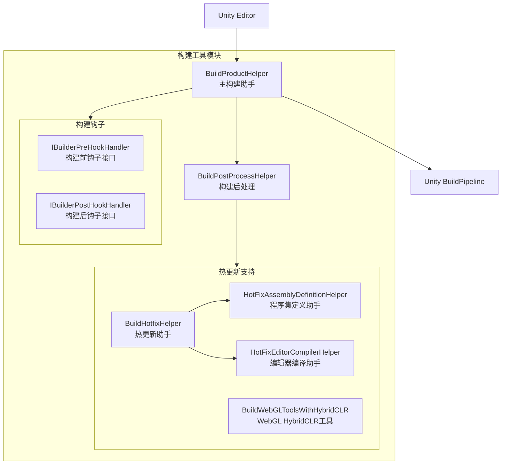
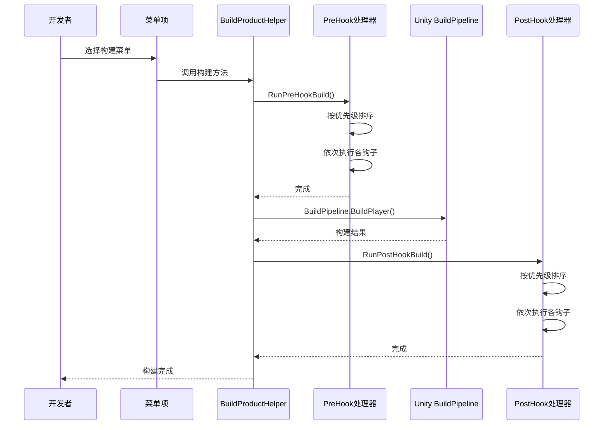

# 构建工具

GameFrameX 提供了一套完整的 Unity 编辑器构建工具，支持多平台构建、热更新（HybridCLR）集成、构建钩子扩展等功能。

## 概述

构建工具模块位于 `Editor/` 目录下，主要包含以下核心组件：

- **BuildProductHelper** - 主构建助手，提供多平台构建功能
- **BuildHotfixHelper** - 热更新代码管理助手
- **Hook 机制** - 构建前后的扩展钩子接口

这些工具通过 Unity Editor 菜单 `GameFrameX/Build` 提供统一的构建入口，简化了跨平台构建流程。

## 架构



### 核心组件说明

| 组件 | 文件路径 | 说明 |
|------|----------|------|
| BuildProductHelper | `Editor/BuildProduct/BuildProductHelper.cs` | 主构建助手，支持 Windows、Mac、Android、iOS、WebGL 平台构建 |
| BuildPostProcessHelper | `Editor/BuildProduct/BuildPostProcessHelper.cs` | 构建后自动更新版本号 |
| IBuilderPreHookHandler | `Editor/BuildProduct/IBuilderPreHookHandler.cs` | 构建前钩子接口 |
| IBuilderPostHookHandler | `Editor/BuildProduct/IBuilderPostHookHandler.cs` | 构建后钩子接口 |
| BuildHotfixHelper | `Editor/BuildHotfix/BuildHotfixHelper.cs` | 热更新代码复制和管理 |
| HotFixEditorCompilerHelper | `Editor/BuildHotfix/HotFixEditorCompilerHelper.cs` | 编辑器编译控制 |
| HotFixAssemblyDefinitionHelper | `Editor/BuildHotfix/HotFixAssemblyDefinitionHelper.cs` | 程序集定义文件修改 |
| BuildWebGLToolsWithHybridCLR | `Editor/BuildWebGLTools/BuildWebGLToolsWithHybridCLR.cs` | WebGL HybridCLR 支持 |

## 菜单项

构建工具通过 Unity Editor 菜单提供统一的构建入口，位于 `GameFrameX/Build` 菜单下：

| 菜单项 | 功能 |
|--------|------|
| Windows X64 | 构建 Windows x64 可执行文件 |
| Windows X32 | 构建 Windows x32 可执行文件 |
| Mac Os | 构建 macOS 应用程序 |
| WebGL | 构建 WebGL 版本 |
| Apk | 构建 Android APK |
| AAB | 构建 Android AAB 包 |
| AndroidStudio Project Debug | 导出 Android Studio Debug 项目 |
| AndroidStudio Project Release | 导出 Android Studio Release 项目 |
| Xcode Project Debug | 导出 Xcode Debug 项目 |
| Xcode Project Release | 导出 Xcode Release 项目 |
| Copy HotFix Code | 复制热更新代码到 Bundles/Code 目录 |
| Copy AOT Code | 复制 AOT 代码到 Bundles/AOTCode 目录 |
| HotFix Editor Compiler Add | 添加热更新程序集的编辑器编译指令 |
| HotFix Editor Compiler Remove | 移除热更新程序集的编辑器编译指令 |

## 核心功能

### 多平台构建

BuildProductHelper 支持以下平台的构建：

```csharp
// Windows x64 构建
[MenuItem("GameFrameX/Build/Windows X64", false, 100)]
public static void BuildPlayerToWindows64BuildTarget()

// Windows x32 构建
[MenuItem("GameFrameX/Build/Windows X32", false, 100)]
public static void BuildPlayerToWindows32BuildTarget()

// macOS 构建
[MenuItem("GameFrameX/Build/Mac Os", false, 200)]
public static void BuildPlayerToMacBuildTarget()

// WebGL 构建
[MenuItem("GameFrameX/Build/WebGL", false, 300)]
private static void BuildPlayerToWebGL()

// Android APK 构建
[MenuItem("GameFrameX/Build/Apk", false, 400)]
private static void BuildPlayerToAndroid()

// Android AAB 构建
[MenuItem("GameFrameX/Build/AAB", false, 400)]
private static void BuildAppBundleForAndroid()

// Android Studio 项目导出（Debug/Release）
[MenuItem("GameFrameX/Build/AndroidStudio Project Debug", false, 500)]
private static void ExportToAndroidStudioToDevelop()

[MenuItem("GameFrameX/Build/AndroidStudio Project Release", false, 500)]
private static void ExportToAndroidStudioToRelease()

// Xcode 项目导出（Debug/Release）
[MenuItem("GameFrameX/Build/Xcode Project Debug", false, 250)]
private static void ExportToXcodeToDevelop()

[MenuItem("GameFrameX/Build/Xcode Project Release", false, 250)]
private static void ExportToXcodeToRelease()
```
> Source: [BuildProductHelper.cs](https://github.com/GameFrameX/com.gameframex.unity/blob/main/Editor/BuildProduct/BuildProductHelper.cs#L101-L662)

### 构建钩子机制

通过实现 `IBuilderPreHookHandler` 和 `IBuilderPostHookHandler` 接口，可以在构建前后执行自定义逻辑：

```csharp
using UnityEditor;

namespace MyProject.Editor
{
    /// <summary>
    /// 构建前钩子示例
    /// </summary>
    public class MyPreBuildHook : IBuilderPreHookHandler
    {
        /// <summary>
        /// 优先级，数值越大优先级越低
        /// </summary>
        public int Priority => 0;

        /// <summary>
        /// 执行构建前逻辑
        /// </summary>
        /// <param name="target">构建目标平台</param>
        /// <param name="path">构建输出路径</param>
        public void Run(BuildTarget target, string path)
        {
            // 在构建前执行的自定义逻辑
            UnityEngine.Debug.Log($"开始构建 {target} 到 {path}");
        }
    }

    /// <summary>
    /// 构建后钩子示例
    /// </summary>
    public class MyPostBuildHook : IBuilderPostHookHandler
    {
        /// <summary>
        /// 优先级
        /// </summary>
        public int Priority => 0;

        /// <summary>
        /// 执行构建后逻辑
        /// </summary>
        /// <param name="target">构建目标平台</param>
        /// <param name="path">构建输出路径</param>
        public void Run(BuildTarget target, string path)
        {
            // 在构建后执行的自定义逻辑
            UnityEngine.Debug.Log($"构建完成 {target} 输出路径 {path}");
        }
    }
}
```
> Sources:
> - [IBuilderPreHookHandler.cs](https://github.com/GameFrameX/com.gameframex.unity/blob/main/Editor/BuildProduct/IBuilderPreHookHandler.cs#L39-L52)
> - [IBuilderPostHookHandler.cs](https://github.com/GameFrameX/com.gameframex.unity/blob/main/Editor/BuildProduct/IBuilderPostHookHandler.cs#L39-L52)

**钩子执行流程：**



### 热更新支持 (HybridCLR)

GameFrameX 内置对 HybridCLR 热更新解决方案的支持：

#### 启用/禁用 HybridCLR

```csharp
// 禁用 HybridCLR
[MenuItem("GameFrameX/Scripting Define Symbols/Disable HybridCLR(关闭HybridCLR适配)", false, 5000)]
public static void DisableHybridCLR()
{
    ScriptingDefineSymbols.AddScriptingDefineSymbol(HybridCLRScriptingDefineSymbol);
}

// 启用 HybridCLR
[MenuItem("GameFrameX/Scripting Define Symbols/Enable HybridCLR(开启HybridCLR适配)", false, 5001)]
public static void EnableHybridCLR()
{
    ScriptingDefineSymbols.RemoveScriptingDefineSymbol(HybridCLRScriptingDefineSymbol);
}
```
> Source: [BuildHotfixHelper.cs](https://github.com/GameFrameX/com.gameframex.unity/blob/main/Editor/BuildHotfix/BuildHotfixHelper.cs#L107-L125)

#### 复制热更新代码

```csharp
// 复制热更新 DLL 到 Assets/Bundles/Code
[MenuItem("GameFrameX/Build/Copy HotFix Code(复制热更新代码到Assets>Bundles>Code)", false, 10)]
public static void CopyHotfixCode()
{
    // 从 Library/ScriptAssemblies 复制 Unity.HotFix.dll 到 Assets/Bundles/Code
}

// 复制 AOT 代码到 Assets/Bundles/AOTCode
[MenuItem("GameFrameX/Build/Copy AOT Code(复制AOT代码到Assets>Bundles>AOTCode)", false, 11)]
public static void CopyAOTCode()
{
    // 从 HybridCLRData/AssembliesPostIl2CppStrip 复制 AOT DLL
}
```
> Source: [BuildHotfixHelper.cs](https://github.com/GameFrameX/com.gameframex.unity/blob/main/Editor/BuildHotfix/BuildHotfixHelper.cs#L43-L104)

### 编辑器编译控制

在构建过程中，需要临时控制热更新程序集的编译范围：

```csharp
// 移除热更新程序集的编辑器编译指令
[MenuItem("GameFrameX/Build/HotFix Editor Compiler Remove(移除热更新程序集的编辑器编译指令)", false, 15)]
public static void RemoveEditor()
{
    var path = "Assets/Hotfix/Unity.HotFix.asmdef";
    HotFixAssemblyDefinitionHelper.RemoveEditor(path);
}

// 增加热更新程序集的编辑器编译指令
[MenuItem("GameFrameX/Build/HotFix Editor Compiler Add(增加热更新程序集的编辑器编译指令)", false, 16)]
public static void AddEditor()
{
    var path = "Assets/Hotfix/Unity.HotFix.asmdef";
    HotFixAssemblyDefinitionHelper.AddEditor(path);
}
```
> Source: [HotFixEditorCompilerHelper.cs](https://github.com/GameFrameX/com.gameframex.unity/blob/main/Editor/BuildHotfix/HotFixEditorCompilerHelper.cs#L8-L29)

### 构建后自动处理

BuildPostProcessHelper 在每次构建后自动更新版本号：

```csharp
[PostProcessBuild(999)]
public static void OnPostProcessBuild(BuildTarget target, string path)
{
    if (target == BuildTarget.Android)
    {
        // Android: bundleVersionCode + 1
        PlayerSettings.Android.bundleVersionCode = Convert.ToInt32(PlayerSettings.Android.bundleVersionCode) + 1;
    }

    if (target == BuildTarget.iOS)
    {
        // iOS: buildNumber + 1
        PlayerSettings.iOS.buildNumber = (Convert.ToInt32(PlayerSettings.iOS.buildNumber) + 1).ToString();
    }
}
```
> Source: [BuildPostProcessHelper.cs](https://github.com/GameFrameX/com.gameframex.unity/blob/main/Editor/BuildProduct/BuildPostProcessHelper.cs#L43-L57)

### 构建输出路径管理

构建输出路径按照以下规则自动生成：

```csharp
// 路径格式: Builds/{平台}/{包名}/{版本号}/{时间戳}
var pathName = $"{Application.identifier}_{_buildTime}_v_{PlayerSettings.bundleVersion}";

// Android 特殊格式
if (EditorUserBuildSettings.activeBuildTarget == BuildTarget.Android)
{
    pathName = $"{_buildTime}_code_{PlayerSettings.Android.bundleVersionCode}";
}

// iOS/macOS 特殊格式
else if (EditorUserBuildSettings.activeBuildTarget == BuildTarget.iOS || 
         EditorUserBuildSettings.activeBuildTarget == BuildTarget.StandaloneOSX)
{
    pathName = $"{_buildTime}_code_{PlayerSettings.iOS.buildNumber}";
}
```
> Source: [BuildProductHelper.cs](https://github.com/GameFrameX/com.gameframex.unity/blob/main/Editor/BuildProduct/BuildProductHelper.cs#L703-L746)

## 使用示例

### 基础构建流程

1. **选择目标平台**：在 Unity Editor 中打开场景
2. **设置构建目标**：通过 `File > Build Settings` 选择目标平台
3. **执行构建**：通过 `GameFrameX/Build` 菜单选择对应的构建选项
4. **查看输出**：构建完成后，在 `Builds/{平台}/` 目录下查看输出

### 使用构建钩子扩展

创建一个自定义构建钩子，用于在构建前清理旧资源：

```csharp
using UnityEditor;
using GameFrameX.Editor;

public class CustomBuildHook : IBuilderPreHookHandler
{
    public int Priority => 10; // 较低优先级

    public void Run(BuildTarget target, string path)
    {
        // 清理旧的构建缓存
        string cachePath = $"{path}/Cache";
        if (System.IO.Directory.Exists(cachePath))
        {
            System.IO.Directory.Delete(cachePath, true);
        }
        
        UnityEngine.Debug.Log($"构建前清理完成: {target}");
    }
}
```

### API 程序化构建

可以通过代码调用实现自动化构建：

```csharp
using GameFrameX.Editor;

// 构建 Android APK
string apkPath = BuildProductHelper.BuildPlayerAndroid();

// 构建 WebGL
string webglPath = BuildProductHelper.BuildPlayerWebGL();

// 构建 Xcode 项目
string xcodePath = BuildProductHelper.BuildPlayerXcode();
```
> Source: [BuildProductHelper.cs](https://github.com/GameFrameX/com.gameframex.unity/blob/main/Editor/BuildProduct/BuildProductHelper.cs#L281-L368)

## 相关链接

- [小游戏平台适配](./6-editor-tools.mini-game-platform) - 了解如何适配微信、字节跳动等小游戏平台
- [包管理工具](./6-editor-tools.package-management) - 了解包管理功能
- [运行时模块概述](./5-runtime.base) - 了解运行时基础组件
- [事件系统](./5-runtime.event-system) - 了解事件系统
- [对象池系统](./5-runtime.object-pool) - 了解对象池系统
