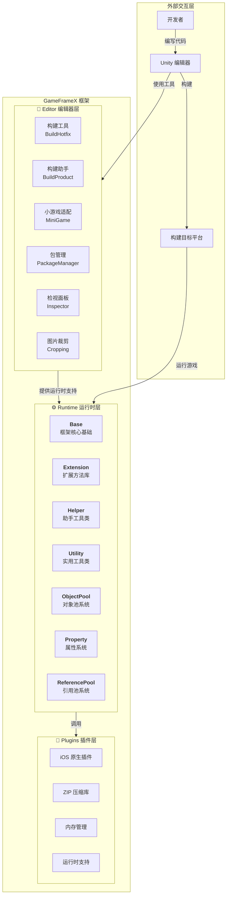
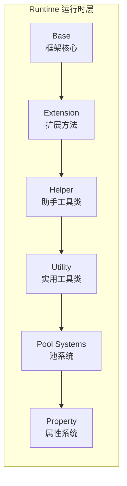

# 概述

GameFrameX 是一个专为独立游戏开发者设计的现代化 Unity 游戏框架，提供完整的前后端一体化解决方案。框架采用**三层模块化架构**设计，内置丰富的游戏开发工具和组件，帮助开发者快速构建高质量的游戏项目。

> Source: [README.zh-CN.md](https://github.com/GameFrameX/com.gameframex.unity/blob/main/README.zh-CN.md#L1-L60)

---

## 项目简介

GameFrameX 旨在为独立游戏开发者提供一个功能强大、易于使用、高度可扩展的游戏开发框架。框架经过精心设计，能够满足从小型个人项目到中型商业游戏的各种需求。

### 核心特性

| 特性 | 描述 |
|------|------|
| **三层架构** | Runtime（运行时）、Plugins（插件）、Editor（编辑器）清晰分层 |
| **丰富工具集** | 内置多种开发辅助工具和编辑器扩展 |
| **对象池管理** | 高效的内存管理和对象复用机制 |
| **扩展方法库** | 丰富的 Unity 引擎扩展方法 |
| **实用工具类** | 涵盖加密、压缩、网络等常用功能 |
| **多平台支持** | 支持 PC、移动端、WebGL 等多平台部署 |
| **热更新支持** | 内置 HybridCLR 热更新解决方案 |
| **小游戏适配** | 一键切换多平台小游戏环境 |

### 系统要求

| 要求 | 规格 |
|------|------|
| **Unity 版本** | 2019.4 或更高版本 |
| **平台支持** | Windows, macOS, Linux, iOS, Android, WebGL |
| **.NET 版本** | .NET Standard 2.0+ |

---

## 架构概览

GameFrameX 采用清晰的三层架构设计，每个模块各司其职，协同工作。这种分层设计确保了代码的高内聚低耦合，便于维护和扩展。



### 架构设计理念

1. **模块化设计**：每个模块独立负责特定功能，便于单独测试和维护
2. **接口分离**：通过接口实现解耦，模块之间通过抽象进行通信
3. **按需加载**：组件按需初始化，避免不必要的性能开销
4. **可扩展性**：提供丰富的扩展点，开发者可以轻松添加自定义功能

---

## 核心模块详解

### Runtime 运行时层

运行时核心代码，提供游戏运行时所需的所有功能。



| 子模块 | 描述 | 主要功能 |
|--------|------|----------|
| **Base** | 框架核心基础 | 组件管理、事件池、日志系统、引用池、任务池、变量系统、生命周期管理、单例模式 |
| **Extension** | 扩展方法库 | 通用扩展（字符串、集合、日期）、Unity类型扩展（Transform、Vector）、序列读取器、GameObject扩展 |
| **Helper** | 助手工具类 | 应用、相机、文件、路径、数学、随机、计时器、网络、JSON、渲染、位置等全方位辅助功能 |
| **ObjectPool** | 对象池系统 | 对象复用、内存优化、性能提升 |
| **Property** | 属性系统 | 可绑定属性、数据监听、MVVM 支持 |
| **ReferencePool** | 引用池系统 | 引用类型对象管理、GC 优化 |
| **Utility** | 实用工具类 | 加密解密（AES/RSA/DSA）、压缩解压、哈希计算（MD5/SHA1/HMAC）、CRC校验、JSON序列化、文件操作、ID生成、类型转换、文本处理、日志等 |

### Plugins 插件层

原生平台插件和第三方依赖库。

| 子模块 | 描述 | 依赖库 |
|--------|------|--------|
| **iOS 插件** | iOS 原生平台功能 | GameFrameX.mm |
| **压缩库** | ZIP 文件压缩/解压 | SharpZipLib |
| **内存管理** | 高效内存操作 | StringTools, Memory, Buffers |
| **运行时支持** | .NET 运行时扩展 | CompilerServices.Unsafe |

### Editor 编辑器层

编辑器工具和扩展，提升开发效率。

| 子模块 | 描述 | 主要功能 |
|--------|------|----------|
| **BuildHotfix** | 热更新构建 | HybridCLR 热更新程序集构建和管理 |
| **BuildProduct** | 产品构建 | 构建流程自动化、前后置处理钩子 |
| **BuildWebGLTools** | WebGL 构建 | WebGL 平台专用构建工具 |
| **Cropping** | 图片裁剪 | 可视化图片裁剪工具 |
| **Inspector** | 自定义检视面板 | 对象池、引用池可视化监控 |
| **InspectorLockShortcut** | 面板锁定 | 快捷键锁定 Inspector 面板 |
| **MiniGame** | 小游戏适配 | 一键切换21个小游戏平台 |
| **PackageManager** | 包管理 | 可视化包管理界面 |
| **UpdatePackages** | 包更新 | 批量更新项目依赖 |
| **Welcome** | 欢迎界面 | 新用户引导和快速入口 |

---

## 平台支持

### 操作系统平台

| 平台 | 状态 | 支持版本 |
|------|------|----------|
| Windows | ✅ 已支持 | Unity 2019.4+ |
| macOS | ✅ 已支持 | Unity 2019.4+ |
| Linux | ✅ 已支持 | Unity 2019.4+ |
| iOS | ✅ 已支持 | Unity 2019.4+ |
| Android | ✅ 已支持 | Unity 2019.4+ |
| WebGL | ✅ 已支持 | Unity 2019.4+ |

### 小游戏平台适配

GameFrameX 提供一键切换的小游戏平台适配功能，支持**全球21个主流小游戏平台**：

#### 🇨🇳 国内小游戏（9个）

微信、支付宝、抖音、快手、百度、京东、淘宝、美团、Bilibili

#### 🌍 国际小游戏（7个）

Discord、YouTube、Facebook、Google Play、TikTok、CrazyGames、Poki

#### 📱 设备厂商（4个）

华为、OPPO、vivo、小米

#### 🎮 游戏平台（1个）

TapTap

---

## 核心概念

### 游戏入口

GameFrameX 使用 `GameEntry` 作为游戏入口点，通过 `GameFrameworkEntry` 管理所有框架模块。

```csharp
using GameFrameX.Runtime;

// 获取对象池组件
var objectPool = GameEntry.GetComponent<ObjectPoolComponent>();

// 获取引用池组件
var referencePool = GameEntry.GetComponent<ReferencePoolComponent>();

// 使用扩展方法
transform.SetPositionX(10f);
gameObject.SetActiveOptimized(true);
```
> Source: [README.zh-CN.md](https://github.com/GameFrameX/com.gameframex.unity/blob/main/README.zh-CN.md#L366-L386)

### 组件系统

GameFrameX 采用组件化设计，所有功能都通过组件（Component）提供。组件继承自 `GameFrameworkComponent` 基类，可以通过 `GameEntry.GetComponent<T>()` 方法获取。

```csharp
public sealed class ObjectPoolComponent : GameFrameworkComponent
{
    // 对象池管理实现
}
```
> Source: [Runtime/ObjectPool/ObjectPoolComponent.cs](https://github.com/GameFrameX/com.gameframex.unity/blob/main/Runtime/ObjectPool/ObjectPoolComponent.cs#L45-L46)

### 模块系统

框架模块（Module）通过接口提供更高层次的抽象，支持按需创建和懒加载。

```csharp
public static T GetModule<T>() where T : class
{
    // 自动创建模块（如果不存在）
    return GetModule(moduleType) as T;
}
```
> Source: [Runtime/Base/GameFrameworkEntry.cs](https://github.com/GameFrameX/com.gameframex.unity/blob/main/Runtime/Base/GameFrameworkEntry.cs#L95-L120)

---

## 版本信息

| 项目 | 信息 |
|------|------|
| **包名** | com.gameframex.unity |
| **版本** | 1.10.0 |
| **Unity 版本** | 2019.4+ |
| **许可证** | MIT + Apache 2.0 |
| **作者** | Blank |

---

## 相关链接

- [📖 完整文档](https://gameframex.doc.alianblank.com)
- [🔧 安装指南](./2-installation)
- [🚀 快速入门](./3-quick-start)
- [💡 核心概念](./4-core-concepts)
- [📦 运行时模块](./5-runtime.base)
- [🛠️ 编辑器工具](./6-editor-tools.build-tools)
- [🌐 平台支持](./7-platforms)
- [📚 API 参考](./8-api-reference)
- [❓ 常见问题](./9-troubleshooting)

---

## 社区与支持

- 💬 **QQ 讨论群**: 467608841
- 🐛 **问题反馈**: [GitHub Issues](https://github.com/GameFrameX/com.gameframex.unity/issues)
- 💡 **功能建议**: [GitHub Discussions](https://github.com/GameFrameX/com.gameframex.unity/discussions)

---

如果这个项目对你有帮助，请给我们一个 ⭐ Star！

