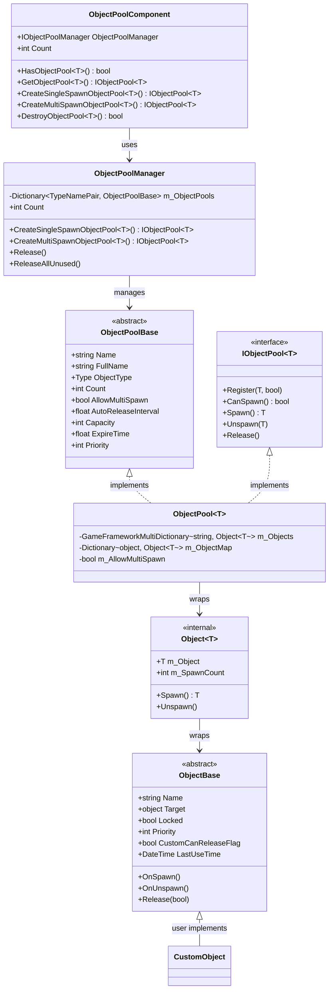
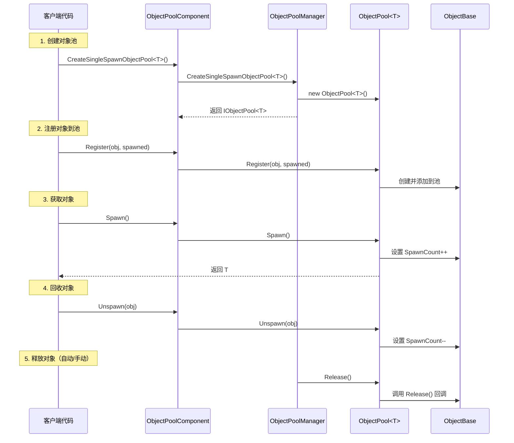

# 对象池系统

对象池系统是 GameFrameX 框架的核心模块之一，用于管理游戏对象的复用，避免频繁的对象创建和销毁带来的性能开销和 GC 压力。该系统提供了完整的对象生命周期管理，包括对象的获取、回收、自动释放等功能。

## 概述

在游戏开发中，频繁创建和销毁对象（如子弹、特效、UI 元素等）是常见的性能瓶颈。对象池系统通过预先创建一定数量的对象并重复利用，显著降低了内存分配开销和 GC 触发频率。

GameFrameX 对象池系统提供以下核心功能：

- **类型安全的泛型池管理**：支持强类型的对象池操作
- **单次/多次获取模式**：灵活控制对象的复用策略
- **自动释放机制**：基于时间过期和容量阈值的自动回收
- **优先级系统**：精细控制对象释放优先级
- **锁定机制**：保护重要对象不被意外释放

## 架构



### 组件说明

| 组件 | 描述 | 层级 |
|------|------|------|
| `ObjectPoolComponent` | Unity 组件，挂在 GameObject 上供场景使用 | API 层 |
| `ObjectPoolManager` | 核心管理器，管理所有对象池 | 核心层 |
| `ObjectPoolBase` | 对象池抽象基类 | 抽象层 |
| `ObjectPool<T>` | 泛型对象池实现 | 实现层 |
| `ObjectBase` | 可池化对象的抽象基类 | 抽象层 |
| `Object<T>` | 内部对象包装器 | 内部实现 |

## 核心概念

### 对象池类型

系统支持两种对象池类型：

**1. 单次获取对象池 (Single Spawn)**
- 同一时间只能有一个消费者使用对象
- 适用于独占性资源，如玩家角色、载具等

```csharp
// 创建一个单次获取对象池
IObjectPool<Bullet> bulletPool = objectPoolComponent.CreateSingleSpawnObjectPool<Bullet>("Bullet Pool", 100, 60f, 10);
```

> Source: [Runtime/ObjectPool/ObjectPoolComponent.cs](https://github.com/GameFrameX/com.gameframex.unity/blob/main/Runtime/ObjectPool/ObjectPoolComponent.cs#L257-L260)

**2. 多次获取对象池 (Multi Spawn)**
- 同一时间可以同时被多个消费者使用
- 适用于可复用资源，如子弹、特效等

```csharp
// 创建一个多次获取对象池
IObjectPool<Effect> effectPool = objectPoolComponent.CreateMultiSpawnObjectPool<Effect>("Effect Pool", 50, 30f, 5);
```

> Source: [Runtime/ObjectPool/ObjectPoolComponent.cs](https://github.com/GameFrameX/com.gameframex.unity/blob/main/Runtime/ObjectPool/ObjectPoolComponent.cs#L655-L658)

### 关键参数

| 参数 | 说明 | 默认值 |
|------|------|--------|
| `name` | 对象池名称，用于标识和查找 | 空字符串 |
| `capacity` | 对象池容量，最大对象数量 | int.MaxValue |
| `expireTime` | 对象过期时间（秒），超过此时间未使用则可被释放 | float.MaxValue（永不过期） |
| `autoReleaseInterval` | 自动释放间隔（秒），每隔此时间尝试释放过期对象 | 依赖创建参数 |
| `priority` | 对象池优先级，影响释放顺序 | 0 |

## 使用流程



## 创建可池化对象

要使用对象池系统，需要继承 `ObjectBase` 类并实现相关方法：

```csharp
using GameFrameX.ObjectPool;
using GameFrameX.Runtime;

public class Bullet : ObjectBase
{
    private BulletController m_Controller;
    
    // 初始化对象
    public void Initialize(BulletController controller)
    {
        Initialize(null, controller.Target, 0);
        m_Controller = controller;
    }
    
    // 对象被获取时调用
    protected internal override void OnSpawn()
    {
        base.OnSpawn();
        m_Controller.gameObject.SetActive(true);
    }
    
    // 对象被回收时调用
    protected internal override void OnUnspawn()
    {
        base.OnUnspawn();
        m_Controller.gameObject.SetActive(false);
    }
    
    // 对象被释放时调用
    protected internal override void Release(bool isShutdown)
    {
        if (isShutdown || m_Controller == null)
        {
            if (m_Controller != null)
            {
                UnityEngine.Object.Destroy(m_Controller.gameObject);
            }
        }
        m_Controller = null;
    }
}
```

> Source: [Runtime/ObjectPool/ObjectBase.cs](https://github.com/GameFrameX/com.gameframex.unity/blob/main/Runtime/ObjectPool/ObjectBase.cs#L201-L223)

### 扩展方法

系统还提供了扩展方法方便用户使用：

```csharp
// 扩展方法示例（伪代码）
public static class ObjectPoolExtensions
{
    public static T Spawn<T>(this IObjectPool<T> pool) where T : ObjectBase
    {
        return pool.Spawn();
    }
    
    public static void Unspawn<T>(this IObjectPool<T> pool, T obj) where T : ObjectBase
    {
        pool.Unspawn(obj);
    }
}
```

## 使用示例

### 基本用法

```csharp
using GameFrameX.Runtime;
using GameFrameX.ObjectPool;
using UnityEngine;

// 1. 获取对象池组件
var objectPoolComponent = UnityEngine.Object.FindObjectOfType<ObjectPoolComponent>();

// 2. 创建对象池（多次获取模式，适合子弹）
var bulletPool = objectPoolComponent.CreateMultiSpawnObjectPool<Bullet>("Bullet Pool", 100, 60f);

// 3. 注册对象到池中
var bulletObj = new Bullet();
bulletObj.Initialize(bulletController);
bulletPool.Register(bulletObj, false);

// 4. 从池中获取对象
var bullet = bulletPool.Spawn();

// 5. 使用完毕后回收对象
bulletPool.Unspawn(bullet);
```

> Source: [Runtime/ObjectPool/ObjectPoolManager.ObjectPool.cs](https://github.com/GameFrameX/com.gameframex.unity/blob/main/Runtime/ObjectPool/ObjectPoolManager.ObjectPool.cs#L256-L292)

### 高级用法：自定义释放策略

```csharp
// 自定义释放过滤器
IObjectPool<Bullet> bulletPool = objectPoolComponent.GetObjectPool<Bullet>("Bullet Pool");

// 释放符合条件的对象
bulletPool.Release(10, (candidateObjects, toReleaseCount, expireTime) =>
{
    // 优先释放优先级低的对象
    var releaseList = new List<Bullet>();
    var sorted = candidateObjects.OrderByDescending(b => b.Priority)
                                 .ThenBy(b => b.LastUseTime);
    
    int count = 0;
    foreach (var bullet in sorted)
    {
        if (count >= toReleaseCount) break;
        releaseList.Add(bullet);
        count++;
    }
    return releaseList;
});
```

> Source: [Runtime/ObjectPool/ObjectPoolManager.ObjectPool.cs](https://github.com/GameFrameX/com.gameframex.unity/blob/main/Runtime/ObjectPool/ObjectPoolManager.ObjectPool.cs#L498-L529)

### 高级用法：对象锁定

```csharp
// 锁定对象，防止被自动释放
bulletPool.SetLocked(bullet, true);

// 解锁对象，允许被释放
bulletPool.SetLocked(bullet, false);
```

> Source: [Runtime/ObjectPool/ObjectPoolManager.ObjectPool.cs](https://github.com/GameFrameX/com.gameframex.unity/blob/main/Runtime/ObjectPool/ObjectPoolManager.ObjectPool.cs#L336-L374)

### 高级用法：设置优先级

```csharp
// 设置对象优先级（数值越大优先级越高，越晚被释放）
bulletPool.SetPriority(bullet, 100);
```

> Source: [Runtime/ObjectPool/ObjectPoolManager.ObjectPool.cs](https://github.com/GameFrameX/com.gameframex.unity/blob/main/Runtime/ObjectPool/ObjectPoolManager.ObjectPool.cs#L376-L414)

## 配置选项

### ObjectPoolComponent 配置

在 Unity 编辑器中，`ObjectPoolComponent` 组件提供以下可配置项：

| 配置项 | 类型 | 说明 |
|--------|------|------|
| ImplementationComponentType | Type | 对象池管理器实现类型 |
| InterfaceComponentType | Type | 对象池管理器接口类型 |

> 详情请参考 ObjectPoolComponent 源码

### 对象池参数配置

| 参数 | 类型 | 默认值 | 说明 |
|------|------|--------|------|
| name | string | "" | 对象池名称 |
| capacity | int | int.MaxValue | 对象池容量 |
| expireTime | float | float.MaxValue | 对象过期时间（秒） |
| autoReleaseInterval | float | float.MaxValue | 自动释放间隔 |
| priority | int | 0 | 对象池优先级 |

## API 参考

### ObjectPoolComponent

```csharp
// 创建单次获取对象池
IObjectPool<T> CreateSingleSpawnObjectPool<T>(string name, float autoReleaseInterval, int capacity, float expireTime, int priority)
```

**参数：**
- `name` (string): 对象池名称
- `autoReleaseInterval` (float): 自动释放间隔秒数
- `capacity` (int): 对象池容量
- `expireTime` (float): 对象过期秒数
- `priority` (int): 对象池优先级

```csharp
// 创建多次获取对象池
IObjectPool<T> CreateMultiSpawnObjectPool<T>(string name, float autoReleaseInterval, int capacity, float expireTime, int priority)
```

> Source: [Runtime/ObjectPool/ObjectPoolComponent.cs](https://github.com/GameFrameX/com.gameframex.unity/blob/main/Runtime/ObjectPool/ObjectPoolComponent.cs#L1026-L1029)

### IObjectPool<T>

```csharp
// 注册对象到池
void Register(T obj, bool spawned)

// 检查是否可以获取对象
bool CanSpawn(string name)

// 获取对象
T Spawn(string name)

// 回收对象
void Unspawn(T obj)

// 释放对象
void Release()
```

> Source: [Runtime/ObjectPool/IObjectPool.cs](https://github.com/GameFrameX/com.gameframex.unity/blob/main/Runtime/ObjectPool/IObjectPool.cs#L92-L129)

## 相关链接

- [引用池系统](./5-runtime.reference-pool) - 另一种池化机制，用于管理引用类型对象
- [任务池系统](./5-runtime.task-pool) - 异步任务池管理
- [基础组件](./5-runtime.base) - GameFramework 基础组件
- [API 参考](./8-api-reference) - 完整的 API 文档
