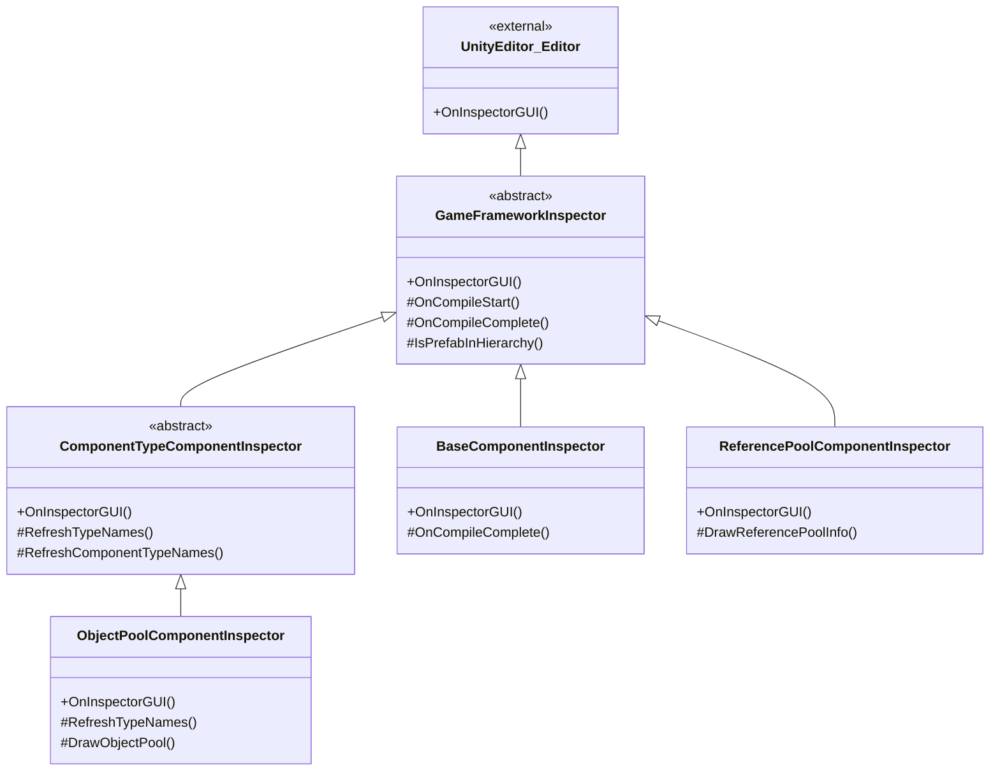

# 检视面板工具

检视面板工具是 GameFrameX 为 Unity 编辑器提供的一系列自定义检视面板（Inspector）扩展，用于在编辑器中直观地查看和配置游戏框架各组件的运行状态和参数。

## 概述

GameFrameX 的检视面板工具通过扩展 Unity 原生的 Inspector 系统，为框架的核心组件提供了更加友好和功能丰富的配置界面。这些自定义检视面板不仅可以在编辑器模式下配置组件属性，还能在运行时实时显示对象池、引用池等系统的内部状态，帮助开发者更好地调试和优化游戏性能。

检视面板工具主要包含以下功能：
- **基础组件检视面板**：配置全局助手类型（文本、版本、日志、压缩、JSON）和运行时参数（帧率、游戏速度）
- **对象池检视面板**：运行时显示对象池状态，支持手动释放和 CSV 数据导出
- **引用池检视面板**：按程序集分组显示引用池统计信息，支持数据导出
- **检视面板锁定快捷键**：通过菜单快捷键快速切换 Inspector 锁定状态

## 架构

检视面板工具采用面向对象的继承结构，通过抽象基类定义通用功能，具体的检视面板实现定制化的界面展示。



### 核心组件说明

| 类名 | 职责 | 继承关系 |
|------|------|----------|
| `GameFrameworkInspector` | 所有检视面板的抽象基类，提供编译状态检测和 Prefab 层级判断等通用功能 | 继承自 `UnityEditor.Editor` |
| `ComponentTypeComponentInspector` | 组件类型选择器的抽象基类，用于需要动态选择组件类型的场景 | 继承自 `GameFrameworkInspector` |
| `BaseComponentInspector` | `BaseComponent` 的定制检视面板，配置全局助手类型和运行时参数 | 继承自 `GameFrameworkInspector` |
| `ObjectPoolComponentInspector` | `ObjectPoolComponent` 的定制检视面板，显示对象池运行时状态 | 继承自 `ComponentTypeComponentInspector` |
| `ReferencePoolComponentInspector` | `ReferencePoolComponent` 的定制检视面板，显示引用池统计信息 | 继承自 `GameFrameworkInspector` |

## 功能详解

### 基础检视面板基类

`GameFrameworkInspector` 是所有自定义检视面板的基类，提供了编译状态检测和 Prefab 层级判断等通用功能。

```csharp
public abstract class GameFrameworkInspector : UnityEditor.Editor
{
    protected const string NoneOptionName = "<None>";
    private bool m_IsCompiling = false;

    public override void OnInspectorGUI()
    {
        if (m_IsCompiling && !EditorApplication.isCompiling)
        {
            m_IsCompiling = false;
            OnCompileComplete();
        }
        else if (!m_IsCompiling && EditorApplication.isCompiling)
        {
            m_IsCompiling = true;
            OnCompileStart();
        }
    }

    protected bool IsPrefabInHierarchy(UnityEngine.Object obj)
    {
        // 判断对象是否在 Prefab 层级视图中
    }
}
```
> Source: [GameFrameworkInspector.cs](https://github.com/GameFrameX/com.gameframex.unity/blob/main/Editor/Inspector/GameFrameworkInspector.cs#L1-L57)

**设计意图：**
- 监听 Unity 编译状态变化，在编译完成后自动刷新类型列表
- 提供 Prefab 层级判断方法，确保运行时检视功能仅在场景中的对象上可用

### BaseComponent 检视面板

`BaseComponentInspector` 为基础组件提供了丰富的配置界面，包括全局助手类型的选择和运行时参数的控制。

```csharp
[CustomEditor(typeof(BaseComponent))]
internal sealed class BaseComponentInspector : GameFrameworkInspector
{
    private static readonly float[] GameSpeed = new float[] { 0f, 0.01f, 0.1f, 0.25f, 0.5f, 1f, 1.5f, 2f, 4f, 8f };

    public override void OnInspectorGUI()
    {
        base.OnInspectorGUI();
        serializedObject.Update();
        
        // 全局助手类型配置
        EditorGUILayout.BeginVertical("box");
        {
            EditorGUILayout.LabelField("Global Helpers", EditorStyles.boldLabel);
            int textHelperSelectedIndex = EditorGUILayout.Popup("Text Helper", m_TextHelperTypeNameIndex, m_TextHelperTypeNames);
            // ... 其他助手类型配置
        }
        EditorGUILayout.EndVertical();

        // 帧率配置
        int frameRate = EditorGUILayout.IntSlider("Frame Rate", m_FrameRate.intValue, 1, 120);

        // 游戏速度配置
        float gameSpeed = EditorGUILayout.Slider("Game Speed", m_GameSpeed.floatValue, 0f, 8f);

        serializedObject.ApplyModifiedProperties();
    }
}
```
> Source: [BaseComponentInspector.cs](https://github.com/GameFrameX/com.gameframex.unity/blob/main/Editor/Inspector/BaseComponentInspector.cs#L40-L193)

**功能特性：**
- **助手类型配置**：通过下拉菜单动态选择 Text、Version、Log、Compression、JSON 等助手类型
- **帧率控制**：滑块控制游戏帧率（1-120）
- **游戏速度**：滑块+预设按钮控制时间缩放（0x - 8x）
- **后台运行**：Toggle 控制应用是否在后台运行
- **屏幕常亮**：Toggle 控制是否禁止设备休眠

### 对象池检视面板

`ObjectPoolComponentInspector` 在运行时显示对象池的详细状态信息。

```csharp
[CustomEditor(typeof(ObjectPoolComponent))]
internal sealed class ObjectPoolComponentInspector : ComponentTypeComponentInspector
{
    private readonly HashSet<string> m_OpenedItems = new HashSet<string>();

    public override void OnInspectorGUI()
    {
        base.OnInspectorGUI();

        if (!EditorApplication.isPlaying)
        {
            EditorGUILayout.HelpBox("Available during runtime only.", MessageType.Info);
            return;
        }

        ObjectPoolComponent t = (ObjectPoolComponent)target;
        if (IsPrefabInHierarchy(t.gameObject))
        {
            EditorGUILayout.LabelField("Object Pool Count", t.Count.ToString());
            ObjectPoolBase[] objectPools = t.GetAllObjectPools(true);
            foreach (ObjectPoolBase objectPool in objectPools)
            {
                DrawObjectPool(objectPool);
            }
        }
    }
}
```
> Source: [ObjectPoolComponentInspector.cs](https://github.com/GameFrameX/com.gameframex.unity/blob/main/Editor/Inspector/ObjectPoolComponentInspector.cs#L43-L72)

**功能特性：**
- **运行时可用**：仅在游戏运行时显示详细信息
- **可折叠列表**：每个对象池可以展开查看详情
- **实时统计**：显示池容量、使用计数、可用释放数量、过期时间等
- **手动释放**：提供 Release 和 Release All Unused 按钮
- **CSV 导出**：支持将对象池数据导出为 CSV 文件进行分析

### 引用池检视面板

`ReferencePoolComponentInspector` 按程序集分组显示引用池的统计信息。

```csharp
[CustomEditor(typeof(ReferencePoolComponent))]
internal sealed class ReferencePoolComponentInspector : GameFrameworkInspector
{
    private readonly Dictionary<string, List<ReferencePoolInfo>> m_ReferencePoolInfos = new Dictionary<string, List<ReferencePoolInfo>>();

    public override void OnInspectorGUI()
    {
        base.OnInspectorGUI();
        serializedObject.Update();

        ReferencePoolComponent t = (ReferencePoolComponent)target;

        if (EditorApplication.isPlaying && IsPrefabInHierarchy(t.gameObject))
        {
            // 显示严格检查开关
            bool enableStrictCheck = EditorGUILayout.Toggle("Enable Strict Check", t.EnableStrictCheck);
            
            // 按程序集分组显示引用池信息
            foreach (KeyValuePair<string, List<ReferencePoolInfo>> assemblyReferencePoolInfo in m_ReferencePoolInfos)
            {
                bool currentState = EditorGUILayout.Foldout(lastState, assemblyReferencePoolInfo.Key);
                // 显示详细统计信息
            }
        }
    }
}
```
> Source: [ReferencePoolComponentInspector.cs](https://github.com/GameFrameX/com.gameframex.unity/blob/main/Editor/Inspector/ReferencePoolComponentInspector.cs#L42-L151)

**功能特性：**
- **程序集分组**：按程序集名称分组显示引用池
- **详细统计**：显示未使用/使用中/获取/释放/添加/移除的引用计数
- **严格检查开关**：运行时控制是否启用严格检查
- **简洁/完整类名切换**：可选择显示简短类名或完整类名
- **CSV 导出**：支持数据导出功能

### 检视面板锁定快捷键

`InspectorLockShortcut` 提供了一个编辑器窗口，用于快速切换 Inspector 的锁定状态。

```csharp
public sealed class InspectorLockShortcut : EditorWindow
{
    [MenuItem("Window/Toggle Inspector Lock %l")]
    private static void ToggleInspectorLock()
    {
        // 获取Inspector窗口
        var inspectorType = typeof(UnityEditor.Editor).Assembly.GetType("UnityEditor.InspectorWindow");
        var inspectorWindow = EditorWindow.GetWindow(inspectorType);
        // 使用反射调用isLocked属性
        var isLockedProperty = inspectorType.GetProperty("isLocked");
        var isLocked = (bool)isLockedProperty.GetValue(inspectorWindow);
        isLockedProperty.SetValue(inspectorWindow, !isLocked);
    }
}
```
> Source: [InspectorLockShortcut.cs](https://github.com/GameFrameX/com.gameframex.unity/blob/main/Editor/InspectorLockShortcut/InspectorLockShortcut.cs#L5-L18)

**功能特性：**
- **快捷键**：使用 `Ctrl+L`（Mac 上为 `Cmd+L`）快速切换
- **菜单入口**：在 `Window` 菜单下显示 `Toggle Inspector Lock` 选项
- **反射实现**：通过反射调用 Unity 内部 API 实现锁定功能

## 使用方法

### 查看基础组件配置

1. 在 Unity 场景中创建一个空物体，添加 `BaseComponent` 组件
2. 选中该物体，在 Inspector 面板中查看自定义检视面板
3. 通过下拉菜单选择各类助手类型
4. 调整帧率和游戏速度滑块

### 查看运行时对象池状态

1. 运行游戏场景
2. 选中包含 `ObjectPoolComponent` 的游戏对象
3. 展开各个对象池查看详细信息
4. 可点击 Release 按钮手动释放对象
5. 可点击 Export CSV Data 导出数据分析

### 查看运行时引用池状态

1. 运行游戏场景
2. 选中包含 `ReferencePoolComponent` 的游戏对象
3. 按程序集展开查看各类引用统计
4. 切换 Show Full Class Name 查看完整类名
5. 导出 CSV 数据进行性能分析

### 锁定检视面板

1. 按下 `Ctrl+L`（或通过 Window > Toggle Inspector Lock 菜单）
2. Inspector 面板将锁定当前选中的对象
3. 再次按下快捷键可解锁

## 扩展检视面板

框架提供了可扩展的基类，开发者可以基于此创建自定义检视面板。

### 继承 GameFrameworkInspector

```csharp
[CustomEditor(typeof(MyComponent))]
public class MyComponentInspector : GameFrameworkInspector
{
    public override void OnInspectorGUI()
    {
        base.OnInspectorGUI();
        serializedObject.Update();
        
        // 自定义检视面板逻辑
        
        serializedObject.ApplyModifiedProperties();
    }

    protected override void OnCompileComplete()
    {
        base.OnCompileComplete();
        // 编译完成后刷新数据
    }
}
```

### 继承 ComponentTypeComponentInspector

```csharp
[CustomEditor(typeof(MyComponentWithType))]
public class MyComponentWithTypeInspector : ComponentTypeComponentInspector
{
    protected override void RefreshTypeNames()
    {
        RefreshComponentTypeNames(typeof(IMyInterface));
    }

    protected override void Enable()
    {
        // 额外的初始化逻辑
    }
}
```

## 相关链接

- [运行时模块概述](./5-runtime.base)
- [对象池系统](./5-runtime.object-pool)
- [引用池系统](./5-runtime.reference-pool)
- [构建工具](./6-editor-tools.build-tools)
- [包管理工具](./6-editor-tools.package-management)
