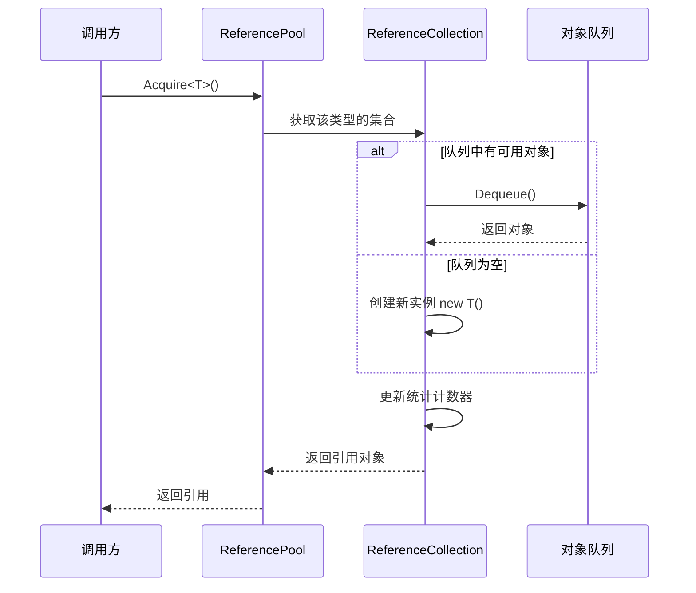
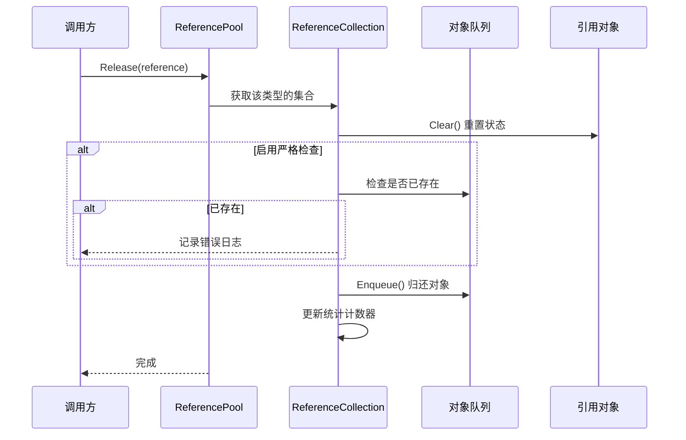

# 引用池系统

引用池系统是 GameFrameX 框架的核心组件之一，用于管理可复用的引用对象，通过对象复用来减少垃圾回收（GC）带来的性能开销。

## 概述

在游戏开发中，频繁创建和销毁对象是导致性能问题的主要原因之一。特别是在高频场景（如粒子系统、事件系统、网络消息处理等）中，每秒可能创建数千个临时对象，这会触发频繁的垃圾回收，导致游戏卡顿。

引用池系统通过以下方式解决这一问题：

1. **对象复用**：从池中获取对象使用，使用完毕后归还池中，避免频繁创建销毁
2. **按类型管理**：每种类型的引用有独立的子池，确保类型安全
3. **状态重置**：归还时自动调用 `Clear()` 方法重置对象状态
4. **统计监控**：提供完整的获取/归还/添加/移除统计，便于性能调优

## 架构

```mermaid
graph TD
    subgraph External["外部调用"]
        Developer["开发者代码"]
    end

    subgraph API["引用池 API"]
        RP["ReferencePool 静态类"]
    end

    subgraph Internal["内部实现"]
        RC["ReferenceCollection<br/>(每类型一个)"]
        Queue["Queue~IReference~<br/>(对象队列)"]
    end

    subgraph Data["数据模型"]
        IRef["IReference 接口"]
        Info["ReferencePoolInfo<br/>(统计信息)"]
    end

    subgraph Unity["Unity 集成"]
        RPC["ReferencePoolComponent<br/>(Unity 组件)"]
        RSCT["ReferenceStrictCheckType<br/>(检查模式枚举)"]
    end

    Developer --> RP
    RP --> RC
    RC --> Queue
    IRef -.->|"实现|", Queue
    RC --> Info
    RPC -.-> RP
    RP -.-> RSCT
```

### 核心组件

| 组件 | 类型 | 说明 |
|------|------|------|
| `IReference` | 接口 | 所有可池化对象必须实现的接口，包含 `Clear()` 方法 |
| `ReferencePool` | 静态类 | 引用池的主 API，提供获取/归还/添加/移除等操作 |
| `ReferenceCollection` | 内部类 | 管理特定类型引用对象的内部集合 |
| `ReferencePoolInfo` | 结构体 | 包含引用池的统计信息 |
| `ReferencePoolComponent` | Unity 组件 | Unity 集成组件，用于配置和监控引用池 |

## 工作原理

### 引用获取流程



### 引用归还流程



### 严格检查模式

引用池支持三种严格检查模式，通过 `ReferenceStrictCheckType` 枚举配置：

| 模式 | 说明 | 适用场景 |
|------|------|----------|
| `AlwaysEnable` | 始终启用严格检查 | 调试阶段捕获重复归还 |
| `OnlyEnableWhenDevelopment` | 仅在开发构建时启用 | 开发时调试，生产环境保持性能 |
| `OnlyEnableInEditor` | 仅在编辑器中启用 | 纯编辑器调试 |
| `AlwaysDisable` | 始终禁用严格检查 | 生产环境最大化性能 |

严格检查会在归还引用时验证该对象是否已在池中，避免重复归还导致的内存问题。

## 使用示例

### 基本用法

首先，需要实现 `IReference` 接口创建可池化的引用类：

```csharp
using GameFrameX.Runtime;

public class MyData : IReference
{
    public string Name;
    public int Value;
    public Dictionary<string, object> ExtraData;

    public void Clear()
    {
        Name = null;
        Value = 0;
        ExtraData?.Clear();
    }
}
```

然后使用引用池获取和归还对象：

```csharp
// 从池中获取引用
MyData data = ReferencePool.Acquire<MyData>();
data.Name = "Test";
data.Value = 100;

// 使用完毕归还池中
ReferencePool.Release(data);
```

### 预热池

可以在游戏开始时预热池，提前创建一定数量的引用对象：

```csharp
// 预热：为某种类型预先添加 100 个引用
ReferencePool.Add<MyData>(100);
```

### 获取池统计信息

在运行时监控引用池状态：

```csharp
// 获取所有引用池的统计信息
ReferencePoolInfo[] infos = ReferencePool.GetAllReferencePoolInfos();

foreach (var info in infos)
{
    Debug.Log($"Type: {info.Type.Name}");
    Debug.Log($"未使用: {info.UnusedReferenceCount}");
    Debug.Log($"使用中: {info.UsingReferenceCount}");
    Debug.Log($"获取次数: {info.AcquireReferenceCount}");
    Debug.Log($"归还次数: {info.ReleaseReferenceCount}");
}
```

### 清空池

在适当的时机清空所有引用池：

```csharp
// 清空所有引用池
ReferencePool.ClearAll();
```

### 使用 Unity 组件配置

在 Unity 场景中添加引用池组件：

```csharp
// 在 Inspector 中配置严格检查模式
// ReferencePoolComponent 会自动初始化引用池配置
```

> Source: [ReferencePoolComponent.cs](https://github.com/GameFrameX/com.gameframex.unity/blob/main/Runtime/ReferencePool/ReferencePoolComponent.cs#L42-L95)

## API 参考

### `ReferencePool`

引用池的静态主类，提供所有池操作。

#### `Acquire<T>() where T : class, IReference, new(): T`

从引用池获取指定类型的引用。

```csharp
T item = ReferencePool.Acquire<T>();
```
> Source: [ReferencePool.cs](https://github.com/GameFrameX/com.gameframex.unity/blob/main/Runtime/Base/ReferencePool/ReferencePool.cs#L129-L132)

**参数：**
- 无（泛型参数 `T` 指定引用类型）

**返回：** 获取的引用实例

**说明：** 如果池中有可用引用则取出，否则创建新实例

---

#### `Acquire(Type referenceType): IReference`

从引用池获取指定类型的引用（使用 Type 参数）。

```csharp
IReference item = ReferencePool.Acquire(typeof(MyData));
```
> Source: [ReferencePool.cs](https://github.com/GameFrameX/com.gameframex.unity/blob/main/Runtime/Base/ReferencePool/ReferencePool.cs#L143-L147)

**参数：**
- `referenceType` (Type): 引用的类型

**返回：** 获取的引用实例

---

#### `Release(IReference reference): void`

将引用归还到引用池。

```csharp
ReferencePool.Release(myData);
```
> Source: [ReferencePool.cs](https://github.com/GameFrameX/com.gameframex.unity/blob/main/Runtime/Base/ReferencePool/ReferencePool.cs#L157-L167)

**参数：**
- `reference` (IReference): 要归还的引用

**抛出：**
- `GameFrameworkException`: 当引用为 null 时

---

#### `Add<T>(int count) where T : class, IReference, new(): void`

向引用池中追加指定数量的引用。

```csharp
// 预热：添加 100 个引用
ReferencePool.Add<MyData>(100);
```
> Source: [ReferencePool.cs](https://github.com/GameFrameX/com.gameframex.unity/blob/main/Runtime/Base/ReferencePool/ReferencePool.cs#L178-L181)

**参数：**
- `count` (int): 要添加的数量

---

#### `Remove<T>(int count) where T : class, IReference: void`

从引用池中移除指定数量的未使用引用。

```csharp
ReferencePool.Remove<MyData>(10);
```
> Source: [ReferencePool.cs](https://github.com/GameFrameX/com.gameframex.unity/blob/main/Runtime/Base/ReferencePool/ReferencePool.cs#L207-L210)

**参数：**
- `count` (int): 要移除的数量

---

#### `RemoveAll<T>() where T : class, IReference: void`

从引用池中移除指定类型的所有未使用引用。

```csharp
ReferencePool.RemoveAll<MyData>();
```
> Source: [ReferencePool.cs](https://github.com/GameFrameX/com.gameframex.unity/blob/main/Runtime/Base/ReferencePool/ReferencePool.cs#L235-L238)

---

#### `ClearAll(): void`

清除所有引用池中的所有引用。

```csharp
ReferencePool.ClearAll();
```
> Source: [ReferencePool.cs](https://github.com/GameFrameX/com.gameframex.unity/blob/main/Runtime/Base/ReferencePool/ReferencePool.cs#L107-L118)

---

#### `GetAllReferencePoolInfos(): ReferencePoolInfo[]`

获取所有引用池的统计信息。

```csharp
ReferencePoolInfo[] infos = ReferencePool.GetAllReferencePoolInfos();
```
> Source: [ReferencePool.cs](https://github.com/GameFrameX/com.gameframex.unity/blob/main/Runtime/Base/ReferencePool/ReferencePool.cs#L82-L98)

**返回：** 包含所有引用池信息的数组

---

#### `EnableStrictCheck: bool`

获取或设置是否启用严格检查模式。

```csharp
// 启用严格检查
ReferencePool.EnableStrictCheck = true;

// 检查当前状态
if (ReferencePool.EnableStrictCheck)
{
    // ...
}
```
> Source: [ReferencePool.cs](https://github.com/GameFrameX/com.gameframex.unity/blob/main/Runtime/Base/ReferencePool/ReferencePool.cs#L56-L60)

---

#### `Count: int`

获取当前管理的引用池数量。

```csharp
int poolCount = ReferencePool.Count;
```
> Source: [ReferencePool.cs](https://github.com/GameFrameX/com.gameframex.unity/blob/main/Runtime/Base/ReferencePool/ReferencePool.cs#L69-L72)

---

### `IReference`

所有可池化对象必须实现的接口。

```csharp
public interface IReference
{
    void Clear();
}
```
> Source: [IReference.cs](https://github.com/GameFrameX/com.gameframex.unity/blob/main/Runtime/Base/ReferencePool/IReference.cs#L40-L49)

#### `Clear(): void`

清理引用，将对象重置为初始状态。该方法在对象从池中取出时**不会**被调用，仅在对象归还池中时由系统自动调用。

```csharp
public class MyData : IReference
{
    public string Name;
    public int Value;

    public void Clear()
    {
        Name = null;
        Value = 0;
    }
}
```

**实现建议：**
- 将所有可写属性重置为默认值
- 释放或清空内部引用的非托管资源（如有）
- 清空集合类成员（如 List、Dictionary）

---

### `ReferencePoolInfo`

包含引用池统计信息的结构体。

> Source: [ReferencePoolInfo.cs](https://github.com/GameFrameX/com.gameframex.unity/blob/main/Runtime/Base/ReferencePool/ReferencePoolInfo.cs#L44-L162)

| 属性 | 类型 | 说明 |
|------|------|------|
| `Type` | Type | 引用池管理的类型 |
| `UnusedReferenceCount` | int | 池中未使用（可用）的引用数量 |
| `UsingReferenceCount` | int | 当前正在被使用的引用数量 |
| `AcquireReferenceCount` | int | 总共获取引用的次数 |
| `ReleaseReferenceCount` | int | 总共归还引用的次数 |
| `AddReferenceCount` | int | 总共添加引用的次数 |
| `RemoveReferenceCount` | int | 总共移除引用的次数 |

---

### `ReferenceStrictCheckType`

引用严格检查模式的枚举类型。

> Source: [ReferenceStrictCheckType.cs](https://github.com/GameFrameX/com.gameframex.unity/blob/main/Runtime/ReferencePool/ReferenceStrictCheckType.cs#L40-L61)

| 值 | 说明 |
|------|------|
| `AlwaysEnable` | 始终启用严格检查 |
| `OnlyEnableWhenDevelopment` | 仅在开发构建时启用 |
| `OnlyEnableInEditor` | 仅在编辑器中启用 |
| `AlwaysDisable` | 始终禁用严格检查 |

---

## 性能优化建议

### 1. 预热池

在游戏开始或切换场景时预热池：

```csharp
void WarmUpPools()
{
    // 根据预估使用量预热
    ReferencePool.Add<MyData>(50);
    ReferencePool.Add<AnotherData>(30);
}
```

### 2. 合理实现 Clear 方法

确保 `Clear()` 方法高效执行：

```csharp
// ✅ 推荐：直接赋值而非创建新实例
public void Clear()
{
    Name = null;
    Value = 0;
    ExtraData.Clear(); // 清空而非置空
}

// ❌ 避免：创建新实例
public void Clear()
{
    ExtraData = new Dictionary<string, object>(); // 每次创建新对象
}
```

### 3. 生产环境禁用严格检查

在发布版本中禁用严格检查以获得最佳性能：

```csharp
// 在 Release 构建设置
ReferencePool.EnableStrictCheck = false;

// 或通过组件配置
// 将 ReferencePoolComponent 的 Strict Check Type 设置为 AlwaysDisable
```

### 4. 监控池状态

定期检查池状态，识别潜在的内存问题：

```csharp
void LogPoolStats()
{
    foreach (var info in ReferencePool.GetAllReferencePoolInfos())
    {
        // 检查是否有泄漏（使用中很多但未使用很少）
        if (info.UsingReferenceCount > 100 && info.UnusedReferenceCount < 5)
        {
            Debug.LogWarning($"Potential leak: {info.Type.Name}");
        }
    }
}
```

## 常见问题

### Q: 引用池和对象池有什么区别？

引用池专门用于实现 `IReference` 接口的对象，强调轻量级复用。对象池（Object Pool）概念更广泛，可以用于任何可复用的对象。GameFrameX 同时提供了引用池和对象池系统，详情请参阅 [对象池系统](./5-runtime.object-pool)。

### Q: 为什么 Clear 方法在获取时不被调用？

设计决策：获取时保持对象最近一次使用的数据可以提高缓存命中率。如果需要干净的对象，可以手动调用 `Clear()` 或使用 `ReferencePool.Release()` 后再获取新对象。

### Q: 如何处理引用池的内存占用？

- 使用 `Remove()` 方法移除多余的空闲引用
- 使用 `ClearAll()` 在适当场景清空所有池
- 监控 `UnusedReferenceCount` 避免过多空闲对象

---

## 相关链接

- [对象池系统](./5-runtime.object-pool) - 另一种对象复用机制
- [任务池系统](./5-runtime.task-pool) - 异步任务管理
- [API 参考](./8-api-reference) - 完整 API 文档
