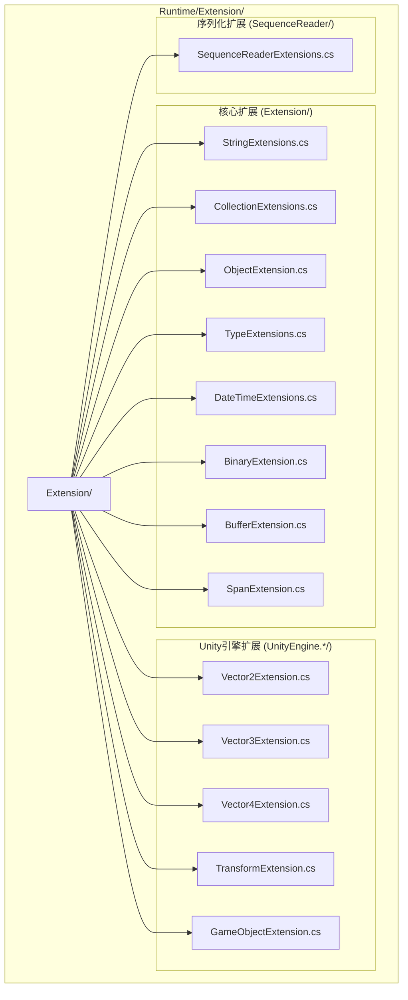

# 扩展方法库

GameFrameX 扩展方法库为 .NET 基础类型和 Unity 引擎类型提供了一套丰富的扩展方法，旨在简化常见编程任务，提升开发效率。所有扩展方法均使用 `[UnityEngine.Scripting.Preserve]` 特性标记，以确保在 Unity 打包时不会被代码裁剪。

## 概述

扩展方法库是 GameFrameX 框架的核心基础组件之一，提供了对标准库类型和 Unity 引擎类型的增强功能。这些扩展方法遵循 C# 扩展方法语法规范，以静态类的形式提供服务，可以直接在任何支持扩展方法的位置使用。

### 设计目标

扩展方法库的设计遵循以下核心原则：

1. **简化常见操作**：将复杂的操作封装为简洁的 API 调用
2. **提升性能**：针对高频操作提供性能优化版本（如字符串快速比较）
3. **类型安全**：充分利用泛型和强类型确保编译时安全
4. **Unity 兼容**：所有方法均考虑 Unity 平台的特殊要求

### 目录结构

扩展方法库的源代码组织结构如下：



## 核心功能分类

扩展方法库提供的功能可以分为以下几个主要类别：

### 1. 字符串扩展方法

字符串扩展方法提供了字符串的快速比较、格式转换、编码转换等功能。

**主要功能：**

- 快速字符串比较：`EqualsFast`、`StartsWithFast`、`EndsWithFast` - 从字符串末尾开始逐字符比较，性能优于标准方法
- 字符串编码转换：`ToBytes`、`ToByteArray`、`ToUtf8` - 支持默认编码和 UTF-8 编码
- 十六进制转换：`HexToBytes` - 将十六进制字符串转换为字节数组
- 空值检查：`IsNullOrEmpty`、`IsNullOrWhiteSpace`、`IsNotNullOrEmpty`、`IsNotNullOrWhiteSpace`
- 格式化和清理：`Format`、`TrimEmpty`、`TrimZhCn` - 移除空白字符或中文字符
- 命名转换：`ConvertToSnakeCase` - 将驼峰命名转换为蛇形命名
- 字符串分割：`SplitToIntArray`、`SplitTo2IntArray` - 将字符串分割为整数数组

```csharp
// 快速字符串比较示例
string str = "Hello World";
bool isMatch = str.EqualsFast("hello world"); // 返回 false（区分大小写）
bool startsWithHello = str.StartsWithFast("Hello"); // 返回 true
bool endsWithWorld = str.EndsWithFast("World"); // 返回 true

// 字符串转字节数组
byte[] bytes = str.ToUtf8(); // UTF-8 编码
byte[] defaultBytes = str.ToByteArray(); // 默认编码

// 十六进制字符串转字节数组
string hex = "48656C6C6F";
byte[] hexBytes = hex.HexToBytes(); // [72, 101, 108, 108, 111]

// 空值检查
string nullStr = null;
bool emptyCheck = nullStr.IsNullOrEmpty(); // true
bool whitespaceCheck = "   ".IsNullOrWhiteSpace(); // true
```
> Source: [StringExtensions.cs](https://github.com/GameFrameX/com.gameframex.unity/blob/main/Runtime/Extension/Extension/StringExtensions.cs#L31-L58)

### 2. 集合扩展方法

集合扩展方法为 Dictionary、List、HashSet 等集合类型提供了便捷的操作方法。

**主要功能：**

- Dictionary 扩展：
  - `Merge` - 合并键值对，支持自定义合并函数
  - `GetOrAdd` - 获取或添加元素，支持默认值和工厂方法
  - `RemoveIf` - 按条件移除元素
- List 扩展：
  - `Shuffle` - Fisher-Yates 洗牌算法打乱列表顺序
  - `RemoveIf` - 按条件移除元素
  - `ListToString` - 将列表转换为分隔符连接的字符串
- HashSet 扩展：
  - `AddRange` - 批量添加元素
- ICollection 扩展：
  - `IsNullOrEmpty` - 检查集合是否为空

```csharp
// Dictionary 使用示例
var dict = new Dictionary<string, int>();
dict.Merge("score", 100, (old, newVal) => old + newVal); // 合并值
int value = dict.GetOrAdd("newKey", k => 100); // 获取或创建

// List 使用示例
var list = new List<int> { 1, 2, 3, 4, 5 };
list.Shuffle(); // 随机打乱
list.RemoveIf(x => x > 3); // 移除大于3的元素
string result = list.ListToString(","); // "1,2,3,"
```
> Source: [CollectionExtensions.cs](https://github.com/GameFrameX/com.gameframex.unity/blob/main/Runtime/Extension/Extension/CollectionExtensions.cs#L33-L77)

### 3. 对象扩展方法

对象扩展方法提供了对象空值检查和验证功能。

**主要功能：**

- `IsNull` - 检查对象是否为 null
- `IsNotNull` - 检查对象是否不为 null
- `CheckNull` - 检查对象是否为 null，为 null 时抛出 ArgumentNullException

```csharp
object obj = null;
bool isNull = obj.IsNull(); // true
bool isNotNull = obj.IsNotNull(); // false

object validObj = new object();
validObj.CheckNull("validObj"); // 不抛出异常
```
> Source: [ObjectExtension.cs](https://github.com/GameFrameX/com.gameframex.unity/blob/main/Runtime/Extension/Extension/ObjectExtension.cs#L18-L47)

### 4. 类型扩展方法

类型扩展方法用于检查类型是否实现了特定的接口。

**主要功能：**

- `IsImplWithInterface` - 检查类型是否实现了指定的接口，支持仅检查直接实现或包含继承链

```csharp
// 检查类型是否实现接口
Type type = typeof(List<string>);
bool implements = type.IsImplWithInterface(typeof(IEnumerable<object>), false); // true
bool directOnly = type.IsImplWithInterface(typeof(IList<string>), true); // true
```
> Source: [TypeExtensions.cs](https://github.com/GameFrameX/com.gameframex.unity/blob/main/Runtime/Extension/Extension/TypeExtensions.cs#L30-L58)

### 5. DateTime 扩展方法

DateTime 扩展方法提供了日期时间相关的计算功能。

**主要功能：**

- `GetDaysFrom` - 计算从指定日期到当前日期的天数差
- `GetDaysFromDefault` - 计算从 1970年1月1日 到当前日期的天数差

```csharp
DateTime now = DateTime.Now;
int days = now.GetDaysFrom(new DateTime(2020, 1, 1)); // 距离2020年1月1日的天数
int unixDays = now.GetDaysFromDefault(); // Unix时间戳对应的天数
```
> Source: [DateTimeExtensions.cs](https://github.com/GameFrameX/com.gameframex.unity/blob/main/Runtime/Extension/Extension/DateTimeExtensions.cs#L23-L40)

### 6. 二进制扩展方法

二进制扩展方法为 BinaryReader 和 BinaryWriter 提供了 7 位编码整数和加密字符串的读写功能。

**主要功能：**

- 7位编码整数读写：
  - `Read7BitEncodedInt32` / `Write7BitEncodedInt32`
  - `Read7BitEncodedUInt32` / `Write7BitEncodedUInt32`
  - `Read7BitEncodedInt64` / `Write7BitEncodedInt64`
  - `Read7BitEncodedUInt64` / `Write7BitEncodedUInt64`
- 加密字符串读写：
  - `ReadEncryptedString` - 读取加密字符串
  - `WriteEncryptedString` - 写入加密字符串

7位编码是一种变长编码方式，用于在序列化时节省空间，小整数占用较少的字节数。

### 7. 缓冲区扩展方法

缓冲区扩展方法为字节数组提供了类型化的读写操作，支持大端字节序（网络字节序）。

**写入方法：**

- `WriteInt`、`WriteUInt`、`WriteShort`、`WriteUShort`
- `WriteLong`、`WriteFloat`、`WriteDouble`
- `WriteByte`、`WriteSByte`、`WriteBool`
- `WriteBytes`、`WriteBytesWithoutLength`、`WriteString`

**读取方法：**

- `ReadInt`、`ReadUInt`、`ReadShort`、`ReadUShort`
- `ReadLong`、`ReadFloat`、`ReadDouble`
- `ReadByte`、`ReadSByte`、`ReadBool`
- `ReadBytes`、`ReadString`

**转换方法：**

- `ToHex`、`ToHex(format)`、`ToHex(offset, count)` - 字节数组转十六进制字符串
- `ToDefaultString`、`ToUtf8String` - 字节数组转字符串

```csharp
byte[] buffer = new byte[1024];
int offset = 0;

// 写入各种类型
buffer.WriteInt(12345, ref offset);
buffer.WriteFloat(3.14f, ref offset);
buffer.WriteString("Hello", ref offset);

// 读取各种类型
offset = 0;
int intVal = buffer.ReadInt(ref offset);
float floatVal = buffer.ReadFloat(ref offset);
string strVal = buffer.ReadString(ref offset);

// 字节数组转十六进制字符串
byte[] data = new byte[] { 0x48, 0x65, 0x6C, 0x6C, 0x6F };
string hex = data.ToHex(); // "48656C6C6F"
```
> Source: [BufferExtension.cs](https://github.com/GameFrameX/com.gameframex.unity/blob/main/Runtime/Extension/Extension/BufferExtension.cs#L90-L103)

### 8. Span 扩展方法

Span 扩展方法为 `Span<byte>` 提供了与 BufferExtension 类似的读写操作，用于高性能场景。

## Unity 引擎扩展

### 1. Vector 扩展方法

Vector 扩展方法提供了不同维度向量之间的转换功能。

**Vector2 扩展：**

- `ToVector3` - 转换为 Vector3（y 分量设为 0 或指定值）
- `ToVector4` - 转换为 Vector4（z、w 分量设为 0）
- `AsVector3` - 转换为 Vector3（z 分量设为 0）

**Vector3 扩展：**

- `ToVector2` - 转换为 Vector2（取 x、z 分量）
- `ToVector3(Vector3Int)` - 从 Vector3Int 转换
- `ToVector4` - 转换为 Vector4（w 分量设为 0）

**Vector4 扩展：**

- `ToVector2` - 转换为 Vector2（取 x、y 分量）
- `ToVector3` - 转换为 Vector3（取 x、y、z 分量）

```csharp
Vector2 v2 = new Vector2(1, 2);
Vector3 v3 = v2.ToVector3(); // (1, 0, 2)
Vector3 v3WithY = v2.ToVector3(5); // (1, 5, 2)
Vector4 v4 = v2.ToVector4(); // (1, 2, 0, 0)

Vector3 v3 = new Vector3(1, 2, 3);
Vector2 v2FromV3 = v3.ToVector2(); // (1, 3)
```
> Source: [UnityEngine.Vector2Extension.cs](https://github.com/GameFrameX/com.gameframex.unity/blob/main/Runtime/Extension/UnityEngine.Vector2/UnityEngine.Vector2Extension.cs#L17-L35)

### 2. Transform 扩展方法

Transform 扩展方法提供了便捷的 Transform 组件操作功能。

**位置操作：**

- 世界坐标设置：`SetPositionX`、`SetPositionY`、`SetPositionZ`
- 世界坐标增量：`AddPositionX`、`AddPositionY`、`AddPositionZ`
- 本地坐标设置：`SetLocalPositionX`、`SetLocalPositionY`、`SetLocalPositionZ`
- 本地坐标增量：`AddLocalPositionX`、`AddLocalPositionY`、`AddLocalPositionZ`

**缩放操作：**

- 缩放设置：`SetLocalScaleX`、`SetLocalScaleY`、`SetLocalScaleZ`
- 缩放增量：`AddLocalScaleX`、`AddLocalScaleY`、`AddLocalScaleZ`

**其他操作：**

- `FindChildName` - 递归查找子节点
- `LookAt2D` - 二维空间朝向目标
- `Reset` - 重置 Transform（位置、旋转、缩放）
- `SetParentAndReset` - 设置父级并重置

```csharp
Transform transform = someObject.transform;

// 设置单个坐标分量
transform.SetPositionX(5f);
transform.AddPositionY(2f);

// 设置局部坐标
transform.SetLocalPositionZ(0f);

// 设置缩放
transform.SetLocalScaleX(2f);

// 查找子节点
Transform child = transform.FindChildName("ChildName");

// 二维朝向
transform.LookAt2D(new Vector2(10, 5));

// 重置
transform.Reset();
```
> Source: [UnityEngine.TransformExtension.cs](https://github.com/GameFrameX/com.gameframex.unity/blob/main/Runtime/Extension/UnityEngine.Transform/UnityEngine.TransformExtension.cs#L55-L92)

### 3. GameObject 和 Component 扩展方法

GameObject 和 Component 扩展方法提供了游戏对象和组件的便捷操作。

**组件操作：**

- `GetOrAddComponent<T>` - 获取或添加组件
- `GetOrAddComponent(Type)` - 获取或添加指定类型组件
- `DestroyComponent<T>` - 销毁指定类型组件
- `DestroyComponent` - 销毁自身组件

**游戏对象操作：**

- `InScene` - 检查 GameObject 是否在场景中
- `SetLayerRecursively` - 递归设置游戏对象及其子对象的层级

```csharp
GameObject go = someGameObject;

// 获取或添加组件
Rigidbody rb = go.GetOrAddComponent<Rigidbody>();
AudioSource audio = go.GetOrAddComponent<AudioSource>();

// 销毁组件
go.DestroyComponent<Rigidbody>();

// 检查是否在场景中
bool inScene = go.InScene(); // true 表示在场景中，false 表示是预制体

// 递归设置层级
go.SetLayerRecursively(LayerMask.NameToLayer("UI"));
```
> Source: [UnityEngage.GameObjectExtension.cs](https://github.com/GameFrameX/com.gameframex.unity/blob/main/Runtime/Extension/UnityEngage.GameObject/UnityEngage.GameObjectExtension.cs#L60-L90)

## 使用示例

### 综合示例

以下示例展示了如何在实际项目中使用扩展方法库：

```csharp
using GameFrameX.Runtime;
using UnityEngine;
using System.Collections.Generic;

public class ExtensionMethodDemo : MonoBehaviour
{
    void Start()
    {
        // 字符串操作
        string json = "{\"name\":\"Player\",\"score\":100}";
        if (json.IsNotNullOrWhiteSpace())
        {
            Debug.Log($"JSON有效，长度: {json.ToUtf8().Length}");
        }

        // 集合操作
        var scores = new Dictionary<string, int>
        {
            { "Player1", 100 },
            { "Player2", 200 }
        };
        
        // 合并分数
        scores.Merge("Player1", 50, (old, newVal) => old + newVal);
        
        // 获取或添加新玩家
        int player3Score = scores.GetOrAdd("Player3", k => 0);

        // Unity 对象操作
        var child = transform.FindChildName("HealthBar");
        child?.SetPositionX(0);
        
        // 获取或添加组件
        var animator = gameObject.GetOrAddComponent<Animator>();
        
        // 列表操作
        var items = new List<string> { "Sword", "Shield", "Potion" };
        items.Shuffle(); // 随机排序
        Debug.Log(items.ListToString(", "));
    }
}
```

## 性能优化说明

扩展方法库中包含多个性能优化版本的方法：

1. **字符串快速比较**：`EqualsFast`、`StartsWithFast`、`EndsWithFast` 方法从字符串末尾开始比较，在比较具有共同后缀/前缀的字符串时可能提供更好的性能。

2. **缓冲区直接操作**：使用 `Span<T>` 和不安全的指针操作避免边界检查，提供接近原生的性能。

3. **7位编码整数**：使用变长编码表示整数，小整数占用更少的字节，适合大量整数序列化的场景。

## 相关链接

- [基础组件](./5-runtime.base) - GameFrameX 基础组件系统
- [辅助类](./5-runtime.helper-classes) - 辅助工具类
- [工具类](./5-runtime.utility-classes) - 实用工具集
- [GitHub 仓库](https://github.com/GameFrameX/com.gameframex.unity)
