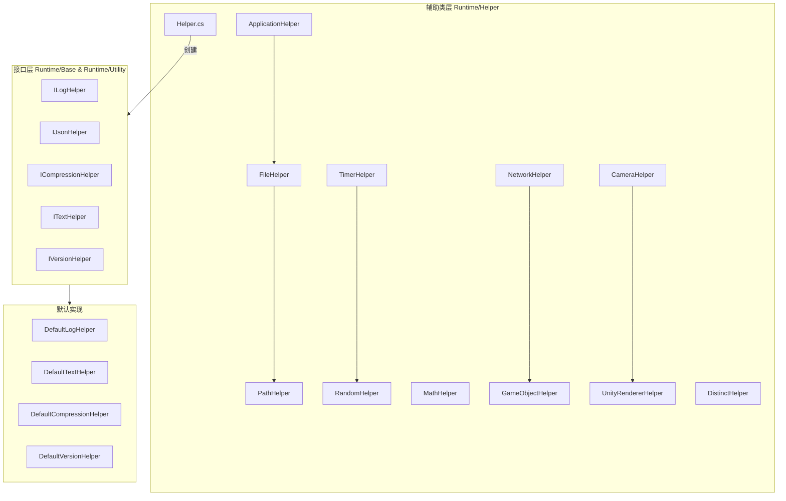

# 辅助类

GameFrameX 框架提供的辅助类模块，涵盖应用、文件、路径、数学、随机数、时间、网络、游戏对象、相机、渲染等多个领域的实用工具方法。

## 概述

辅助类（Helper Classes）是 GameFrameX 框架的基础工具层，为开发者提供日常开发中常用的静态工具方法。这些辅助类经过精心设计，以统一、便捷的方式封装了 Unity 开发和通用编程中的常见操作，使开发者能够更专注于业务逻辑的实现。

### 设计目标

GameFrameX 辅助类系统的设计遵循以下原则：

1. **统一入口**：通过 `Helper` 工厂类提供统一的辅助器创建机制
2. **平台适配**：自动处理不同 Unity 平台（Editor、Windows、Mac、Android、iOS、WebGL 等）的差异
3. **性能优化**：使用 `ThreadLocalRandom` 等机制确保多线程安全
4. **可扩展性**：通过接口（如 `ILogHelper`、`IJsonHelper`）支持自定义实现

### 辅助类分类

GameFrameX 的辅助类可分为以下几个类别：

| 类别 | 辅助类 | 功能描述 |
|------|--------|----------|
| 应用层 | `ApplicationHelper` | 平台检测、应用控制、URL 打开 |
| 文件/路径 | `FileHelper`、`PathHelper` | 文件读写、目录操作、路径拼接 |
| 数学计算 | `MathHelper`、`PositionHelper` | 矩形相交检测、位置计算 |
| 随机数 | `RandomHelper` | 多种随机数生成方法 |
| 时间 | `TimerHelper` | Unix 时间戳、本地时间、服务器时间同步 |
| 网络 | `NetworkHelper` | 网络可达性检测、WiFi/移动网络判断 |
| 游戏对象 | `GameObjectHelper` | GameObject 创建、销毁、查找 |
| 渲染 | `CameraHelper`、`UnityRendererHelper` | 屏幕截图、渲染器可见性检测 |
| 数据处理 | `DistinctHelper`、`NewtonsoftJsonHelper`、`ZipHelper` | 去重、JSON 序列化、压缩 |

## 架构

GameFrameX 辅助类采用分层架构设计，核心组件包括静态工具类和可替换的接口实现。



### 核心组件说明

#### Helper.cs - 辅助器工厂

`Helper.cs` 是整个辅助类系统的核心工厂类，提供基于 `MonoBehaviour` 的辅助器创建机制。

> Source: [Helper.cs](https://github.com/GameFrameX/com.gameframex.unity/blob/main/Runtime/Helper/Helper.cs#L44-L155)

```csharp
public static T CreateHelper<T>(string helperTypeName, T customHelper) where T : MonoBehaviour
{
    return CreateHelper(helperTypeName, customHelper, 0);
}

public static T CreateHelper<T>(string helperTypeName, T customHelper, int index) where T : MonoBehaviour
{
    // 根据类型名称或自定义辅助器创建实例
}
```

**设计意图**：通过工厂模式允许开发者在运行时动态替换默认实现，提高框架的可扩展性。

#### 静态工具类

所有静态辅助类都使用 `[UnityEngine.Scripting.Preserve]` 特性标记，确保在代码裁剪（IL2CPP）时不被移除。

## 核心功能详解

### 应用层辅助类

`ApplicationHelper` 提供平台检测和应用控制功能，是开发跨平台游戏的重要工具。

> Source: [ApplicationHelper.cs](https://github.com/GameFrameX/com.gameframex.unity/blob/main/Runtime/Helper/ApplicationHelper.cs#L1-L305)

```csharp
// 平台检测
public static bool IsEditor => ...;
public static bool IsAndroid => ...;
public static bool IsIOS => ...;
public static bool IsWebGL => ...;
public static bool IsWindows => ...;
public static bool IsMacOsx => ...;
public static bool IsLinux => ...;

// 小游戏平台检测
public static bool IsWebGLWeChatMiniGame => ...;
public static bool IsWebGLDouYinMiniGame => ...;

// 应用控制
public static void Quit() => ...;
public static void OpenURL(string url) => ...;
public static void OpenSetting() => ...;
```

### 文件操作辅助类

`FileHelper` 提供跨平台的文件读写操作，自动处理 Android APK 内资源的读取问题。

> Source: [FileHelper.cs](https://github.com/GameFrameX/com.gameframex.unity/blob/main/Runtime/Helper/FileHelper.cs#L16-L357)

```csharp
// 文件读取
public static byte[] ReadAllBytes(string path) => ...;
public static string ReadAllText(string path) => ...;
public static string[] ReadAllLines(string path) => ...;

// 文件写入
public static void WriteAllBytes(string path, byte[] buffer) => ...;
public static void WriteAllText(string path, string content) => ...;
public static void WriteAllLines(string path, string[] lines) => ...;

// 文件操作
public static void Copy(string sourceFileName, string destFileName, bool overwrite = false) => ...;
public static void Delete(string path) => ...;
public static void Move(string sourceFileName, string destFileName) => ...;
public static bool IsExists(string path) => ...;

// 目录操作
public static void GetAllFiles(List<string> files, string dir) => ...;
public static void CleanDirectory(string dir) => ...;
public static void CopyDirectory(string srcDir, string targetDir) => ...;
```

**设计意图**：统一跨平台文件操作接口，自动处理 Android StreamingAssets 只读路径的特殊情况。

### 路径辅助类

`PathHelper` 提供路径规范化和拼接功能。

> Source: [PathHelper.cs](https://github.com/GameFrameX/com.gameframex.unity/blob/main/Runtime/Helper/PathHelper.cs#L14-L130)

```csharp
// 常用路径
public static string AppHotfixResPath => ...;  // 热更新资源路径
public static string AppResPath => ...;        // StreamingAssets 路径
public static string AppResPath4Web => ...;   // Web 请求专用路径

// 路径操作
public static string NormalizePath(string path) => ...;
public static string Combine(params string[] paths) => ...;
```

### 时间辅助类

`TimerHelper` 提供完整的时间处理功能，包括 Unix 时间戳转换、服务器时间同步等。

> Source: [TimerHelper.cs](https://github.com/GameFrameX/com.gameframex.unity/blob/main/Runtime/Helper/TimerHelper.cs#L36-L525)

```csharp
// 时间戳获取
public static long UnixTimeSeconds() => ...;
public static long UnixTimeMilliseconds() => ...;
public static long NowTimeSeconds() => ...;
public static long NowTimeMilliseconds() => ...;

// 客户端/服务器时间
public static long ClientNow() => ...;
public static long ClientNowSeconds() => ...;
public static long ServerNow() => ...;

// 时间转换
public static long LocalTimeToUnixTimeSeconds(DateTime time) => ...;
public static long LocalTimeToUnixTimeMilliseconds(DateTime time) => ...;
public static DateTime UtcToLocalDateTime(long utcTimestamp) => ...;
public static DateTime UtcToUtcDateTime(long utcTimestamp) => ...;

// 服务器时间同步
public static void SetDifferenceTime(long timeSpan) => ...;
public static void SetDifferenceTime(DateTime serverTime, bool isUtc = false) => ...;
```

### 随机数辅助类

`RandomHelper` 提供线程安全的随机数生成。

> Source: [RandomHelper.cs](https://github.com/GameFrameX/com.gameframex.unity/blob/main/Runtime/Helper/RandomHelper.cs#L12-L80)

```csharp
// 随机数生成
public static void SetSeed(int seed) => ...;
public static int Next(int lower, int upper) => ...;
public static float Next() => ...;
public static long NextInt64() => ...;
public static ulong NextUInt64() => ...;
```

### 数学辅助类

`MathHelper` 提供矩形相交检测等功能。

> Source: [MathHelper.cs](https://github.com/GameFrameX/com.gameframex.unity/blob/main/Runtime/Helper/MathHelper.cs#L13-L148)

```csharp
// 矩形相交检测
public static bool CheckIntersect(RectInt src, RectInt target) => ...;
public static bool CheckIntersect(int x1, int y1, int w1, int h1, int x2, int y2, int w2, int h2) => ...;
public static bool CheckIntersectPoints(int x1, int y1, int w1, int h1, int x2, int y2, int w2, int h2, int[] intersectPoints) => ...;
```

### 网络辅助类

`NetworkHelper` 提供网络状态检测。

> Source: [NetworkHelper.cs](https://github.com/GameFrameX/com.gameframex.unity/blob/main/Runtime/Helper/NetworkHelper.cs#L14-L77)

```csharp
// 网络状态检测
public static string[] GetAddressIPs() => ...;
public static bool IsReachable() => ...;
public static bool IsWifi() => ...;
public static bool IsViaCarrierData() => ...;
```

### 游戏对象辅助类

`GameObjectHelper` 提供 GameObject 的创建、销毁、查找等操作。

> Source: [GameObjectHelper.cs](https://github.com/GameFrameX/com.gameframex.unity/blob/main/Runtime/Helper/GameObjectHelper.cs#L14-L213)

```csharp
// 创建
public static GameObject Create(Transform parent, string name) => ...;
public static GameObject Create(GameObject parent, string name) => ...;

// 销毁
public static void Destroy(GameObject gameObject) => ...;
public static void DestroyObject(this GameObject gameObject) => ...;
public static void DestroyComponent(Component component) => ...;

// 查找
public static GameObject FindChildGamObjectByName(string nodeName, string sceneName = null) => ...;
public static GameObject FindChildGamObjectByName(GameObject gameObject, string name) => ...;

// 变换操作
public static void RemoveChildren(GameObject go) => ...;
public static void ResetTransform(GameObject gameObject) => ...;

// 层设置
public static void SetLayer(GameObject gameObject, int layer, bool children = true) => ...;
public static void SetSortingGroupLayer(GameObject gameObject, string sortingLayer) => ...;
```

### 渲染辅助类

`CameraHelper` 和 `UnityRendererHelper` 提供屏幕截图和渲染器可见性检测。

> Source: [CameraHelper.cs](https://github.com/GameFrameX/com.gameframex.unity/blob/main/Runtime/Helper/CameraHelper.cs#L14-L47)

```csharp
// 屏幕截图
public static Texture2D GetCaptureScreenshot(Camera main, float scale = 0.5f) => ...;
```

> Source: [UnityRendererHelper.cs](https://github.com/GameFrameX/com.gameframex.unity/blob/main/Runtime/Helper/UnityRendererHelper.cs#L12-L42)

```csharp
// 可见性检测
public static bool IsVisibleFrom(Renderer renderer, Camera camera) => ...;
public static bool IsVisibleFrom(MeshRenderer renderer, Camera camera) => ...;
```

### 数据处理辅助类

`DistinctHelper` 提供基于键的集合去重功能。

> Source: [DistinctHelper.cs](https://github.com/GameFrameX/com.gameframex.unity/blob/main/Runtime/Helper/DistinctHelper.cs#L13-L39)

```csharp
// 去重
public static IEnumerable<TSource> DistinctBy<TSource, TKey>(
    this IEnumerable<TSource> source, 
    Func<TSource, TKey> keySelector) => ...;
```

## 使用示例

### 平台检测与适配

```csharp
using GameFrameX.Runtime;

// 检测当前平台
if (ApplicationHelper.IsAndroid)
{
    Debug.Log("运行在 Android 平台");
}
else if (ApplicationHelper.IsIOS)
{
    Debug.Log("运行在 iOS 平台");
}
else if (ApplicationHelper.IsWebGL)
{
    Debug.Log("运行在 WebGL 平台");
}

// 检测小游戏平台
if (ApplicationHelper.IsWebGLWeChatMiniGame)
{
    Debug.Log("运行在微信小游戏平台");
}

// 获取平台名称
string platform = ApplicationHelper.PlatformName;
```

### 文件读写操作

```csharp
using GameFrameX.Runtime;

// 读取文件
string content = FileHelper.ReadAllText("path/to/file.txt");
byte[] data = FileHelper.ReadAllBytes("path/to/file.bin");
string[] lines = FileHelper.ReadAllLines("path/to/file.txt");

// 写入文件
FileHelper.WriteAllText("path/to/output.txt", "Hello World");
FileHelper.WriteAllBytes("path/to/output.bin", data);

// 检查文件存在
if (FileHelper.IsExists("path/to/file.txt"))
{
    Debug.Log("文件存在");
}
```

### 时间戳处理

```csharp
using GameFrameX.Runtime;

// 获取当前时间戳
long unixSeconds = TimerHelper.UnixTimeSeconds();
long unixMillis = TimerHelper.UnixTimeMilliseconds();

// 时间戳转换
DateTime dateTime = TimerHelper.UtcToLocalDateTime(1699999999);
long timestamp = TimerHelper.LocalTimeToUnixTimeSeconds(DateTime.Now);

// 服务器时间同步（从服务器获取时间后调用）
TimerHelper.SetDifferenceTime(serverTimestamp);

// 获取服务器时间
long serverTime = TimerHelper.ServerNow();
DateTime serverDateTime = TimerHelper.ServerToday();
```

### 游戏对象操作

```csharp
using GameFrameX.Runtime;

// 创建 GameObject
GameObject parent = someParent;
GameObject newObj = GameObjectHelper.Create(parent, "NewObject");

// 重置变换
GameObjectHelper.ResetTransform(newObj);

// 设置层级
GameObjectHelper.SetLayer(newObj, LayerMask.NameToLayer("UI"), true);

// 查找子对象
GameObject child = GameObjectHelper.FindChildGamObjectByName(parent, "ChildName");

// 销毁子对象
GameObjectHelper.RemoveChildren(parent);
```

### 渲染器可见性检测

```csharp
using GameFrameX.Runtime;

// 检测物体是否在相机视野内
Camera mainCamera = Camera.main;
Renderer[] renderers = FindObjectsOfType<Renderer>();

foreach (var renderer in renderers)
{
    if (UnityRendererHelper.IsVisibleFrom(renderer, mainCamera))
    {
        Debug.Log("物体在相机视野内");
    }
}
```

### 屏幕截图

```csharp
using GameFrameX.Runtime;

// 捕获屏幕截图
Texture2D screenshot = CameraHelper.GetCaptureScreenshot(Camera.main, 0.5f);

// 保存截图
byte[] pngData = screenshot.EncodeToPNG();
FileHelper.WriteAllBytes(Application.persistentDataPath + "/screenshot.png", pngData);
```

### 集合去重

```csharp
using GameFrameX.Runtime;

// 基于特定键去重
var list = new List<Player>();
list.Add(new Player { Id = 1, Name = "Alice" });
list.Add(new Player { Id = 1, Name = "Alice" });
list.Add(new Player { Id = 2, Name = "Bob" });

// 按 Id 去重
var distinctList = list.DistinctBy(p => p.Id).ToList();
```

## API 参考

### Helper

#### `CreateHelper<T>(string helperTypeName, T customHelper): T`

创建辅助器实例。

**参数：**
- `helperTypeName` (string): 辅助器类型名称
- `customHelper` (T): 自定义辅助器实例

**返回：** 创建的辅助器实例

### ApplicationHelper

| 方法/属性 | 返回类型 | 描述 |
|----------|---------|------|
| `IsEditor` | `bool` | 是否在 Unity 编辑器中运行 |
| `IsAndroid` | `bool` | 是否在 Android 平台运行 |
| `IsIOS` | `bool` | 是否在 iOS 平台运行 |
| `IsWebGL` | `bool` | 是否在 WebGL 平台运行 |
| `IsWindows` | `bool` | 是否在 Windows 平台运行 |
| `PlatformName` | `string` | 获取当前平台名称 |
| `Quit()` | `void` | 退出应用程序 |
| `OpenURL(string url)` | `void` | 打开指定 URL |

### FileHelper

| 方法 | 描述 |
|------|------|
| `ReadAllBytes(string path)` | 读取文件字节数组 |
| `ReadAllText(string path)` | 读取文件文本内容 |
| `WriteAllBytes(string path, byte[] buffer)` | 写入字节数组 |
| `WriteAllText(string path, string content)` | 写入文本内容 |
| `Copy(string source, string dest, bool overwrite)` | 复制文件 |
| `Delete(string path)` | 删除文件 |
| `IsExists(string path)` | 检查文件是否存在 |
| `GetAllFiles(List<string> files, string dir)` | 获取目录下所有文件 |
| `CleanDirectory(string dir)` | 清理目录 |

### TimerHelper

| 方法 | 描述 |
|------|------|
| `UnixTimeSeconds()` | 获取当前 UTC Unix 时间戳（秒） |
| `UnixTimeMilliseconds()` | 获取当前 UTC Unix 时间戳（毫秒） |
| `ServerNow()` | 获取服务器当前时间 |
| `ClientNow()` | 获取客户端当前时间（毫秒） |
| `UtcToLocalDateTime(long timestamp)` | UTC 时间戳转本地时间 |
| `SetDifferenceTime(long timeSpan)` | 设置服务器时间差 |

### RandomHelper

| 方法 | 描述 |
|------|------|
| `SetSeed(int seed)` | 设置随机数种子 |
| `Next(int lower, int upper)` | 获取指定范围随机整数 |
| `Next()` | 获取 0-1 之间随机浮点数 |
| `NextInt64()` | 获取 Int64 范围随机数 |

### GameObjectHelper

| 方法 | 描述 |
|------|------|
| `Create(Transform parent, string name)` | 创建 GameObject |
| `Destroy(GameObject gameObject)` | 销毁 GameObject |
| `FindChildGamObjectByName(string name)` | 按名称查找子对象 |
| `RemoveChildren(GameObject go)` | 销毁所有子对象 |
| `ResetTransform(GameObject gameObject)` | 重置变换组件 |
| `SetLayer(GameObject gameObject, int layer, bool children)` | 设置层级 |

### MathHelper

| 方法 | 描述 |
|------|------|
| `CheckIntersect(RectInt src, RectInt target)` | 检测矩形相交 |
| `CheckIntersect(int x1, int y1, int w1, int h1, int x2, int y2, int w2, int h2)` | 检测矩形相交（参数形式） |

### NetworkHelper

| 方法 | 描述 |
|------|------|
| `IsReachable()` | 检测是否有网络连接 |
| `IsWifi()` | 是否通过 WiFi 连接 |
| `IsViaCarrierData()` | 是否通过移动数据连接 |
| `GetAddressIPs()` | 获取本地 IP 地址列表 |

### CameraHelper

| 方法 | 描述 |
|------|------|
| `GetCaptureScreenshot(Camera main, float scale)` | 捕获相机屏幕截图 |

### UnityRendererHelper

| 方法 | 描述 |
|------|------|
| `IsVisibleFrom(Renderer renderer, Camera camera)` | 检测渲染器是否在相机视野内 |

### DistinctHelper

| 方法 | 描述 |
|------|------|
| `DistinctBy<TSource, TKey>(IEnumerable, Func)` | 基于键选择器去重 |

## 相关链接

- [扩展方法库](./5-runtime.extension-methods) - 了解更多扩展方法
- [工具类](./5-runtime.utility-classes) - 框架核心工具类
- [基础组件](./5-runtime.base) - 框架核心组件
- [事件系统](./5-runtime.event-system) - 框架事件机制
