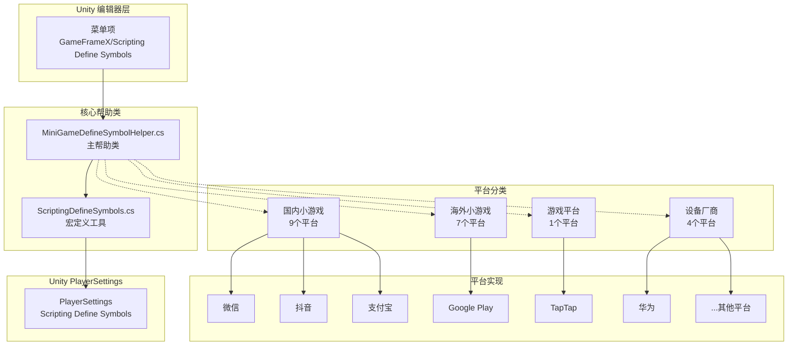
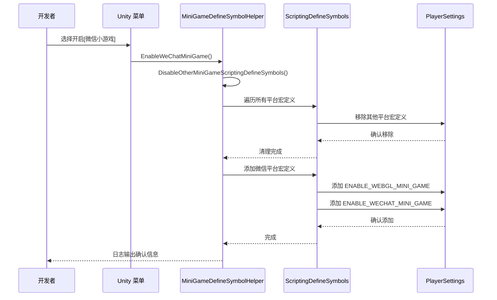

# 平台支持

GameFrameX 提供全面的多平台支持，涵盖操作系统平台和小游戏平台两大类别。通过条件编译机制和统一的宏定义管理，开发者可以轻松实现项目在不同平台之间的无缝切换。

## 概述

GameFrameX 的平台支持系统采用 Unity 的 Scripting Define Symbols（脚本宏定义）技术，实现了对 21 个主流小游戏平台的一键切换支持。该系统设计遵循以下核心原则：

- **互斥机制**：各小游戏平台之间互斥，一次只能激活一个平台
- **统一标识**：所有小游戏平台共享统一宏定义 `ENABLE_WEBGL_MINI_GAME`
- **菜单集成**：通过 Unity 菜单提供可视化的平台切换操作
- **条件编译**：使用 `#if` 预处理指令实现平台特定代码

## 架构

平台支持系统的架构设计围绕 `MiniGameDefineSymbolHelper` 展开，采用部分类（partial class）模式实现模块化扩展。



**架构说明：**

1. **编辑器层**：通过 Unity 菜单触发平台切换操作
2. **核心帮助类**：
   - `MiniGameDefineSymbolHelper`：主帮助类，管理所有平台宏定义
   - `ScriptingDefineSymbols`：底层工具类，封装 PlayerSettings API
3. **平台分类**：按地区和类型将 21 个平台分为 4 个组
4. **Unity PlayerSettings**：最终的宏定义存储位置

## 核心机制

### 宏定义体系

GameFrameX 使用双层宏定义体系来管理平台切换：

```mermaid
flowchart LR
    subgraph DefineLayers["宏定义层级"]
        Unified["统一宏定义<br/>ENABLE_WEBGL_MINI_GAME"]
        Platform["平台宏定义<br/>ENABLE_XXX_MINI_GAME<br/>XXXMINIGAME"]
    end
    
    Unified -->|激活时机| Auto[当任意平台开启时<br/>自动激活]
    Platform -->|条件编译|#if UNITY_WEBGL<br/>& ENABLE_XXX_MINI_GAME
    
    style Unified fill:#e1f5fe
    style Platform fill:#fff3e0
```

**宏定义说明：**

| 宏定义类型 | 名称 | 用途 |
|-----------|------|------|
| 统一宏定义 | `ENABLE_WEBGL_MINI_GAME` | 标识当前构建为 WebGL 小游戏 |
| 平台宏定义 | `ENABLE_XXX_MINI_GAME` | 标识具体的小游戏平台 |
| 平台宏定义 | `XXXMINIGAME` | 平台简写标识（用于第三方 SDK 适配） |

### 平台互斥机制



## 支持的平台

### 操作系统平台

GameFrameX 支持以下操作系统平台的构建：

| 平台 | 状态 | 支持版本 | 构建目标组 |
|------|------|----------|-----------|
| Windows | ✅ 已支持 | Unity 2019.4+ | Standalone |
| macOS | ✅ 已支持 | Unity 2019.4+ | Standalone |
| Linux | ✅ 已支持 | Unity 2019.4+ | Standalone |
| iOS | ✅ 已支持 | Unity 2019.4+ | iOS |
| Android | ✅ 已支持 | Unity 2019.4+ | Android |
| WebGL | ✅ 已支持 | Unity 2019.4+ | WebGL |

### 小游戏平台

GameFrameX 提供一键切换的 21 个小游戏平台适配，涵盖国内、国际、设备厂商和游戏平台四大类别。

#### 国内小游戏（9个）

| 平台 | 宏定义 | 地区 | 菜单路径 |
|------|--------|------|----------|
| 微信小程序 | `ENABLE_WECHAT_MINI_GAME` / `WEIXINMINIGAME` | 🇨🇳 中国 | Domestic Mini Games |
| 支付宝小程序 | `ENABLE_ALIPAY_MINI_GAME` / `ALIPAYMINIGAME` | 🇨🇳 中国 | Domestic Mini Games |
| 抖音小程序 | `ENABLE_DOUYIN_MINI_GAME` / `DOUYINMINIGAME` | 🇨🇳 中国 | Domestic Mini Games |
| 快手小程序 | `ENABLE_KUAISHOU_MINI_GAME` / `KUAISHOUMINIGAME` | 🇨🇳 中国 | Domestic Mini Games |
| 百度小程序 | `ENABLE_BAIDU_MINI_GAME` / `BAIDUMINIGAME` | 🇨🇳 中国 | Domestic Mini Games |
| 京东小程序 | `ENABLE_JINGDONG_MINI_GAME` / `JINGDONGMINIGAME` | 🇨🇳 中国 | Domestic Mini Games |
| 淘宝小程序 | `ENABLE_TAOBAO_MINI_GAME` / `TAOBAOMINIGAME` | 🇨🇳 中国 | Domestic Mini Games |
| 美团小程序 | `ENABLE_MEITUAN_MINI_GAME` / `MEITUANMINIGAME` | 🇨🇳 中国 | Domestic Mini Games |
| Bilibili 小程序 | `ENABLE_BILIBILI_MINI_GAME` / `BILIBILIMINIGAME` | 🇨🇳 中国 | Domestic Mini Games |

#### 海外小游戏（7个）

| 平台 | 宏定义 | 地区 | 菜单路径 |
|------|--------|------|----------|
| Discord | `ENABLE_DISCORD_MINI_GAME` / `DISCORDMINIGAME` | 🌍 全球 | International Mini Games |
| YouTube | `ENABLE_YOUTUBE_MINI_GAME` / `YOUTUBEMINIGAME` | 🌍 全球 | International Mini Games |
| Facebook | `ENABLE_FACEBOOK_MINI_GAME` / `FACEBOOKMINIGAME` | 🌍 全球 | International Mini Games |
| Google Play | `ENABLE_GOOGLEPLAY_MINI_GAME` / `GOOGLEPLAYMINIGAME` | 🌍 全球 | International Mini Games |
| TikTok | `ENABLE_TIKTOK_MINI_GAME` / `TIKTOKMINIGAME` | 🌍 全球 | International Mini Games |
| CrazyGames | `ENABLE_CRAZYGAMES_MINI_GAME` / `CRAZYGAMESMINIGAME` | 🌍 全球 | International Mini Games |
| Poki | `ENABLE_POKI_MINI_GAME` / `POKIMINIGAME` | 🌍 全球 | International Mini Games |

#### 设备厂商（4个）

| 平台 | 宏定义 | 地区 | 菜单路径 |
|------|--------|------|----------|
| 华为小游戏 | `ENABLE_HUAWEI_MINI_GAME` / `HUAWEIMINIGAME` | 🇨🇳 中国 | Device OEMs |
| OPPO 小游戏 | `ENABLE_OPPO_MINI_GAME` / `OPPOSMINIGAME` | 🇨🇳 中国 | Device OEMs |
| vivo 小游戏 | `ENABLE_VIVO_MINI_GAME` / `VIVOMINIGAME` | 🇨🇳 中国 | Device OEMs |
| 小米小游戏 | `ENABLE_XIAOMI_MINI_GAME` / `XIAOMIMINIGAME` | 🇨🇳 中国 | Device OEMs |

#### 游戏平台（1个）

| 平台 | 宏定义 | 地区 | 菜单路径 |
|------|--------|------|----------|
| TapTap 小游戏 | `ENABLE_TAPTAP_MINI_GAME` / `TAPTAPMINIGAME` | 🇨🇳 中国 | Game Platforms |

## 使用指南

### 启用小游戏平台

在 Unity 编辑器中，通过菜单操作可以快速切换小游戏平台：

```
GameFrameX/
└── Scripting Define Symbols/
    ├── Domestic Mini Games(国内小游戏)/
    │   ├── Enable WeChat Mini Game (开启[微信小游戏]适配)
    │   ├── Enable Alipay Mini Game (开启[支付宝小游戏]适配)
    │   ├── Enable DouYin Mini Game (开启[抖音小游戏]适配)
    │   ├── Enable KuaiShou Mini Game (开启[快手小游戏]适配)
    │   ├── Enable Baidu Mini Game (开启[百度小游戏]适配)
    │   ├── Enable JingDong Mini Game (开启[京东小游戏]适配)
    │   ├── Enable Meituan Mini Game (开启[美团小游戏]适配)
    │   ├── Enable Taobao Mini Game (开启[淘宝小游戏]适配)
    │   └── Enable Bilibili Mini Game (开启[Bilibili小游戏]适配)
    ├── International Mini Games(海外小游戏)/
    │   ├── Enable Discord Mini Game
    │   ├── Enable YouTube Mini Game
    │   ├── Enable Facebook Mini Game
    │   ├── Enable Google Play Mini Game
    │   ├── Enable TikTok Mini Game
    │   ├── Enable CrazyGames Mini Game
    │   └── Enable Poki Mini Game
    ├── Device OEMs(设备厂商)/
    │   ├── Enable Huawei Mini Game (开启[华为小游戏]适配)
    │   ├── Enable OPPO Mini Game (开启[OPPO小游戏]适配)
    │   ├── Enable Vivo Mini Game (开启[vivo小游戏]适配)
    │   └── Enable Xiaomi Mini Game (开启[小米小游戏]适配)
    └── Game Platforms(游戏平台)/
        └── Enable TapTap Mini Game (开启[TapTap小游戏]适配)
```

### 使用条件编译

在代码中可以使用条件编译指令来实现平台特定的逻辑：

```csharp
#if ENABLE_WEBGL_MINI_GAME
    // 所有小游戏平台共用的代码
#endif

#if ENABLE_WECHAT_MINI_GAME
    // 微信小游戏特定代码
    // 可使用微信小游戏专属 API
#endif

#if ENABLE_TAPTAP_MINI_GAME
    // TapTap 小游戏特定代码
    // 可使用 TapTap 平台 SDK
#endif

#if ENABLE_GOOGLEPLAY_MINI_GAME
    // Google Play 小游戏特定代码
    // 可使用 Google Play 游戏服务
#endif
```

> Source: [MiniGameDefineSymbolHelper.WeChat.cs](https://github.com/GameFrameX/com.gameframex.unity/blob/main/Editor/MiniGame/DomesticMiniGames/MiniGameDefineSymbolHelper.WeChat.cs#L14-L39)
> Source: [MiniGameDefineSymbolHelper.TapTap.cs](https://github.com/GameFrameX/com.gameframex.unity/blob/main/Editor/MiniGame/GamePlatforms/MiniGameDefineSymbolHelper.TapTap.cs#L14-L39)

### 关闭小游戏平台

同样可以通过菜单关闭已启用的小游戏平台：

```
GameFrameX/
└── Scripting Define Symbols/
    ├── Domestic Mini Games(国内小游戏)/
    │   └── Disable WeChat Mini Game (关闭[微信小游戏]适配)
    ├── International Mini Games(海外小游戏)/
    │   └── Disable Google Play Mini Game (关闭[Google Play]适配)
    ├── Device OEMs(设备厂商)/
    │   └── Disable Huawei Mini Game (关闭[华为小游戏]适配)
    └── Game Platforms(游戏平台)/
        └── Disable TapTap Mini Game (关闭[TapTap小游戏]适配)
```

## 核心 API 参考

### `MiniGameDefineSymbolHelper`

小游戏平台宏定义管理主类。

#### `EnableWeChatMiniGame()`

```csharp
#if UNITY_WEBGL
[MenuItem("GameFrameX/Scripting Define Symbols/Domestic Mini Games(国内小游戏)/Enable WeChat Mini Game(开启[微信小游戏]适配)", false, 2000)]
#endif
public static void EnableWeChatMiniGame()
```

开启微信小游戏适配。启用时会自动：
1. 关闭其他所有小游戏平台的宏定义
2. 启用微信小游戏专用的宏定义
3. 启用统一的 WebGL 小游戏宏定义

> Source: [MiniGameDefineSymbolHelper.WeChat.cs](https://github.com/GameFrameX/com.gameframex.unity/blob/main/Editor/MiniGame/DomesticMiniGames/MiniGameDefineSymbolHelper.WeChat.cs#L20-L40)

#### `DisableWeChatMiniGame()`

```csharp
#if UNITY_WEBGL
[MenuItem("GameFrameX/Scripting Define Symbols/Domestic Mini Games(国内小游戏)/Disable WeChat Mini Game(关闭[微信小游戏]适配)", false, 2001)]
#endif
public static void DisableWeChatMiniGame()
```

关闭微信小游戏适配。

> Source: [MiniGameDefineSymbolHelper.WeChat.cs](https://github.com/GameFrameX/com.gameframex.unity/blob/main/Editor/MiniGame/DomesticMiniGames/MiniGameDefineSymbolHelper.WeChat.cs#L46-L64)

### `ScriptingDefineSymbols`

脚本宏定义底层操作工具类。

#### `HasScriptingDefineSymbol(buildTargetGroup, scriptingDefineSymbol): bool`

```csharp
public static bool HasScriptingDefineSymbol(BuildTargetGroup buildTargetGroup, string scriptingDefineSymbol)
```

检查指定平台是否存在指定的脚本宏定义。

**参数：**
- `buildTargetGroup` (BuildTargetGroup)：目标平台组
- `scriptingDefineSymbol` (string)：要检查的宏定义

**返回：** 是否存在指定宏定义

> Source: [ScriptingDefineSymbols.cs](https://github.com/GameFrameX/com.gameframex.unity/blob/main/Editor/Misc/ScriptingDefineSymbols.cs#L57-L74)

#### `AddScriptingDefineSymbol(buildTargetGroup, scriptingDefineSymbol): void`

```csharp
public static void AddScriptingDefineSymbol(BuildTargetGroup buildTargetGroup, string scriptingDefineSymbol)
```

为指定平台添加脚本宏定义。

**参数：**
- `buildTargetGroup` (BuildTargetGroup)：目标平台组
- `scriptingDefineSymbol` (string)：要添加的宏定义

> Source: [ScriptingDefineSymbols.cs](https://github.com/GameFrameX/com.gameframex.unity/blob/main/Editor/Misc/ScriptingDefineSymbols.cs#L81-L99)

#### `RemoveScriptingDefineSymbol(buildTargetGroup, scriptingDefineSymbol): void`

```csharp
public static void RemoveScriptingDefineSymbol(BuildTargetGroup buildTargetGroup, string scriptingDefineSymbol)
```

从指定平台移除脚本宏定义。

**参数：**
- `buildTargetGroup` (BuildTargetGroup)：目标平台组
- `scriptingDefineSymbol` (string)：要移除的宏定义

> Source: [ScriptingDefineSymbols.cs](https://github.com/GameFrameX/com.gameframex.unity/blob/main/Editor/Misc/ScriptingDefineSymbols.cs#L106-L125)

#### `GetScriptingDefineSymbols(buildTargetGroup): string[]`

```csharp
public static string[] GetScriptingDefineSymbols(BuildTargetGroup buildTargetGroup)
```

获取指定平台的脚本宏定义数组。

**参数：**
- `buildTargetGroup` (BuildTargetGroup)：目标平台组

**返回：** 宏定义数组

> Source: [ScriptingDefineSymbols.cs](https://github.com/GameFrameX/com.gameframex.unity/blob/main/Editor/Misc/ScriptingDefineSymbols.cs#L166-L169)

## 最佳实践

### 平台适配建议

1. **使用统一的 WebGL 宏定义**：对于所有小游戏平台通用的代码，使用 `ENABLE_WEBGL_MINI_GAME` 进行条件编译

2. **分离平台特定代码**：将不同平台的代码分别放置在独立的目录或文件中，便于维护

3. **接口抽象**：对于需要调用平台特定 API 的场景，建议使用接口抽象或依赖注入模式

4. **测试覆盖**：每个目标平台都应该进行充分的测试，确保条件编译代码正确执行

### 常见问题

**Q: 开启新平台后之前的平台宏定义是否会自动关闭？**

是的，系统采用互斥机制，开启任一小游戏平台会自动关闭其他所有小游戏平台的宏定义。

**Q: 可以同时开启多个小游戏平台吗？**

不可以。由于小游戏平台之间的 API 和 SDK 存在冲突，系统设计为互斥模式，一次只能激活一个平台。

**Q: 如何查看当前已开启的平台？**

可以通过 Unity 菜单 `Edit > Project Settings > Player > Other Settings > Scripting Define Symbols` 查看 WebGL 平台下的宏定义列表。

## 相关链接

- [编辑器工具](./6-editor-tools.mini-game-platform) - 小游戏平台适配详细文档
- [构建工具](./6-editor-tools.build-tools) - 构建产品相关工具
- [API 参考](./8-api-reference) - 完整 API 文档
- [项目主页](https://github.com/GameFrameX/com.gameframex.unity)
- [官方文档](https://gameframex.doc.alianblank.com)
